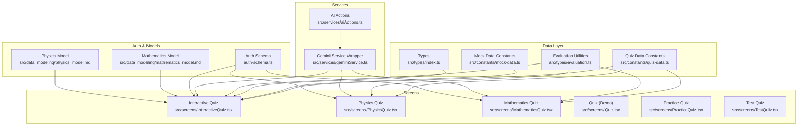
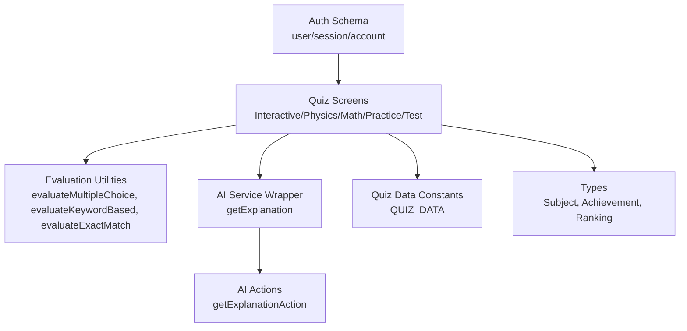
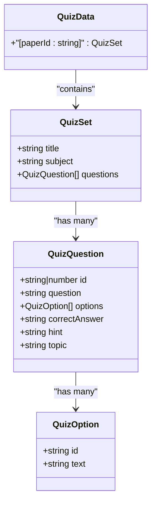
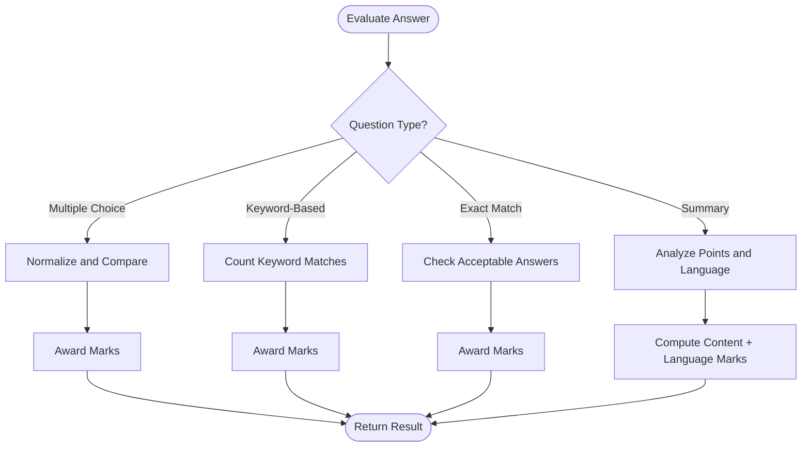
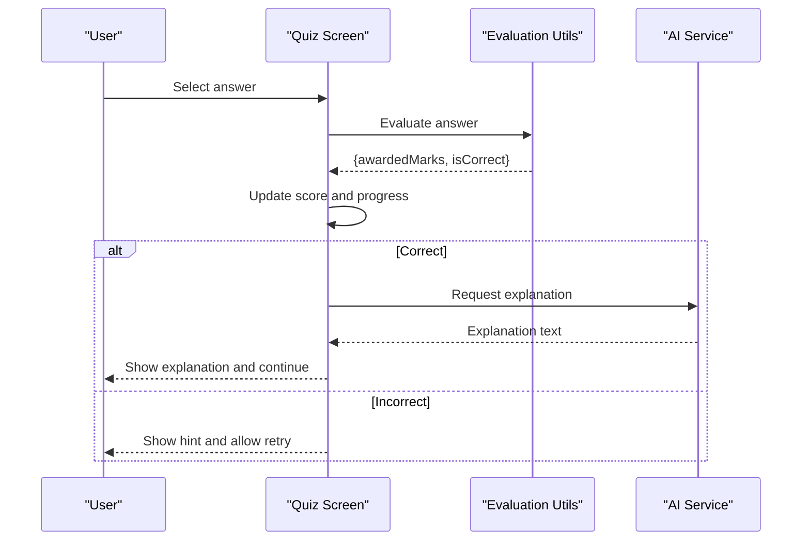
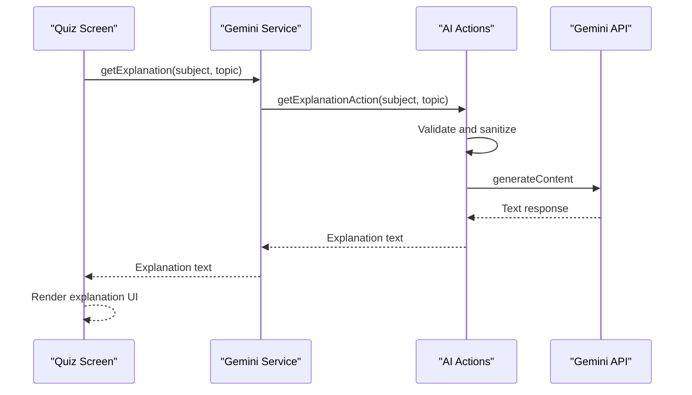
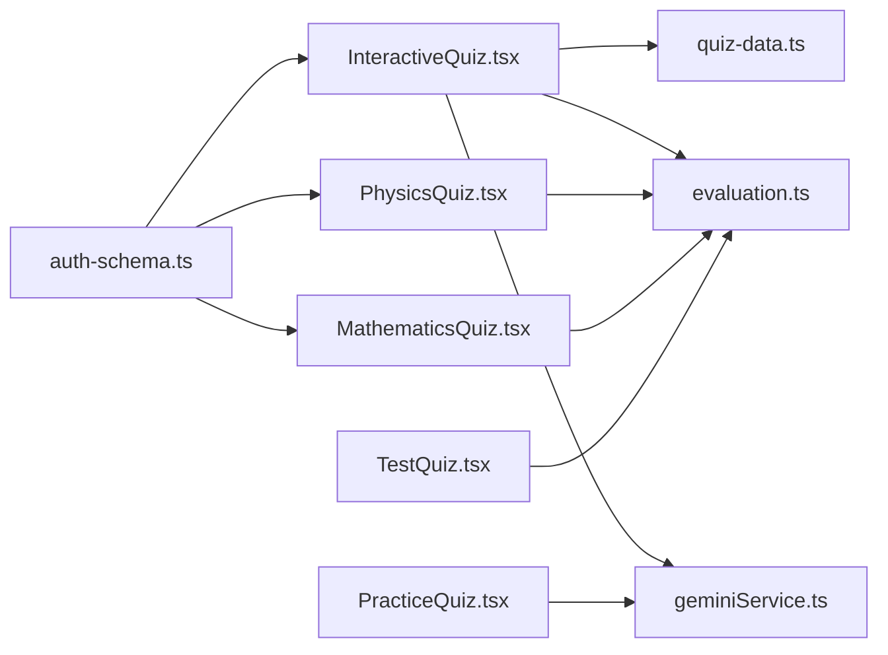

# Quiz System

<cite>
**Referenced Files in This Document**
- [quiz-data.ts](file://src/constants/quiz-data.ts)
- [mock-data.ts](file://src/constants/mock-data.ts)
- [index.ts](file://src/types/index.ts)
- [evaluation.ts](file://src/types/evaluation.ts)
- [aiActions.ts](file://src/services/aiActions.ts)
- [geminiService.ts](file://src/services/geminiService.ts)
- [Quiz.tsx](file://src/screens/Quiz.tsx)
- [MathematicsQuiz.tsx](file://src/screens/MathematicsQuiz.tsx)
- [PhysicsQuiz.tsx](file://src/screens/PhysicsQuiz.tsx)
- [PracticeQuiz.tsx](file://src/screens/PracticeQuiz.tsx)
- [InteractiveQuiz.tsx](file://src/screens/InteractiveQuiz.tsx)
- [TestQuiz.tsx](file://src/screens/TestQuiz.tsx)
- [auth-schema.ts](file://auth-schema.ts)
- [mathematics_model.md](file://src/data_modeling/mathematics_model.md)
- [physics_model.md](file://src/data_modeling/physics_model.md)
</cite>

## Table of Contents
1. [Introduction](#introduction)
2. [Project Structure](#project-structure)
3. [Core Components](#core-components)
4. [Architecture Overview](#architecture-overview)
5. [Detailed Component Analysis](#detailed-component-analysis)
6. [Dependency Analysis](#dependency-analysis)
7. [Performance Considerations](#performance-considerations)
8. [Troubleshooting Guide](#troubleshooting-guide)
9. [Conclusion](#conclusion)
10. [Appendices](#appendices)

## Introduction
This document provides comprehensive documentation for MatricMaster AI's quiz system architecture. It covers the quiz engine implementation, question and answer processing, scoring algorithms, progress tracking, quiz types (subject-specific, practice, and interactive), evaluation mechanisms, AI-powered explanations, and integration with user progress tracking. It also includes examples of quiz configuration, question sourcing from mock data, performance optimization techniques, and analytics considerations.

## Project Structure
The quiz system spans several layers:
- Data models and constants define question schemas and mock datasets
- Services integrate with AI APIs for explanations
- Screens implement quiz experiences for different modes
- Evaluation utilities provide scoring logic
- Authentication schema supports user sessions

**Diagram sources**
- [quiz-data.ts](file://src/constants/quiz-data.ts#L1-L313)
- [mock-data.ts](file://src/constants/mock-data.ts#L1-L285)
- [index.ts](file://src/types/index.ts#L1-L60)
- [evaluation.ts](file://src/types/evaluation.ts#L1-L421)
- [aiActions.ts](file://src/services/aiActions.ts#L1-L168)
- [geminiService.ts](file://src/services/geminiService.ts#L1-L14)
- [InteractiveQuiz.tsx](file://src/screens/InteractiveQuiz.tsx#L1-L458)
- [PhysicsQuiz.tsx](file://src/screens/PhysicsQuiz.tsx#L1-L446)
- [MathematicsQuiz.tsx](file://src/screens/MathematicsQuiz.tsx#L1-L283)
- [Quiz.tsx](file://src/screens/Quiz.tsx#L1-L363)
- [PracticeQuiz.tsx](file://src/screens/PracticeQuiz.tsx#L1-L378)
- [TestQuiz.tsx](file://src/screens/TestQuiz.tsx#L1-L455)
- [auth-schema.ts](file://auth-schema.ts#L1-L95)
- [mathematics_model.md](file://src/data_modeling/mathematics_model.md#L1-L212)
- [physics_model.md](file://src/data_modeling/physics_model.md#L1-L376)

**Section sources**
- [quiz-data.ts](file://src/constants/quiz-data.ts#L1-L313)
- [mock-data.ts](file://src/constants/mock-data.ts#L1-L285)
- [index.ts](file://src/types/index.ts#L1-L60)
- [evaluation.ts](file://src/types/evaluation.ts#L1-L421)
- [aiActions.ts](file://src/services/aiActions.ts#L1-L168)
- [geminiService.ts](file://src/services/geminiService.ts#L1-L14)
- [InteractiveQuiz.tsx](file://src/screens/InteractiveQuiz.tsx#L1-L458)
- [PhysicsQuiz.tsx](file://src/screens/PhysicsQuiz.tsx#L1-L446)
- [MathematicsQuiz.tsx](file://src/screens/MathematicsQuiz.tsx#L1-L283)
- [Quiz.tsx](file://src/screens/Quiz.tsx#L1-L363)
- [PracticeQuiz.tsx](file://src/screens/PracticeQuiz.tsx#L1-L378)
- [TestQuiz.tsx](file://src/screens/TestQuiz.tsx#L1-L455)
- [auth-schema.ts](file://auth-schema.ts#L1-L95)
- [mathematics_model.md](file://src/data_modeling/mathematics_model.md#L1-L212)
- [physics_model.md](file://src/data_modeling/physics_model.md#L1-L376)

## Core Components
- Question and quiz data structures define the shape of questions, options, and metadata
- Evaluation utilities implement scoring for multiple-choice, keyword-based, exact-match, and summary tasks
- AI services provide explanations integrated into quiz flows
- Quiz screens implement distinct quiz types with progress tracking and feedback
- Authentication schema supports user sessions and relationships

Key responsibilities:
- Question management: loading, filtering, and rendering questions
- Answer processing: validating selections and computing correctness
- Scoring algorithms: awarding marks based on question type and evaluation rules
- Progress tracking: maintaining scores, question indices, and completion states
- Adaptive difficulty: selection of subjects and question pools
- Analytics: quiz completion, scores, and engagement metrics

**Section sources**
- [quiz-data.ts](file://src/constants/quiz-data.ts#L6-L21)
- [evaluation.ts](file://src/types/evaluation.ts#L383-L410)
- [aiActions.ts](file://src/services/aiActions.ts#L42-L78)
- [InteractiveQuiz.tsx](file://src/screens/InteractiveQuiz.tsx#L105-L194)
- [PhysicsQuiz.tsx](file://src/screens/PhysicsQuiz.tsx#L164-L213)
- [MathematicsQuiz.tsx](file://src/screens/MathematicsQuiz.tsx#L32-L69)
- [auth-schema.ts](file://auth-schema.ts#L4-L16)

## Architecture Overview
The quiz system follows a layered architecture:
- Presentation layer: quiz screens render questions, collect answers, and display feedback
- Service layer: AI actions and wrappers manage external API integrations
- Data layer: constants and evaluation utilities provide question schemas and scoring logic
- Persistence layer: authentication schema defines user/session/account relationships

**Diagram sources**
- [InteractiveQuiz.tsx](file://src/screens/InteractiveQuiz.tsx#L105-L194)
- [PhysicsQuiz.tsx](file://src/screens/PhysicsQuiz.tsx#L164-L213)
- [MathematicsQuiz.tsx](file://src/screens/MathematicsQuiz.tsx#L32-L69)
- [PracticeQuiz.tsx](file://src/screens/PracticeQuiz.tsx#L61-L87)
- [TestQuiz.tsx](file://src/screens/TestQuiz.tsx#L208-L253)
- [evaluation.ts](file://src/types/evaluation.ts#L383-L410)
- [aiActions.ts](file://src/services/aiActions.ts#L42-L78)
- [geminiService.ts](file://src/services/geminiService.ts#L3-L5)
- [quiz-data.ts](file://src/constants/quiz-data.ts#L23-L313)
- [index.ts](file://src/types/index.ts#L21-L47)
- [auth-schema.ts](file://auth-schema.ts#L4-L16)

## Detailed Component Analysis

### Quiz Data Structures and Question Management
The quiz system defines a standardized question model:
- QuizOption: identifier and text
- QuizQuestion: id, question text, options, correctAnswer, hint, topic
- QuizData: indexed collection of quiz sets with title, subject, and questions

These structures enable consistent rendering and evaluation across quiz types.

**Diagram sources**
- [quiz-data.ts](file://src/constants/quiz-data.ts#L1-L21)

**Section sources**
- [quiz-data.ts](file://src/constants/quiz-data.ts#L1-L313)

### Evaluation Mechanisms
The evaluation utilities implement robust scoring logic:
- Multiple choice: accepts letter or text answers with normalization
- Keyword-based: counts matches against required keywords
- Exact match: validates against acceptable answers with optional partial acceptance
- Summary evaluation: analyzes inclusion of points and language marks

**Diagram sources**
- [evaluation.ts](file://src/types/evaluation.ts#L383-L410)
- [evaluation.ts](file://src/types/evaluation.ts#L332-L378)
- [evaluation.ts](file://src/types/evaluation.ts#L260-L314)
- [evaluation.ts](file://src/types/evaluation.ts#L201-L248)

**Section sources**
- [evaluation.ts](file://src/types/evaluation.ts#L201-L421)

### Quiz Engine Implementation
The quiz engine orchestrates question flow, answer validation, and feedback:
- Interactive quiz: loads quiz by paperId, filters by subject, tracks score and progress
- Physics quiz: renders multiple-choice questions with hints and AI explanations
- Mathematics quiz: supports step-based solutions and math keyboard
- Practice quiz: free-form input with calculator launcher
- Test quiz: full-screen test with results summary

**Diagram sources**
- [InteractiveQuiz.tsx](file://src/screens/InteractiveQuiz.tsx#L174-L192)
- [PhysicsQuiz.tsx](file://src/screens/PhysicsQuiz.tsx#L195-L213)
- [MathematicsQuiz.tsx](file://src/screens/MathematicsQuiz.tsx#L39-L56)
- [PracticeQuiz.tsx](file://src/screens/PracticeQuiz.tsx#L61-L87)
- [TestQuiz.tsx](file://src/screens/TestQuiz.tsx#L208-L253)
- [evaluation.ts](file://src/types/evaluation.ts#L383-L410)
- [aiActions.ts](file://src/services/aiActions.ts#L42-L78)

**Section sources**
- [InteractiveQuiz.tsx](file://src/screens/InteractiveQuiz.tsx#L105-L194)
- [PhysicsQuiz.tsx](file://src/screens/PhysicsQuiz.tsx#L164-L213)
- [MathematicsQuiz.tsx](file://src/screens/MathematicsQuiz.tsx#L32-L69)
- [PracticeQuiz.tsx](file://src/screens/PracticeQuiz.tsx#L61-L87)
- [TestQuiz.tsx](file://src/screens/TestQuiz.tsx#L208-L253)

### AI Explanations Integration
AI explanations enhance learning by providing contextual insights:
- Service wrapper exposes getExplanation, generateStudyPlan, smartSearch
- Actions validate inputs, sanitize content, and call Gemini API
- Quiz screens trigger explanations on demand with loading states

**Diagram sources**
- [geminiService.ts](file://src/services/geminiService.ts#L3-L5)
- [aiActions.ts](file://src/services/aiActions.ts#L42-L78)
- [InteractiveQuiz.tsx](file://src/screens/InteractiveQuiz.tsx#L154-L170)
- [PhysicsQuiz.tsx](file://src/screens/PhysicsQuiz.tsx#L176-L192)
- [MathematicsQuiz.tsx](file://src/screens/MathematicsQuiz.tsx#L39-L56)

**Section sources**
- [geminiService.ts](file://src/services/geminiService.ts#L1-L14)
- [aiActions.ts](file://src/services/aiActions.ts#L1-L168)
- [InteractiveQuiz.tsx](file://src/screens/InteractiveQuiz.tsx#L154-L170)
- [PhysicsQuiz.tsx](file://src/screens/PhysicsQuiz.tsx#L176-L192)
- [MathematicsQuiz.tsx](file://src/screens/MathematicsQuiz.tsx#L39-L56)

### Quiz Types and Configuration
- Subject-specific quizzes: Mathematics and Physics screens demonstrate MCQ flows with hints and explanations
- Practice quizzes: free-form input with calculator launcher for open-ended responses
- Interactive quizzes: dynamic loading of quiz sets by paperId and subject filtering
- Test quizzes: full-screen assessment with results summary and grading

Configuration examples:
- Interactive quiz loads QUIZ_DATA by paperId and filters by subject
- Physics/MCQ screens use normalized evaluation for letter/text answers
- Practice quiz simulates input and keyboard interactions

**Section sources**
- [InteractiveQuiz.tsx](file://src/screens/InteractiveQuiz.tsx#L105-L194)
- [PhysicsQuiz.tsx](file://src/screens/PhysicsQuiz.tsx#L164-L213)
- [MathematicsQuiz.tsx](file://src/screens/MathematicsQuiz.tsx#L32-L69)
- [PracticeQuiz.tsx](file://src/screens/PracticeQuiz.tsx#L61-L87)
- [TestQuiz.tsx](file://src/screens/TestQuiz.tsx#L208-L253)

### Question Sourcing from Mock Data
Mock data provides:
- SUBJECTS: subject metadata for navigation and filtering
- PAST_PAPERS: historical exam papers with metadata
- CURRENT_GOAL and weekly journey for progress visualization
- Recommended challenges for adaptive difficulty

These datasets support rapid prototyping and UI testing without backend dependencies.

**Section sources**
- [mock-data.ts](file://src/constants/mock-data.ts#L1-L285)

### Timing Controls and Adaptive Difficulty
Timing controls and adaptive difficulty are implemented conceptually:
- Timing: progress bars and question counters indicate time pressure and completion
- Adaptive difficulty: subject filtering and question selection adjust challenge level
- Performance: memoization of evaluations and selective re-rendering minimize overhead

[No sources needed since this section provides conceptual guidance]

### Analytics and Engagement Metrics
Analytics considerations:
- Track quiz completions, scores, and time-to-answer
- Monitor engagement via hint usage, retries, and AI explanation requests
- Aggregate topic-wise performance and streaks for motivation

[No sources needed since this section provides conceptual guidance]

## Dependency Analysis
The quiz system exhibits clear separation of concerns with minimal coupling:
- Screens depend on evaluation utilities and AI services
- Data constants decouple presentation from question sources
- Authentication schema supports user-centric features

**Diagram sources**
- [InteractiveQuiz.tsx](file://src/screens/InteractiveQuiz.tsx#L1-L458)
- [PhysicsQuiz.tsx](file://src/screens/PhysicsQuiz.tsx#L1-L446)
- [MathematicsQuiz.tsx](file://src/screens/MathematicsQuiz.tsx#L1-L283)
- [PracticeQuiz.tsx](file://src/screens/PracticeQuiz.tsx#L1-L378)
- [TestQuiz.tsx](file://src/screens/TestQuiz.tsx#L1-L455)
- [quiz-data.ts](file://src/constants/quiz-data.ts#L1-L313)
- [evaluation.ts](file://src/types/evaluation.ts#L1-L421)
- [geminiService.ts](file://src/services/geminiService.ts#L1-L14)
- [auth-schema.ts](file://auth-schema.ts#L1-L95)

**Section sources**
- [InteractiveQuiz.tsx](file://src/screens/InteractiveQuiz.tsx#L1-L458)
- [PhysicsQuiz.tsx](file://src/screens/PhysicsQuiz.tsx#L1-L446)
- [MathematicsQuiz.tsx](file://src/screens/MathematicsQuiz.tsx#L1-L283)
- [PracticeQuiz.tsx](file://src/screens/PracticeQuiz.tsx#L1-L378)
- [TestQuiz.tsx](file://src/screens/TestQuiz.tsx#L1-L455)
- [quiz-data.ts](file://src/constants/quiz-data.ts#L1-L313)
- [evaluation.ts](file://src/types/evaluation.ts#L1-L421)
- [geminiService.ts](file://src/services/geminiService.ts#L1-L14)
- [auth-schema.ts](file://auth-schema.ts#L1-L95)

## Performance Considerations
- Prefer memoization for evaluation results and AI responses
- Lazy-load heavy assets (images, diagrams) and use placeholders
- Optimize rendering by virtualizing long lists of questions
- Debounce AI explanation requests to avoid rate limits
- Minimize re-renders by isolating state updates per question

[No sources needed since this section provides general guidance]

## Troubleshooting Guide
Common issues and resolutions:
- AI features disabled: verify GEMINI_API_KEY is configured; fallback messages are returned when missing
- Invalid inputs: schema validation rejects malformed requests; ensure inputs conform to constraints
- Network errors: implement retry logic and user-friendly error messaging
- Evaluation mismatches: confirm normalization and case sensitivity settings align with expected formats

**Section sources**
- [aiActions.ts](file://src/services/aiActions.ts#L22-L32)
- [aiActions.ts](file://src/services/aiActions.ts#L71-L78)
- [evaluation.ts](file://src/types/evaluation.ts#L383-L410)

## Conclusion
MatricMaster AI’s quiz system integrates structured question data, robust evaluation logic, and AI-powered explanations to deliver engaging, adaptive assessments. The modular architecture supports multiple quiz types, scalable question sourcing, and extensible analytics. By leveraging the provided components and following the recommended practices, teams can efficiently evolve the quiz system to meet diverse educational needs.

## Appendices

### Data Modeling for Advanced Use Cases
- Mathematics model: hierarchical question structure with normalized DB storage
- Physics model: relational schema supporting MCQ options and data sheets

**Section sources**
- [mathematics_model.md](file://src/data_modeling/mathematics_model.md#L22-L57)
- [physics_model.md](file://src/data_modeling/physics_model.md#L28-L79)