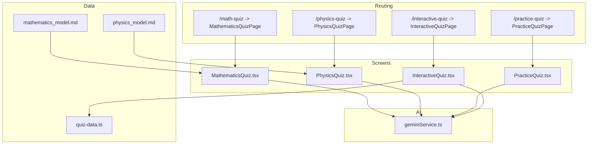
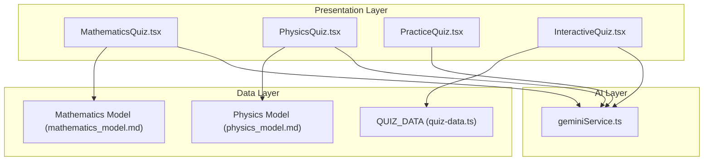
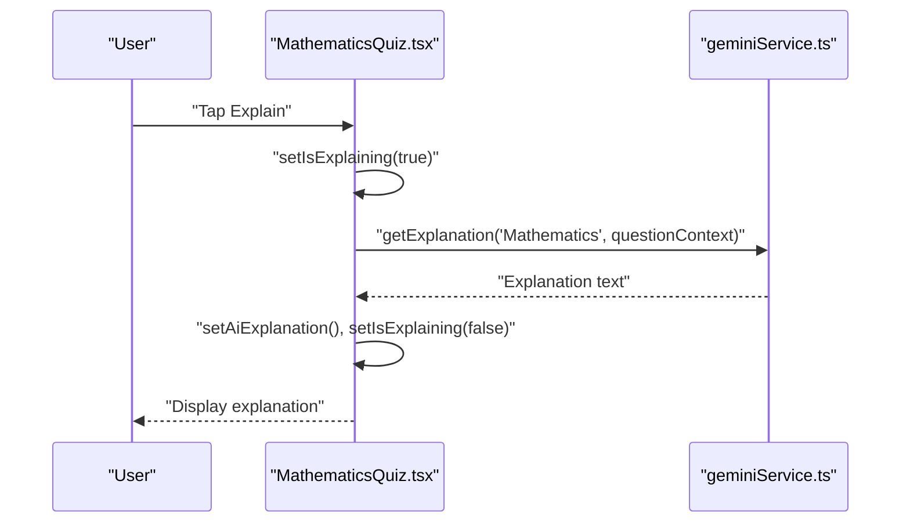
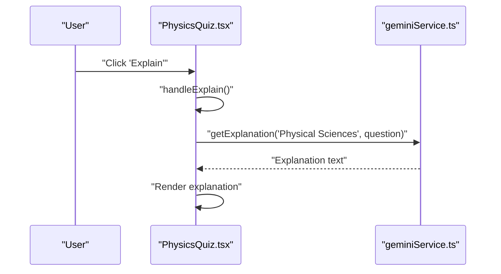
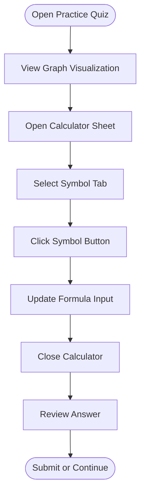
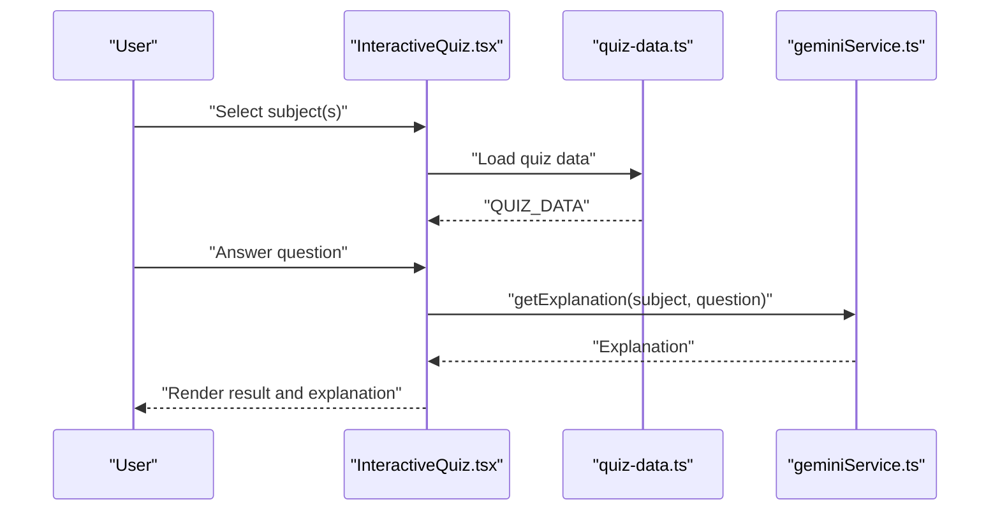
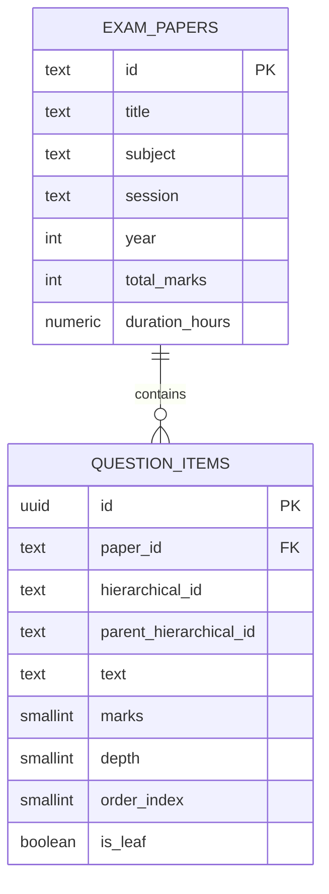
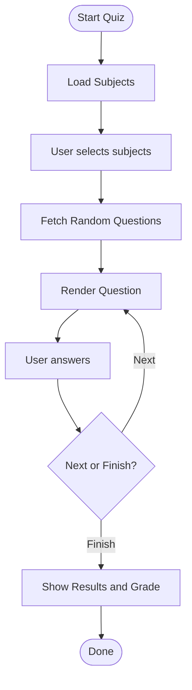
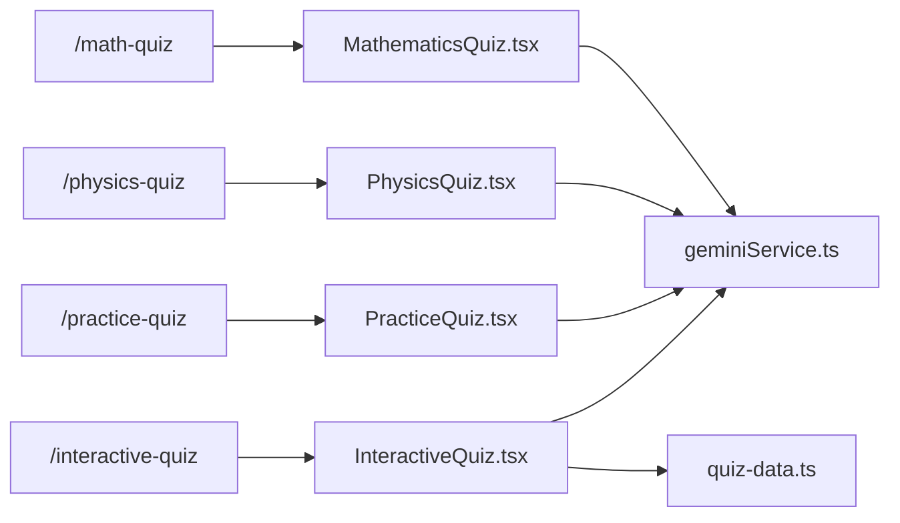

# Quiz Types and Subjects

<cite>
**Referenced Files in This Document**
- [MathematicsQuiz.tsx](file://src/screens/MathematicsQuiz.tsx)
- [PhysicsQuiz.tsx](file://src/screens/PhysicsQuiz.tsx)
- [PracticeQuiz.tsx](file://src/screens/PracticeQuiz.tsx)
- [InteractiveQuiz.tsx](file://src/screens/InteractiveQuiz.tsx)
- [quiz-data.ts](file://src/constants/quiz-data.ts)
- [mathematics_model.md](file://src/data_modeling/mathematics_model.md)
- [physics_model.md](file://src/data_modeling/physics_model.md)
- [geminiService.ts](file://src/services/geminiService.ts)
- [page.tsx (Math Quiz)](file://src/app/math-quiz/page.tsx)
- [page.tsx (Physics Quiz)](file://src/app/physics-quiz/page.tsx)
- [page.tsx (Practice Quiz)](file://src/app/practice-quiz/page.tsx)
- [page.tsx (Interactive Quiz)](file://src/app/interactive-quiz/page.tsx)
- [TestQuiz.tsx](file://src/screens/TestQuiz.tsx)
- [EnhancedTestQuiz.tsx](file://src/screens/EnhancedTestQuiz.tsx)
</cite>

## Table of Contents
1. [Introduction](#introduction)
2. [Project Structure](#project-structure)
3. [Core Components](#core-components)
4. [Architecture Overview](#architecture-overview)
5. [Detailed Component Analysis](#detailed-component-analysis)
6. [Dependency Analysis](#dependency-analysis)
7. [Performance Considerations](#performance-considerations)
8. [Troubleshooting Guide](#troubleshooting-guide)
9. [Conclusion](#conclusion)
10. [Appendices](#appendices)

## Introduction
This document explains the quiz systems in MatricMaster AI, focusing on quiz types and subject implementations. It covers:
- Mathematics quiz with calculus integration and algebraic reasoning
- Physics quiz with mechanics, thermodynamics, and experimental analysis
- Practice quiz for skill reinforcement
- Interactive quiz enabling cross-subject exploration
- Backend data modeling for Mathematics and Physics
- AI-powered explanations and formula integration
- Content creation workflows, expert collaboration, and curriculum alignment
- Quiz customization, difficulty scaling, and adaptive selection
- Guidelines for adding new subjects and maintaining pedagogical consistency

## Project Structure
MatricMaster AI organizes quiz experiences by dedicated pages and screens:
- Pages define routes and metadata for each quiz type
- Screens implement the UI and interactions for each quiz
- Constants provide reusable quiz datasets
- Services integrate AI explanations
- Data modeling documents define subject-specific structures

**Diagram sources**
- [page.tsx (Math Quiz)](file://src/app/math-quiz/page.tsx#L1-L12)
- [page.tsx (Physics Quiz)](file://src/app/physics-quiz/page.tsx#L1-L12)
- [page.tsx (Practice Quiz)](file://src/app/practice-quiz/page.tsx#L1-L12)
- [page.tsx (Interactive Quiz)](file://src/app/interactive-quiz/page.tsx#L1-L24)
- [MathematicsQuiz.tsx](file://src/screens/MathematicsQuiz.tsx#L1-L283)
- [PhysicsQuiz.tsx](file://src/screens/PhysicsQuiz.tsx#L1-L446)
- [PracticeQuiz.tsx](file://src/screens/PracticeQuiz.tsx#L1-L378)
- [InteractiveQuiz.tsx](file://src/screens/InteractiveQuiz.tsx#L1-L458)
- [quiz-data.ts](file://src/constants/quiz-data.ts#L1-L313)
- [mathematics_model.md](file://src/data_modeling/mathematics_model.md#L1-L212)
- [physics_model.md](file://src/data_modeling/physics_model.md#L1-L376)
- [geminiService.ts](file://src/services/geminiService.ts#L1-L14)

**Section sources**
- [page.tsx (Math Quiz)](file://src/app/math-quiz/page.tsx#L1-L12)
- [page.tsx (Physics Quiz)](file://src/app/physics-quiz/page.tsx#L1-L12)
- [page.tsx (Practice Quiz)](file://src/app/practice-quiz/page.tsx#L1-L12)
- [page.tsx (Interactive Quiz)](file://src/app/interactive-quiz/page.tsx#L1-L24)

## Core Components
- Mathematics Quiz: Drag-and-drop integration steps with AI explanations and a math keyboard.
- Physics Quiz: Multiple-choice questions with hints, scoring, and AI explanations.
- Practice Quiz: Graph visualization and a virtual calculator for calculus-style input.
- Interactive Quiz: Multi-subject selection with dynamic quiz loading and AI explanations.
- Data Model: Structured interfaces and schemas for Mathematics and Physics content.
- AI Integration: Unified service for explanations across subjects.

**Section sources**
- [MathematicsQuiz.tsx](file://src/screens/MathematicsQuiz.tsx#L1-L283)
- [PhysicsQuiz.tsx](file://src/screens/PhysicsQuiz.tsx#L1-L446)
- [PracticeQuiz.tsx](file://src/screens/PracticeQuiz.tsx#L1-L378)
- [InteractiveQuiz.tsx](file://src/screens/InteractiveQuiz.tsx#L1-L458)
- [quiz-data.ts](file://src/constants/quiz-data.ts#L1-L313)
- [mathematics_model.md](file://src/data_modeling/mathematics_model.md#L1-L212)
- [physics_model.md](file://src/data_modeling/physics_model.md#L1-L376)
- [geminiService.ts](file://src/services/geminiService.ts#L1-L14)

## Architecture Overview
The quiz architecture separates routing, presentation, data, and AI services. Interactive and subject-specific quizzes rely on centralized data and AI capabilities.

**Diagram sources**
- [MathematicsQuiz.tsx](file://src/screens/MathematicsQuiz.tsx#L1-L283)
- [PhysicsQuiz.tsx](file://src/screens/PhysicsQuiz.tsx#L1-L446)
- [PracticeQuiz.tsx](file://src/screens/PracticeQuiz.tsx#L1-L378)
- [InteractiveQuiz.tsx](file://src/screens/InteractiveQuiz.tsx#L1-L458)
- [quiz-data.ts](file://src/constants/quiz-data.ts#L1-L313)
- [mathematics_model.md](file://src/data_modeling/mathematics_model.md#L1-L212)
- [physics_model.md](file://src/data_modeling/physics_model.md#L1-L376)
- [geminiService.ts](file://src/services/geminiService.ts#L1-L14)

## Detailed Component Analysis

### Mathematics Quiz
- Purpose: Reinforces integral calculation through step assembly and AI explanations.
- UI highlights:
  - Step fragments drag-and-drop pool
  - Selected steps area
  - Math symbols toolbar
  - Hint and AI explanation panels
- Interactions:
  - Select/deselect steps
  - Request AI explanation for the current problem
  - Navigate to next step or completion

**Diagram sources**
- [MathematicsQuiz.tsx](file://src/screens/MathematicsQuiz.tsx#L39-L56)
- [geminiService.ts](file://src/services/geminiService.ts#L3-L5)

**Section sources**
- [MathematicsQuiz.tsx](file://src/screens/MathematicsQuiz.tsx#L1-L283)

### Physics Quiz
- Purpose: Multiple-choice assessment aligned with Physical Sciences topics.
- UI highlights:
  - Question header with topic badge and progress
  - Radio-group options with visual feedback
  - Score badge and hint panel
  - AI explanation toggle
- Interactions:
  - Select answer, check correctness, navigate to next question
  - Request AI explanation per question

**Diagram sources**
- [PhysicsQuiz.tsx](file://src/screens/PhysicsQuiz.tsx#L176-L192)
- [geminiService.ts](file://src/services/geminiService.ts#L3-L5)

**Section sources**
- [PhysicsQuiz.tsx](file://src/screens/PhysicsQuiz.tsx#L1-L446)

### Practice Quiz
- Purpose: Reinforce calculus and graph interpretation with a virtual calculator.
- UI highlights:
  - Graph visualization with axes and shaded area
  - Formula input area with cursor
  - Virtual calculator with tabs for symbols
- Interactions:
  - Insert/delete symbols
  - Move cursor left/right
  - Launch calculator from bottom sheet

**Diagram sources**
- [PracticeQuiz.tsx](file://src/screens/PracticeQuiz.tsx#L61-L356)

**Section sources**
- [PracticeQuiz.tsx](file://src/screens/PracticeQuiz.tsx#L1-L378)

### Interactive Quiz
- Purpose: Cross-subject quiz selection with dynamic content and AI explanations.
- UI highlights:
  - Subject filter pills
  - Topic badges and progress bar
  - Dynamic question rendering
  - Smart hints and AI explanation panel
- Interactions:
  - Choose subjects (single or mixed)
  - Start quiz and navigate questions
  - Toggle AI explanations per question

**Diagram sources**
- [InteractiveQuiz.tsx](file://src/screens/InteractiveQuiz.tsx#L105-L194)
- [quiz-data.ts](file://src/constants/quiz-data.ts#L23-L313)
- [geminiService.ts](file://src/services/geminiService.ts#L3-L5)

**Section sources**
- [InteractiveQuiz.tsx](file://src/screens/InteractiveQuiz.tsx#L1-L458)
- [quiz-data.ts](file://src/constants/quiz-data.ts#L1-L313)

### Data Modeling and Content Creation
- Mathematics:
  - Hierarchical question structure with marks and metadata
  - Normalized DB schema for scalable queries
  - LaTeX-ready rendering and formula sheets
- Physics:
  - Multiple-choice and structured questions
  - Diagram references and data sheets for constants/formulas
  - Scalable relational schema with JSONB for flexibility

**Diagram sources**
- [mathematics_model.md](file://src/data_modeling/mathematics_model.md#L119-L147)

**Section sources**
- [mathematics_model.md](file://src/data_modeling/mathematics_model.md#L1-L212)
- [physics_model.md](file://src/data_modeling/physics_model.md#L1-L376)

### AI Integration and Formula Support
- Unified service exposes:
  - getExplanation(subject, topic)
  - generateStudyPlan(subjects, hours)
  - smartSearch(query)
- Mathematics and Physics screens leverage explanations to enhance learning.

**Section sources**
- [geminiService.ts](file://src/services/geminiService.ts#L1-L14)
- [MathematicsQuiz.tsx](file://src/screens/MathematicsQuiz.tsx#L39-L56)
- [PhysicsQuiz.tsx](file://src/screens/PhysicsQuiz.tsx#L176-L192)
- [InteractiveQuiz.tsx](file://src/screens/InteractiveQuiz.tsx#L154-L170)

### Additional Quiz Implementations
- Test Quiz: Single-subject, fixed dataset with results summary and grading.
- Enhanced Test Quiz: Dynamic subject selection, randomized questions, and timing.

**Diagram sources**
- [EnhancedTestQuiz.tsx](file://src/screens/EnhancedTestQuiz.tsx#L192-L236)

**Section sources**
- [TestQuiz.tsx](file://src/screens/TestQuiz.tsx#L1-L455)
- [EnhancedTestQuiz.tsx](file://src/screens/EnhancedTestQuiz.tsx#L1-L846)

## Dependency Analysis
- Routing depends on page.tsx files to mount quiz screens.
- Quiz screens depend on UI primitives and shared services.
- Interactive quiz depends on centralized quiz data.
- Data modeling documents guide backend schema and content ingestion.

**Diagram sources**
- [page.tsx (Math Quiz)](file://src/app/math-quiz/page.tsx#L1-L12)
- [page.tsx (Physics Quiz)](file://src/app/physics-quiz/page.tsx#L1-L12)
- [page.tsx (Practice Quiz)](file://src/app/practice-quiz/page.tsx#L1-L12)
- [page.tsx (Interactive Quiz)](file://src/app/interactive-quiz/page.tsx#L1-L24)
- [MathematicsQuiz.tsx](file://src/screens/MathematicsQuiz.tsx#L1-L283)
- [PhysicsQuiz.tsx](file://src/screens/PhysicsQuiz.tsx#L1-L446)
- [PracticeQuiz.tsx](file://src/screens/PracticeQuiz.tsx#L1-L378)
- [InteractiveQuiz.tsx](file://src/screens/InteractiveQuiz.tsx#L1-L458)
- [quiz-data.ts](file://src/constants/quiz-data.ts#L1-L313)
- [geminiService.ts](file://src/services/geminiService.ts#L1-L14)

**Section sources**
- [page.tsx (Math Quiz)](file://src/app/math-quiz/page.tsx#L1-L12)
- [page.tsx (Physics Quiz)](file://src/app/physics-quiz/page.tsx#L1-L12)
- [page.tsx (Practice Quiz)](file://src/app/practice-quiz/page.tsx#L1-L12)
- [page.tsx (Interactive Quiz)](file://src/app/interactive-quiz/page.tsx#L1-L24)

## Performance Considerations
- Lazy loading and suspense for interactive quiz initialization
- Minimal re-renders by managing state locally within screens
- Efficient symbol insertion and cursor movement in the practice quiz
- Centralized AI calls to avoid redundant requests

[No sources needed since this section provides general guidance]

## Troubleshooting Guide
- AI explanation failures:
  - Symptom: Error message displayed when requesting explanation
  - Resolution: Verify network connectivity and retry; explanations are optional
- Navigation issues:
  - Symptom: Back navigation not working as expected
  - Resolution: Use provided back buttons or browser navigation
- Practice quiz input:
  - Symptom: Symbols not inserting correctly
  - Resolution: Ensure calculator sheet is open and symbols are clicked in order

**Section sources**
- [MathematicsQuiz.tsx](file://src/screens/MathematicsQuiz.tsx#L48-L53)
- [PhysicsQuiz.tsx](file://src/screens/PhysicsQuiz.tsx#L184-L189)
- [InteractiveQuiz.tsx](file://src/screens/InteractiveQuiz.tsx#L162-L167)

## Conclusion
MatricMaster AI’s quiz system blends subject-specific content with interactive UI and AI-powered explanations. Mathematics and Physics implementations demonstrate robust UX patterns, while the Interactive Quiz enables cross-disciplinary exploration. Data modeling documents provide a scalable foundation for curriculum-aligned content creation and expert collaboration.

[No sources needed since this section summarizes without analyzing specific files]

## Appendices

### Quiz Customization and Adaptive Selection
- Difficulty scaling:
  - Use question metadata (e.g., grade level, marks) to infer difficulty
  - Dynamically adjust question count per subject (e.g., 10 single-subject, 20 mixed)
- Adaptive selection:
  - Random sampling from selected subjects
  - Option fetching per question for dynamic content

**Section sources**
- [EnhancedTestQuiz.tsx](file://src/screens/EnhancedTestQuiz.tsx#L192-L236)
- [TestQuiz.tsx](file://src/screens/TestQuiz.tsx#L16-L206)

### Adding New Subjects and Maintaining Pedagogy
- Define subject metadata and questions in quiz data
- Align topics with curriculum standards
- Provide hints and explanations for each question
- Integrate subject color themes and badges for consistency

**Section sources**
- [quiz-data.ts](file://src/constants/quiz-data.ts#L15-L313)
- [InteractiveQuiz.tsx](file://src/screens/InteractiveQuiz.tsx#L23-L103)