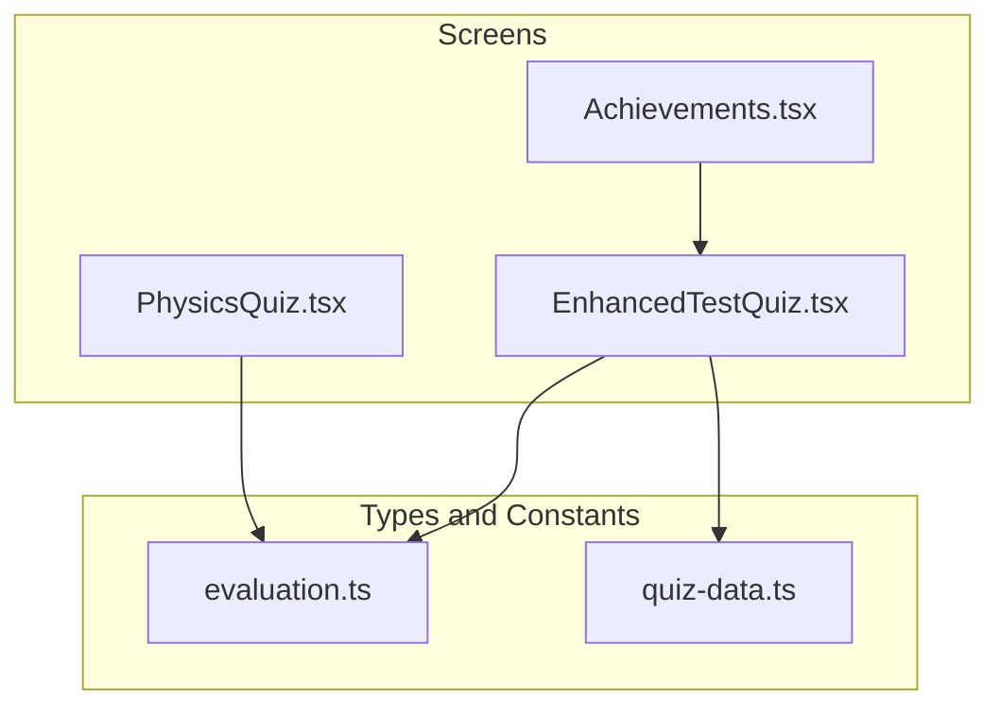
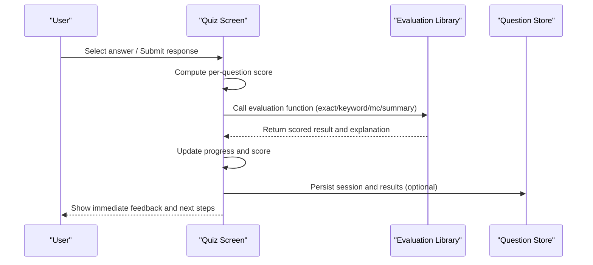
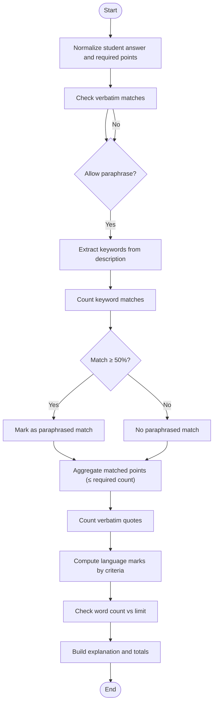
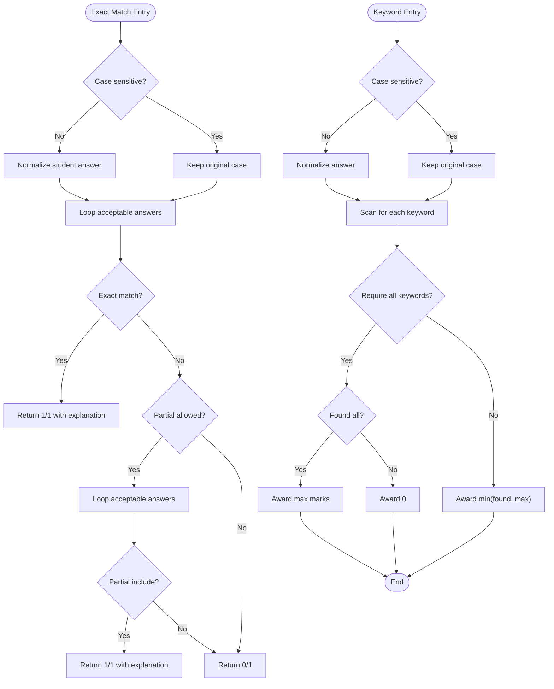
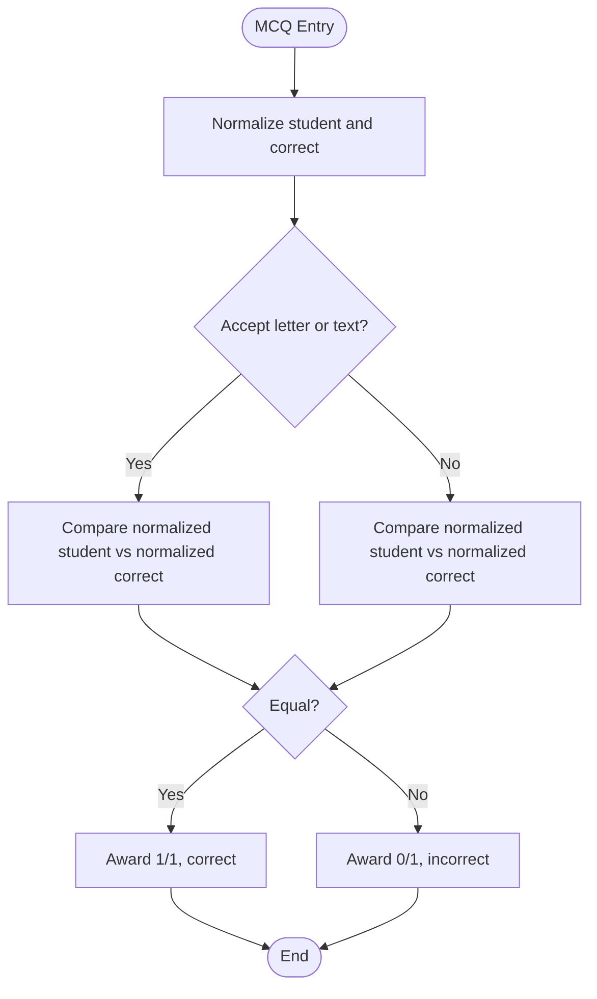
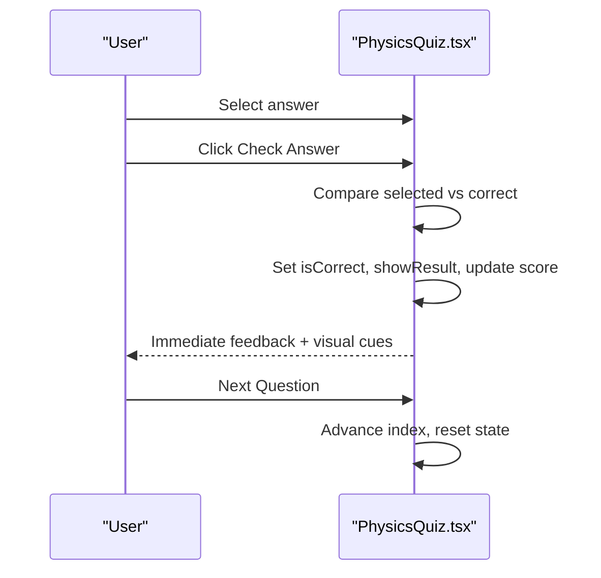
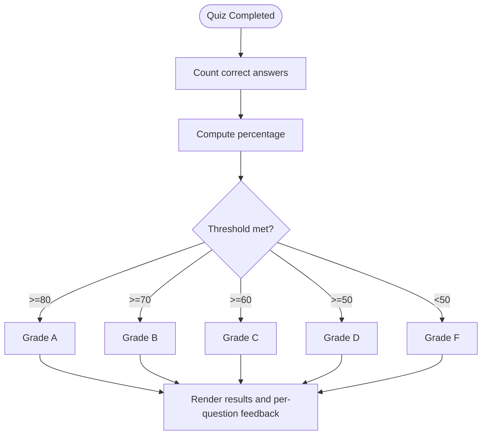
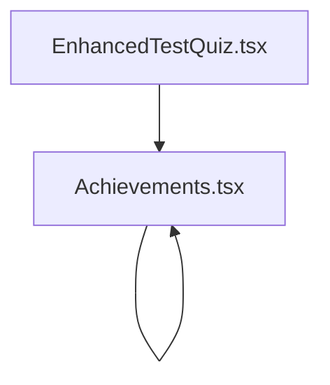
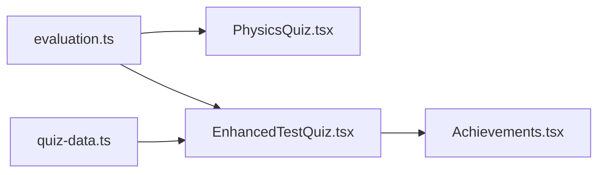

# Scoring and Evaluation

<cite>
**Referenced Files in This Document**
- [evaluation.ts](file://src/types/evaluation.ts)
- [quiz-data.ts](file://src/constants/quiz-data.ts)
- [PhysicsQuiz.tsx](file://src/screens/PhysicsQuiz.tsx)
- [EnhancedTestQuiz.tsx](file://src/screens/EnhancedTestQuiz.tsx)
- [Achievements.tsx](file://src/screens/Achievements.tsx)
</cite>

## Table of Contents
1. [Introduction](#introduction)
2. [Project Structure](#project-structure)
3. [Core Components](#core-components)
4. [Architecture Overview](#architecture-overview)
5. [Detailed Component Analysis](#detailed-component-analysis)
6. [Dependency Analysis](#dependency-analysis)
7. [Performance Considerations](#performance-considerations)
8. [Troubleshooting Guide](#troubleshooting-guide)
9. [Conclusion](#conclusion)
10. [Appendices](#appendices)

## Introduction
This document explains the quiz scoring and evaluation system implemented in the project. It covers the scoring algorithms, correctness validation logic, point calculation mechanisms, evaluation criteria for different question types, progress tracking, score aggregation, grade determination, and integration with user progress and achievements. It also documents transparency features, immediate feedback systems, and pathways for customization and integration with external assessment systems.

## Project Structure
The scoring and evaluation logic spans several modules:
- A reusable evaluation library for language and content-based assessments
- Quiz screens implementing question-by-question scoring and progress tracking
- A results screen aggregating scores and determining grades
- Achievement display integrating mastery metrics

**Diagram sources**
- [PhysicsQuiz.tsx](file://src/screens/PhysicsQuiz.tsx#L164-L446)
- [EnhancedTestQuiz.tsx](file://src/screens/EnhancedTestQuiz.tsx#L113-L846)
- [evaluation.ts](file://src/types/evaluation.ts#L1-L421)
- [quiz-data.ts](file://src/constants/quiz-data.ts#L1-L313)
- [Achievements.tsx](file://src/screens/Achievements.tsx#L96-L250)

**Section sources**
- [evaluation.ts](file://src/types/evaluation.ts#L1-L421)
- [quiz-data.ts](file://src/constants/quiz-data.ts#L1-L313)
- [PhysicsQuiz.tsx](file://src/screens/PhysicsQuiz.tsx#L164-L446)
- [EnhancedTestQuiz.tsx](file://src/screens/EnhancedTestQuiz.tsx#L113-L846)
- [Achievements.tsx](file://src/screens/Achievements.tsx#L96-L250)

## Core Components
- Content-based evaluation for constructed responses (summary/argument tasks)
- Exact-match and keyword-based evaluation for short-answer tasks
- Multiple-choice evaluation with flexible normalization
- Quiz progress tracking and immediate feedback
- Score aggregation and grade determination
- Achievement and mastery visualization

Key implementation references:
- Content analysis and language marks: [evaluateSummary](file://src/types/evaluation.ts#L201-L248), [analyzeSummaryPoints](file://src/types/evaluation.ts#L34-L80), [calculateLanguageMarks](file://src/types/evaluation.ts#L144-L186)
- Exact match evaluation: [evaluateExactMatch](file://src/types/evaluation.ts#L260-L314)
- Keyword-based evaluation: [evaluateKeywordBased](file://src/types/evaluation.ts#L332-L378)
- Multiple-choice evaluation: [evaluateMultipleChoice](file://src/types/evaluation.ts#L383-L410)
- Quiz progress and scoring: [PhysicsQuiz.tsx](file://src/screens/PhysicsQuiz.tsx#L195-L213), [EnhancedTestQuiz.tsx](file://src/screens/EnhancedTestQuiz.tsx#L277-L291)
- Grade determination: [EnhancedTestQuiz.tsx](file://src/screens/EnhancedTestQuiz.tsx#L284-L291)

**Section sources**
- [evaluation.ts](file://src/types/evaluation.ts#L201-L410)
- [PhysicsQuiz.tsx](file://src/screens/PhysicsQuiz.tsx#L195-L213)
- [EnhancedTestQuiz.tsx](file://src/screens/EnhancedTestQuiz.tsx#L277-L291)

## Architecture Overview
The evaluation pipeline integrates UI screens with evaluation utilities. Screens collect answers, compute per-question scores, aggregate totals, and present results and feedback.

**Diagram sources**
- [PhysicsQuiz.tsx](file://src/screens/PhysicsQuiz.tsx#L195-L213)
- [EnhancedTestQuiz.tsx](file://src/screens/EnhancedTestQuiz.tsx#L277-L291)
- [evaluation.ts](file://src/types/evaluation.ts#L260-L410)

## Detailed Component Analysis

### Content-Based Summary Evaluation
This component evaluates constructed responses by:
- Normalizing text for comparison
- Matching verbatim quotes and paraphrased content via keywords
- Assigning content marks up to a required threshold
- Applying language marks with criteria that penalize excessive verbatim quoting
- Enforcing word limits and generating explanations

**Diagram sources**
- [evaluation.ts](file://src/types/evaluation.ts#L34-L80)
- [evaluation.ts](file://src/types/evaluation.ts#L144-L186)
- [evaluation.ts](file://src/types/evaluation.ts#L201-L248)

**Section sources**
- [evaluation.ts](file://src/types/evaluation.ts#L23-L80)
- [evaluation.ts](file://src/types/evaluation.ts#L144-L186)
- [evaluation.ts](file://src/types/evaluation.ts#L201-L248)

### Exact-Match and Keyword-Based Evaluations
- Exact match evaluation supports case sensitivity and optional partial inclusion checks, awarding full marks on match.
- Keyword-based evaluation optionally requires all keywords or awards marks proportionally.

**Diagram sources**
- [evaluation.ts](file://src/types/evaluation.ts#L260-L314)
- [evaluation.ts](file://src/types/evaluation.ts#L332-L378)

**Section sources**
- [evaluation.ts](file://src/types/evaluation.ts#L260-L314)
- [evaluation.ts](file://src/types/evaluation.ts#L332-L378)

### Multiple-Choice Evaluation
- Supports flexible normalization and optional acceptance of letter or full-text answers.
- Returns correctness flag and awarded/max marks.

**Diagram sources**
- [evaluation.ts](file://src/types/evaluation.ts#L383-L410)

**Section sources**
- [evaluation.ts](file://src/types/evaluation.ts#L383-L410)

### Quiz Progress Tracking and Immediate Feedback
- Physics quiz tracks current question index, selected answer, correctness, and score per question.
- On submission, it toggles result visibility and updates score accordingly.
- Progress bar and score badge reflect real-time progress.

**Diagram sources**
- [PhysicsQuiz.tsx](file://src/screens/PhysicsQuiz.tsx#L195-L213)
- [PhysicsQuiz.tsx](file://src/screens/PhysicsQuiz.tsx#L215-L446)

**Section sources**
- [PhysicsQuiz.tsx](file://src/screens/PhysicsQuiz.tsx#L164-L446)

### Score Aggregation and Grade Determination
- Enhanced test quiz aggregates correct answers across all questions.
- Computes grade based on percentage thresholds.
- Displays time taken and per-question correctness.

**Diagram sources**
- [EnhancedTestQuiz.tsx](file://src/screens/EnhancedTestQuiz.tsx#L277-L291)
- [EnhancedTestQuiz.tsx](file://src/screens/EnhancedTestQuiz.tsx#L790-L840)

**Section sources**
- [EnhancedTestQuiz.tsx](file://src/screens/EnhancedTestQuiz.tsx#L277-L291)
- [EnhancedTestQuiz.tsx](file://src/screens/EnhancedTestQuiz.tsx#L790-L840)

### Achievement and Mastery Visualization
- Achievements page displays mastery level, progress percentage, and badge collection.
- Integrates with quiz results indirectly via user progression and activity.

**Diagram sources**
- [EnhancedTestQuiz.tsx](file://src/screens/EnhancedTestQuiz.tsx#L790-L840)
- [Achievements.tsx](file://src/screens/Achievements.tsx#L96-L250)

**Section sources**
- [Achievements.tsx](file://src/screens/Achievements.tsx#L96-L250)

## Dependency Analysis
- Quiz screens depend on evaluation utilities for correctness and scoring.
- Enhanced test quiz depends on question data and database actions for dynamic quizzes.
- Achievements rely on aggregated quiz performance indirectly.

**Diagram sources**
- [evaluation.ts](file://src/types/evaluation.ts#L1-L421)
- [PhysicsQuiz.tsx](file://src/screens/PhysicsQuiz.tsx#L164-L446)
- [EnhancedTestQuiz.tsx](file://src/screens/EnhancedTestQuiz.tsx#L113-L846)
- [quiz-data.ts](file://src/constants/quiz-data.ts#L1-L313)
- [Achievements.tsx](file://src/screens/Achievements.tsx#L96-L250)

**Section sources**
- [evaluation.ts](file://src/types/evaluation.ts#L1-L421)
- [PhysicsQuiz.tsx](file://src/screens/PhysicsQuiz.tsx#L164-L446)
- [EnhancedTestQuiz.tsx](file://src/screens/EnhancedTestQuiz.tsx#L113-L846)
- [quiz-data.ts](file://src/constants/quiz-data.ts#L1-L313)
- [Achievements.tsx](file://src/screens/Achievements.tsx#L96-L250)

## Performance Considerations
- Text normalization and keyword extraction are linear in input length; keep keyword lists concise.
- Exact and keyword evaluations iterate over acceptable answers; prefer smaller sets or pre-filtered candidates.
- Multiple-choice comparisons are O(1) after normalization.
- UI rendering updates are optimized via React state management; avoid unnecessary re-renders by memoizing derived values.

## Troubleshooting Guide
Common issues and resolutions:
- Incorrect scoring for MCQs: Verify normalization options and accepted answer formats.
- Keyword evaluation not awarding marks: Confirm case sensitivity and whether partial inclusion is enabled.
- Summary evaluation not recognizing paraphrased content: Adjust keyword extraction and matching thresholds.
- Progress not updating: Ensure state updates occur after correctness checks and before advancing to next question.

**Section sources**
- [evaluation.ts](file://src/types/evaluation.ts#L260-L410)
- [PhysicsQuiz.tsx](file://src/screens/PhysicsQuiz.tsx#L195-L213)
- [EnhancedTestQuiz.tsx](file://src/screens/EnhancedTestQuiz.tsx#L277-L291)

## Conclusion
The system provides robust, extensible scoring and evaluation capabilities across multiple question types, with immediate feedback, progress tracking, and grade computation. The evaluation utilities encapsulate correctness logic, while quiz screens orchestrate user interactions and results presentation. Achievements integrate with quiz performance to visualize mastery.

## Appendices

### Implementation Guidelines for Customization
- To customize scoring rules:
  - Modify evaluation thresholds and criteria in the evaluation utilities.
  - Extend evaluation functions to support new question types (e.g., numeric, drag-and-drop).
- To integrate with external assessment systems:
  - Persist quiz sessions and results to a backend service.
  - Export performance analytics (time, accuracy, topic-wise breakdown).
  - Align grade boundaries with external standards.

### Example References
- Summary evaluation: [evaluateSummary](file://src/types/evaluation.ts#L201-L248)
- Exact match evaluation: [evaluateExactMatch](file://src/types/evaluation.ts#L260-L314)
- Keyword evaluation: [evaluateKeywordBased](file://src/types/evaluation.ts#L332-L378)
- MCQ evaluation: [evaluateMultipleChoice](file://src/types/evaluation.ts#L383-L410)
- Quiz scoring and progress: [PhysicsQuiz.tsx](file://src/screens/PhysicsQuiz.tsx#L195-L213), [EnhancedTestQuiz.tsx](file://src/screens/EnhancedTestQuiz.tsx#L277-L291)
- Grade determination: [EnhancedTestQuiz.tsx](file://src/screens/EnhancedTestQuiz.tsx#L284-L291)