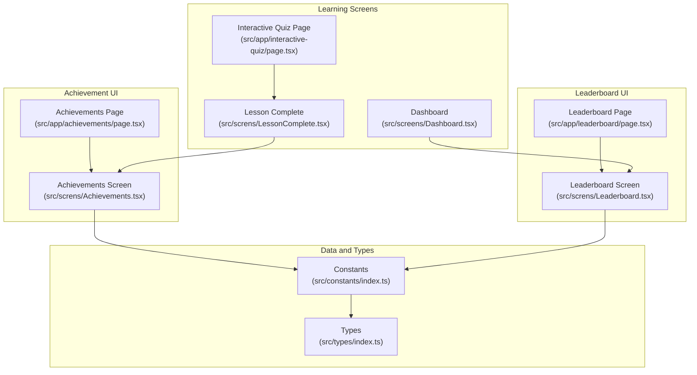
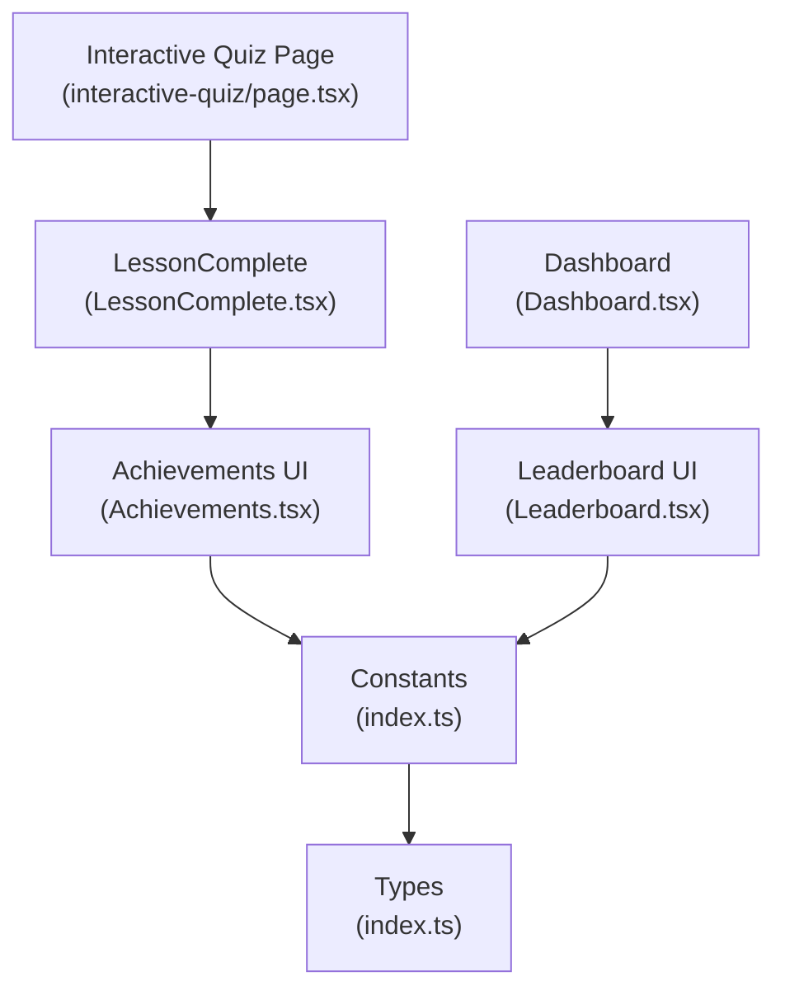
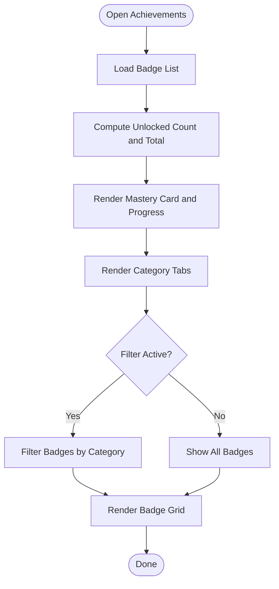
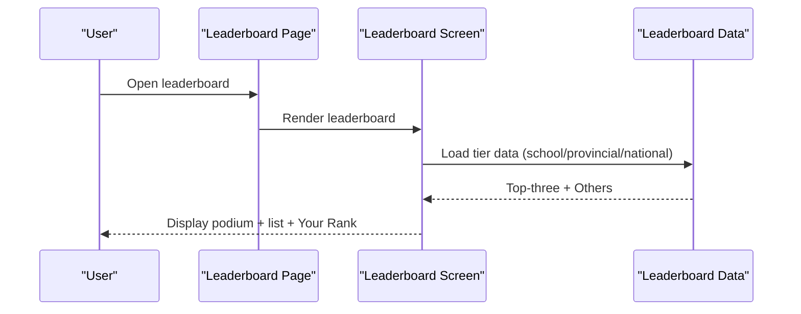
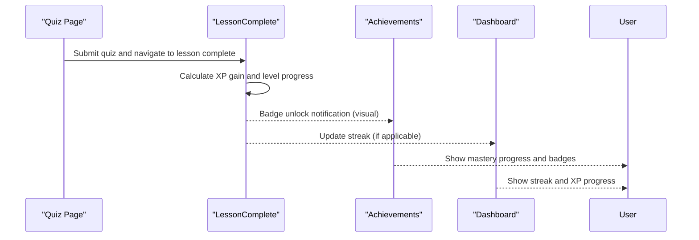
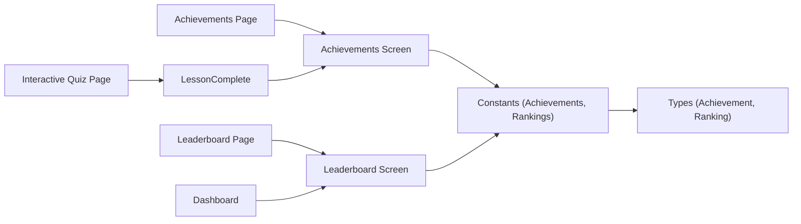

# Achievement and Gamification System

<cite>
**Referenced Files in This Document**
- [page.tsx](file://src/app/achievements/page.tsx)
- [Achievements.tsx](file://src/screns/Achievements.tsx)
- [page.tsx](file://src/app/leaderboard/page.tsx)
- [Leaderboard.tsx](file://src/screns/Leaderboard.tsx)
- [index.ts](file://src/constants/index.ts)
- [index.ts](file://src/types/index.ts)
- [LessonComplete.tsx](file://src/screns/LessonComplete.tsx)
- [Dashboard.tsx](file://src/screens/Dashboard.tsx)
- [page.tsx](file://src/app/interactive-quiz/page.tsx)
</cite>

## Table of Contents
1. [Introduction](#introduction)
2. [Project Structure](#project-structure)
3. [Core Components](#core-components)
4. [Architecture Overview](#architecture-overview)
5. [Detailed Component Analysis](#detailed-component-analysis)
6. [Dependency Analysis](#dependency-analysis)
7. [Performance Considerations](#performance-considerations)
8. [Troubleshooting Guide](#troubleshooting-guide)
9. [Conclusion](#conclusion)
10. [Appendices](#appendices)

## Introduction
This document describes the achievement and gamification system that drives student engagement through rewards, recognition, and competition. It documents achievement criteria definitions, reward mechanisms, badge systems, progression tiers, leaderboard functionality, and the social motivation features that encourage continued learning. It also outlines implementation specifics for achievement triggers, reward distribution, and leaderboard updates, and provides examples of achievement categories, reward types, and competitive scenarios. Finally, it addresses the psychological impact of gamification on learning outcomes and strategies for maintaining long-term engagement.

## Project Structure
The gamification system spans UI pages, screen components, constants, and types that define achievements, rankings, and related data models. The key areas are:
- Achievement display page and component
- Leaderboard page and component
- Constants defining achievements and rankings
- Types defining data contracts
- Screens integrating XP, streaks, and rewards

**Diagram sources**
- [page.tsx](file://src/app/achievements/page.tsx#L1-L12)
- [Achievements.tsx](file://src/screns/Achievements.tsx#L1-L250)
- [page.tsx](file://src/app/leaderboard/page.tsx#L1-L12)
- [Leaderboard.tsx](file://src/screns/Leaderboard.tsx#L1-L380)
- [index.ts](file://src/constants/index.ts#L1-L120)
- [index.ts](file://src/types/index.ts#L1-L60)
- [LessonComplete.tsx](file://src/screns/LessonComplete.tsx#L90-L172)
- [Dashboard.tsx](file://src/screens/Dashboard.tsx#L157-L173)
- [page.tsx](file://src/app/interactive-quiz/page.tsx#L1-L24)

**Section sources**
- [page.tsx](file://src/app/achievements/page.tsx#L1-L12)
- [Achievements.tsx](file://src/screns/Achievements.tsx#L1-L250)
- [page.tsx](file://src/app/leaderboard/page.tsx#L1-L12)
- [Leaderboard.tsx](file://src/screns/Leaderboard.tsx#L1-L380)
- [index.ts](file://src/constants/index.ts#L1-L120)
- [index.ts](file://src/types/index.ts#L1-L60)
- [LessonComplete.tsx](file://src/screns/LessonComplete.tsx#L90-L172)
- [Dashboard.tsx](file://src/screens/Dashboard.tsx#L157-L173)
- [page.tsx](file://src/app/interactive-quiz/page.tsx#L1-L24)

## Core Components
- Achievement page and screen: Render a mastery level, progress bar, category filters, and a grid of badges with unlock status.
- Leaderboard page and screen: Display school, provincial, and national leaderboards with podium visuals, rankings, and user rank footer.
- Constants: Define achievement records and ranking lists used by screens.
- Types: Define Achievement and Ranking interfaces used across components and constants.
- Learning screens: Integrate XP gains, level progression, streak counters, and reward notifications.

Key implementation specifics:
- Achievement display uses a fixed set of badges with unlock status and category filtering.
- Leaderboard uses mock data for top-three podium and extended lists, with tabs for different competition tiers.
- XP and level progression appear on lesson completion, and streaks appear on the dashboard.
- Quiz pages trigger lesson completion and subsequent XP/reward displays.

**Section sources**
- [Achievements.tsx](file://src/screns/Achievements.tsx#L7-L87)
- [Achievements.tsx](file://src/screns/Achievements.tsx#L96-L250)
- [Leaderboard.tsx](file://src/screns/Leaderboard.tsx#L9-L25)
- [Leaderboard.tsx](file://src/screns/Leaderboard.tsx#L28-L175)
- [Leaderboard.tsx](file://src/screns/Leaderboard.tsx#L291-L380)
- [index.ts](file://src/constants/index.ts#L38-L73)
- [index.ts](file://src/constants/index.ts#L75-L119)
- [index.ts](file://src/types/index.ts#L30-L47)
- [LessonComplete.tsx](file://src/screns/LessonComplete.tsx#L90-L148)
- [Dashboard.tsx](file://src/screens/Dashboard.tsx#L157-L173)
- [page.tsx](file://src/app/interactive-quiz/page.tsx#L1-L24)

## Architecture Overview
The gamification system is composed of:
- Presentation layer: Pages and screens render UI for achievements and leaderboards.
- Data layer: Constants provide static achievement and ranking datasets.
- Types layer: Strong typing for achievements and rankings.
- Learning integration: Quiz and lesson completion screens feed XP, levels, and streaks.

**Diagram sources**
- [Achievements.tsx](file://src/screns/Achievements.tsx#L1-L250)
- [Leaderboard.tsx](file://src/screns/Leaderboard.tsx#L1-L380)
- [index.ts](file://src/constants/index.ts#L1-L120)
- [index.ts](file://src/types/index.ts#L1-L60)
- [LessonComplete.tsx](file://src/screns/LessonComplete.tsx#L90-L172)
- [Dashboard.tsx](file://src/screens/Dashboard.tsx#L157-L173)
- [page.tsx](file://src/app/interactive-quiz/page.tsx#L1-L24)

## Detailed Component Analysis

### Achievement System
The achievement system centers around a badge collection with unlock status and categorization. The UI:
- Shows a mastery level card with progress percentage and total badges.
- Provides category tabs to filter badges (All, Science, Math, History).
- Renders a grid of badges with either unlock visuals or lock icons.

Implementation highlights:
- Fixed badge list with category and unlock flags.
- Progress calculation based on unlocked count vs. total expected badges.
- Category filtering applied client-side.

**Diagram sources**
- [Achievements.tsx](file://src/screns/Achievements.tsx#L96-L104)
- [Achievements.tsx](file://src/screns/Achievements.tsx#L172-L187)
- [Achievements.tsx](file://src/screns/Achievements.tsx#L190-L244)

Achievement criteria examples (as defined in constants):
- Study timing: “Study after 10 PM”
- Topic mastery: “Complete Mechanics module”
- Performance target: “Complete quiz in less than 1 minute”
- Future goal: “Master Derivatives” (locked)

Reward mechanisms:
- Unlocking a badge triggers a visual reward and contributes to mastery progress.
- Lesson completion displays XP gain and potential new badges.

Progression tiers:
- Mastery level and progress bar reflect cumulative unlocks.
- Next milestone messaging encourages continued progress.

**Section sources**
- [Achievements.tsx](file://src/screns/Achievements.tsx#L7-L87)
- [Achievements.tsx](file://src/screns/Achievements.tsx#L96-L167)
- [index.ts](file://src/constants/index.ts#L38-L73)
- [LessonComplete.tsx](file://src/screns/LessonComplete.tsx#L90-L126)

### Leaderboard System
The leaderboard supports three competition tiers: school, provincial, and national. The UI:
- Uses tabs to switch between tiers.
- Displays a podium for top-three students with avatars and points.
- Lists others with rank, avatar, school, and points.
- Shows a persistent “Your Rank” footer with streak and points.

Ranking algorithm (conceptual):
- Students are ranked by points in descending order within each tier.
- Top-three are highlighted in a podium layout; others are listed below.
- The “Your Rank” section indicates position, streak, and percentile.

**Diagram sources**
- [page.tsx](file://src/app/leaderboard/page.tsx#L1-L12)
- [Leaderboard.tsx](file://src/screns/Leaderboard.tsx#L28-L175)
- [Leaderboard.tsx](file://src/screns/Leaderboard.tsx#L291-L380)

Leaderboard update mechanism:
- Current implementation uses mock data; future integration would require:
  - Backend endpoint to fetch scores and compute ranks.
  - Real-time updates via polling or push events.
  - Caching strategies to minimize load.

**Section sources**
- [Leaderboard.tsx](file://src/screns/Leaderboard.tsx#L9-L25)
- [Leaderboard.tsx](file://src/screns/Leaderboard.tsx#L28-L175)
- [Leaderboard.tsx](file://src/screns/Leaderboard.tsx#L291-L380)
- [index.ts](file://src/constants/index.ts#L75-L119)

### Learning Integration and Reward Distribution
Learning screens integrate gamification signals:
- XP gain and level progression after lesson completion.
- Streak counter on the dashboard reflecting consecutive study days.
- Quiz pages lead to lesson completion screens where rewards are shown.

**Diagram sources**
- [page.tsx](file://src/app/interactive-quiz/page.tsx#L1-L24)
- [LessonComplete.tsx](file://src/screns/LessonComplete.tsx#L90-L148)
- [Achievements.tsx](file://src/screns/Achievements.tsx#L96-L167)
- [Dashboard.tsx](file://src/screens/Dashboard.tsx#L157-L173)

Reward distribution specifics:
- Visual badge display upon unlock.
- XP gain and level progression indicators.
- Streak visualization and motivational messages.

**Section sources**
- [LessonComplete.tsx](file://src/screns/LessonComplete.tsx#L90-L148)
- [Dashboard.tsx](file://src/screens/Dashboard.tsx#L157-L173)
- [Achievements.tsx](file://src/screns/Achievements.tsx#L96-L167)

### Achievement Categories and Examples
Achievement categories and examples:
- All: Night Owl, Fast Finisher, Book Worm, Code Ninja
- Science: Physics Master, Bio Whiz, Chem Wiz
- Math: Calculus King
- History: History Buff

Reward types:
- Visual badges with unlock status and category.
- Mastery progress and next milestone messaging.

Competitive scenarios:
- Streak-based recognition (e.g., “Keep building your streak!”).
- Quiz performance targets (e.g., “Complete quiz in less than 1 minute”).
- Topic mastery goals (e.g., “Master Derivatives”).

**Section sources**
- [Achievements.tsx](file://src/screns/Achievements.tsx#L89-L94)
- [index.ts](file://src/constants/index.ts#L38-L73)

## Dependency Analysis
The system exhibits clear separation of concerns:
- UI pages depend on screen components.
- Screen components consume constants and types.
- Learning screens integrate with UI to show XP, levels, and streaks.

**Diagram sources**
- [page.tsx](file://src/app/achievements/page.tsx#L1-L12)
- [Achievements.tsx](file://src/screns/Achievements.tsx#L1-L250)
- [page.tsx](file://src/app/leaderboard/page.tsx#L1-L12)
- [Leaderboard.tsx](file://src/screns/Leaderboard.tsx#L1-L380)
- [index.ts](file://src/constants/index.ts#L1-L120)
- [index.ts](file://src/types/index.ts#L1-L60)
- [LessonComplete.tsx](file://src/screns/LessonComplete.tsx#L90-L172)
- [Dashboard.tsx](file://src/screens/Dashboard.tsx#L157-L173)
- [page.tsx](file://src/app/interactive-quiz/page.tsx#L1-L24)

**Section sources**
- [index.ts](file://src/constants/index.ts#L1-L120)
- [index.ts](file://src/types/index.ts#L1-L60)

## Performance Considerations
- Client-side filtering for badges is efficient given small datasets.
- Leaderboard mock data avoids network overhead but requires backend integration for scalability.
- Consider lazy-loading images for badges and avatars to improve initial render performance.
- Debounce tab switching on leaderboard for smoother transitions.

## Troubleshooting Guide
Common issues and resolutions:
- Missing or broken badge images: Verify image URLs and fallback rendering.
- Incorrect unlock states: Ensure unlock flags align with game logic and user progress.
- Leaderboard rank discrepancies: Validate sorting logic and tie-breaking rules.
- Streak not updating: Confirm daily check-ins and persistence of streak state.

**Section sources**
- [Achievements.tsx](file://src/screns/Achievements.tsx#L206-L218)
- [Leaderboard.tsx](file://src/screns/Leaderboard.tsx#L178-L254)
- [Dashboard.tsx](file://src/screens/Dashboard.tsx#L157-L173)

## Conclusion
The achievement and gamification system leverages visible rewards, progress tracking, and healthy competition to sustain student engagement. With a clear UI for badges and leaderboards, integrated XP and streak mechanics, and strong typing for data contracts, the system provides a solid foundation for continued learning. Future enhancements should focus on dynamic achievement triggers, real-time leaderboard updates, and scalable reward distribution.

## Appendices
- Achievement categories and examples are defined in constants and rendered by the achievements screen.
- Leaderboard tiers (school, provincial, national) are supported by mock data and rendered by the leaderboard screen.
- Types define the contracts for achievements and rankings used across components.