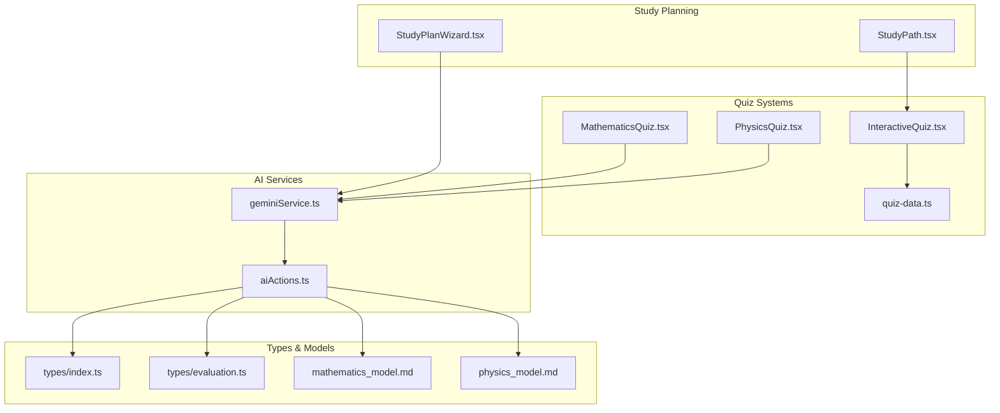
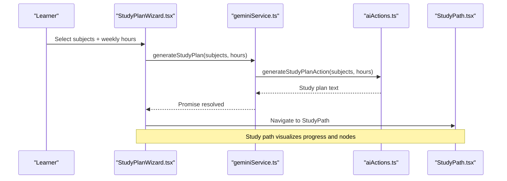
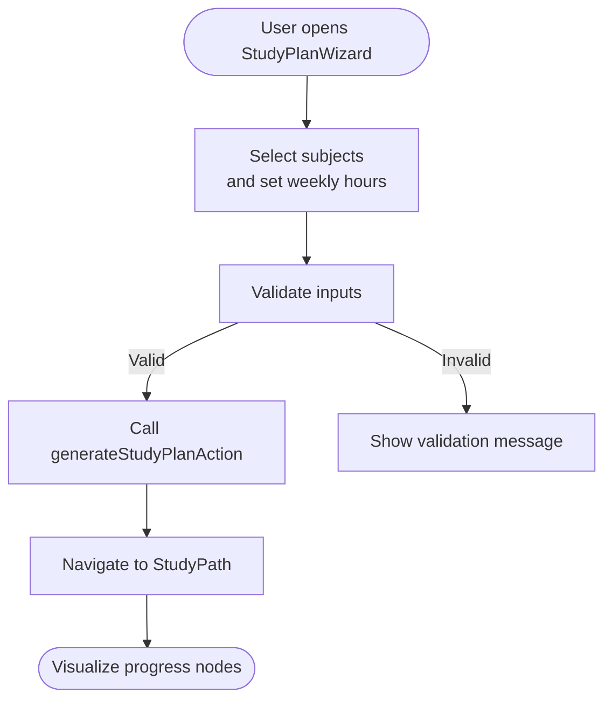
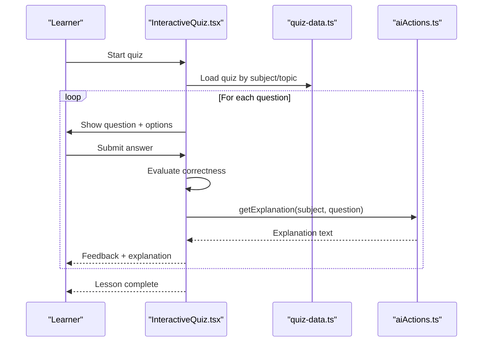
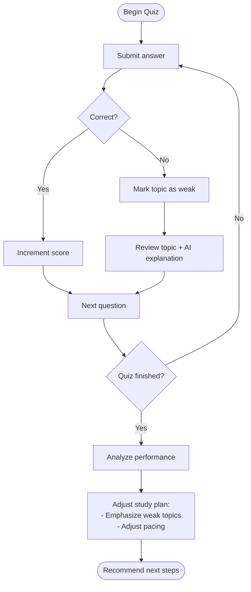
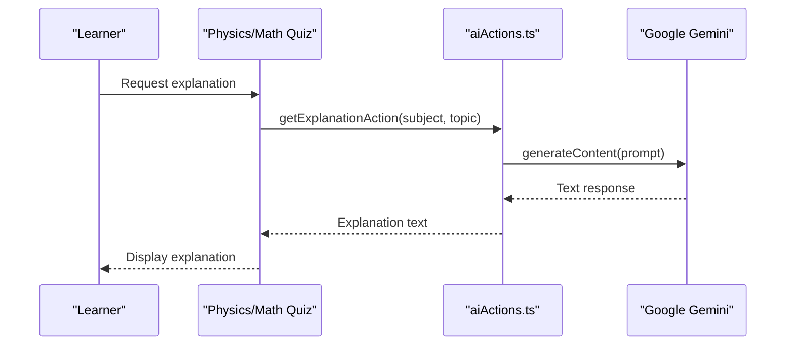
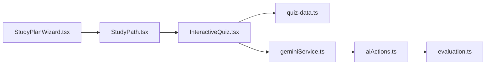
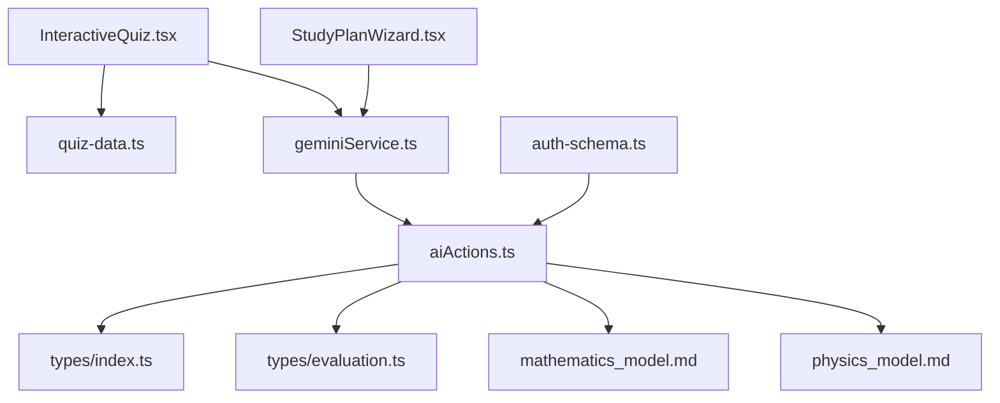

# Learning System Integration

<cite>
**Referenced Files in This Document**
- [StudyPath.tsx](file://src/screens/StudyPath.tsx)
- [StudyPlanWizard.tsx](file://src/screens/StudyPlanWizard.tsx)
- [InteractiveQuiz.tsx](file://src/screens/InteractiveQuiz.tsx)
- [MathematicsQuiz.tsx](file://src/screens/MathematicsQuiz.tsx)
- [PhysicsQuiz.tsx](file://src/screens/PhysicsQuiz.tsx)
- [geminiService.ts](file://src/services/geminiService.ts)
- [aiActions.ts](file://src/services/aiActions.ts)
- [quiz-data.ts](file://src/constants/quiz-data.ts)
- [index.ts](file://src/types/index.ts)
- [evaluation.ts](file://src/types/evaluation.ts)
- [README.md](file://README.md)
- [auth-schema.ts](file://auth-schema.ts)
- [mathematics_model.md](file://src/data_modeling/mathematics_model.md)
- [physics_model.md](file://src/data_modeling/physics_model.md)
</cite>

## Table of Contents
1. [Introduction](#introduction)
2. [Project Structure](#project-structure)
3. [Core Components](#core-components)
4. [Architecture Overview](#architecture-overview)
5. [Detailed Component Analysis](#detailed-component-analysis)
6. [Dependency Analysis](#dependency-analysis)
7. [Performance Considerations](#performance-considerations)
8. [Troubleshooting Guide](#troubleshooting-guide)
9. [Conclusion](#conclusion)
10. [Appendices](#appendices)

## Introduction
This document explains how the learning system integrates study planning with learning features to deliver personalized educational recommendations. It covers how study paths influence quiz selection, subject prioritization, and learning resource recommendations; how adaptive learning algorithms adjust study plans based on quiz performance, weak topic identification, and learning pace; and how AI-powered recommendations suggest specific topics, resources, and practice exercises. It also details the data flow between study planning and quiz systems, performance-based topic prioritization, and dynamic content adaptation, with examples of adaptive study recommendations, topic-based learning sequences, and personalized quiz suggestions.

## Project Structure
The learning system is organized around three pillars:
- Study Planning: Wizard-driven generation of personalized study paths and a visual Study Path screen.
- Quiz Systems: Interactive quizzes with AI-powered explanations and topic tagging.
- AI Services: Server actions that generate study plans and explanations via Google Gemini.

**Diagram sources**
- [StudyPlanWizard.tsx](file://src/screens/StudyPlanWizard.tsx#L33-L60)
- [StudyPath.tsx](file://src/screens/StudyPath.tsx#L38-L272)
- [InteractiveQuiz.tsx](file://src/screens/InteractiveQuiz.tsx#L105-L194)
- [MathematicsQuiz.tsx](file://src/screens/MathematicsQuiz.tsx#L32-L56)
- [PhysicsQuiz.tsx](file://src/screens/PhysicsQuiz.tsx#L164-L193)
- [geminiService.ts](file://src/services/geminiService.ts#L1-L14)
- [aiActions.ts](file://src/services/aiActions.ts#L1-L168)
- [quiz-data.ts](file://src/constants/quiz-data.ts#L23-L312)
- [index.ts](file://src/types/index.ts#L21-L60)
- [evaluation.ts](file://src/types/evaluation.ts#L1-L421)
- [mathematics_model.md](file://src/data_modeling/mathematics_model.md#L1-L212)
- [physics_model.md](file://src/data_modeling/physics_model.md#L1-L376)

**Section sources**
- [README.md](file://README.md#L1-L141)
- [StudyPlanWizard.tsx](file://src/screens/StudyPlanWizard.tsx#L33-L60)
- [StudyPath.tsx](file://src/screens/StudyPath.tsx#L38-L272)
- [InteractiveQuiz.tsx](file://src/screens/InteractiveQuiz.tsx#L105-L194)
- [MathematicsQuiz.tsx](file://src/screens/MathematicsQuiz.tsx#L32-L56)
- [PhysicsQuiz.tsx](file://src/screens/PhysicsQuiz.tsx#L164-L193)
- [geminiService.ts](file://src/services/geminiService.ts#L1-L14)
- [aiActions.ts](file://src/services/aiActions.ts#L1-L168)
- [quiz-data.ts](file://src/constants/quiz-data.ts#L23-L312)
- [index.ts](file://src/types/index.ts#L21-L60)
- [evaluation.ts](file://src/types/evaluation.ts#L1-L421)
- [mathematics_model.md](file://src/data_modeling/mathematics_model.md#L1-L212)
- [physics_model.md](file://src/data_modeling/physics_model.md#L1-L376)

## Core Components
- StudyPlanWizard: Collects subjects and weekly commitment, triggers AI-generated study plan, and navigates to StudyPath.
- StudyPath: Visualizes the learner’s progress along a generated path with nodes indicating locked, current, and completed states.
- Quiz Screens: Interactive quiz experiences with topic tagging, hints, and AI-powered explanations.
- AI Services: Thin client wrappers around server actions that call Google Gemini for explanations and study plan generation.
- Data Models: Quiz data structure, evaluation utilities, and exam paper modeling for scalable content ingestion.

Key responsibilities:
- Personalized Study Paths: Generated via AI based on selected subjects and weekly hours.
- Topic-Based Learning Sequences: Quizzes are tagged with topics; learners revisit weak topics.
- Adaptive Recommendations: Quiz performance influences subsequent topic selection and resource suggestions.
- Dynamic Content Adaptation: AI explanations tailor to learner’s current topic and performance.

**Section sources**
- [StudyPlanWizard.tsx](file://src/screens/StudyPlanWizard.tsx#L33-L60)
- [StudyPath.tsx](file://src/screens/StudyPath.tsx#L38-L272)
- [InteractiveQuiz.tsx](file://src/screens/InteractiveQuiz.tsx#L105-L194)
- [MathematicsQuiz.tsx](file://src/screens/MathematicsQuiz.tsx#L32-L56)
- [PhysicsQuiz.tsx](file://src/screens/PhysicsQuiz.tsx#L164-L193)
- [geminiService.ts](file://src/services/geminiService.ts#L1-L14)
- [aiActions.ts](file://src/services/aiActions.ts#L80-L114)
- [quiz-data.ts](file://src/constants/quiz-data.ts#L23-L312)
- [evaluation.ts](file://src/types/evaluation.ts#L34-L80)

## Architecture Overview
The system follows a client-server separation:
- Client-side screens orchestrate user interactions and render UI.
- Server actions encapsulate AI logic and enforce input validation and sanitization.
- Quiz data is centralized and consumed by multiple quiz screens.
- Authentication schema supports user sessions and account linking.

**Diagram sources**
- [StudyPlanWizard.tsx](file://src/screens/StudyPlanWizard.tsx#L45-L60)
- [geminiService.ts](file://src/services/geminiService.ts#L7-L9)
- [aiActions.ts](file://src/services/aiActions.ts#L80-L114)
- [StudyPath.tsx](file://src/screens/StudyPath.tsx#L38-L272)

## Detailed Component Analysis

### Study Planning Flow
- Wizard collects subjects and weekly commitment, validates inputs, and triggers AI generation.
- The AI action composes a prompt for a daily quest path and returns a textual plan.
- Navigation to StudyPath displays progress nodes and allows resuming current topic.

**Diagram sources**
- [StudyPlanWizard.tsx](file://src/screens/StudyPlanWizard.tsx#L33-L60)
- [aiActions.ts](file://src/services/aiActions.ts#L80-L114)
- [StudyPath.tsx](file://src/screens/StudyPath.tsx#L38-L272)

**Section sources**
- [StudyPlanWizard.tsx](file://src/screens/StudyPlanWizard.tsx#L33-L60)
- [aiActions.ts](file://src/services/aiActions.ts#L80-L114)
- [StudyPath.tsx](file://src/screens/StudyPath.tsx#L38-L272)

### Quiz Selection and Topic Prioritization
- Quiz screens consume centralized quiz data with subject and topic metadata.
- Learners can filter by subject and progress through questions with immediate feedback.
- Topics are used to prioritize weak areas and suggest targeted practice.

**Diagram sources**
- [InteractiveQuiz.tsx](file://src/screens/InteractiveQuiz.tsx#L105-L194)
- [quiz-data.ts](file://src/constants/quiz-data.ts#L23-L312)
- [aiActions.ts](file://src/services/aiActions.ts#L42-L78)

**Section sources**
- [InteractiveQuiz.tsx](file://src/screens/InteractiveQuiz.tsx#L105-L194)
- [quiz-data.ts](file://src/constants/quiz-data.ts#L23-L312)
- [aiActions.ts](file://src/services/aiActions.ts#L42-L78)

### Adaptive Learning Algorithms
- Weak Topic Identification: Incorrect answers flag topics for relearning; subsequent quizzes emphasize those topics.
- Performance-Based Prioritization: Scores and completion rates inform next-topic selection and difficulty progression.
- Learning Pace Adjustment: Weekly hours and progress metrics influence recommended daily study load and topic sequencing.

**Diagram sources**
- [InteractiveQuiz.tsx](file://src/screens/InteractiveQuiz.tsx#L174-L193)
- [aiActions.ts](file://src/services/aiActions.ts#L42-L78)
- [StudyPlanWizard.tsx](file://src/screens/StudyPlanWizard.tsx#L45-L60)

**Section sources**
- [InteractiveQuiz.tsx](file://src/screens/InteractiveQuiz.tsx#L174-L193)
- [aiActions.ts](file://src/services/aiActions.ts#L42-L78)
- [StudyPlanWizard.tsx](file://src/screens/StudyPlanWizard.tsx#L45-L60)

### AI-Powered Recommendations
- Study Plan Generation: Prompt includes subjects and weekly hours to produce a daily quest path.
- Topic Explanations: On-demand explanations improve understanding of difficult concepts.
- Smart Search: Suggestions for topics/questions and tips guide learners to relevant content.

**Diagram sources**
- [PhysicsQuiz.tsx](file://src/screens/PhysicsQuiz.tsx#L176-L192)
- [MathematicsQuiz.tsx](file://src/screens/MathematicsQuiz.tsx#L39-L55)
- [aiActions.ts](file://src/services/aiActions.ts#L42-L78)

**Section sources**
- [PhysicsQuiz.tsx](file://src/screens/PhysicsQuiz.tsx#L176-L192)
- [MathematicsQuiz.tsx](file://src/screens/MathematicsQuiz.tsx#L39-L55)
- [aiActions.ts](file://src/services/aiActions.ts#L42-L78)

### Data Flow Between Study Planning and Quiz Systems
- StudyPlanWizard generates a plan; StudyPath visualizes progress.
- Quiz screens draw from centralized quiz data; explanations leverage AI actions.
- Evaluation utilities can be extended to compute mastery and recommend next steps.

**Diagram sources**
- [StudyPlanWizard.tsx](file://src/screens/StudyPlanWizard.tsx#L33-L60)
- [StudyPath.tsx](file://src/screens/StudyPath.tsx#L38-L272)
- [InteractiveQuiz.tsx](file://src/screens/InteractiveQuiz.tsx#L105-L194)
- [geminiService.ts](file://src/services/geminiService.ts#L1-L14)
- [aiActions.ts](file://src/services/aiActions.ts#L1-L168)
- [evaluation.ts](file://src/types/evaluation.ts#L34-L80)

**Section sources**
- [StudyPlanWizard.tsx](file://src/screens/StudyPlanWizard.tsx#L33-L60)
- [StudyPath.tsx](file://src/screens/StudyPath.tsx#L38-L272)
- [InteractiveQuiz.tsx](file://src/screens/InteractiveQuiz.tsx#L105-L194)
- [geminiService.ts](file://src/services/geminiService.ts#L1-L14)
- [aiActions.ts](file://src/services/aiActions.ts#L1-L168)
- [evaluation.ts](file://src/types/evaluation.ts#L34-L80)

## Dependency Analysis
- Client-Server Separation: AI logic runs in server actions to keep client lean and secure.
- Centralized Quiz Data: Reduces duplication and simplifies maintenance.
- Authentication Schema: Provides user session and account relations for personalized experiences.

**Diagram sources**
- [InteractiveQuiz.tsx](file://src/screens/InteractiveQuiz.tsx#L105-L194)
- [geminiService.ts](file://src/services/geminiService.ts#L1-L14)
- [aiActions.ts](file://src/services/aiActions.ts#L1-L168)
- [StudyPlanWizard.tsx](file://src/screens/StudyPlanWizard.tsx#L33-L60)
- [quiz-data.ts](file://src/constants/quiz-data.ts#L23-L312)
- [index.ts](file://src/types/index.ts#L21-L60)
- [evaluation.ts](file://src/types/evaluation.ts#L1-L421)
- [mathematics_model.md](file://src/data_modeling/mathematics_model.md#L1-L212)
- [physics_model.md](file://src/data_modeling/physics_model.md#L1-L376)
- [auth-schema.ts](file://auth-schema.ts#L1-L95)

**Section sources**
- [InteractiveQuiz.tsx](file://src/screens/InteractiveQuiz.tsx#L105-L194)
- [geminiService.ts](file://src/services/geminiService.ts#L1-L14)
- [aiActions.ts](file://src/services/aiActions.ts#L1-L168)
- [StudyPlanWizard.tsx](file://src/screens/StudyPlanWizard.tsx#L33-L60)
- [quiz-data.ts](file://src/constants/quiz-data.ts#L23-L312)
- [index.ts](file://src/types/index.ts#L21-L60)
- [evaluation.ts](file://src/types/evaluation.ts#L1-L421)
- [mathematics_model.md](file://src/data_modeling/mathematics_model.md#L1-L212)
- [physics_model.md](file://src/data_modeling/physics_model.md#L1-L376)
- [auth-schema.ts](file://auth-schema.ts#L1-L95)

## Performance Considerations
- Minimize client-side AI calls: Keep prompts concise and delegate heavy lifting to server actions.
- Cache explanations: Store recent explanations keyed by subject and topic to avoid repeated API calls.
- Optimize quiz rendering: Virtualize long lists of questions and lazy-load images or diagrams.
- Scalable quiz data: Normalize quiz metadata to enable efficient filtering and pagination.

## Troubleshooting Guide
Common issues and resolutions:
- AI Features Disabled: Ensure the Gemini API key is configured; server actions return a message when the key is missing.
- Invalid Inputs: Server actions validate and sanitize inputs; errors are surfaced to the UI.
- Quiz Data Loading: Verify quiz IDs and topic mappings; ensure quiz data is correctly imported.

**Section sources**
- [aiActions.ts](file://src/services/aiActions.ts#L22-L32)
- [aiActions.ts](file://src/services/aiActions.ts#L42-L78)
- [aiActions.ts](file://src/services/aiActions.ts#L80-L114)
- [InteractiveQuiz.tsx](file://src/screens/InteractiveQuiz.tsx#L124-L129)

## Conclusion
The learning system integrates study planning and quiz experiences through a robust client-server architecture powered by AI. Study paths influence quiz selection and topic prioritization, while adaptive algorithms adjust plans based on performance, weak topic identification, and learning pace. AI-powered explanations and recommendations personalize the learning journey, and centralized data models enable scalable content management and dynamic adaptation.

## Appendices
- Example Adaptive Recommendations:
  - After repeated incorrect answers in “Gravitational Force,” recommend targeted quizzes and an explanation on Newton’s Law of Universal Gravitation.
  - Based on progress, suggest increasing daily study hours and introducing advanced topics like “Doppler Effect.”
- Topic-Based Learning Sequences:
  - Start with foundational topics (e.g., “Newton’s Laws”), then progress to intermediate (“Universal Gravitation”) and advanced (“Doppler Effect”).
- Personalized Quiz Suggestions:
  - Filter quizzes by subject and topic, and present a mix of recent weak topics and newly introduced concepts.