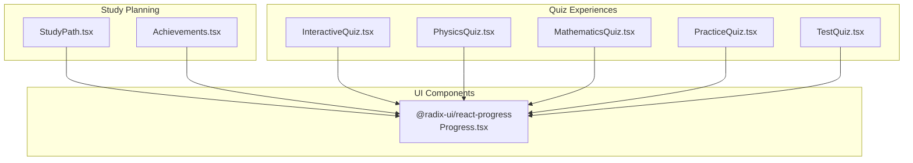
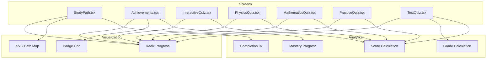
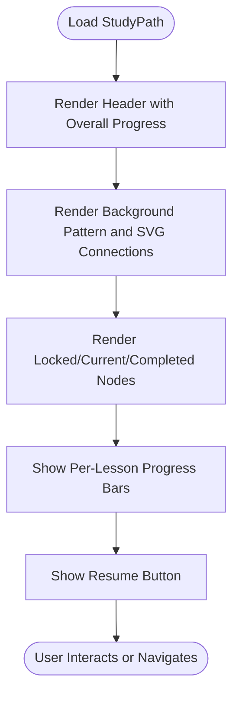
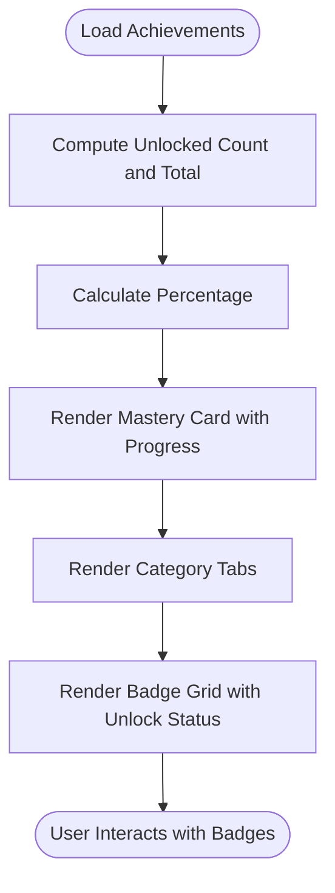
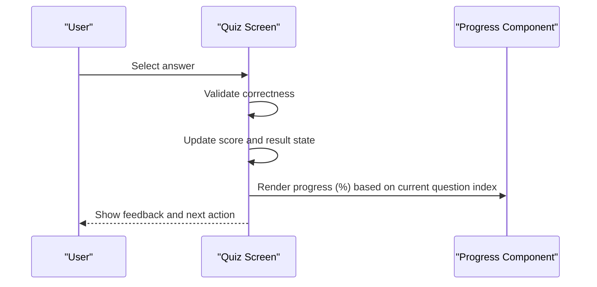
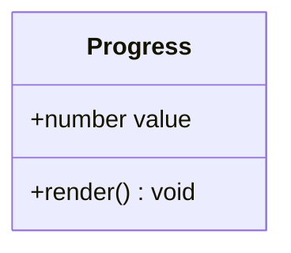
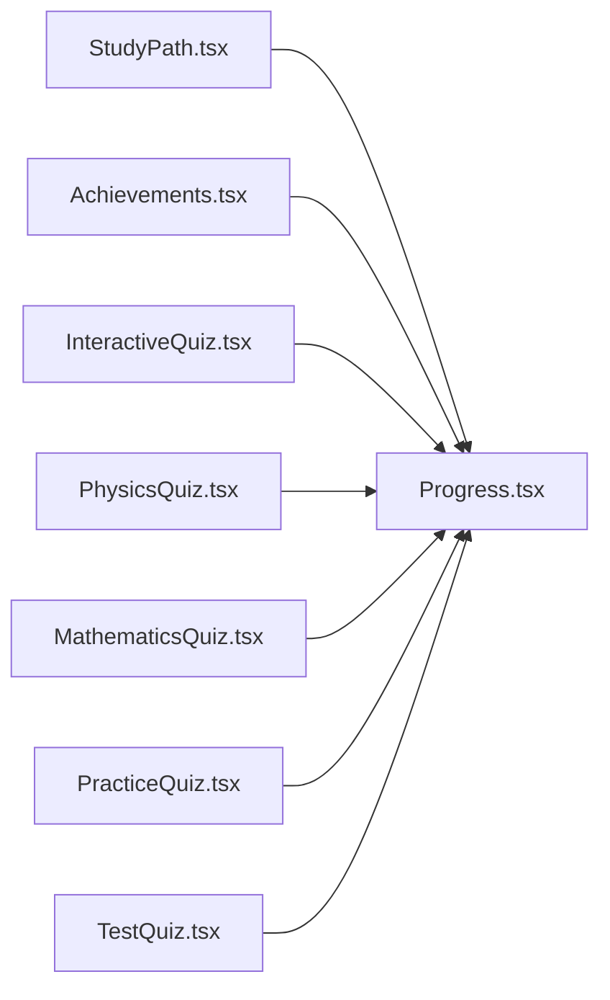

# Progress Tracking and Analytics

<cite>
**Referenced Files in This Document**
- [StudyPath.tsx](file://src/screens/StudyPath.tsx)
- [StudyPath Page](file://src/app/study-path/page.tsx)
- [Achievements.tsx](file://src/screens/Achievements.tsx)
- [Achievements Page](file://src/app/achievements/page.tsx)
- [Radix Progress](file://src/components/ui/progress.tsx)
- [InteractiveQuiz.tsx](file://src/screens/InteractiveQuiz.tsx)
- [PhysicsQuiz.tsx](file://src/screens/PhysicsQuiz.tsx)
- [MathematicsQuiz.tsx](file://src/screens/MathematicsQuiz.tsx)
- [PracticeQuiz.tsx](file://src/screens/PracticeQuiz.tsx)
- [TestQuiz.tsx](file://src/screens/TestQuiz.tsx)
- [Mock Data](file://src/constants/mock-data.ts)
</cite>

## Table of Contents
1. [Introduction](#introduction)
2. [Project Structure](#project-structure)
3. [Core Components](#core-components)
4. [Architecture Overview](#architecture-overview)
5. [Detailed Component Analysis](#detailed-component-analysis)
6. [Dependency Analysis](#dependency-analysis)
7. [Performance Considerations](#performance-considerations)
8. [Troubleshooting Guide](#troubleshooting-guide)
9. [Conclusion](#conclusion)
10. [Appendices](#appendices)

## Introduction
This document explains the progress tracking and analytics system within the study planning framework. It covers:
- Study path visualization with completion status, streak maintenance, and milestone achievements
- Progress calculation methods, completion percentage tracking, and study hour logging
- Integration between quiz performance and study path progression for adaptive learning recommendations
- Implementation details for progress data collection, analytics calculations, and visualization components
- Examples of progress metrics, completion tracking, and performance analytics
- Correlation between quiz scores, study hours, and overall academic improvement tracking

## Project Structure
The progress tracking and analytics system spans several screens and UI components:
- Study path visualization and resume flow
- Achievement and mastery tracking
- Quiz experiences that drive progress and performance analytics
- Shared progress visualization component

**Diagram sources**
- [StudyPath.tsx](file://src/screens/StudyPath.tsx#L1-L273)
- [Achievements.tsx](file://src/screens/Achievements.tsx#L1-L250)
- [InteractiveQuiz.tsx](file://src/screens/InteractiveQuiz.tsx#L1-L458)
- [PhysicsQuiz.tsx](file://src/screens/PhysicsQuiz.tsx#L1-L446)
- [MathematicsQuiz.tsx](file://src/screens/MathematicsQuiz.tsx#L1-L283)
- [PracticeQuiz.tsx](file://src/screens/PracticeQuiz.tsx#L1-L378)
- [TestQuiz.tsx](file://src/screens/TestQuiz.tsx#L1-L455)
- [Radix Progress](file://src/components/ui/progress.tsx#L1-L26)

**Section sources**
- [StudyPath.tsx](file://src/screens/StudyPath.tsx#L1-L273)
- [Achievements.tsx](file://src/screens/Achievements.tsx#L1-L250)
- [InteractiveQuiz.tsx](file://src/screens/InteractiveQuiz.tsx#L1-L458)
- [PhysicsQuiz.tsx](file://src/screens/PhysicsQuiz.tsx#L1-L446)
- [MathematicsQuiz.tsx](file://src/screens/MathematicsQuiz.tsx#L1-L283)
- [PracticeQuiz.tsx](file://src/screens/PracticeQuiz.tsx#L1-L378)
- [TestQuiz.tsx](file://src/screens/TestQuiz.tsx#L1-L455)
- [Radix Progress](file://src/components/ui/progress.tsx#L1-L26)

## Core Components
- Study Path Visualization: Presents a quest-style map of learning nodes (locked, current, completed) with progress indicators and a resume action.
- Achievements and Mastery: Tracks unlocked badges and mastery level progress with a global progress bar.
- Quiz Progress and Performance: Computes per-question progress and score-based grading; integrates AI explanations and feedback.
- Shared Progress Indicator: A reusable Radix UI progress component used across screens.

Key implementation highlights:
- Study path nodes define status, progress, and stars; overall progress is shown near the header.
- Achievements compute mastery progress from unlocked counts and total targets.
- Quiz screens compute progress percentages and derive grades from correct answers.
- Radix Progress component renders progress bars consistently.

**Section sources**
- [StudyPath.tsx](file://src/screens/StudyPath.tsx#L9-L36)
- [StudyPath.tsx](file://src/screens/StudyPath.tsx#L40-L58)
- [Achievements.tsx](file://src/screens/Achievements.tsx#L7-L87)
- [Achievements.tsx](file://src/screens/Achievements.tsx#L99-L104)
- [Achievements.tsx](file://src/screens/Achievements.tsx#L140-L167)
- [InteractiveQuiz.tsx](file://src/screens/InteractiveQuiz.tsx#L172-L172)
- [PhysicsQuiz.tsx](file://src/screens/PhysicsQuiz.tsx#L193-L193)
- [TestQuiz.tsx](file://src/screens/TestQuiz.tsx#L215-L215)
- [Radix Progress](file://src/components/ui/progress.tsx#L8-L22)

## Architecture Overview
The system follows a screen-centric architecture with shared UI components. Quiz experiences feed into progress and analytics, while the study path and achievements provide high-level views.

**Diagram sources**
- [StudyPath.tsx](file://src/screens/StudyPath.tsx#L74-L105)
- [Achievements.tsx](file://src/screens/Achievements.tsx#L96-L168)
- [InteractiveQuiz.tsx](file://src/screens/InteractiveQuiz.tsx#L174-L181)
- [PhysicsQuiz.tsx](file://src/screens/PhysicsQuiz.tsx#L195-L202)
- [TestQuiz.tsx](file://src/screens/TestQuiz.tsx#L238-L252)
- [Radix Progress](file://src/components/ui/progress.tsx#L8-L22)

## Detailed Component Analysis

### Study Path Visualization
The study path presents a visual journey with:
- Nodes representing locked, current, and completed lessons
- Progress bars for current lessons
- Overall progress percentage near the header
- Resume action to continue the current lesson

**Diagram sources**
- [StudyPath.tsx](file://src/screens/StudyPath.tsx#L42-L271)

**Section sources**
- [StudyPath.tsx](file://src/screens/StudyPath.tsx#L9-L36)
- [StudyPath.tsx](file://src/screens/StudyPath.tsx#L40-L58)
- [StudyPath.tsx](file://src/screens/StudyPath.tsx#L74-L105)
- [StudyPath.tsx](file://src/screens/StudyPath.tsx#L107-L245)
- [StudyPath.tsx](file://src/screens/StudyPath.tsx#L249-L271)

### Achievements and Mastery
Achievements track:
- Unlocked badges and total targets
- Mastery level progress computed from unlocked count
- Category filtering for badges
- Visual mastery card with progress bar

**Diagram sources**
- [Achievements.tsx](file://src/screens/Achievements.tsx#L99-L104)
- [Achievements.tsx](file://src/screens/Achievements.tsx#L111-L167)
- [Achievements.tsx](file://src/screens/Achievements.tsx#L172-L187)
- [Achievements.tsx](file://src/screens/Achievements.tsx#L190-L244)

**Section sources**
- [Achievements.tsx](file://src/screens/Achievements.tsx#L7-L87)
- [Achievements.tsx](file://src/screens/Achievements.tsx#L99-L104)
- [Achievements.tsx](file://src/screens/Achievements.tsx#L111-L167)
- [Achievements.tsx](file://src/screens/Achievements.tsx#L172-L187)
- [Achievements.tsx](file://src/screens/Achievements.tsx#L190-L244)

### Quiz Progress and Performance Analytics
Quiz experiences compute:
- Per-question progress percentage
- Score accumulation for correct answers
- Final grade derived from percentage thresholds
- Visual progress bars using the shared progress component

**Diagram sources**
- [InteractiveQuiz.tsx](file://src/screens/InteractiveQuiz.tsx#L174-L181)
- [PhysicsQuiz.tsx](file://src/screens/PhysicsQuiz.tsx#L195-L202)
- [TestQuiz.tsx](file://src/screens/TestQuiz.tsx#L238-L252)
- [Radix Progress](file://src/components/ui/progress.tsx#L8-L22)

**Section sources**
- [InteractiveQuiz.tsx](file://src/screens/InteractiveQuiz.tsx#L172-L172)
- [InteractiveQuiz.tsx](file://src/screens/InteractiveQuiz.tsx#L174-L181)
- [PhysicsQuiz.tsx](file://src/screens/PhysicsQuiz.tsx#L193-L193)
- [PhysicsQuiz.tsx](file://src/screens/PhysicsQuiz.tsx#L195-L202)
- [TestQuiz.tsx](file://src/screens/TestQuiz.tsx#L215-L215)
- [TestQuiz.tsx](file://src/screens/TestQuiz.tsx#L238-L252)
- [Radix Progress](file://src/components/ui/progress.tsx#L8-L22)

### Shared Progress Component
The progress component provides a consistent progress indicator across screens.

**Diagram sources**
- [Radix Progress](file://src/components/ui/progress.tsx#L8-L22)

**Section sources**
- [Radix Progress](file://src/components/ui/progress.tsx#L1-L26)

## Dependency Analysis
The system exhibits clear separation of concerns:
- Screens own UI rendering and state management
- Shared components encapsulate cross-cutting UI concerns
- Analytics computations are localized within screens

**Diagram sources**
- [StudyPath.tsx](file://src/screens/StudyPath.tsx#L1-L10)
- [Achievements.tsx](file://src/screens/Achievements.tsx#L1-L10)
- [InteractiveQuiz.tsx](file://src/screens/InteractiveQuiz.tsx#L1-L22)
- [PhysicsQuiz.tsx](file://src/screens/PhysicsQuiz.tsx#L1-L21)
- [MathematicsQuiz.tsx](file://src/screens/MathematicsQuiz.tsx#L1-L19)
- [PracticeQuiz.tsx](file://src/screens/PracticeQuiz.tsx#L1-L10)
- [TestQuiz.tsx](file://src/screens/TestQuiz.tsx#L1-L13)
- [Radix Progress](file://src/components/ui/progress.tsx#L1-L26)

**Section sources**
- [StudyPath.tsx](file://src/screens/StudyPath.tsx#L1-L10)
- [Achievements.tsx](file://src/screens/Achievements.tsx#L1-L10)
- [InteractiveQuiz.tsx](file://src/screens/InteractiveQuiz.tsx#L1-L22)
- [PhysicsQuiz.tsx](file://src/screens/PhysicsQuiz.tsx#L1-L21)
- [MathematicsQuiz.tsx](file://src/screens/MathematicsQuiz.tsx#L1-L19)
- [PracticeQuiz.tsx](file://src/screens/PracticeQuiz.tsx#L1-L10)
- [TestQuiz.tsx](file://src/screens/TestQuiz.tsx#L1-L13)
- [Radix Progress](file://src/components/ui/progress.tsx#L1-L26)

## Performance Considerations
- Re-render minimization: Keep state updates scoped to immediate needs (e.g., current question index, selected answers).
- Progress computation: Use lightweight calculations for progress percentages and avoid heavy DOM operations.
- Image loading: Lazy-load achievement images and quiz visuals to reduce initial payload.
- Local storage: Persist progress and preferences to reduce server round trips and improve responsiveness.

## Troubleshooting Guide
Common issues and resolutions:
- Progress not updating: Verify progress percentage calculations align with current indices and lengths.
- Incorrect scores: Ensure correctness checks match expected answer identifiers and that score increments occur only on correct answers.
- Mastery progress anomalies: Confirm unlocked counts and totals are correctly computed and bounded.
- Visual regressions: Validate progress component props and ensure consistent styling across themes.

**Section sources**
- [InteractiveQuiz.tsx](file://src/screens/InteractiveQuiz.tsx#L174-L181)
- [PhysicsQuiz.tsx](file://src/screens/PhysicsQuiz.tsx#L195-L202)
- [TestQuiz.tsx](file://src/screens/TestQuiz.tsx#L238-L252)
- [Achievements.tsx](file://src/screens/Achievements.tsx#L99-L104)

## Conclusion
The progress tracking and analytics system integrates study path visualization, achievement milestones, and quiz-driven performance metrics. By leveraging a shared progress component and localized analytics computations, the system provides a cohesive, responsive experience that supports adaptive learning recommendations and long-term academic improvement tracking.

## Appendices

### Progress Metrics and Examples
- Study Path Overall Progress: Shown as a percentage near the header; used to indicate cumulative completion across nodes.
- Per-Lesson Progress: Computed from current question index and total questions; displayed as progress bars on current lessons.
- Mastery Progress: Derived from unlocked badges versus total targets; presented in a mastery card with a progress bar.
- Quiz Scores and Grades: Correct answers counted and converted to a letter grade based on thresholds.

**Section sources**
- [StudyPath.tsx](file://src/screens/StudyPath.tsx#L40-L58)
- [InteractiveQuiz.tsx](file://src/screens/InteractiveQuiz.tsx#L172-L172)
- [PhysicsQuiz.tsx](file://src/screens/PhysicsQuiz.tsx#L193-L193)
- [TestQuiz.tsx](file://src/screens/TestQuiz.tsx#L215-L215)
- [Achievements.tsx](file://src/screens/Achievements.tsx#L99-L104)
- [Mock Data](file://src/constants/mock-data.ts#L242-L248)
- [Mock Data](file://src/constants/mock-data.ts#L250-L257)
- [Mock Data](file://src/constants/mock-data.ts#L259-L284)