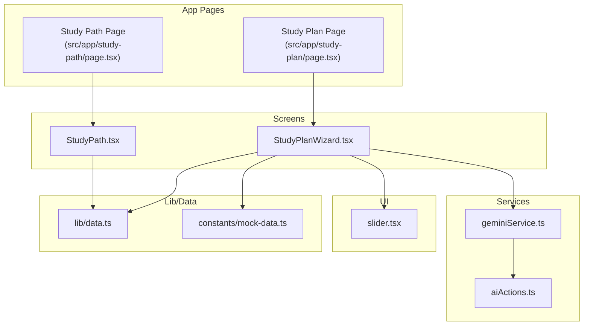
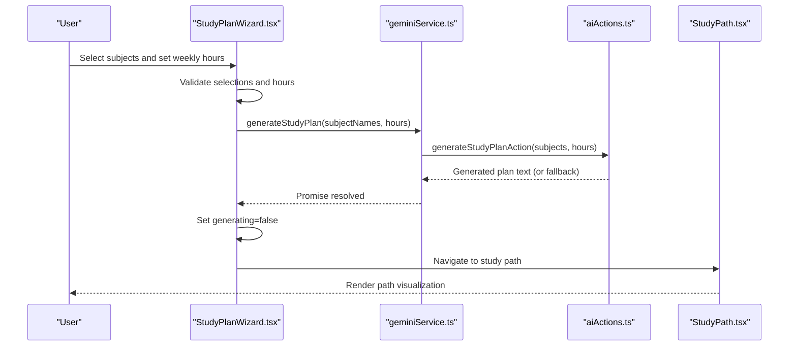
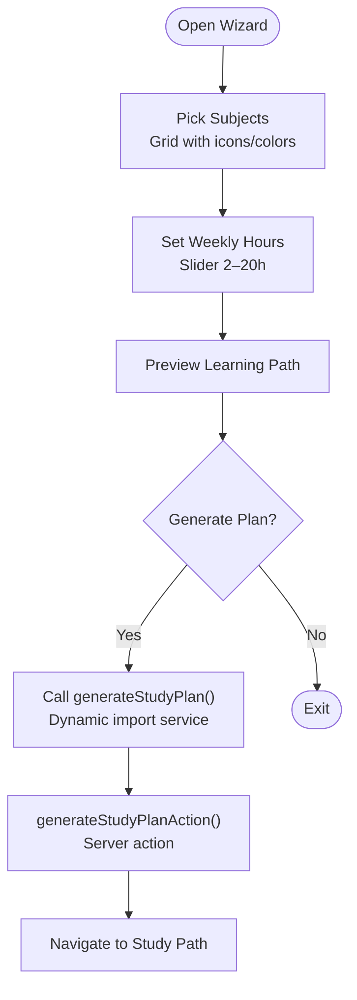
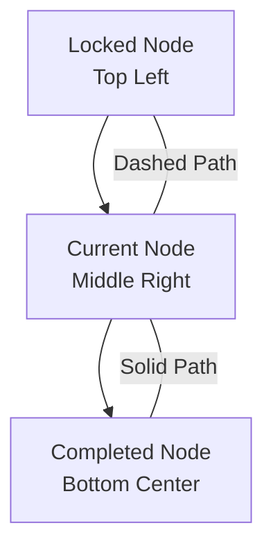
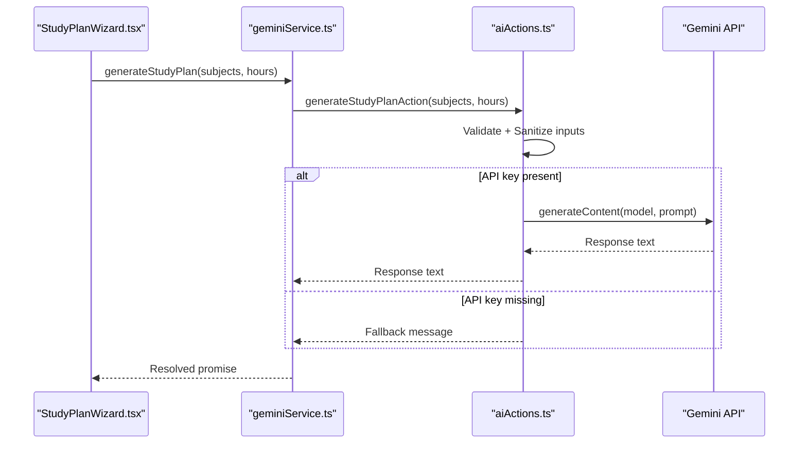
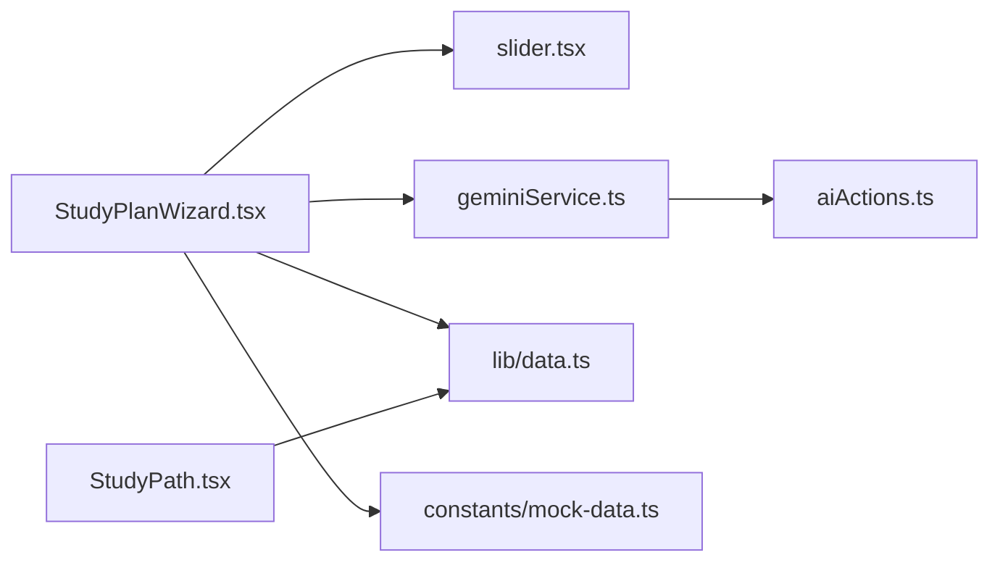

# Study Path Creation

<cite>
**Referenced Files in This Document**
- [StudyPlanWizard.tsx](file://src/screens/StudyPlanWizard.tsx)
- [StudyPath.tsx](file://src/screens/StudyPath.tsx)
- [geminiService.ts](file://src/services/geminiService.ts)
- [aiActions.ts](file://src/services/aiActions.ts)
- [slider.tsx](file://src/components/ui/slider.tsx)
- [data.ts](file://src/lib/data.ts)
- [mock-data.ts](file://src/constants/mock-data.ts)
- [page.tsx (Study Plan)](file://src/app/study-plan/page.tsx)
- [page.tsx (Study Path)](file://src/app/study-path/page.tsx)
</cite>

## Table of Contents
1. [Introduction](#introduction)
2. [Project Structure](#project-structure)
3. [Core Components](#core-components)
4. [Architecture Overview](#architecture-overview)
5. [Detailed Component Analysis](#detailed-component-analysis)
6. [Dependency Analysis](#dependency-analysis)
7. [Performance Considerations](#performance-considerations)
8. [Troubleshooting Guide](#troubleshooting-guide)
9. [Conclusion](#conclusion)
10. [Appendices](#appendices)

## Introduction
This document explains the study path creation and management system, focusing on the step-by-step wizard for subject selection, weekly commitment configuration, and AI-generated study plans. It also documents the study path visualization showing completed, current, and locked milestones, along with implementation specifics for subject mapping, study plan algorithm integration, and user preference handling. Examples illustrate different study path configurations, subject combinations, and weekly commitment scenarios. The integration with Gemini AI is covered, including prompts, fallback mechanisms, and graceful degradation when AI generation fails.

## Project Structure
The study path feature spans UI screens, service integrations, and shared data utilities:
- Wizard screen for selecting subjects and setting weekly hours
- Study path visualization screen for progress and milestones
- AI service layer for Gemini integration
- Shared UI components (e.g., slider)
- Data utilities for future persistence and types

**Diagram sources**
- [page.tsx (Study Plan)](file://src/app/study-plan/page.tsx#L1-L12)
- [page.tsx (Study Path)](file://src/app/study-path/page.tsx#L1-L12)
- [StudyPlanWizard.tsx](file://src/screens/StudyPlanWizard.tsx#L1-L243)
- [StudyPath.tsx](file://src/screens/StudyPath.tsx#L1-L273)
- [geminiService.ts](file://src/services/geminiService.ts#L1-L14)
- [aiActions.ts](file://src/services/aiActions.ts#L1-L168)
- [slider.tsx](file://src/components/ui/slider.tsx#L1-L26)
- [data.ts](file://src/lib/data.ts#L256-L305)
- [mock-data.ts](file://src/constants/mock-data.ts#L1-L46)

**Section sources**
- [page.tsx (Study Plan)](file://src/app/study-plan/page.tsx#L1-L12)
- [page.tsx (Study Path)](file://src/app/study-path/page.tsx#L1-L12)
- [StudyPlanWizard.tsx](file://src/screens/StudyPlanWizard.tsx#L1-L243)
- [StudyPath.tsx](file://src/screens/StudyPath.tsx#L1-L273)
- [geminiService.ts](file://src/services/geminiService.ts#L1-L14)
- [aiActions.ts](file://src/services/aiActions.ts#L1-L168)
- [slider.tsx](file://src/components/ui/slider.tsx#L1-L26)
- [data.ts](file://src/lib/data.ts#L256-L305)
- [mock-data.ts](file://src/constants/mock-data.ts#L1-L46)

## Core Components
- Study Plan Wizard: Allows users to pick subjects and set weekly hours, then triggers AI plan generation.
- Study Path Visualization: Renders a quest-style path with locked, current, and completed nodes and progress indicators.
- Gemini Integration: Provides AI explanations, study plan generation, and smart search via server actions.
- UI Controls: Slider for weekly hours and subject selection grid with icons and color coding.

Key implementation highlights:
- Subject mapping: The wizard maintains a selected list of subject IDs and maps them to display names for AI generation.
- Weekly commitment: A slider controls hours per week with min/max constraints and a recommended range.
- AI-powered generation: The wizard calls a dynamic import of the Gemini service, which delegates to server actions for safety and environment variable access.
- Fallback behavior: On failure, the wizard navigates to the study path page to avoid blocking the user.

**Section sources**
- [StudyPlanWizard.tsx](file://src/screens/StudyPlanWizard.tsx#L24-L60)
- [StudyPath.tsx](file://src/screens/StudyPath.tsx#L9-L36)
- [geminiService.ts](file://src/services/geminiService.ts#L7-L9)
- [aiActions.ts](file://src/services/aiActions.ts#L80-L114)
- [slider.tsx](file://src/components/ui/slider.tsx#L1-L26)

## Architecture Overview
The wizard orchestrates user preferences and triggers AI generation. The generated plan is intended to be persisted and consumed by the study path screen, which renders the visual journey.

**Diagram sources**
- [StudyPlanWizard.tsx](file://src/screens/StudyPlanWizard.tsx#L45-L60)
- [geminiService.ts](file://src/services/geminiService.ts#L7-L9)
- [aiActions.ts](file://src/services/aiActions.ts#L80-L114)
- [StudyPath.tsx](file://src/screens/StudyPath.tsx#L1-L273)

## Detailed Component Analysis

### Study Plan Wizard
The wizard provides:
- Subject selection grid with icons and color coding
- Slider-based weekly hour configuration
- Preview of a vertical learning path
- AI generation flow with a loading state and fallback navigation

Implementation specifics:
- Subject grid toggles selection by ID and displays a check indicator for selected items.
- Icons are rendered from imported Lucide components; colors reflect selection state.
- Weekly hours are controlled by a slider with min 2, max 20, step 1, and a recommended range note.
- The generate action filters selected subject IDs to names and passes them to the AI service.
- On completion or error, the wizard navigates to the study path page.

**Diagram sources**
- [StudyPlanWizard.tsx](file://src/screens/StudyPlanWizard.tsx#L126-L186)
- [geminiService.ts](file://src/services/geminiService.ts#L7-L9)
- [aiActions.ts](file://src/services/aiActions.ts#L80-L114)

**Section sources**
- [StudyPlanWizard.tsx](file://src/screens/StudyPlanWizard.tsx#L24-L60)
- [StudyPlanWizard.tsx](file://src/screens/StudyPlanWizard.tsx#L126-L186)
- [StudyPlanWizard.tsx](file://src/screens/StudyPlanWizard.tsx#L188-L226)
- [StudyPlanWizard.tsx](file://src/screens/StudyPlanWizard.tsx#L229-L242)
- [slider.tsx](file://src/components/ui/slider.tsx#L1-L26)

### Study Path Visualization
The study path screen renders:
- A background pattern and connecting SVG paths
- Three nodes representing locked, current, and completed milestones
- Progress bars for the current node and star ratings for completed milestones
- A resume button with estimated time

Implementation specifics:
- Nodes are positioned absolutely using percentages and styled with gradients and badges.
- Paths are drawn with SVG quadratic Beziers to indicate direction and status (dashed for locked-to-current, solid for current-to-completed).
- The current node shows a progress bar and a “NEXT” badge.
- The completed node shows stars based on stored data.

**Diagram sources**
- [StudyPath.tsx](file://src/screens/StudyPath.tsx#L9-L36)
- [StudyPath.tsx](file://src/screens/StudyPath.tsx#L73-L105)
- [StudyPath.tsx](file://src/screens/StudyPath.tsx#L107-L245)

**Section sources**
- [StudyPath.tsx](file://src/screens/StudyPath.tsx#L9-L36)
- [StudyPath.tsx](file://src/screens/StudyPath.tsx#L73-L105)
- [StudyPath.tsx](file://src/screens/StudyPath.tsx#L107-L245)

### AI Integration and Fallback Mechanisms
The AI integration consists of:
- A client-side service wrapper that dynamically imports server actions
- Server actions that validate inputs, sanitize text, and call the Gemini API
- Fallback messages when the API key is missing or when errors occur

Implementation specifics:
- Inputs are validated with Zod schemas before calling the model.
- Text sanitization removes unsafe characters and truncates to safe lengths.
- The model used is a flash variant suitable for fast generation.
- On missing API key or errors, the server action returns a friendly message and logs the error.

**Diagram sources**
- [geminiService.ts](file://src/services/geminiService.ts#L7-L9)
- [aiActions.ts](file://src/services/aiActions.ts#L22-L32)
- [aiActions.ts](file://src/services/aiActions.ts#L80-L114)

**Section sources**
- [geminiService.ts](file://src/services/geminiService.ts#L1-L14)
- [aiActions.ts](file://src/services/aiActions.ts#L1-L168)

### Subject Mapping and User Preferences
- Subject mapping: The wizard maintains an internal list of selected subject IDs and maps them to human-readable names for the AI prompt.
- Preference handling: Weekly hours are stored in state and passed to the AI generator; the slider enforces bounds and provides immediate feedback.

Examples of configurations:
- Two subjects: Mathematics and Physical Sci with 12 weekly hours
- Three subjects: Mathematics, Physical Sci, and Life Sciences with 15 weekly hours
- Four subjects: Mathematics, Physical Sci, Life Sciences, and English HL with 10 weekly hours

Note: These examples describe typical user selections; actual values are derived from the wizard’s state and UI.

**Section sources**
- [StudyPlanWizard.tsx](file://src/screens/StudyPlanWizard.tsx#L24-L37)
- [StudyPlanWizard.tsx](file://src/screens/StudyPlanWizard.tsx#L161-L186)

### Study Plan Algorithm Integration
- Prompt structure: The server action composes a prompt asking for a daily quest path with specific topics for the given subjects and weekly hours.
- Output handling: The response text is returned to the caller; in case of errors, a fallback message is returned.

Integration points:
- The wizard triggers generation after validating selections.
- The study path page consumes the generated plan (intended) to render the visualization.

**Section sources**
- [aiActions.ts](file://src/services/aiActions.ts#L80-L114)
- [StudyPlanWizard.tsx](file://src/screens/StudyPlanWizard.tsx#L45-L60)

## Dependency Analysis
The wizard depends on:
- UI components (buttons, sliders, scroll areas)
- Dynamic import of the Gemini service
- Navigation to the study path page
- Data utilities for potential persistence (types and caches)

**Diagram sources**
- [StudyPlanWizard.tsx](file://src/screens/StudyPlanWizard.tsx#L1-L243)
- [slider.tsx](file://src/components/ui/slider.tsx#L1-L26)
- [geminiService.ts](file://src/services/geminiService.ts#L1-L14)
- [aiActions.ts](file://src/services/aiActions.ts#L1-L168)
- [data.ts](file://src/lib/data.ts#L256-L305)
- [mock-data.ts](file://src/constants/mock-data.ts#L1-L46)
- [StudyPath.tsx](file://src/screens/StudyPath.tsx#L1-L273)

**Section sources**
- [StudyPlanWizard.tsx](file://src/screens/StudyPlanWizard.tsx#L1-L243)
- [StudyPath.tsx](file://src/screens/StudyPath.tsx#L1-L273)
- [geminiService.ts](file://src/services/geminiService.ts#L1-L14)
- [aiActions.ts](file://src/services/aiActions.ts#L1-L168)
- [slider.tsx](file://src/components/ui/slider.tsx#L1-L26)
- [data.ts](file://src/lib/data.ts#L256-L305)
- [mock-data.ts](file://src/constants/mock-data.ts#L1-L46)

## Performance Considerations
- Client-server boundary: AI calls are executed on the server via server actions, avoiding exposing API keys in the browser.
- Dynamic imports: The wizard dynamically imports the service module to keep the client bundle lean until generation is requested.
- Validation and sanitization: Input validation and sanitization reduce downstream processing overhead and improve reliability.
- Rendering: The study path visualization uses lightweight SVG paths and CSS gradients; consider lazy-loading heavy assets if images are added.

## Troubleshooting Guide
Common issues and resolutions:
- Missing API key: If the Gemini API key is not configured, AI features log a warning and return a friendly message. Ensure the environment variable is set and redeployed.
- Invalid input: Zod validation errors return a concise message; verify that subjects and hours meet the defined constraints.
- Network/API errors: The server action logs the error and returns a fallback message; retry later or check service availability.
- Navigation failures: The wizard navigates to the study path page on both success and error to prevent dead ends.

**Section sources**
- [aiActions.ts](file://src/services/aiActions.ts#L22-L32)
- [aiActions.ts](file://src/services/aiActions.ts#L71-L78)
- [aiActions.ts](file://src/services/aiActions.ts#L107-L114)
- [StudyPlanWizard.tsx](file://src/screens/StudyPlanWizard.tsx#L54-L59)

## Conclusion
The study path creation system combines a user-friendly wizard for subject and commitment selection with an AI-driven planner powered by Gemini. The study path visualization provides a clear, motivating roadmap of milestones. Robust fallbacks ensure the user can continue even if AI generation encounters issues. Future enhancements can include persisting plans and integrating real-time progress updates.

## Appendices

### Example Scenarios
- Scenario A: Two subjects with moderate weekly commitment
  - Selection: Mathematics, Physical Sci
  - Hours: 12 per week
  - Outcome: Balanced daily path across two subjects
- Scenario B: Three subjects with higher commitment
  - Selection: Mathematics, Physical Sci, Life Sciences
  - Hours: 15 per week
  - Outcome: More frequent sessions with topic rotation
- Scenario C: Four subjects with lower commitment
  - Selection: Mathematics, Physical Sci, Life Sciences, English HL
  - Hours: 10 per week
  - Outcome: Spread-out sessions to accommodate breadth

These scenarios illustrate how the wizard’s inputs translate into a structured daily quest path.

### UI and Interaction Notes
- Subject grid responsiveness: Tapping a tile toggles selection with immediate visual feedback.
- Slider behavior: Real-time updates show the current weekly hour value with min/max constraints.
- Preview: The vertical path preview helps users visualize the journey before generation.

**Section sources**
- [StudyPlanWizard.tsx](file://src/screens/StudyPlanWizard.tsx#L126-L186)
- [StudyPlanWizard.tsx](file://src/screens/StudyPlanWizard.tsx#L188-L226)