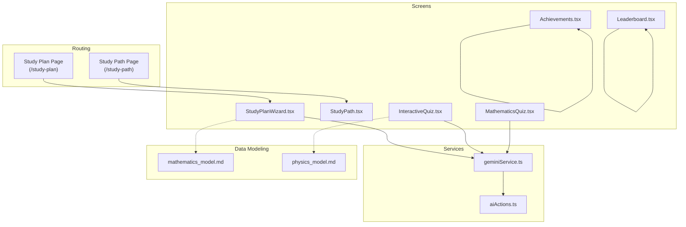
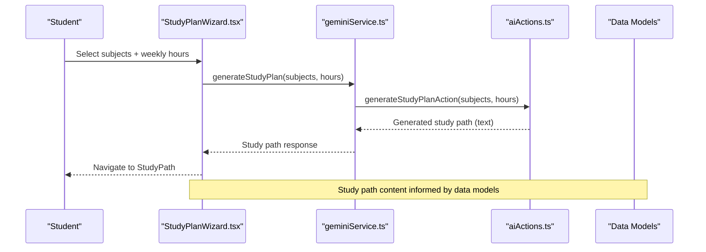
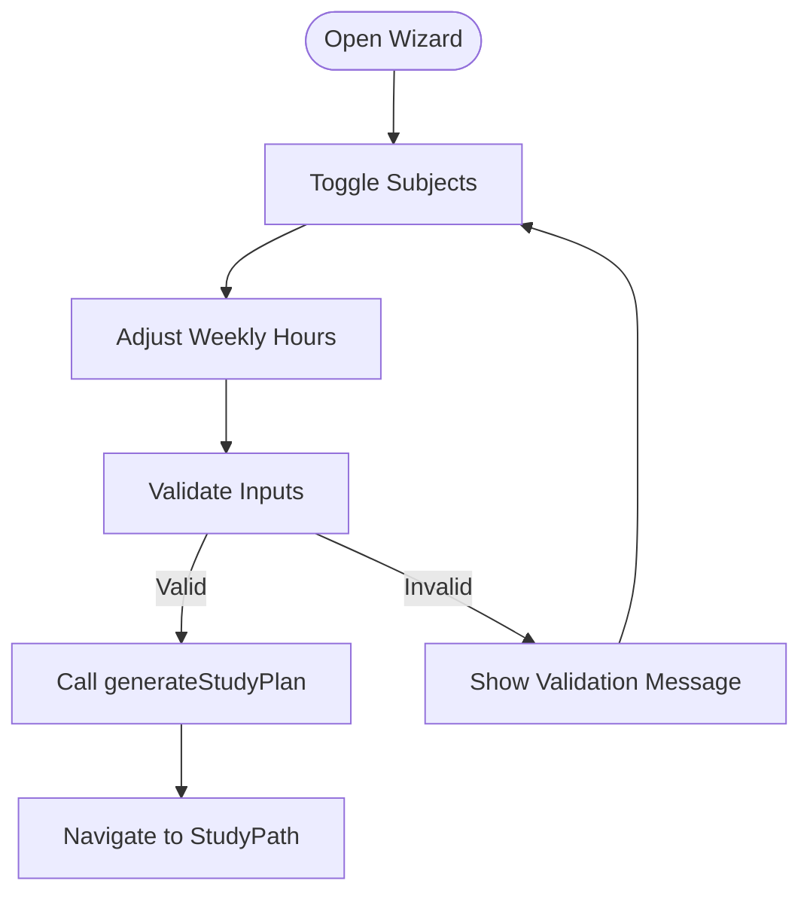
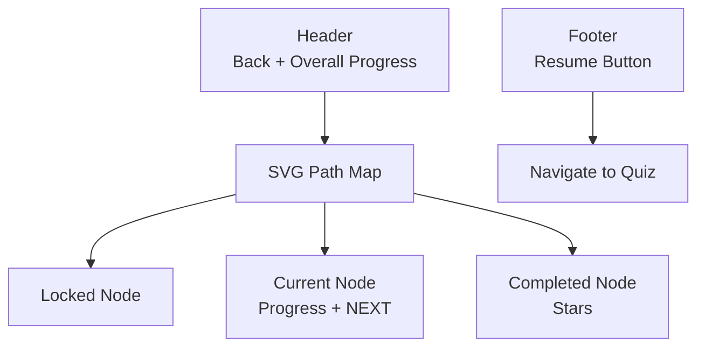
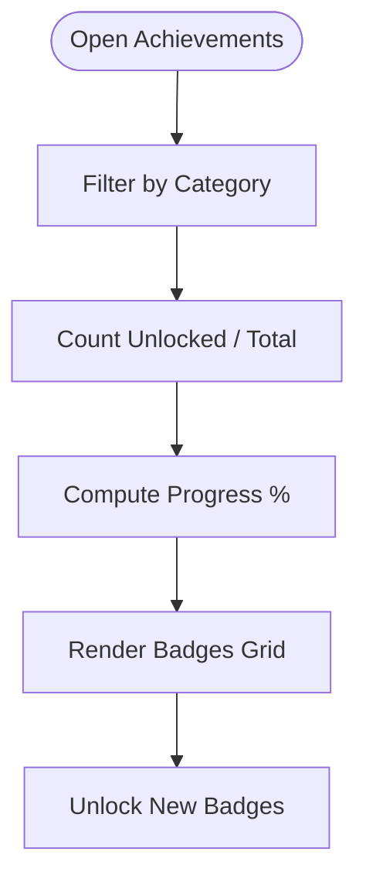
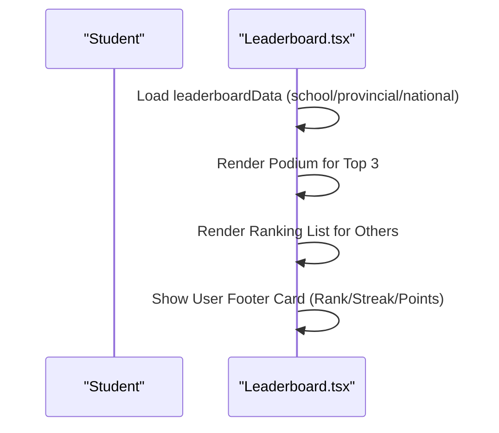
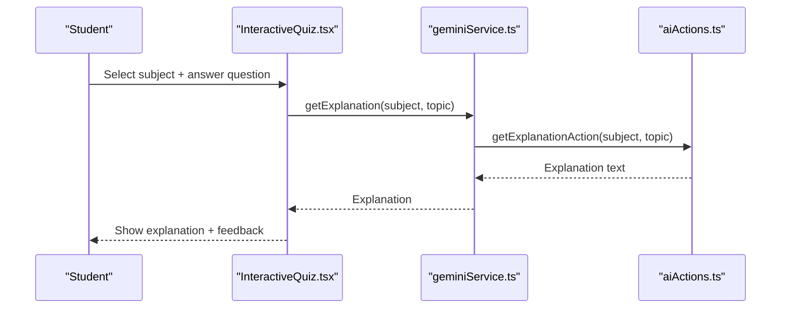
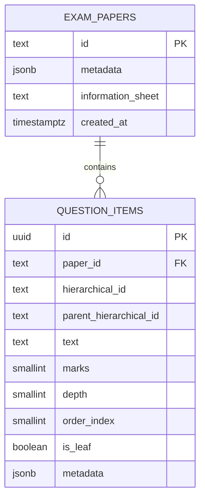
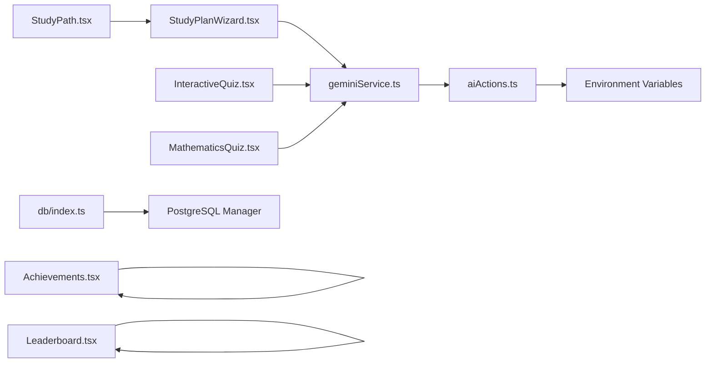

# Study Planning System

<cite>
**Referenced Files in This Document**
- [StudyPath.tsx](file://src/screens/StudyPath.tsx)
- [StudyPlanWizard.tsx](file://src/screens/StudyPlanWizard.tsx)
- [Achievements.tsx](file://src/screens/Achievements.tsx)
- [Leaderboard.tsx](file://src/screens/Leaderboard.tsx)
- [InteractiveQuiz.tsx](file://src/screens/InteractiveQuiz.tsx)
- [MathematicsQuiz.tsx](file://src/screens/MathematicsQuiz.tsx)
- [geminiService.ts](file://src/services/geminiService.ts)
- [aiActions.ts](file://src/services/aiActions.ts)
- [mock-data.ts](file://src/constants/mock-data.ts)
- [mathematics_model.md](file://src/data_modeling/mathematics_model.md)
- [physics_model.md](file://src/data_modeling/physics_model.md)
- [page.tsx](file://src/app/study-path/page.tsx)
- [page.tsx](file://src/app/study-plan/page.tsx)
- [db/index.ts](file://src/lib/db/index.ts)
</cite>

## Table of Contents
1. [Introduction](#introduction)
2. [Project Structure](#project-structure)
3. [Core Components](#core-components)
4. [Architecture Overview](#architecture-overview)
5. [Detailed Component Analysis](#detailed-component-analysis)
6. [Dependency Analysis](#dependency-analysis)
7. [Performance Considerations](#performance-considerations)
8. [Troubleshooting Guide](#troubleshooting-guide)
9. [Conclusion](#conclusion)
10. [Appendices](#appendices)

## Introduction
This document explains MatricMaster AI’s study planning and progress tracking system. It covers how students create personalized study paths, track weekly progress, visualize achievements and leaderboards, and receive adaptive quiz recommendations powered by AI. The documentation also details the achievement system, streak mechanics, and integration between study planning and the quiz system to support personalized learning.

## Project Structure
The study planning system spans UI screens, service integrations, and data modeling:
- Study planning wizard and path visualization live under src/screens
- AI-powered generation is handled by src/services
- Data modeling documents define exam paper structures for quizzes
- Routing pages connect app routes to screen components
- Database utilities manage persistence and connectivity

**Diagram sources**
- [page.tsx](file://src/app/study-plan/page.tsx#L1-L12)
- [page.tsx](file://src/app/study-path/page.tsx#L1-L12)
- [StudyPlanWizard.tsx](file://src/screens/StudyPlanWizard.tsx#L1-L243)
- [StudyPath.tsx](file://src/screens/StudyPath.tsx#L1-L273)
- [InteractiveQuiz.tsx](file://src/screens/InteractiveQuiz.tsx#L1-L458)
- [MathematicsQuiz.tsx](file://src/screens/MathematicsQuiz.tsx#L1-L283)
- [Achievements.tsx](file://src/screens/Achievements.tsx#L1-L250)
- [Leaderboard.tsx](file://src/screens/Leaderboard.tsx#L1-L380)
- [geminiService.ts](file://src/services/geminiService.ts#L1-L14)
- [aiActions.ts](file://src/services/aiActions.ts#L1-L168)
- [mathematics_model.md](file://src/data_modeling/mathematics_model.md#L1-L212)
- [physics_model.md](file://src/data_modeling/physics_model.md#L1-L376)

**Section sources**
- [page.tsx](file://src/app/study-plan/page.tsx#L1-L12)
- [page.tsx](file://src/app/study-path/page.tsx#L1-L12)
- [StudyPlanWizard.tsx](file://src/screens/StudyPlanWizard.tsx#L1-L243)
- [StudyPath.tsx](file://src/screens/StudyPath.tsx#L1-L273)
- [geminiService.ts](file://src/services/geminiService.ts#L1-L14)
- [aiActions.ts](file://src/services/aiActions.ts#L1-L168)
- [mathematics_model.md](file://src/data_modeling/mathematics_model.md#L1-L212)
- [physics_model.md](file://src/data_modeling/physics_model.md#L1-L376)

## Core Components
- Study Plan Wizard: Collects subject selections and weekly commitment, triggers AI-generated study path creation, and previews the resulting quest map.
- Study Path Visualization: Renders a quest-style path with nodes representing locked, current, and completed stages, plus overall progress.
- Achievement System: Displays unlockable badges categorized by subject/domain, with mastery level and progress tracking.
- Leaderboard: Shows competitive rankings across school, provincial, and national tiers with podium visuals and user rank highlights.
- Quiz Integration: Provides interactive quizzes with AI-powered explanations and adaptive recommendations aligned to study paths.
- Data Modeling: Defines exam paper structures for Mathematics and Physics to support quiz content and curriculum alignment.

**Section sources**
- [StudyPlanWizard.tsx](file://src/screens/StudyPlanWizard.tsx#L33-L60)
- [StudyPath.tsx](file://src/screens/StudyPath.tsx#L38-L105)
- [Achievements.tsx](file://src/screens/Achievements.tsx#L96-L167)
- [Leaderboard.tsx](file://src/screens/Leaderboard.tsx#L291-L377)
- [InteractiveQuiz.tsx](file://src/screens/InteractiveQuiz.tsx#L105-L170)
- [MathematicsQuiz.tsx](file://src/screens/MathematicsQuiz.tsx#L32-L56)
- [mathematics_model.md](file://src/data_modeling/mathematics_model.md#L36-L56)
- [physics_model.md](file://src/data_modeling/physics_model.md#L129-L140)

## Architecture Overview
The system integrates UI screens with AI services and data models. The wizard collects inputs and delegates to the Gemini service, which calls server-side AI actions. Quiz screens consume AI explanations and present adaptive learning experiences. Persistent data is managed via a database manager.

**Diagram sources**
- [StudyPlanWizard.tsx](file://src/screens/StudyPlanWizard.tsx#L45-L60)
- [geminiService.ts](file://src/services/geminiService.ts#L7-L9)
- [aiActions.ts](file://src/services/aiActions.ts#L80-L114)
- [mathematics_model.md](file://src/data_modeling/mathematics_model.md#L119-L147)
- [physics_model.md](file://src/data_modeling/physics_model.md#L15-L79)

## Detailed Component Analysis

### Study Plan Wizard
- Purpose: Guide students through selecting subjects and setting weekly study hours, then generate a personalized quest path.
- Inputs: Subjects grid toggling, weekly hours slider.
- Processing: Validates inputs, calls AI action to generate a study plan, and navigates to the study path view.
- Preview: Displays a vertical path map preview with completed, current, and locked nodes.

**Diagram sources**
- [StudyPlanWizard.tsx](file://src/screens/StudyPlanWizard.tsx#L39-L60)
- [geminiService.ts](file://src/services/geminiService.ts#L7-L9)
- [aiActions.ts](file://src/services/aiActions.ts#L80-L114)

**Section sources**
- [StudyPlanWizard.tsx](file://src/screens/StudyPlanWizard.tsx#L33-L243)
- [geminiService.ts](file://src/services/geminiService.ts#L1-L14)
- [aiActions.ts](file://src/services/aiActions.ts#L80-L114)

### Study Path Visualization
- Purpose: Present a visual quest map of the generated study path with nodes indicating locked, current, and completed states.
- Features: Progress bar, node icons with status badges, “NEXT” indicator, and a resume action.
- Data: Uses a static array of path nodes with positions and statuses.

**Diagram sources**
- [StudyPath.tsx](file://src/screens/StudyPath.tsx#L38-L272)

**Section sources**
- [StudyPath.tsx](file://src/screens/StudyPath.tsx#L9-L273)

### Achievement System
- Purpose: Motivate learners through unlockable badges and mastery tracking.
- Categories: All, Science, Math, History.
- Mechanics: Tracks unlocked count vs total, displays mastery level, and shows progress percentage.
- UI: Grid of badges with lock/unlock states and category filters.

**Diagram sources**
- [Achievements.tsx](file://src/screens/Achievements.tsx#L96-L249)

**Section sources**
- [Achievements.tsx](file://src/screens/Achievements.tsx#L7-L250)

### Leaderboard
- Purpose: Foster friendly competition by ranking students across school, provincial, and national tiers.
- Features: Podium visualization for top three, detailed ranking lists, and a user-focused footer card showing rank, streak, and points.
- Data: Mock leaderboard entries with avatars, ranks, and points.

**Diagram sources**
- [Leaderboard.tsx](file://src/screens/Leaderboard.tsx#L28-L175)
- [Leaderboard.tsx](file://src/screens/Leaderboard.tsx#L291-L377)

**Section sources**
- [Leaderboard.tsx](file://src/screens/Leaderboard.tsx#L1-L380)

### Quiz Integration and Adaptive Recommendations
- Interactive Quiz: Presents subject-filtered questions, tracks score, shows feedback, and offers AI explanations.
- Mathematics Quiz: Step-based solution builder with symbol insertion and hints.
- AI Explanations: Delegated to Gemini service and AI actions, returning concise, curriculum-aligned explanations.

**Diagram sources**
- [InteractiveQuiz.tsx](file://src/screens/InteractiveQuiz.tsx#L154-L170)
- [geminiService.ts](file://src/services/geminiService.ts#L3-L5)
- [aiActions.ts](file://src/services/aiActions.ts#L42-L78)

**Section sources**
- [InteractiveQuiz.tsx](file://src/screens/InteractiveQuiz.tsx#L105-L458)
- [MathematicsQuiz.tsx](file://src/screens/MathematicsQuiz.tsx#L32-L283)
- [geminiService.ts](file://src/services/geminiService.ts#L1-L14)
- [aiActions.ts](file://src/services/aiActions.ts#L42-L78)

### Data Modeling for Quiz Content
- Mathematics: Defines exam paper metadata, recursive question nodes, and normalized database schema for efficient querying and rendering.
- Physics: Defines relational schema for exam papers, questions, sub-questions, MCQ options, and data sheets.

**Diagram sources**
- [mathematics_model.md](file://src/data_modeling/mathematics_model.md#L119-L147)

**Section sources**
- [mathematics_model.md](file://src/data_modeling/mathematics_model.md#L1-L212)
- [physics_model.md](file://src/data_modeling/physics_model.md#L15-L79)

## Dependency Analysis
- UI Screens depend on:
  - Services for AI-powered features
  - Data modeling for curriculum alignment
- Services depend on:
  - AI actions for Gemini integration
  - Environment configuration for API keys
- Database utilities provide:
  - Centralized connection management and availability checks

**Diagram sources**
- [StudyPlanWizard.tsx](file://src/screens/StudyPlanWizard.tsx#L45-L60)
- [geminiService.ts](file://src/services/geminiService.ts#L1-L14)
- [aiActions.ts](file://src/services/aiActions.ts#L20-L32)
- [InteractiveQuiz.tsx](file://src/screens/InteractiveQuiz.tsx#L20-L21)
- [MathematicsQuiz.tsx](file://src/screens/MathematicsQuiz.tsx#L19)
- [StudyPath.tsx](file://src/screens/StudyPath.tsx#L1-L10)
- [Achievements.tsx](file://src/screens/Achievements.tsx#L1-L10)
- [Leaderboard.tsx](file://src/screens/Leaderboard.tsx#L1-L10)
- [db/index.ts](file://src/lib/db/index.ts#L9-L87)

**Section sources**
- [geminiService.ts](file://src/services/geminiService.ts#L1-L14)
- [aiActions.ts](file://src/services/aiActions.ts#L1-L168)
- [db/index.ts](file://src/lib/db/index.ts#L1-L102)

## Performance Considerations
- AI Request Throttling: Validate inputs and sanitize to prevent oversized prompts; avoid redundant calls by caching recent explanations.
- Rendering Efficiency: Use virtualized scrolling for long lists (already present in several screens) and lazy-load images for badges and avatars.
- Database Connectivity: Ensure the database manager initializes and retries connections gracefully to avoid blocking UI rendering.
- Quiz Responsiveness: Debounce AI explanation requests and provide loading states to maintain smooth interactions.

## Troubleshooting Guide
- AI Features Disabled:
  - Symptom: Messages indicating AI features are not configured.
  - Cause: Missing Gemini API key.
  - Resolution: Set the GEMINI_API_KEY environment variable and restart the application.
- Study Plan Generation Failures:
  - Symptom: Navigation to study path despite errors.
  - Cause: AI action exceptions or invalid inputs.
  - Resolution: Validate inputs, check network connectivity, and retry generation.
- Database Connection Issues:
  - Symptom: Database not connected errors.
  - Cause: PostgreSQL unavailable or misconfigured.
  - Resolution: Verify credentials and connection settings; use the database manager’s availability checks.

**Section sources**
- [aiActions.ts](file://src/services/aiActions.ts#L22-L32)
- [aiActions.ts](file://src/services/aiActions.ts#L71-L78)
- [aiActions.ts](file://src/services/aiActions.ts#L107-L114)
- [db/index.ts](file://src/lib/db/index.ts#L24-L39)
- [db/index.ts](file://src/lib/db/index.ts#L65-L71)

## Conclusion
MatricMaster AI’s study planning system combines a guided path creation workflow with immersive visualization, gamified achievements, and competitive leaderboards. By integrating AI-powered explanations and adaptive quiz recommendations, the platform supports personalized learning journeys aligned with curriculum structures. Robust UI components, clear data models, and resilient service integrations ensure scalability and reliability for student engagement and improved learning outcomes.

## Appendices

### Examples and Configuration References
- Study Path Configuration:
  - Example path nodes and progress indicators are defined in the study path screen.
  - Reference: [StudyPath.tsx](file://src/screens/StudyPath.tsx#L9-L36)
- Achievement Criteria Setup:
  - Badge categories and unlock conditions are represented in the achievements screen.
  - Reference: [Achievements.tsx](file://src/screens/Achievements.tsx#L89-L94)
- Progress Analytics:
  - Mastery level and progress percentage computed from badge counts.
  - Reference: [Achievements.tsx](file://src/screens/Achievements.tsx#L102-L104)
- Weekly Planning Capabilities:
  - Weekly hours slider and focus areas selection in the wizard.
  - Reference: [StudyPlanWizard.tsx](file://src/screens/StudyPlanWizard.tsx#L161-L186)
- Milestone Tracking:
  - Visual milestones in the study path (locked/current/completed nodes).
  - Reference: [StudyPath.tsx](file://src/screens/StudyPath.tsx#L107-L133)
- Streak Maintenance:
  - Streak display in the leaderboard footer.
  - Reference: [Leaderboard.tsx](file://src/screens/Leaderboard.tsx#L364-L365)
- Quiz Integration:
  - Interactive quiz with AI explanations and subject filtering.
  - Reference: [InteractiveQuiz.tsx](file://src/screens/InteractiveQuiz.tsx#L136-L170)
- Data Models:
  - Mathematics and Physics exam paper structures for quiz content.
  - Reference: [mathematics_model.md](file://src/data_modeling/mathematics_model.md#L36-L56), [physics_model.md](file://src/data_modeling/physics_model.md#L129-L140)