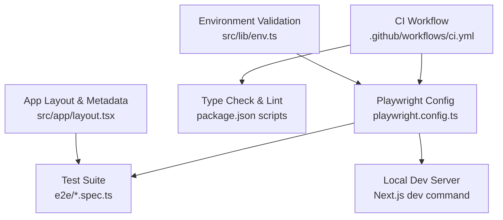
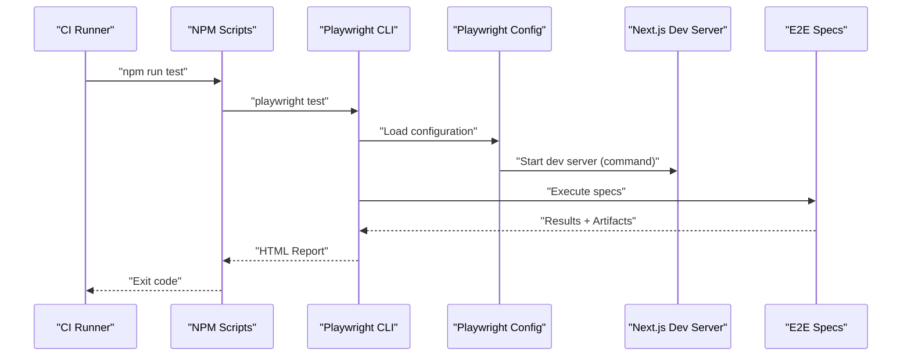
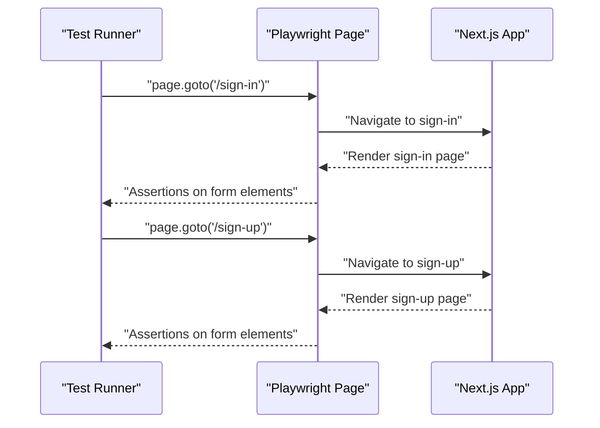
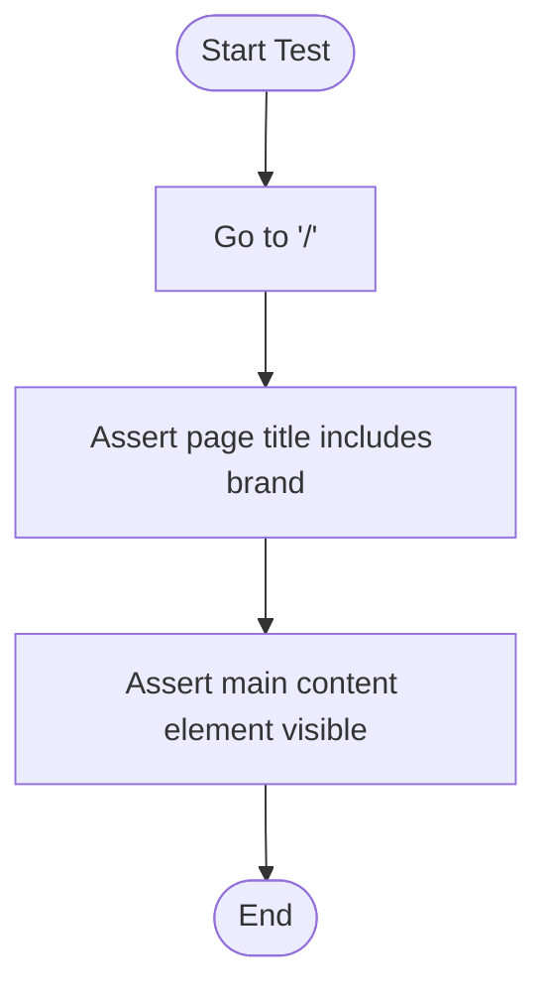
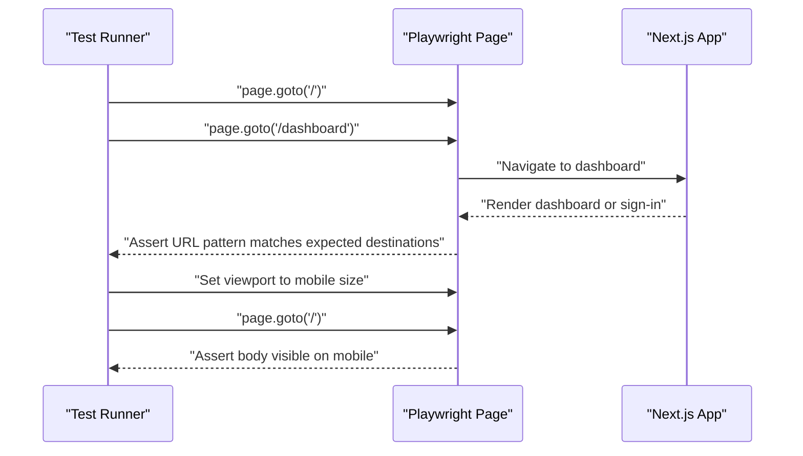
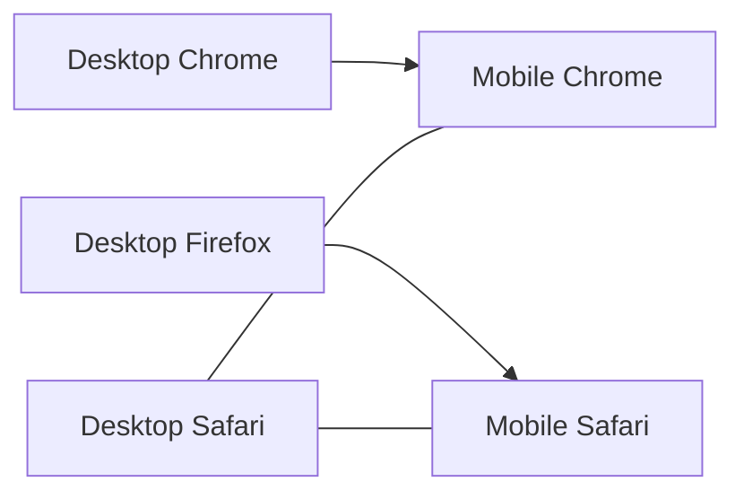
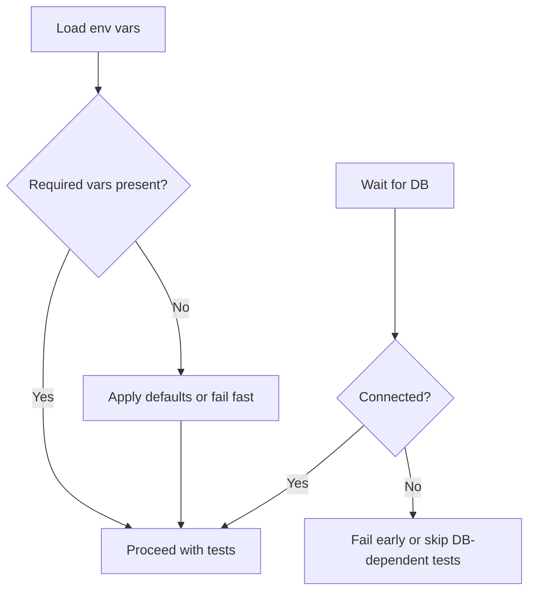
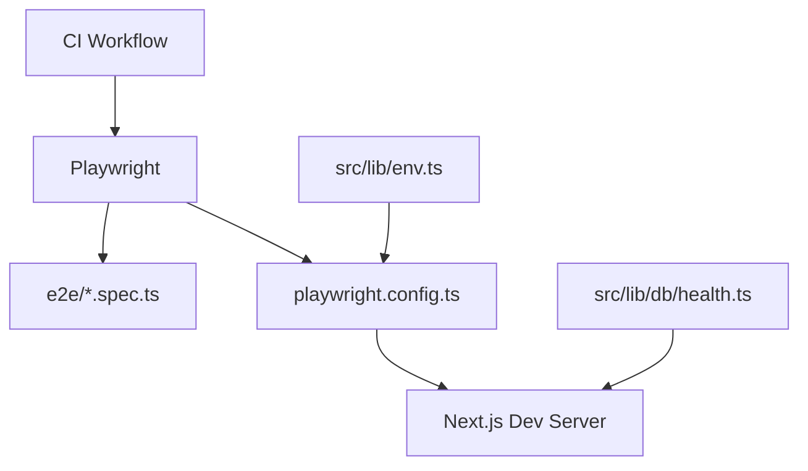

# Testing Strategy

<cite>
**Referenced Files in This Document**
- [playwright.config.ts](file://playwright.config.ts)
- [package.json](file://package.json)
- [.github/workflows/ci.yml](file://.github/workflows/ci.yml)
- [e2e/auth.spec.ts](file://e2e/auth.spec.ts)
- [e2e/home.spec.ts](file://e2e/home.spec.ts)
- [e2e/navigation.spec.ts](file://e2e/navigation.spec.ts)
- [src/app/layout.tsx](file://src/app/layout.tsx)
- [src/lib/env.ts](file://src/lib/env.ts)
- [src/lib/auth.ts](file://src/lib/auth.ts)
- [src/lib/db/index.ts](file://src/lib/db/index.ts)
- [src/lib/db/health.ts](file://src/lib/db/health.ts)
- [src/lib/db/seed/index.ts](file://src/lib/db/seed/index.ts)
- [SETUP_LOCAL_DB.md](file://SETUP_LOCAL_DB.md)
- [db-test.js](file://db-test.js)
- [test-db-auth.js](file://test-db-auth.js)
- [test-db-auth.ts](file://test-db-auth.ts)
- [.env.example](file://.env.example)
</cite>

## Table of Contents
1. [Introduction](#introduction)
2. [Project Structure](#project-structure)
3. [Core Components](#core-components)
4. [Architecture Overview](#architecture-overview)
5. [Detailed Component Analysis](#detailed-component-analysis)
6. [Dependency Analysis](#dependency-analysis)
7. [Performance Considerations](#performance-considerations)
8. [Troubleshooting Guide](#troubleshooting-guide)
9. [Conclusion](#conclusion)
10. [Appendices](#appendices)

## Introduction
This document defines a comprehensive testing strategy for MatricMaster AI using Playwright for end-to-end (E2E) testing. It covers configuration, test suite structure, cross-browser and responsive testing, execution and reporting, CI/CD integration, test data management, mocking strategies, environment setup, and debugging via screenshots and traces. The goal is to ensure reliable validation of authentication flows, navigation, and core features while maintaining maintainability and scalability.

## Project Structure
MatricMaster AI uses Playwright’s E2E test runner with a dedicated test directory and a configuration that supports parallel execution, cross-browser testing, and automatic local server startup. The CI pipeline integrates linting, type checking, and Playwright tests.

**Diagram sources**
- [playwright.config.ts](file://playwright.config.ts#L1-L61)
- [e2e/auth.spec.ts](file://e2e/auth.spec.ts#L1-L20)
- [e2e/home.spec.ts](file://e2e/home.spec.ts#L1-L26)
- [e2e/navigation.spec.ts](file://e2e/navigation.spec.ts#L1-L23)
- [.github/workflows/ci.yml](file://.github/workflows/ci.yml#L1-L37)
- [package.json](file://package.json#L1-L84)
- [src/lib/env.ts](file://src/lib/env.ts#L1-L62)
- [src/app/layout.tsx](file://src/app/layout.tsx#L1-L108)

**Section sources**
- [playwright.config.ts](file://playwright.config.ts#L1-L61)
- [package.json](file://package.json#L1-L84)
- [.github/workflows/ci.yml](file://.github/workflows/ci.yml#L1-L37)

## Core Components
- Playwright configuration defines test directory, parallelism, retries, workers, reporters, base URL, tracing, and screenshots. Projects include desktop and mobile targets.
- Test scripts in package.json provide convenient commands for running tests, UI mode, headed mode, debug mode, and report generation.
- CI workflow orchestrates type checking, linting, and Playwright test execution with coverage.

Key behaviors:
- Parallel execution enabled locally; CI disables parallelism for stability.
- Retries on CI; forbidOnly prevents accidental test exclusions.
- HTML reporter for rich test reports.
- Automatic local dev server startup for tests.

**Section sources**
- [playwright.config.ts](file://playwright.config.ts#L7-L60)
- [package.json](file://package.json#L6-L26)
- [.github/workflows/ci.yml](file://.github/workflows/ci.yml#L32-L33)

## Architecture Overview
The testing architecture integrates Playwright with Next.js, leveraging environment validation and database readiness helpers. Tests run against a local dev server and produce HTML reports, screenshots, and trace files for debugging.

**Diagram sources**
- [package.json](file://package.json#L14-L18)
- [playwright.config.ts](file://playwright.config.ts#L54-L59)
- [e2e/auth.spec.ts](file://e2e/auth.spec.ts#L1-L20)
- [e2e/home.spec.ts](file://e2e/home.spec.ts#L1-L26)
- [e2e/navigation.spec.ts](file://e2e/navigation.spec.ts#L1-L23)

## Detailed Component Analysis

### Authentication Flow Tests
Tests validate that sign-in and sign-up pages render expected form elements. These tests serve as smoke checks for authentication UI and routing.

**Diagram sources**
- [e2e/auth.spec.ts](file://e2e/auth.spec.ts#L3-L19)
- [src/app/layout.tsx](file://src/app/layout.tsx#L10-L76)

**Section sources**
- [e2e/auth.spec.ts](file://e2e/auth.spec.ts#L1-L20)

### Home Page Tests
These tests verify basic rendering and presence of main content and navigation elements on the landing page.

**Diagram sources**
- [e2e/home.spec.ts](file://e2e/home.spec.ts#L3-L15)

**Section sources**
- [e2e/home.spec.ts](file://e2e/home.spec.ts#L1-L26)

### Navigation Tests
Navigation tests check internal navigation and responsive behavior on mobile viewports.

**Diagram sources**
- [e2e/navigation.spec.ts](file://e2e/navigation.spec.ts#L3-L22)

**Section sources**
- [e2e/navigation.spec.ts](file://e2e/navigation.spec.ts#L1-L23)

### Cross-Browser and Responsive Testing
Playwright projects target Chromium, Firefox, WebKit, and mobile devices. Tests leverage device emulation and responsive viewport sizes to validate UI behavior across environments.

**Diagram sources**
- [playwright.config.ts](file://playwright.config.ts#L29-L52)

**Section sources**
- [playwright.config.ts](file://playwright.config.ts#L29-L52)
- [e2e/navigation.spec.ts](file://e2e/navigation.spec.ts#L14-L21)

### Environment and Database Setup
Environment validation ensures required variables are present and defaults are applied in development. Database readiness helpers support robust connection handling and health checks.

**Diagram sources**
- [src/lib/env.ts](file://src/lib/env.ts#L19-L45)
- [src/lib/db/health.ts](file://src/lib/db/health.ts#L19-L32)

**Section sources**
- [src/lib/env.ts](file://src/lib/env.ts#L1-L62)
- [src/lib/db/health.ts](file://src/lib/db/health.ts#L1-L40)
- [SETUP_LOCAL_DB.md](file://SETUP_LOCAL_DB.md#L1-L52)
- [db-test.js](file://db-test.js#L1-L39)
- [test-db-auth.js](file://test-db-auth.js#L1-L63)
- [test-db-auth.ts](file://test-db-auth.ts#L1-L53)

### Test Data Management and Mocking
- Seeding: Database seeding scripts populate test data for quizzes and users, enabling repeatable scenarios.
- Fallbacks: Database action functions fall back to mock data when DB is unavailable, ensuring tests remain runnable.
- Local DB Options: Multiple setup paths (local Postgres, Docker, SQLite) support varied environments.

**Section sources**
- [src/lib/db/seed/index.ts](file://src/lib/db/seed/index.ts#L147-L193)
- [src/lib/db/actions.ts](file://src/lib/db/actions.ts#L341-L372)
- [SETUP_LOCAL_DB.md](file://SETUP_LOCAL_DB.md#L1-L52)

### Reporting and Artifacts
- HTML reporter generates a comprehensive report after test runs.
- Screenshots are captured on failure; traces are collected on first retry.
- CI publishes artifacts for inspection.

**Section sources**
- [playwright.config.ts](file://playwright.config.ts#L17-L27)
- [.github/workflows/ci.yml](file://.github/workflows/ci.yml#L32-L33)

## Dependency Analysis
The testing stack depends on Playwright, Next.js, environment validation, and database readiness. CI coordinates these dependencies to ensure deterministic test execution.

**Diagram sources**
- [playwright.config.ts](file://playwright.config.ts#L1-L61)
- [e2e/auth.spec.ts](file://e2e/auth.spec.ts#L1-L20)
- [e2e/home.spec.ts](file://e2e/home.spec.ts#L1-L26)
- [e2e/navigation.spec.ts](file://e2e/navigation.spec.ts#L1-L23)
- [src/lib/env.ts](file://src/lib/env.ts#L1-L62)
- [src/lib/db/health.ts](file://src/lib/db/health.ts#L1-L40)
- [.github/workflows/ci.yml](file://.github/workflows/ci.yml#L1-L37)

**Section sources**
- [playwright.config.ts](file://playwright.config.ts#L1-L61)
- [package.json](file://package.json#L1-L84)
- [src/lib/env.ts](file://src/lib/env.ts#L1-L62)
- [src/lib/db/health.ts](file://src/lib/db/health.ts#L1-L40)
- [.github/workflows/ci.yml](file://.github/workflows/ci.yml#L1-L37)

## Performance Considerations
- Prefer targeted selectors and avoid brittle text-based assertions to reduce flakiness.
- Use fixtures sparingly; keep tests self-contained for faster iteration.
- Leverage parallelization locally; disable in CI for stability.
- Keep trace and screenshot scopes minimal to reduce artifact size.
- Use seeded data to avoid slow network-bound operations during tests.

## Troubleshooting Guide
- Inspect HTML reports generated by Playwright for test outcomes and logs.
- Review screenshots captured on failure for visual context.
- Open trace files to replay failing steps and inspect network, DOM, and console logs.
- Validate environment variables and database connectivity before running tests.
- Use headed mode for interactive debugging and UI inspection.

**Section sources**
- [playwright.config.ts](file://playwright.config.ts#L17-L27)
- [.github/workflows/ci.yml](file://.github/workflows/ci.yml#L32-L33)

## Conclusion
MatricMaster AI’s testing strategy leverages Playwright for robust E2E validation across browsers and devices, integrated with CI for reliability. By combining environment validation, database readiness, and seeded test data, the suite remains maintainable and resilient. Extending the suite with focused tests, accessibility checks, and performance baselines will further strengthen quality assurance.

## Appendices

### Writing Effective Tests
- Use descriptive test names and group related tests under describe blocks.
- Prefer semantic selectors and role-based queries over fragile text selectors.
- Isolate tests from each other; avoid shared state where possible.
- Add explicit waits for dynamic content; avoid arbitrary sleeps.

### Test Maintenance Strategies
- Centralize shared utilities (e.g., navigation helpers) to reduce duplication.
- Regularly review selectors and adjust to UI changes.
- Keep environment variables documented and versioned securely.

### Accessibility Testing
- Integrate accessibility checks alongside UI validations to ensure inclusive experiences.
- Validate focus order, ARIA roles, and keyboard navigation in key flows.

### Continuous Integration Pipelines
- Run type checks and linters before tests to catch issues early.
- Use Playwright’s built-in coverage and HTML reporting for visibility.
- Store and review artifacts (screenshots, traces) for failed runs.