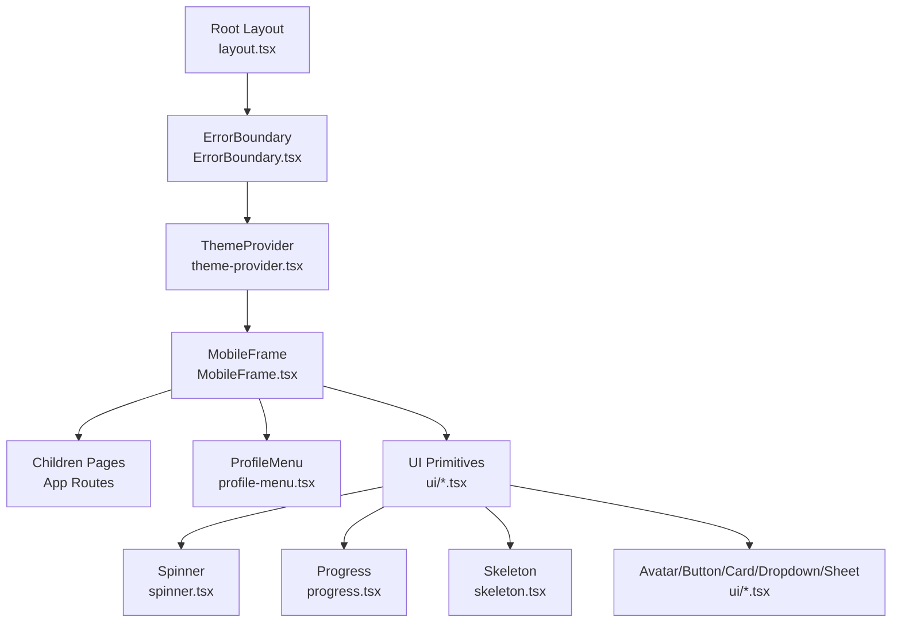
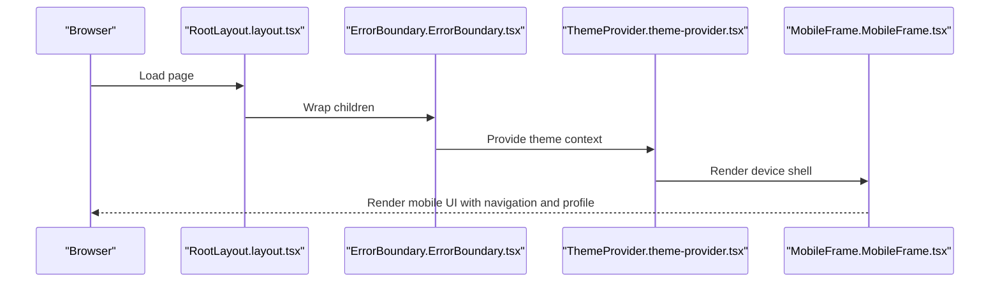
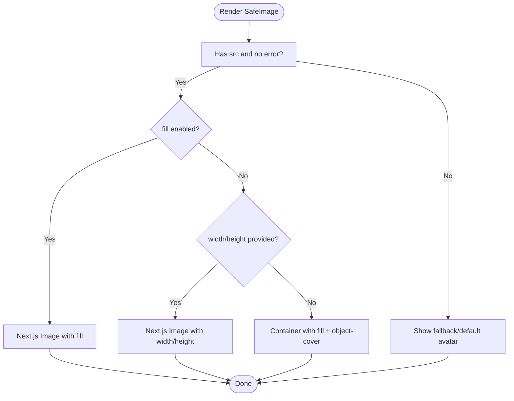
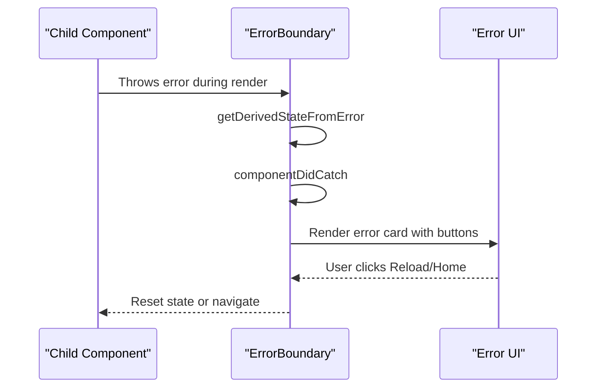
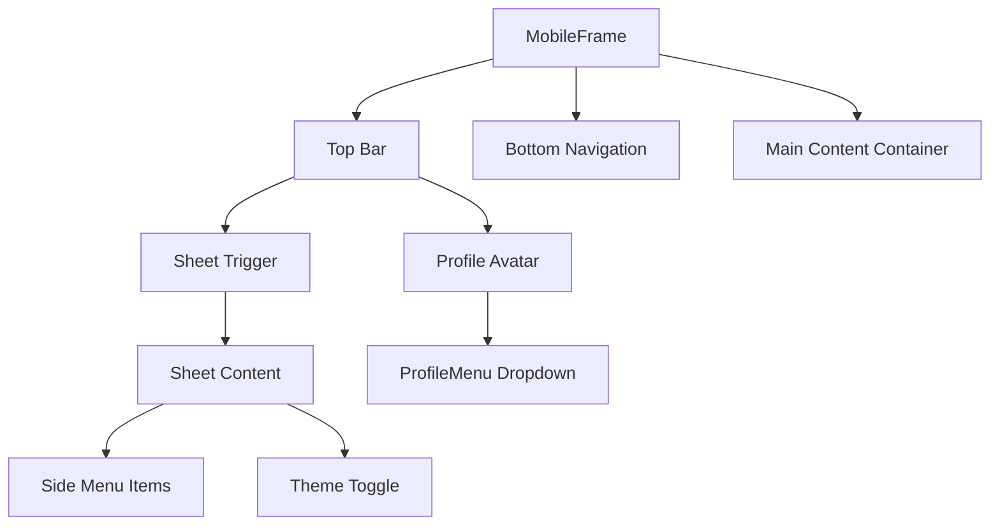
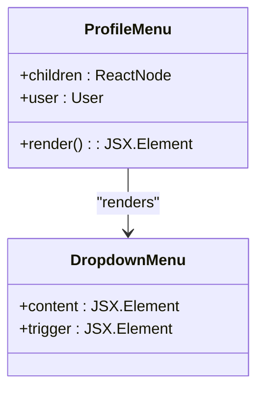
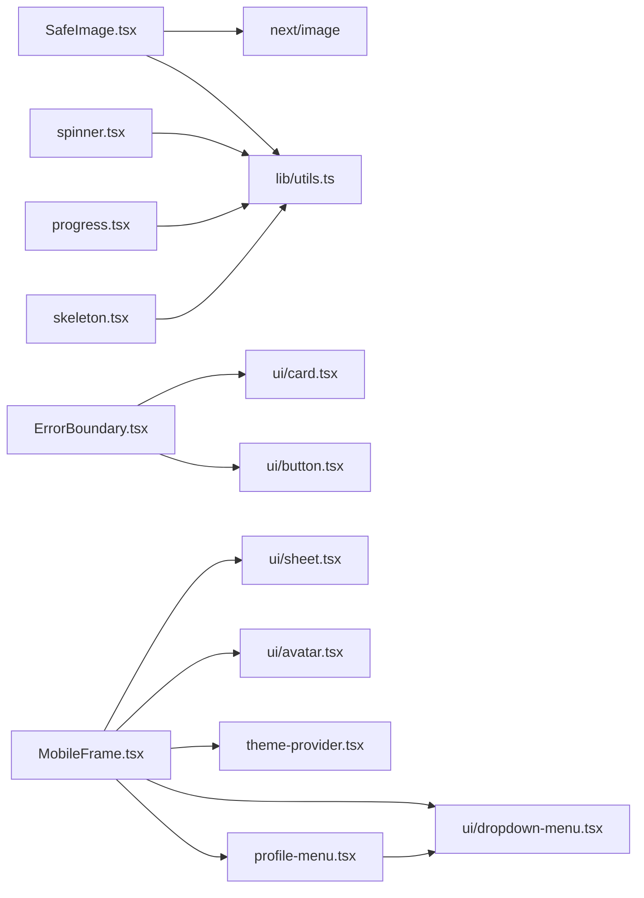

# Custom Components

<cite>
**Referenced Files in This Document**
- [SafeImage.tsx](file://src/components/SafeImage.tsx)
- [ErrorBoundary.tsx](file://src/components/ErrorBoundary.tsx)
- [MobileFrame.tsx](file://src/components/Layout/MobileFrame.tsx)
- [profile-menu.tsx](file://src/components/Layout/profile-menu.tsx)
- [spinner.tsx](file://src/components/ui/spinner.tsx)
- [progress.tsx](file://src/components/ui/progress.tsx)
- [skeleton.tsx](file://src/components/ui/skeleton.tsx)
- [avatar.tsx](file://src/components/ui/avatar.tsx)
- [button.tsx](file://src/components/ui/button.tsx)
- [card.tsx](file://src/components/ui/card.tsx)
- [dropdown-menu.tsx](file://src/components/ui/dropdown-menu.tsx)
- [sheet.tsx](file://src/components/ui/sheet.tsx)
- [theme-provider.tsx](file://src/components/theme-provider.tsx)
- [use-theme.ts](file://src/hooks/use-theme.ts)
- [utils.ts](file://src/lib/utils.ts)
- [layout.tsx](file://src/app/layout.tsx)
</cite>

## Table of Contents
1. [Introduction](#introduction)
2. [Project Structure](#project-structure)
3. [Core Components](#core-components)
4. [Architecture Overview](#architecture-overview)
5. [Detailed Component Analysis](#detailed-component-analysis)
6. [Dependency Analysis](#dependency-analysis)
7. [Performance Considerations](#performance-considerations)
8. [Accessibility and UX Best Practices](#accessibility-and-ux-best-practices)
9. [Troubleshooting Guide](#troubleshooting-guide)
10. [Conclusion](#conclusion)

## Introduction
This document provides comprehensive documentation for MatricMaster AI’s custom UI components that extend beyond standard primitives. It covers:
- SafeImage: lazy loading, error handling, and responsive image optimization
- ErrorBoundary: graceful error handling and user feedback
- MobileFrame: responsive layout adaptation and mobile-first design patterns
- ProfileMenu: user navigation and account management
- Spinner, Progress, and Skeleton: loading states, completion tracking, and placeholders
It includes implementation examples, customization options, performance optimizations, integration patterns, and accessibility considerations.

## Project Structure
The custom components live under src/components and src/components/ui, while higher-level layouts and providers orchestrate them. The root layout wraps the entire app with ErrorBoundary and ThemeProvider, and renders MobileFrame around page content.

**Diagram sources**
- [layout.tsx](file://src/app/layout.tsx#L84-L107)
- [ErrorBoundary.tsx](file://src/components/ErrorBoundary.tsx#L18-L73)
- [theme-provider.tsx](file://src/components/theme-provider.tsx#L25-L75)
- [MobileFrame.tsx](file://src/components/Layout/MobileFrame.tsx#L43-L318)
- [profile-menu.tsx](file://src/components/Layout/profile-menu.tsx#L19-L79)
- [spinner.tsx](file://src/components/ui/spinner.tsx#L5-L14)
- [progress.tsx](file://src/components/ui/progress.tsx#L8-L22)
- [skeleton.tsx](file://src/components/ui/skeleton.tsx#L3-L5)
- [avatar.tsx](file://src/components/ui/avatar.tsx#L6-L43)
- [button.tsx](file://src/components/ui/button.tsx#L7-L48)
- [card.tsx](file://src/components/ui/card.tsx#L5-L58)
- [dropdown-menu.tsx](file://src/components/ui/dropdown-menu.tsx#L7-L72)
- [sheet.tsx](file://src/components/ui/sheet.tsx#L10-L71)

**Section sources**
- [layout.tsx](file://src/app/layout.tsx#L84-L107)

## Core Components
- SafeImage: robust image rendering with fallbacks, error handling, and responsive sizing
- ErrorBoundary: app-wide error capture with user-friendly recovery actions
- MobileFrame: mobile-first shell with top bar, bottom navigation, side sheet, and theme controls
- ProfileMenu: user dropdown with avatar, badges, and logout
- Spinner: lightweight animated loader
- Progress: numeric completion indicator
- Skeleton: subtle placeholder animation

**Section sources**
- [SafeImage.tsx](file://src/components/SafeImage.tsx#L18-L90)
- [ErrorBoundary.tsx](file://src/components/ErrorBoundary.tsx#L18-L73)
- [MobileFrame.tsx](file://src/components/Layout/MobileFrame.tsx#L43-L318)
- [profile-menu.tsx](file://src/components/Layout/profile-menu.tsx#L19-L79)
- [spinner.tsx](file://src/components/ui/spinner.tsx#L5-L14)
- [progress.tsx](file://src/components/ui/progress.tsx#L8-L22)
- [skeleton.tsx](file://src/components/ui/skeleton.tsx#L3-L5)

## Architecture Overview
The app initializes with ThemeProvider, wraps pages in ErrorBoundary, and renders MobileFrame to enforce a consistent mobile-first layout. Components integrate with Radix UI primitives and Next.js Image for optimal performance.

**Diagram sources**
- [layout.tsx](file://src/app/layout.tsx#L84-L107)
- [ErrorBoundary.tsx](file://src/components/ErrorBoundary.tsx#L18-L73)
- [theme-provider.tsx](file://src/components/theme-provider.tsx#L25-L75)
- [MobileFrame.tsx](file://src/components/Layout/MobileFrame.tsx#L43-L318)

## Detailed Component Analysis

### SafeImage
Purpose: Render images safely with fallbacks, error handling, and responsive sizing. Supports Next.js Image for optimized assets and graceful degradation for external images.

Key behaviors:
- Fallback rendering: Uses gradient avatar with initial letter if src is missing or error occurs
- Responsive sizing: Uses fill mode with object-cover when width/height are not provided
- External images: Renders with explicit dimensions or fill mode depending on props
- Priority hints: Honors priority prop for Next.js optimization

Implementation highlights:
- Props include src, alt, width, height, className, priority, fill, sizes, fallback
- onError triggers internal error state to switch to fallback
- Conditional rendering based on fill and presence of width/height

**Diagram sources**
- [SafeImage.tsx](file://src/components/SafeImage.tsx#L18-L90)

**Section sources**
- [SafeImage.tsx](file://src/components/SafeImage.tsx#L6-L16)
- [SafeImage.tsx](file://src/components/SafeImage.tsx#L18-L90)

### ErrorBoundary
Purpose: Capture unhandled errors in the React tree and present a friendly error UI with recovery actions.

Key behaviors:
- Static getDerivedStateFromError updates state on error
- componentDidCatch logs error and errorInfo
- Renders custom fallback UI with reload/home actions if no custom fallback provided

Integration:
- Wrapped around the entire app in RootLayout
- Uses Card and Button primitives for consistent styling

**Diagram sources**
- [ErrorBoundary.tsx](file://src/components/ErrorBoundary.tsx#L18-L73)
- [layout.tsx](file://src/app/layout.tsx#L99-L103)

**Section sources**
- [ErrorBoundary.tsx](file://src/components/ErrorBoundary.tsx#L8-L16)
- [ErrorBoundary.tsx](file://src/components/ErrorBoundary.tsx#L18-L73)
- [card.tsx](file://src/components/ui/card.tsx#L5-L16)
- [button.tsx](file://src/components/ui/button.tsx#L41-L48)

### MobileFrame
Purpose: Provide a mobile-first shell with top navigation, bottom navigation, side sheet, and profile integration.

Key behaviors:
- Top bar: Menu sheet trigger, logo, and profile avatar with dropdown
- Side sheet: Navigation items, theme toggle, and optional auth actions
- Bottom navigation: Four-item floating pill navigation with active state animations
- Responsive breakpoints: Uses sm/min-h-screen and min-h-screen for tablet/desktop
- Theme integration: Reads current theme and toggles via ThemeProvider hook
- Auth integration: Uses Better Auth client for session and sign-out

**Diagram sources**
- [MobileFrame.tsx](file://src/components/Layout/MobileFrame.tsx#L43-L318)
- [profile-menu.tsx](file://src/components/Layout/profile-menu.tsx#L19-L79)
- [sheet.tsx](file://src/components/ui/sheet.tsx#L56-L71)
- [dropdown-menu.tsx](file://src/components/ui/dropdown-menu.tsx#L55-L72)
- [theme-provider.tsx](file://src/components/theme-provider.tsx#L25-L75)

**Section sources**
- [MobileFrame.tsx](file://src/components/Layout/MobileFrame.tsx#L59-L82)
- [MobileFrame.tsx](file://src/components/Layout/MobileFrame.tsx#L232-L289)
- [MobileFrame.tsx](file://src/components/Layout/MobileFrame.tsx#L314-L318)
- [profile-menu.tsx](file://src/components/Layout/profile-menu.tsx#L28-L79)
- [sheet.tsx](file://src/components/ui/sheet.tsx#L56-L71)
- [dropdown-menu.tsx](file://src/components/ui/dropdown-menu.tsx#L55-L72)
- [theme-provider.tsx](file://src/components/theme-provider.tsx#L25-L75)

### ProfileMenu
Purpose: Provide a user dropdown menu with avatar, verification badge, name/email, and actions (manage profile, contact support, logout).

Key behaviors:
- Accepts children as trigger (e.g., Avatar button)
- Displays user avatar with fallback
- Includes verification badge and rating
- Provides navigation to profile and support
- Handles logout via Better Auth client

**Diagram sources**
- [profile-menu.tsx](file://src/components/Layout/profile-menu.tsx#L19-L79)
- [dropdown-menu.tsx](file://src/components/ui/dropdown-menu.tsx#L7-L72)
- [avatar.tsx](file://src/components/ui/avatar.tsx#L6-L43)

**Section sources**
- [profile-menu.tsx](file://src/components/Layout/profile-menu.tsx#L19-L79)
- [dropdown-menu.tsx](file://src/components/ui/dropdown-menu.tsx#L55-L72)
- [avatar.tsx](file://src/components/ui/avatar.tsx#L6-L43)

### Spinner
Purpose: Lightweight animated loader for pending states.

Key behaviors:
- Uses Loader2Icon from lucide-react
- Role and aria-label for accessibility
- Inherits size and className via cn

**Section sources**
- [spinner.tsx](file://src/components/ui/spinner.tsx#L5-L14)
- [utils.ts](file://src/lib/utils.ts#L4-L6)

### Progress
Purpose: Visual indicator of completion percentage.

Key behaviors:
- Uses @radix-ui/react-progress
- Indicator translates to show remaining unfilled portion
- Responsive to value prop changes

**Section sources**
- [progress.tsx](file://src/components/ui/progress.tsx#L8-L22)

### Skeleton
Purpose: Subtle animated placeholder for content areas.

Key behaviors:
- Uses pulse animation
- Applies primary/10 background with rounded corners

**Section sources**
- [skeleton.tsx](file://src/components/ui/skeleton.tsx#L3-L5)

## Dependency Analysis
The components depend on:
- Radix UI primitives for accessible interactions (DropdownMenu, Progress, Dialog/Sheet)
- Next.js Image for optimized asset delivery
- Lucide icons for UI affordances
- Tailwind utility classes via cn for composition
- ThemeProvider/useTheme for theme-aware rendering

**Diagram sources**
- [SafeImage.tsx](file://src/components/SafeImage.tsx#L3-L4)
- [utils.ts](file://src/lib/utils.ts#L4-L6)
- [ErrorBoundary.tsx](file://src/components/ErrorBoundary.tsx#L5-L6)
- [MobileFrame.tsx](file://src/components/Layout/MobileFrame.tsx#L37-L41)
- [profile-menu.tsx](file://src/components/Layout/profile-menu.tsx#L6-L16)
- [theme-provider.tsx](file://src/components/theme-provider.tsx#L25-L75)
- [spinner.tsx](file://src/components/ui/spinner.tsx#L5-L14)
- [progress.tsx](file://src/components/ui/progress.tsx#L3-L4)
- [skeleton.tsx](file://src/components/ui/skeleton.tsx#L1-L2)

**Section sources**
- [SafeImage.tsx](file://src/components/SafeImage.tsx#L3-L4)
- [ErrorBoundary.tsx](file://src/components/ErrorBoundary.tsx#L5-L6)
- [MobileFrame.tsx](file://src/components/Layout/MobileFrame.tsx#L37-L41)
- [profile-menu.tsx](file://src/components/Layout/profile-menu.tsx#L6-L16)
- [theme-provider.tsx](file://src/components/theme-provider.tsx#L25-L75)
- [spinner.tsx](file://src/components/ui/spinner.tsx#L5-L14)
- [progress.tsx](file://src/components/ui/progress.tsx#L3-L4)
- [skeleton.tsx](file://src/components/ui/skeleton.tsx#L1-L2)
- [utils.ts](file://src/lib/utils.ts#L4-L6)

## Performance Considerations
- SafeImage
  - Prefer Next.js Image with fill for responsive containers to leverage native browser lazy loading and aspect ratio preservation
  - Provide explicit width/height when possible to avoid layout shifts
  - Use priority for above-the-fold images to improve Core Web Vitals
- ErrorBoundary
  - Keep fallback UI minimal to reduce re-render cost
  - Avoid heavy computations in fallback; rely on simple state resets
- MobileFrame
  - Use CSS transforms and opacity for animations (already leveraged via motion and radix)
  - Minimize DOM depth inside Sheet and Dropdown menus
- Spinner/Progress/Skeleton
  - Keep Spinner small and lightweight
  - Use Skeleton sparingly to avoid overdraw
- ThemeProvider
  - Initialize with system theme to prevent hydration mismatches and layout shifts

[No sources needed since this section provides general guidance]

## Accessibility and UX Best Practices
- SafeImage
  - Always provide alt text; use meaningful alt for decorative fallback avatars
  - Ensure sufficient color contrast for fallback backgrounds
- ErrorBoundary
  - Include clear error messages and actionable buttons (reload/home)
  - Provide skip-link in layout for keyboard/screen reader navigation
- MobileFrame
  - Use semantic labels for navigation (aria-label on nav)
  - Ensure touch targets meet minimum size guidelines
  - Respect safe areas with env() insets
- ProfileMenu
  - Use proper roles and labels for menu items
  - Maintain focus order and keyboard navigation
- Spinner/Progress/Skeleton
  - Associate Spinner with aria-live regions for dynamic content
  - Use Progress to communicate task duration and completion
  - Use Skeleton to indicate content is loading without blocking interactions

**Section sources**
- [layout.tsx](file://src/app/layout.tsx#L93-L98)
- [MobileFrame.tsx](file://src/components/Layout/MobileFrame.tsx#L234-L239)
- [profile-menu.tsx](file://src/components/Layout/profile-menu.tsx#L28-L79)
- [spinner.tsx](file://src/components/ui/spinner.tsx#L8-L10)
- [progress.tsx](file://src/components/ui/progress.tsx#L17-L21)

## Troubleshooting Guide
- SafeImage does not render
  - Verify src is a valid URL or null/undefined triggers fallback
  - If using fill, ensure parent has explicit dimensions
  - Confirm onError handler is not masking network errors
- ErrorBoundary not catching errors
  - Ensure ErrorBoundary wraps the component tree (already done in RootLayout)
  - Check for errors thrown in event handlers vs render lifecycle
- MobileFrame navigation not visible
  - Check hideNavigation/hideBottomNavigation arrays for pathname matches
  - Confirm usePathname and router are initialized
- ProfileMenu not opening
  - Ensure children act as a trigger (asChild)
  - Verify DropdownMenu is open and not blocked by z-index
- Spinner/Progress/Skeleton not animating
  - Confirm Tailwind utilities are applied via cn
  - Ensure required CSS classes are included in build

**Section sources**
- [SafeImage.tsx](file://src/components/SafeImage.tsx#L41-L43)
- [layout.tsx](file://src/app/layout.tsx#L99-L103)
- [MobileFrame.tsx](file://src/components/Layout/MobileFrame.tsx#L52-L58)
- [profile-menu.tsx](file://src/components/Layout/profile-menu.tsx#L28-L31)
- [spinner.tsx](file://src/components/ui/spinner.tsx#L8-L10)
- [progress.tsx](file://src/components/ui/progress.tsx#L17-L21)
- [skeleton.tsx](file://src/components/ui/skeleton.tsx#L3-L5)

## Conclusion
MatricMaster AI’s custom components combine performance, accessibility, and mobile-first design. SafeImage optimizes image delivery with robust fallbacks; ErrorBoundary ensures graceful degradation; MobileFrame enforces a cohesive mobile experience; ProfileMenu streamlines user actions; and Spinner, Progress, and Skeleton provide clear feedback during async operations. Together, they form a resilient, user-centric UI ecosystem.