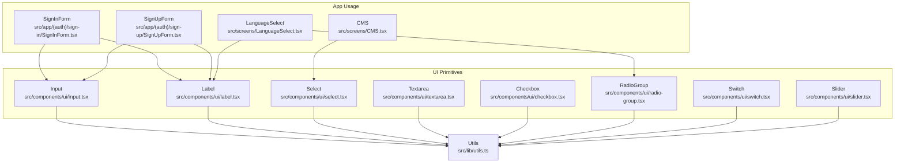
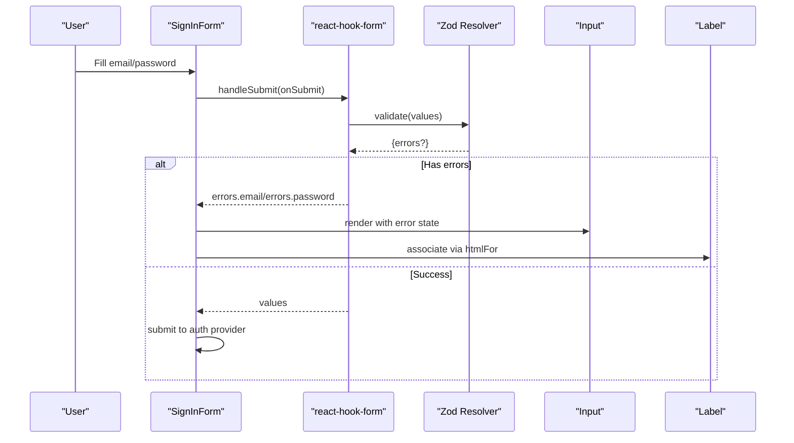
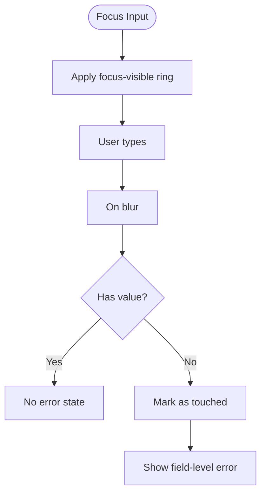
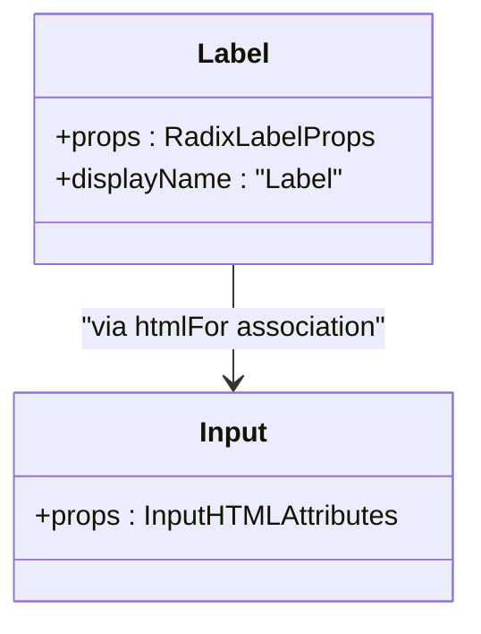
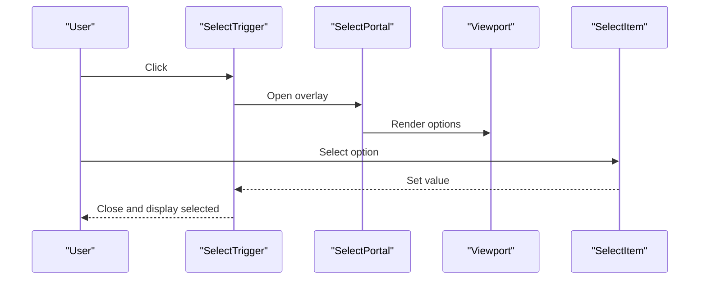
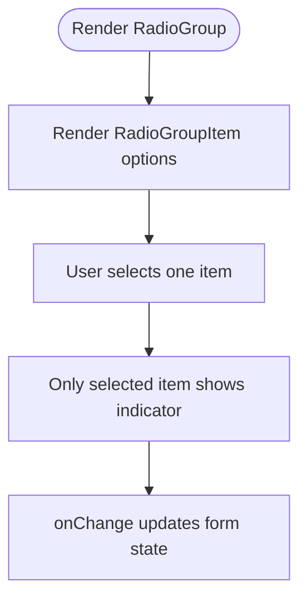
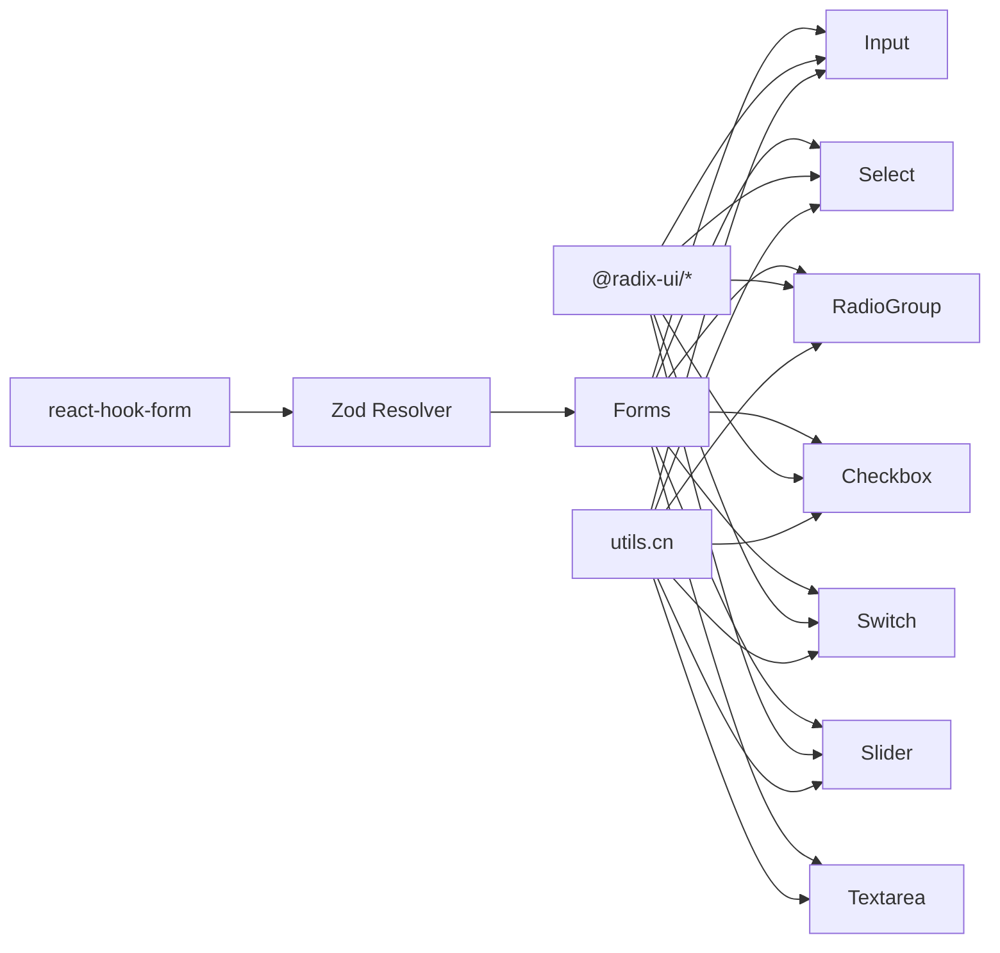

# Form Components

<cite>
**Referenced Files in This Document**
- [input.tsx](file://src/components/ui/input.tsx)
- [label.tsx](file://src/components/ui/label.tsx)
- [select.tsx](file://src/components/ui/select.tsx)
- [textarea.tsx](file://src/components/ui/textarea.tsx)
- [checkbox.tsx](file://src/components/ui/checkbox.tsx)
- [radio-group.tsx](file://src/components/ui/radio-group.tsx)
- [switch.tsx](file://src/components/ui/switch.tsx)
- [slider.tsx](file://src/components/ui/slider.tsx)
- [SignInForm.tsx](file://src/app/(auth)/sign-in/SignInForm.tsx)
- [SignUpForm.tsx](file://src/app/(auth)/sign-up/SignUpForm.tsx)
- [LanguageSelect.tsx](file://src/screens/LanguageSelect.tsx)
- [CMS.tsx](file://src/screens/CMS.tsx)
- [utils.ts](file://src/lib/utils.ts)
- [package.json](file://package.json)
</cite>

## Table of Contents
1. [Introduction](#introduction)
2. [Project Structure](#project-structure)
3. [Core Components](#core-components)
4. [Architecture Overview](#architecture-overview)
5. [Detailed Component Analysis](#detailed-component-analysis)
6. [Dependency Analysis](#dependency-analysis)
7. [Performance Considerations](#performance-considerations)
8. [Troubleshooting Guide](#troubleshooting-guide)
9. [Conclusion](#conclusion)
10. [Appendices](#appendices)

## Introduction
This document describes MatricMaster AI’s form component suite used across educational platform interactions. It covers input fields, labels, selects, textareas, checkboxes, radio groups, switches, and sliders. It documents validation patterns, error handling, accessibility (ARIA and keyboard support), and integration with form libraries. Practical examples demonstrate real-world usage in authentication and configuration screens.

## Project Structure
The form components are implemented as reusable UI primitives under src/components/ui and consumed by application pages and screens. Validation is handled via react-hook-form with Zod resolvers. Utility helpers centralize Tailwind class merging.

**Diagram sources**
- [input.tsx](file://src/components/ui/input.tsx#L1-L23)
- [label.tsx](file://src/components/ui/label.tsx#L1-L20)
- [select.tsx](file://src/components/ui/select.tsx#L1-L151)
- [textarea.tsx](file://src/components/ui/textarea.tsx#L1-L22)
- [checkbox.tsx](file://src/components/ui/checkbox.tsx#L1-L29)
- [radio-group.tsx](file://src/components/ui/radio-group.tsx#L1-L37)
- [switch.tsx](file://src/components/ui/switch.tsx#L1-L28)
- [slider.tsx](file://src/components/ui/slider.tsx#L1-L26)
- [SignInForm.tsx](file://src/app/(auth)/sign-in/SignInForm.tsx#L1-L353)
- [SignUpForm.tsx](file://src/app/(auth)/sign-up/SignUpForm.tsx#L1-L249)
- [LanguageSelect.tsx](file://src/screens/LanguageSelect.tsx#L1-L32)
- [CMS.tsx](file://src/screens/CMS.tsx#L490-L504)
- [utils.ts](file://src/lib/utils.ts#L1-L7)

**Section sources**
- [input.tsx](file://src/components/ui/input.tsx#L1-L23)
- [label.tsx](file://src/components/ui/label.tsx#L1-L20)
- [select.tsx](file://src/components/ui/select.tsx#L1-L151)
- [textarea.tsx](file://src/components/ui/textarea.tsx#L1-L22)
- [checkbox.tsx](file://src/components/ui/checkbox.tsx#L1-L29)
- [radio-group.tsx](file://src/components/ui/radio-group.tsx#L1-L37)
- [switch.tsx](file://src/components/ui/switch.tsx#L1-L28)
- [slider.tsx](file://src/components/ui/slider.tsx#L1-L26)
- [SignInForm.tsx](file://src/app/(auth)/sign-in/SignInForm.tsx#L1-L353)
- [SignUpForm.tsx](file://src/app/(auth)/sign-up/SignUpForm.tsx#L1-L249)
- [LanguageSelect.tsx](file://src/screens/LanguageSelect.tsx#L1-L32)
- [CMS.tsx](file://src/screens/CMS.tsx#L490-L504)
- [utils.ts](file://src/lib/utils.ts#L1-L7)

## Core Components
- Input: A styled text input with focus/ring states and disabled handling.
- Label: Accessible label with Radix UI and variant styling.
- Select: Composite component set with trigger, content, item, and scrolling helpers.
- Textarea: Multi-line text area with focus/ring states.
- Checkbox: Accessible two-state toggle with indicator.
- RadioGroup: Grid-based group with accessible items and indicators.
- Switch: On/off toggle with thumb animation.
- Slider: Numeric range selector with track and thumb.

Validation and error handling are demonstrated in SignInForm and SignUpForm using react-hook-form and Zod. Accessibility is ensured via proper labeling, ARIA roles, and keyboard navigation.

**Section sources**
- [input.tsx](file://src/components/ui/input.tsx#L1-L23)
- [label.tsx](file://src/components/ui/label.tsx#L1-L20)
- [select.tsx](file://src/components/ui/select.tsx#L1-L151)
- [textarea.tsx](file://src/components/ui/textarea.tsx#L1-L22)
- [checkbox.tsx](file://src/components/ui/checkbox.tsx#L1-L29)
- [radio-group.tsx](file://src/components/ui/radio-group.tsx#L1-L37)
- [switch.tsx](file://src/components/ui/switch.tsx#L1-L28)
- [slider.tsx](file://src/components/ui/slider.tsx#L1-L26)
- [SignInForm.tsx](file://src/app/(auth)/sign-in/SignInForm.tsx#L16-L60)
- [SignUpForm.tsx](file://src/app/(auth)/sign-up/SignUpForm.tsx#L15-L35)

## Architecture Overview
The form components are thin wrappers around Radix UI primitives and native HTML elements. They apply consistent styling via a shared utility and expose props compatible with form libraries. Forms integrate validation schemas and render field-level errors.

**Diagram sources**
- [SignInForm.tsx](file://src/app/(auth)/sign-in/SignInForm.tsx#L54-L117)
- [input.tsx](file://src/components/ui/input.tsx#L1-L23)
- [label.tsx](file://src/components/ui/label.tsx#L1-L20)
- [package.json](file://package.json#L27-L64)

## Detailed Component Analysis

### Input
- Purpose: Single-line text input with consistent focus states and disabled behavior.
- Props: Inherits standard input attributes; supports className overrides.
- Accessibility: Pair with Label using htmlFor for screen reader support.
- Validation: Used with react-hook-form register; errors rendered below the field.

**Diagram sources**
- [input.tsx](file://src/components/ui/input.tsx#L5-L18)
- [SignInForm.tsx](file://src/app/(auth)/sign-in/SignInForm.tsx#L204-L248)

**Section sources**
- [input.tsx](file://src/components/ui/input.tsx#L1-L23)
- [SignInForm.tsx](file://src/app/(auth)/sign-in/SignInForm.tsx#L204-L248)
- [SignUpForm.tsx](file://src/app/(auth)/sign-up/SignUpForm.tsx#L106-L168)

### Label
- Purpose: Accessible label with consistent typography and disabled state styling.
- Integration: Use htmlFor to associate with inputs; peer-enabled variants adapt to input state.

**Diagram sources**
- [label.tsx](file://src/components/ui/label.tsx#L7-L16)
- [input.tsx](file://src/components/ui/input.tsx#L5-L18)

**Section sources**
- [label.tsx](file://src/components/ui/label.tsx#L1-L20)
- [SignInForm.tsx](file://src/app/(auth)/sign-in/SignInForm.tsx#L206-L221)
- [SignUpForm.tsx](file://src/app/(auth)/sign-up/SignUpForm.tsx#L108-L141)

### Select
- Purpose: Dropdown selection with grouped options, scrolling buttons, and item indicators.
- Features: Trigger, Content with viewport, Item, Label, Separator, and ScrollUp/Down buttons.
- Usage: Demonstrated in CMS for difficulty filtering.

**Diagram sources**
- [select.tsx](file://src/components/ui/select.tsx#L13-L91)
- [CMS.tsx](file://src/screens/CMS.tsx#L491-L501)

**Section sources**
- [select.tsx](file://src/components/ui/select.tsx#L1-L151)
- [CMS.tsx](file://src/screens/CMS.tsx#L491-L501)

### Textarea
- Purpose: Multi-line text area with focus states and disabled handling.
- Usage: Suitable for long-form content; pair with Label and validation.

**Section sources**
- [textarea.tsx](file://src/components/ui/textarea.tsx#L1-L22)
- [SignInForm.tsx](file://src/app/(auth)/sign-in/SignInForm.tsx#L204-L248)

### Checkbox
- Purpose: Binary choice with accessible indicator and focus states.
- Usage: Terms acceptance, consent toggles.

**Section sources**
- [checkbox.tsx](file://src/components/ui/checkbox.tsx#L1-L29)

### RadioGroup
- Purpose: Mutually exclusive selection with accessible items and indicators.
- Usage: Language selection, preference sets.

**Diagram sources**
- [radio-group.tsx](file://src/components/ui/radio-group.tsx#L7-L33)
- [LanguageSelect.tsx](file://src/screens/LanguageSelect.tsx#L30-L32)

**Section sources**
- [radio-group.tsx](file://src/components/ui/radio-group.tsx#L1-L37)
- [LanguageSelect.tsx](file://src/screens/LanguageSelect.tsx#L1-L32)

### Switch
- Purpose: On/off toggle suitable for preferences and feature flags.
- Behavior: Thumb translates to indicate state; focus-visible ring applied.

**Section sources**
- [switch.tsx](file://src/components/ui/switch.tsx#L1-L28)

### Slider
- Purpose: Continuous or discrete numeric range selection.
- Behavior: Track and range reflect current value; thumb is focusable.

**Section sources**
- [slider.tsx](file://src/components/ui/slider.tsx#L1-L26)

## Dependency Analysis
- Form library stack: react-hook-form + @hookform/resolvers + zod.
- Accessibility primitives: @radix-ui packages for checkbox, dialog, radio-group, select, slider, switch.
- Styling: Tailwind utilities merged via a shared cn helper.

**Diagram sources**
- [package.json](file://package.json#L27-L64)
- [utils.ts](file://src/lib/utils.ts#L4-L6)

**Section sources**
- [package.json](file://package.json#L27-L64)
- [utils.ts](file://src/lib/utils.ts#L1-L7)

## Performance Considerations
- Keep re-renders minimal by registering only necessary fields and avoiding unnecessary wrapper components.
- Prefer controlled components with react-hook-form to reduce manual state synchronization overhead.
- Use Select with virtualized or paginated options for large datasets to avoid heavy DOM rendering.
- Defer expensive validations to onBlur or on submit to improve typing responsiveness.

## Troubleshooting Guide
- Field-level errors not visible:
  - Ensure Label uses htmlFor matching the input id and that errors are conditionally rendered below the field.
- Select options not appearing:
  - Verify SelectContent wraps Select.Viewport and that children are SelectItem elements.
- Checkbox/Radio not accessible:
  - Confirm the primitive root is used and that the component exposes ref and className props.
- Slider thumb not focusable:
  - Ensure SliderPrimitive.Root is used and the component forwards ref and props.

**Section sources**
- [SignInForm.tsx](file://src/app/(auth)/sign-in/SignInForm.tsx#L206-L248)
- [select.tsx](file://src/components/ui/select.tsx#L64-L90)
- [checkbox.tsx](file://src/components/ui/checkbox.tsx#L9-L25)
- [radio-group.tsx](file://src/components/ui/radio-group.tsx#L15-L33)
- [slider.tsx](file://src/components/ui/slider.tsx#L8-L22)

## Conclusion
MatricMaster AI’s form components provide a cohesive, accessible, and extensible foundation for building educational forms. They integrate seamlessly with react-hook-form and Zod for robust validation, while leveraging Radix UI for accessibility. The examples in SignInForm, SignUpForm, LanguageSelect, and CMS illustrate practical usage patterns for single-line inputs, dropdowns, radio selections, and filters.

## Appendices

### Validation Patterns and Accessibility Checklist
- Validation:
  - Define Zod schemas per form and pass them to the resolver.
  - Use register to bind fields; render errors from formState.errors.
- Accessibility:
  - Always pair Label with htmlFor and the input id.
  - Ensure focus-visible rings and keyboard navigation work across custom controls.
  - Provide ARIA attributes when extending primitives (e.g., aria-disabled on buttons).
- Error Handling:
  - Display concise, user-friendly messages below fields.
  - Clear error state on successful submission.

**Section sources**
- [SignInForm.tsx](file://src/app/(auth)/sign-in/SignInForm.tsx#L16-L60)
- [SignUpForm.tsx](file://src/app/(auth)/sign-up/SignUpForm.tsx#L15-L35)
- [label.tsx](file://src/components/ui/label.tsx#L11-L16)
- [select.tsx](file://src/components/ui/select.tsx#L13-L31)