# Layout Components

<cite>
**Referenced Files in This Document**
- [dialog.tsx](file://src/components/ui/dialog.tsx)
- [drawer.tsx](file://src/components/ui/drawer.tsx)
- [sheet.tsx](file://src/components/ui/sheet.tsx)
- [tabs.tsx](file://src/components/ui/tabs.tsx)
- [scroll-area.tsx](file://src/components/ui/scroll-area.tsx)
- [chart.tsx](file://src/components/ui/chart.tsx)
- [MobileFrame.tsx](file://src/components/Layout/MobileFrame.tsx)
- [profile-menu.tsx](file://src/components/Layout/profile-menu.tsx)
- [layout.tsx](file://src/app/layout.tsx)
- [progress.tsx](file://src/components/ui/progress.tsx)
- [card.tsx](file://src/components/ui/card.tsx)
- [input.tsx](file://src/components/ui/input.tsx)
- [dropdown-menu.tsx](file://src/components/ui/dropdown-menu.tsx)
- [avatar.tsx](file://src/components/ui/avatar.tsx)
- [package.json](file://package.json)
</cite>

## Table of Contents
1. [Introduction](#introduction)
2. [Project Structure](#project-structure)
3. [Core Components](#core-components)
4. [Architecture Overview](#architecture-overview)
5. [Detailed Component Analysis](#detailed-component-analysis)
6. [Dependency Analysis](#dependency-analysis)
7. [Performance Considerations](#performance-considerations)
8. [Accessibility and Responsive Behavior](#accessibility-and-responsive-behavior)
9. [Animation and Interaction Patterns](#animation-and-interaction-patterns)
10. [Educational Content Workflows Integration](#educational-content-workflows-integration)
11. [Troubleshooting Guide](#troubleshooting-guide)
12. [Conclusion](#conclusion)

## Introduction
This document provides comprehensive documentation for MatricMaster AI's layout and container components that organize educational content. It covers modal interactions (dialog), slide-out interfaces (sheet), mobile-first navigation (drawer), content organization (tabs), custom scrolling experiences (scroll area), data visualization (chart), and supporting UI containers and forms. The documentation emphasizes responsive behavior, accessibility, animations, and integration with educational workflows such as lessons, quizzes, and study paths.

## Project Structure
The layout and container components are primarily located under `src/components/ui/` and `src/components/Layout/`. The Next.js root layout (`src/app/layout.tsx`) wraps the entire application with theming, error boundaries, and the mobile frame. The mobile frame orchestrates navigation, sheets, and bottom navigation for mobile-first experiences.

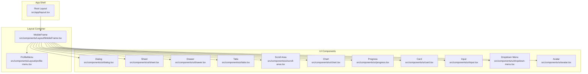

**Diagram sources**
- [layout.tsx](file://src/app/layout.tsx#L84-L107)
- [MobileFrame.tsx](file://src/components/Layout/MobileFrame.tsx#L43-L319)
- [profile-menu.tsx](file://src/components/Layout/profile-menu.tsx#L19-L80)
- [dialog.tsx](file://src/components/ui/dialog.tsx#L9-L105)
- [sheet.tsx](file://src/components/ui/sheet.tsx#L10-L122)
- [drawer.tsx](file://src/components/ui/drawer.tsx#L6-L99)
- [tabs.tsx](file://src/components/ui/tabs.tsx#L6-L54)
- [scroll-area.tsx](file://src/components/ui/scroll-area.tsx#L6-L45)
- [chart.tsx](file://src/components/ui/chart.tsx#L35-L354)
- [progress.tsx](file://src/components/ui/progress.tsx#L8-L26)
- [card.tsx](file://src/components/ui/card.tsx#L5-L59)
- [input.tsx](file://src/components/ui/input.tsx#L5-L23)
- [dropdown-menu.tsx](file://src/components/ui/dropdown-menu.tsx#L7-L187)
- [avatar.tsx](file://src/components/ui/avatar.tsx#L6-L46)

**Section sources**
- [layout.tsx](file://src/app/layout.tsx#L84-L107)
- [MobileFrame.tsx](file://src/components/Layout/MobileFrame.tsx#L43-L319)

## Core Components
This section summarizes the primary layout and container components and their roles in organizing educational content.

- Dialog: Modal overlay with animated entrance/exit, header/footer, title, and description slots for confirmations and information displays.
- Sheet: Slide-out panel from a chosen side (default right) for settings, filters, and secondary navigation.
- Drawer: Touch-friendly bottom drawer for mobile interactions, commonly used for quick actions and navigation menus.
- Tabs: Organize content sections with triggers and content areas for multi-view educational dashboards.
- Scroll Area: Custom scrollbar with Radix primitives for smooth, accessible scrolling in content panels.
- Chart: Recharts wrapper with theme-aware styling, tooltips, and legends for progress and analytics.
- Supporting containers and controls: Card, Input, Progress, Dropdown Menu, and Avatar enhance content presentation and user interactions.

**Section sources**
- [dialog.tsx](file://src/components/ui/dialog.tsx#L9-L105)
- [sheet.tsx](file://src/components/ui/sheet.tsx#L10-L122)
- [drawer.tsx](file://src/components/ui/drawer.tsx#L6-L99)
- [tabs.tsx](file://src/components/ui/tabs.tsx#L6-L54)
- [scroll-area.tsx](file://src/components/ui/scroll-area.tsx#L6-L45)
- [chart.tsx](file://src/components/ui/chart.tsx#L35-L354)
- [card.tsx](file://src/components/ui/card.tsx#L5-L59)
- [input.tsx](file://src/components/ui/input.tsx#L5-L23)
- [progress.tsx](file://src/components/ui/progress.tsx#L8-L26)
- [dropdown-menu.tsx](file://src/components/ui/dropdown-menu.tsx#L7-L187)
- [avatar.tsx](file://src/components/ui/avatar.tsx#L6-L46)

## Architecture Overview
The application uses a layered architecture:
- App shell sets global metadata, viewport, and theming.
- MobileFrame provides the mobile-first container with top bar, bottom navigation, and slide-out sheet for navigation.
- UI components encapsulate behavior and styling for modals, drawers, sheets, tabs, scroll areas, and charts.
- Educational workflows integrate these components for lessons, quizzes, study plans, and content management.

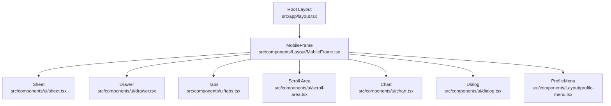

**Diagram sources**
- [layout.tsx](file://src/app/layout.tsx#L84-L107)
- [MobileFrame.tsx](file://src/components/Layout/MobileFrame.tsx#L43-L319)
- [sheet.tsx](file://src/components/ui/sheet.tsx#L10-L122)
- [drawer.tsx](file://src/components/ui/drawer.tsx#L6-L99)
- [tabs.tsx](file://src/components/ui/tabs.tsx#L6-L54)
- [scroll-area.tsx](file://src/components/ui/scroll-area.tsx#L6-L45)
- [chart.tsx](file://src/components/ui/chart.tsx#L35-L354)
- [dialog.tsx](file://src/components/ui/dialog.tsx#L9-L105)
- [profile-menu.tsx](file://src/components/Layout/profile-menu.tsx#L19-L80)

## Detailed Component Analysis

### Dialog Component
The Dialog component provides modal overlays with animated transitions and close controls. It supports structured composition with overlay, content, header, footer, title, and description.

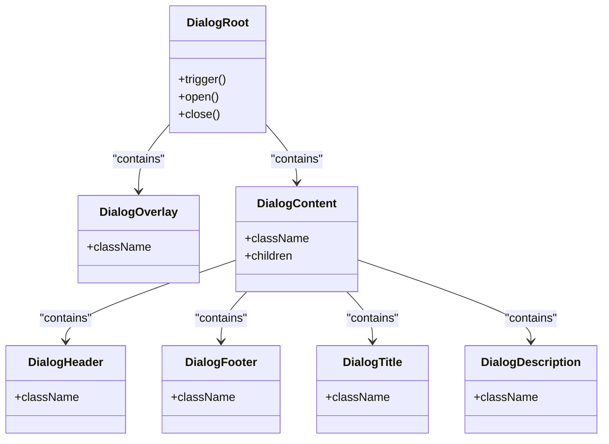

**Diagram sources**
- [dialog.tsx](file://src/components/ui/dialog.tsx#L9-L105)

**Section sources**
- [dialog.tsx](file://src/components/ui/dialog.tsx#L9-L105)

### Sheet Component
The Sheet component renders a slide-out panel from a specified side with animated transitions and a close button. It integrates with portals for overlay rendering.

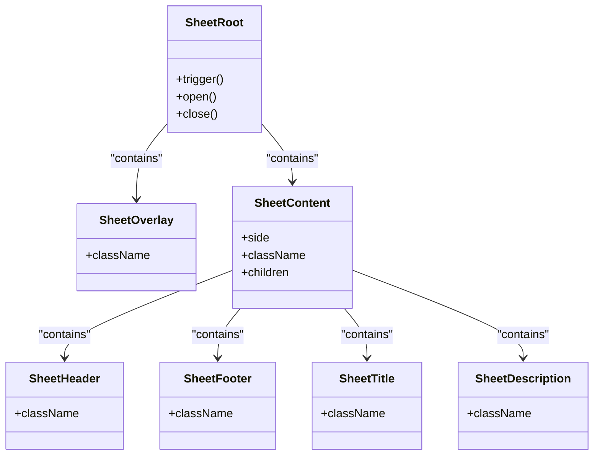

**Diagram sources**
- [sheet.tsx](file://src/components/ui/sheet.tsx#L10-L122)

**Section sources**
- [sheet.tsx](file://src/components/ui/sheet.tsx#L10-L122)

### Drawer Component
The Drawer component offers a mobile-friendly bottom drawer built on Vaul, with overlay, content, handle, and optional scaling background effects.

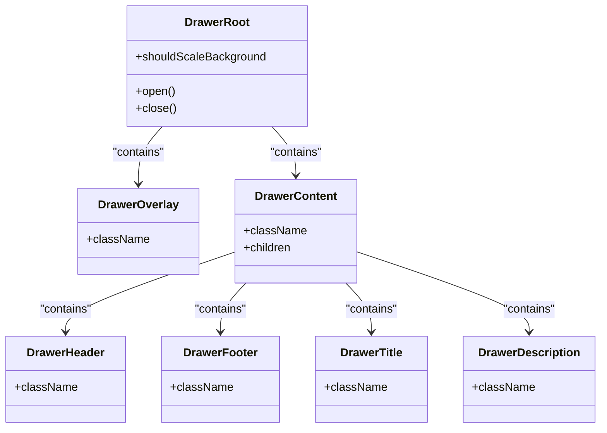

**Diagram sources**
- [drawer.tsx](file://src/components/ui/drawer.tsx#L6-L99)

**Section sources**
- [drawer.tsx](file://src/components/ui/drawer.tsx#L6-L99)

### Tabs Component
Tabs provide content organization with list, triggers, and content areas, enabling multi-panel views for educational dashboards.

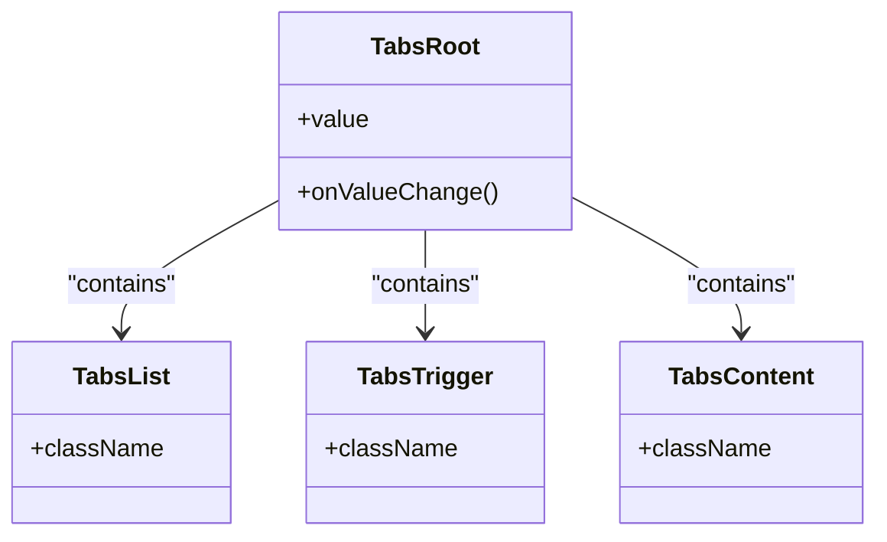

**Diagram sources**
- [tabs.tsx](file://src/components/ui/tabs.tsx#L6-L54)

**Section sources**
- [tabs.tsx](file://src/components/ui/tabs.tsx#L6-L54)

### Scroll Area Component
The Scroll Area component wraps content with a viewport and custom scrollbar, ensuring consistent cross-browser scrolling behavior.

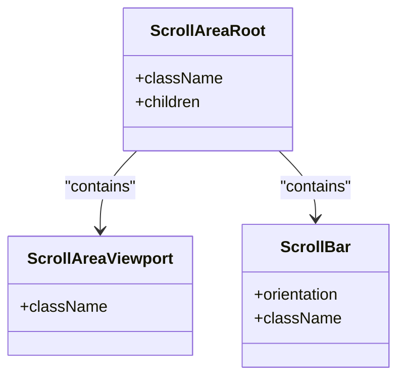

**Diagram sources**
- [scroll-area.tsx](file://src/components/ui/scroll-area.tsx#L6-L45)

**Section sources**
- [scroll-area.tsx](file://src/components/ui/scroll-area.tsx#L6-L45)

### Chart Component
The Chart component wraps Recharts with theme-aware styling, configurable tooltips, and legends. It exposes a context provider for color configuration and dynamic CSS variables.

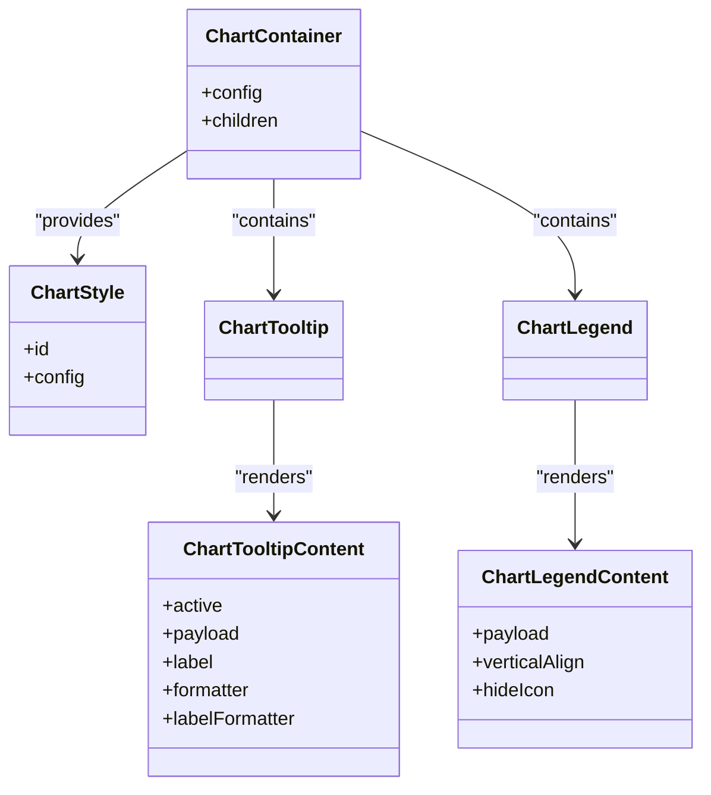

**Diagram sources**
- [chart.tsx](file://src/components/ui/chart.tsx#L35-L354)

**Section sources**
- [chart.tsx](file://src/components/ui/chart.tsx#L35-L354)

### MobileFrame and Navigation Integration
MobileFrame orchestrates the mobile-first experience, integrating a top navigation bar, slide-out left sheet for main navigation, and a floating bottom pill navigation. It also includes a profile menu dropdown and theme toggle.

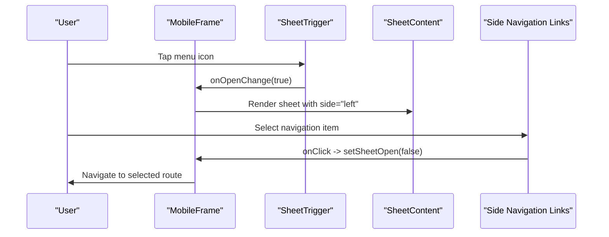

**Diagram sources**
- [MobileFrame.tsx](file://src/components/Layout/MobileFrame.tsx#L95-L201)

**Section sources**
- [MobileFrame.tsx](file://src/components/Layout/MobileFrame.tsx#L43-L319)

### Profile Menu Integration
The ProfileMenu component provides a dropdown menu with avatar, account details, and logout action, integrated into the top navigation bar.

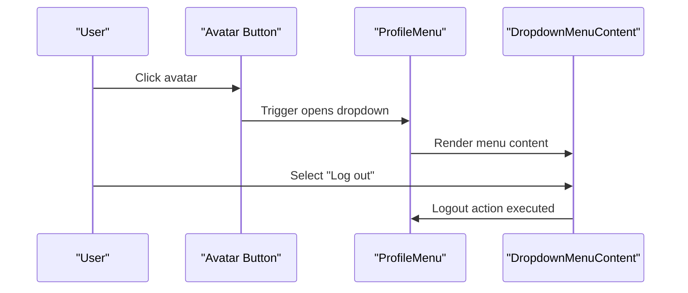

**Diagram sources**
- [profile-menu.tsx](file://src/components/Layout/profile-menu.tsx#L19-L80)

**Section sources**
- [profile-menu.tsx](file://src/components/Layout/profile-menu.tsx#L19-L80)

## Dependency Analysis
The UI components rely on Radix UI primitives for accessibility and state management, Recharts for data visualization, Framer Motion for animations, and Vaul for drawer interactions. Tailwind utilities and class variance authority (CVA) manage styling and variants.

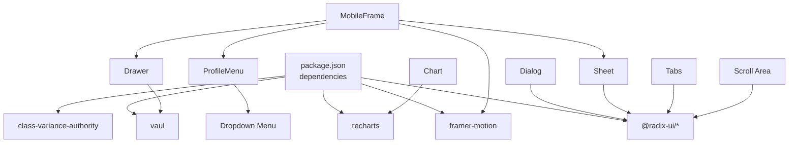

**Diagram sources**
- [package.json](file://package.json#L27-L65)
- [dialog.tsx](file://src/components/ui/dialog.tsx#L3-L4)
- [sheet.tsx](file://src/components/ui/sheet.tsx#L3-L6)
- [drawer.tsx](file://src/components/ui/drawer.tsx#L2)
- [tabs.tsx](file://src/components/ui/tabs.tsx#L1)
- [scroll-area.tsx](file://src/components/ui/scroll-area.tsx#L1)
- [chart.tsx](file://src/components/ui/chart.tsx#L4)
- [MobileFrame.tsx](file://src/components/Layout/MobileFrame.tsx#L4)
- [profile-menu.tsx](file://src/components/Layout/profile-menu.tsx#L9-L16)

**Section sources**
- [package.json](file://package.json#L27-L65)

## Performance Considerations
- Prefer lazy loading for heavy content inside sheets and drawers to minimize initial render cost.
- Use virtualized lists within scroll areas for large datasets to maintain smooth scrolling.
- Defer non-critical chart rendering until after hydration to avoid layout shifts.
- Limit deep nesting in dialogs and sheets to reduce reflow and repaint costs.
- Utilize CSS containment and transform-based animations for smoother interactions.

## Accessibility and Responsive Behavior
- Keyboard navigation: All interactive components (dialogs, sheets, drawers, tabs, dropdowns) inherit keyboard support from Radix UI primitives.
- Focus management: Dialogs and sheets trap focus within the modal region; overlays dismiss on escape or click outside.
- Screen reader support: Titles and descriptions in dialogs and sheets provide context; aria-labels are present on interactive elements.
- Responsive breakpoints: MobileFrame applies device-width viewport and adjusts navigation visibility per route; bottom navigation hides on specific pages.
- Touch targets: Drawer and sheet handles are appropriately sized; bottom navigation pill icons include adequate spacing.

**Section sources**
- [layout.tsx](file://src/app/layout.tsx#L78-L82)
- [MobileFrame.tsx](file://src/components/Layout/MobileFrame.tsx#L52-L57)
- [dialog.tsx](file://src/components/ui/dialog.tsx#L47-L50)
- [sheet.tsx](file://src/components/ui/sheet.tsx#L64-L67)
- [tabs.tsx](file://src/components/ui/tabs.tsx#L27-L35)

## Animation and Interaction Patterns
- Entrance/exit animations: Dialogs and sheets use fade, zoom, and slide transitions controlled via data-state attributes.
- Drawer interactions: Smooth bottom-to-top reveal with optional background scaling for immersive feel.
- Bottom navigation: Animated active pill using layoutId for fluid transitions between active states.
- Hover and tap feedback: Buttons and navigation items include transitions and subtle scaling for tactile responses.

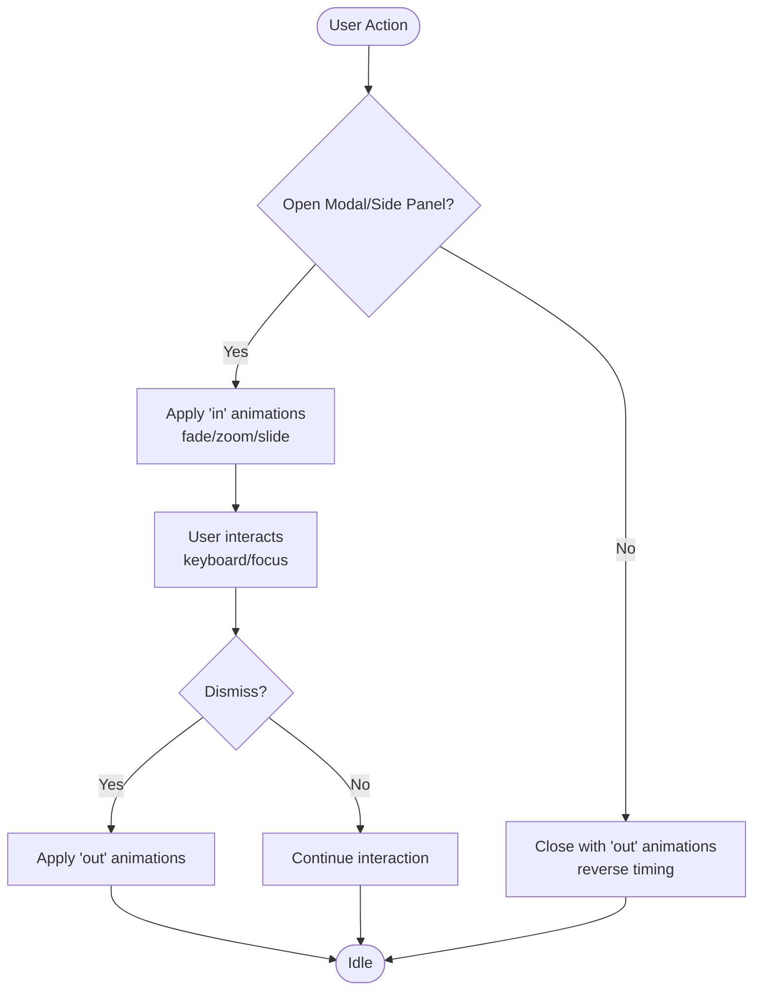

**Section sources**
- [dialog.tsx](file://src/components/ui/dialog.tsx#L21-L28)
- [sheet.tsx](file://src/components/ui/sheet.tsx#L33-L50)
- [MobileFrame.tsx](file://src/components/Layout/MobileFrame.tsx#L250-L261)

## Educational Content Workflows Integration
- Lessons and Quizzes: Tabs can organize theory, practice, and review sections; dialogs can present confirmations for quiz submission or progress warnings.
- Study Paths and Plans: Sheets can host filters and settings for subjects and difficulty; scroll areas accommodate long lists of topics.
- Content Management: Drawers can provide quick actions for adding resources; charts visualize progress and performance metrics.
- Accessibility: Progress bars indicate completion; cards present structured content blocks; inputs support search and filtering.

**Section sources**
- [tabs.tsx](file://src/components/ui/tabs.tsx#L6-L54)
- [progress.tsx](file://src/components/ui/progress.tsx#L8-L26)
- [card.tsx](file://src/components/ui/card.tsx#L5-L59)
- [input.tsx](file://src/components/ui/input.tsx#L5-L23)
- [chart.tsx](file://src/components/ui/chart.tsx#L35-L354)

## Troubleshooting Guide
- Dialog not closing: Verify the close button is placed inside the content and that the trigger is correctly wired.
- Sheet not animating: Ensure the portal and overlay are rendered and side prop is set appropriately.
- Drawer not opening: Confirm Vaul is installed and the root component is configured with proper props.
- Scrollbar missing: Check that ScrollAreaRoot wraps the content and ScrollBar is included.
- Chart colors incorrect: Validate the ChartConfig keys match payload and that theme CSS variables are applied.
- Mobile navigation issues: Inspect route-based visibility flags and ensure the sheet is closed on navigation.

**Section sources**
- [dialog.tsx](file://src/components/ui/dialog.tsx#L47-L50)
- [sheet.tsx](file://src/components/ui/sheet.tsx#L62-L69)
- [drawer.tsx](file://src/components/ui/drawer.tsx#L38-L50)
- [scroll-area.tsx](file://src/components/ui/scroll-area.tsx#L15-L20)
- [chart.tsx](file://src/components/ui/chart.tsx#L46-L72)
- [MobileFrame.tsx](file://src/components/Layout/MobileFrame.tsx#L52-L57)

## Conclusion
MatricMaster AI’s layout and container components form a cohesive, mobile-first foundation for educational content delivery. Dialogs, sheets, drawers, tabs, scroll areas, and charts work together to provide intuitive navigation, robust modals, and insightful data visualization. By adhering to accessibility guidelines, leveraging animations thoughtfully, and structuring components for scalability, the system supports seamless learning workflows across devices.