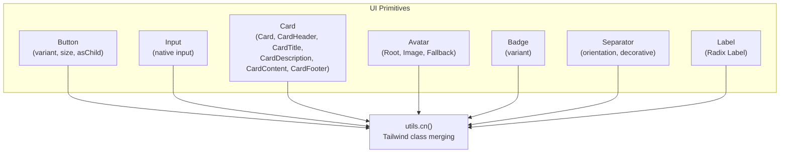
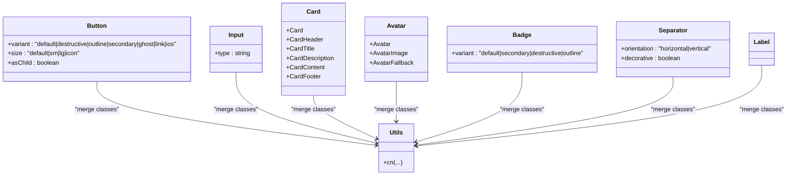
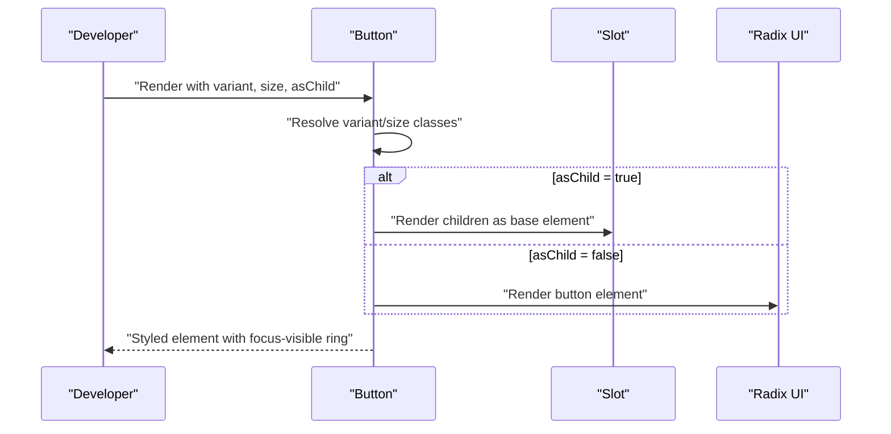
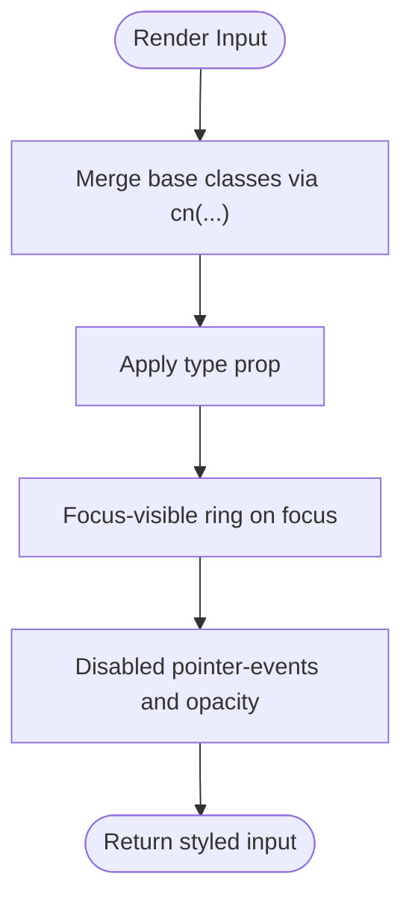
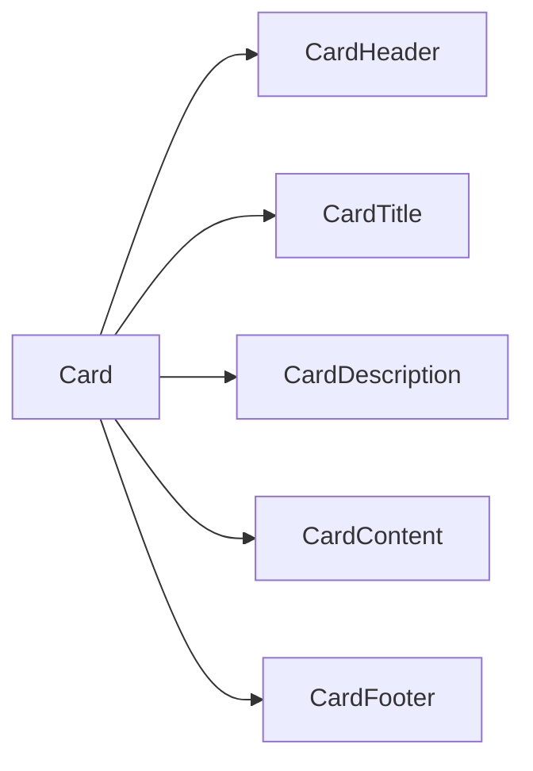
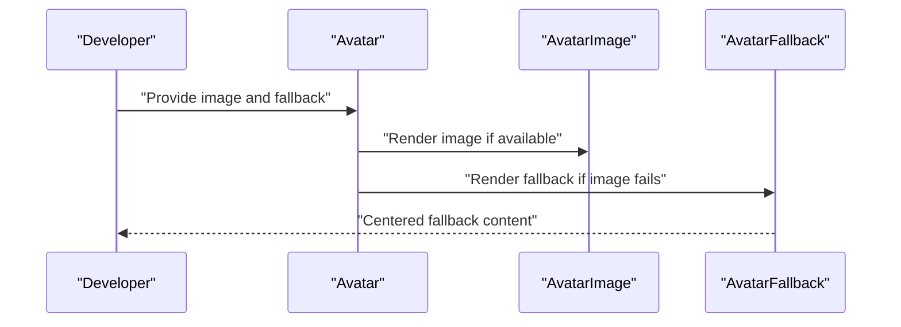
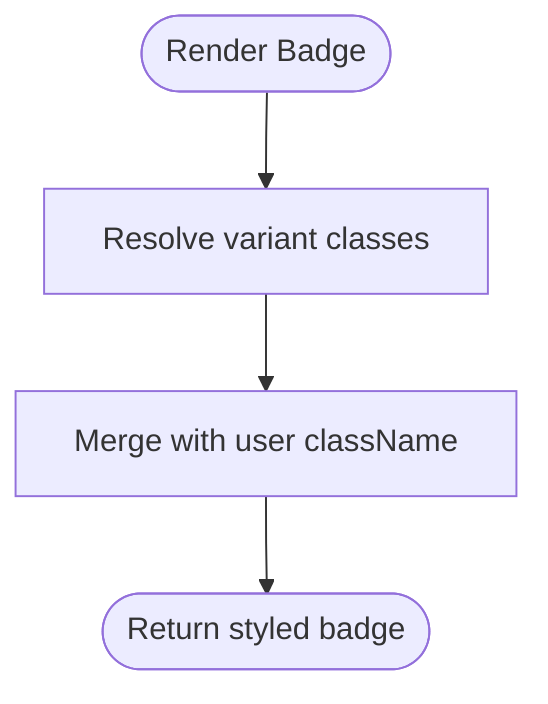
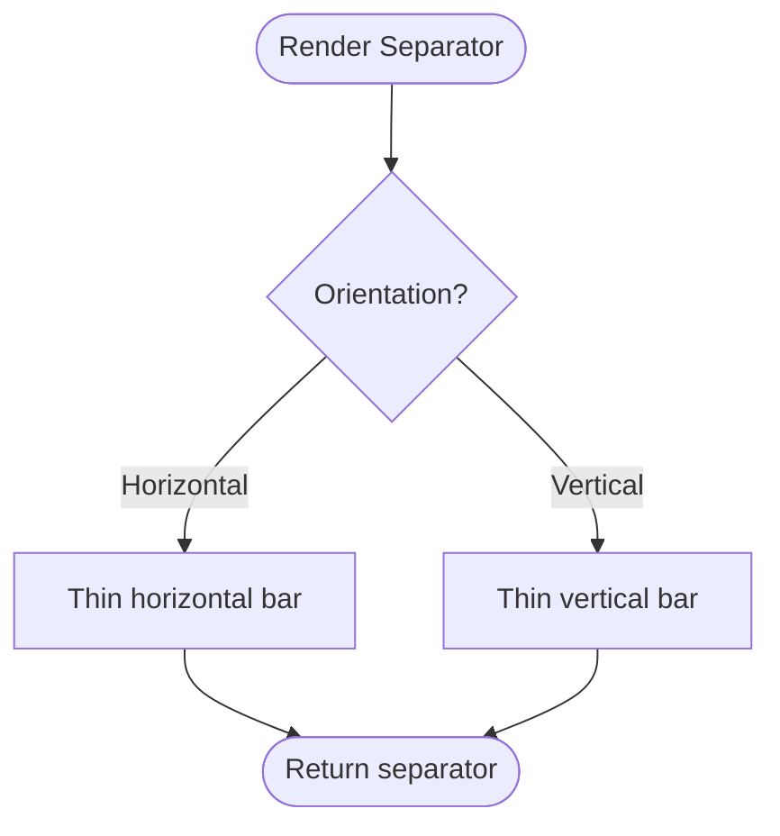
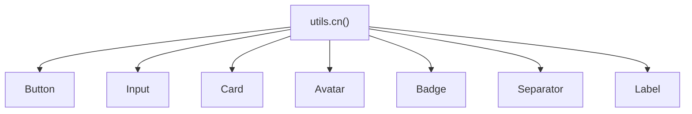

# Primitive Components

<cite>
**Referenced Files in This Document**
- [button.tsx](file://src/components/ui/button.tsx)
- [input.tsx](file://src/components/ui/input.tsx)
- [card.tsx](file://src/components/ui/card.tsx)
- [avatar.tsx](file://src/components/ui/avatar.tsx)
- [badge.tsx](file://src/components/ui/badge.tsx)
- [separator.tsx](file://src/components/ui/separator.tsx)
- [label.tsx](file://src/components/ui/label.tsx)
- [utils.ts](file://src/lib/utils.ts)
</cite>

## Table of Contents
1. [Introduction](#introduction)
2. [Project Structure](#project-structure)
3. [Core Components](#core-components)
4. [Architecture Overview](#architecture-overview)
5. [Detailed Component Analysis](#detailed-component-analysis)
6. [Dependency Analysis](#dependency-analysis)
7. [Performance Considerations](#performance-considerations)
8. [Troubleshooting Guide](#troubleshooting-guide)
9. [Conclusion](#conclusion)

## Introduction
This document describes MatricMaster AI’s primitive UI components built on Radix UI foundations. It focuses on the button, input, card, avatar, badge, and separator components, detailing their variants, sizes, composition patterns, accessibility attributes, and integration points. It also outlines styling customization via Tailwind-based class merging and demonstrates how these primitives compose into larger UI patterns.

## Project Structure
The primitive components live under the UI module and are thin wrappers around Radix UI primitives or native HTML elements. They consistently:
- Use a shared utility for merging Tailwind classes
- Apply Radix UI props and forward refs
- Expose variant systems (where applicable) using class variance authority
- Support composition via the “asChild” pattern for buttons

**Diagram sources**
- [button.tsx](file://src/components/ui/button.tsx#L1-L52)
- [input.tsx](file://src/components/ui/input.tsx#L1-L23)
- [card.tsx](file://src/components/ui/card.tsx#L1-L59)
- [avatar.tsx](file://src/components/ui/avatar.tsx#L1-L46)
- [badge.tsx](file://src/components/ui/badge.tsx#L1-L34)
- [separator.tsx](file://src/components/ui/separator.tsx#L1-L27)
- [label.tsx](file://src/components/ui/label.tsx#L1-L20)
- [utils.ts](file://src/lib/utils.ts#L1-L7)

**Section sources**
- [button.tsx](file://src/components/ui/button.tsx#L1-L52)
- [input.tsx](file://src/components/ui/input.tsx#L1-L23)
- [card.tsx](file://src/components/ui/card.tsx#L1-L59)
- [avatar.tsx](file://src/components/ui/avatar.tsx#L1-L46)
- [badge.tsx](file://src/components/ui/badge.tsx#L1-L34)
- [separator.tsx](file://src/components/ui/separator.tsx#L1-L27)
- [label.tsx](file://src/components/ui/label.tsx#L1-L20)
- [utils.ts](file://src/lib/utils.ts#L1-L7)

## Core Components
This section summarizes each primitive’s purpose, props, and behavior.

- Button
  - Variants: default, destructive, outline, secondary, ghost, link, ios
  - Sizes: default, sm, lg, icon
  - Composition: supports asChild to render any underlying element
  - Accessibility: inherits focus-visible ring and disabled states
  - Styling: variant and size classes merged via a variant system

- Input
  - Native HTML input wrapper
  - Placeholder and focus-visible ring handled via shared classes
  - Responsive typography adjustments via media queries

- Card
  - Composite container with header, title, description, content, footer slots
  - Rounded, elevated styling with transitions

- Avatar
  - Root, Image, and Fallback segments for user image display and fallback

- Badge
  - Status indicator with variant system (default, secondary, destructive, outline)

- Separator
  - Horizontal or vertical divider with orientation and decorative semantics

- Label
  - Radix Label with optional variant styling

**Section sources**
- [button.tsx](file://src/components/ui/button.tsx#L7-L33)
- [input.tsx](file://src/components/ui/input.tsx#L5-L22)
- [card.tsx](file://src/components/ui/card.tsx#L5-L58)
- [avatar.tsx](file://src/components/ui/avatar.tsx#L6-L45)
- [badge.tsx](file://src/components/ui/badge.tsx#L6-L33)
- [separator.tsx](file://src/components/ui/separator.tsx#L8-L26)
- [label.tsx](file://src/components/ui/label.tsx#L7-L19)

## Architecture Overview
The primitives follow a consistent pattern:
- Props extend native or Radix types
- A central class merging utility composes base and variant classes
- Buttons support “asChild” to wrap other elements (e.g., links)
- Composite components expose named subcomponents for structured layouts

**Diagram sources**
- [button.tsx](file://src/components/ui/button.tsx#L35-L49)
- [input.tsx](file://src/components/ui/input.tsx#L5-L22)
- [card.tsx](file://src/components/ui/card.tsx#L5-L58)
- [avatar.tsx](file://src/components/ui/avatar.tsx#L6-L45)
- [badge.tsx](file://src/components/ui/badge.tsx#L25-L31)
- [separator.tsx](file://src/components/ui/separator.tsx#L8-L26)
- [label.tsx](file://src/components/ui/label.tsx#L11-L16)
- [utils.ts](file://src/lib/utils.ts#L4-L6)

## Detailed Component Analysis

### Button
- Purpose: Action surface with variant and size styling, and flexible rendering via asChild
- Props
  - variant: default, destructive, outline, secondary, ghost, link, ios
  - size: default, sm, lg, icon
  - asChild: renders children as the base element instead of a button
  - Inherits native button attributes
- Composition pattern
  - Uses a slot to render either a button or a custom element (e.g., Link)
- Accessibility
  - Focus-visible ring and disabled pointer-events
- Styling
  - Variant and size classes applied via a variant system
  - Shared utility merges base classes with variants and user-provided className

**Diagram sources**
- [button.tsx](file://src/components/ui/button.tsx#L41-L49)

**Section sources**
- [button.tsx](file://src/components/ui/button.tsx#L7-L33)
- [button.tsx](file://src/components/ui/button.tsx#L35-L49)
- [utils.ts](file://src/lib/utils.ts#L4-L6)

### Input
- Purpose: Native input with consistent focus, disabled, and placeholder styling
- Props
  - type: input type
  - Inherits native input attributes
- Accessibility
  - Focus ring and disabled pointer-events
- Styling
  - Base classes include placeholder and focus-visible ring

**Diagram sources**
- [input.tsx](file://src/components/ui/input.tsx#L5-L22)

**Section sources**
- [input.tsx](file://src/components/ui/input.tsx#L5-L22)
- [utils.ts](file://src/lib/utils.ts#L4-L6)

### Card
- Purpose: Content container with semantic regions for headers, titles, descriptions, content, and footers
- Subcomponents
  - Card, CardHeader, CardTitle, CardDescription, CardContent, CardFooter
- Styling
  - Rounded, elevated, and transitioned background and borders

**Diagram sources**
- [card.tsx](file://src/components/ui/card.tsx#L5-L58)

**Section sources**
- [card.tsx](file://src/components/ui/card.tsx#L5-L58)
- [utils.ts](file://src/lib/utils.ts#L4-L6)

### Avatar
- Purpose: User identity with image and fallback visuals
- Subcomponents
  - Avatar (root), AvatarImage, AvatarFallback
- Styling
  - Circular root with overflow hidden; fallback centered and muted

**Diagram sources**
- [avatar.tsx](file://src/components/ui/avatar.tsx#L6-L45)

**Section sources**
- [avatar.tsx](file://src/components/ui/avatar.tsx#L6-L45)
- [utils.ts](file://src/lib/utils.ts#L4-L6)

### Badge
- Purpose: Short status or tag labels
- Props
  - variant: default, secondary, destructive, outline
- Styling
  - Rounded pill shape with optional border and shadow

**Diagram sources**
- [badge.tsx](file://src/components/ui/badge.tsx#L25-L31)

**Section sources**
- [badge.tsx](file://src/components/ui/badge.tsx#L6-L33)
- [utils.ts](file://src/lib/utils.ts#L4-L6)

### Separator
- Purpose: Visual divider between content blocks
- Props
  - orientation: horizontal or vertical
  - decorative: boolean for semantics
- Styling
  - Thin bar with appropriate dimension per orientation

**Diagram sources**
- [separator.tsx](file://src/components/ui/separator.tsx#L8-L26)

**Section sources**
- [separator.tsx](file://src/components/ui/separator.tsx#L8-L26)
- [utils.ts](file://src/lib/utils.ts#L4-L6)

### Label
- Purpose: Accessible label for form controls
- Styling
  - Optional variant styling via class variance authority

**Section sources**
- [label.tsx](file://src/components/ui/label.tsx#L7-L19)
- [utils.ts](file://src/lib/utils.ts#L4-L6)

## Dependency Analysis
- Shared utility
  - All components rely on a single class merging utility to combine base and variant classes
- Radix UI dependencies
  - Avatar, Badge, Separator, Label, and others depend on Radix UI primitives
- Composition
  - Button supports asChild composition via a slot
  - Composite containers (Card, Dialog, Drawer, DropdownMenu, Select, Tabs) expose subcomponents

**Diagram sources**
- [utils.ts](file://src/lib/utils.ts#L4-L6)
- [button.tsx](file://src/components/ui/button.tsx#L5-L5)
- [input.tsx](file://src/components/ui/input.tsx#L3-L3)
- [card.tsx](file://src/components/ui/card.tsx#L3-L3)
- [avatar.tsx](file://src/components/ui/avatar.tsx#L4-L4)
- [badge.tsx](file://src/components/ui/badge.tsx#L4-L4)
- [separator.tsx](file://src/components/ui/separator.tsx#L6-L6)
- [label.tsx](file://src/components/ui/label.tsx#L5-L5)

**Section sources**
- [utils.ts](file://src/lib/utils.ts#L4-L6)
- [button.tsx](file://src/components/ui/button.tsx#L1-L52)
- [input.tsx](file://src/components/ui/input.tsx#L1-L23)
- [card.tsx](file://src/components/ui/card.tsx#L1-L59)
- [avatar.tsx](file://src/components/ui/avatar.tsx#L1-L46)
- [badge.tsx](file://src/components/ui/badge.tsx#L1-L34)
- [separator.tsx](file://src/components/ui/separator.tsx#L1-L27)
- [label.tsx](file://src/components/ui/label.tsx#L1-L20)

## Performance Considerations
- Prefer variant and size props over ad-hoc className overrides to keep the variant system efficient
- Use asChild on Button sparingly to avoid unnecessary DOM nodes
- Keep composite containers shallow; avoid deeply nested wrappers to reduce reflow costs
- Leverage the shared class merging utility to minimize redundant class concatenation

## Troubleshooting Guide
- Button does not render as expected
  - Verify variant and size combinations are supported
  - Confirm asChild usage aligns with intended semantics
- Input lacks focus ring or placeholder styling
  - Ensure the component receives the base classes from the shared utility
- Card layout issues
  - Use the dedicated subcomponents (header, title, description, content, footer) to maintain structure
- Avatar image not visible
  - Provide an image source; fallback will appear if the image fails to load
- Badge variant not applying
  - Confirm variant matches supported values
- Separator orientation incorrect
  - Set orientation to horizontal or vertical as needed

**Section sources**
- [button.tsx](file://src/components/ui/button.tsx#L41-L49)
- [input.tsx](file://src/components/ui/input.tsx#L5-L22)
- [card.tsx](file://src/components/ui/card.tsx#L5-L58)
- [avatar.tsx](file://src/components/ui/avatar.tsx#L6-L45)
- [badge.tsx](file://src/components/ui/badge.tsx#L25-L31)
- [separator.tsx](file://src/components/ui/separator.tsx#L8-L26)

## Conclusion
MatricMaster AI’s primitive UI components provide a cohesive, accessible, and extensible foundation built on Radix UI. By standardizing styling through a shared utility and offering robust variant and composition patterns, these primitives enable consistent UI development while supporting customization and responsive behavior.