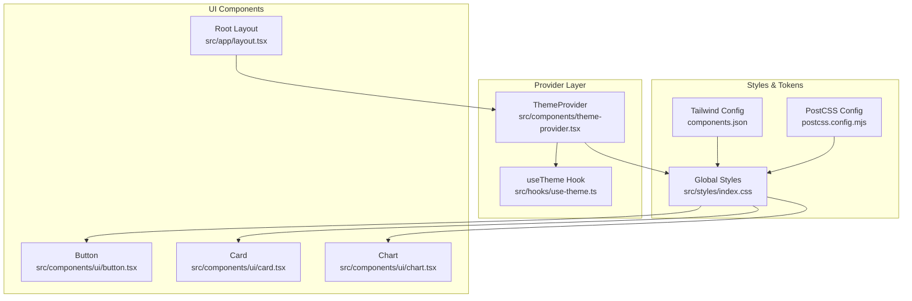
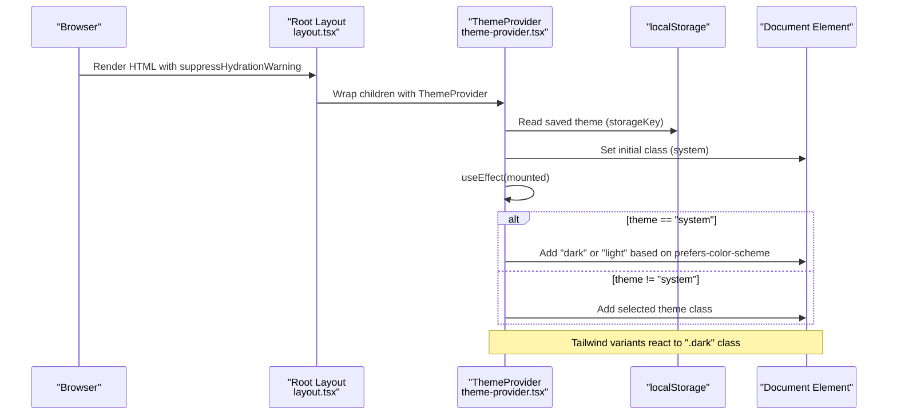
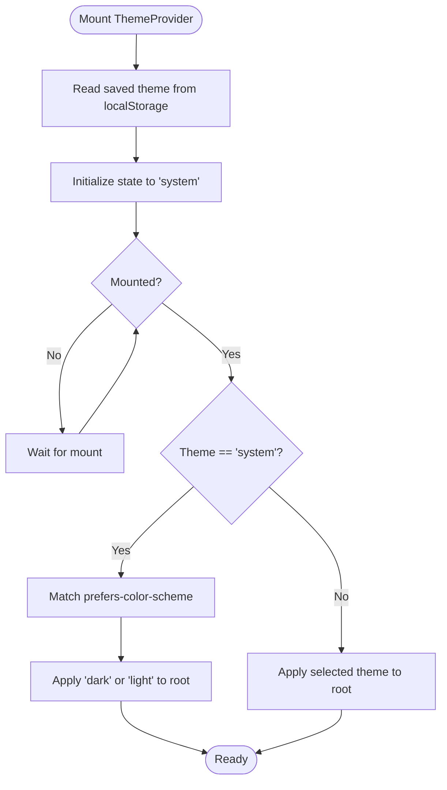
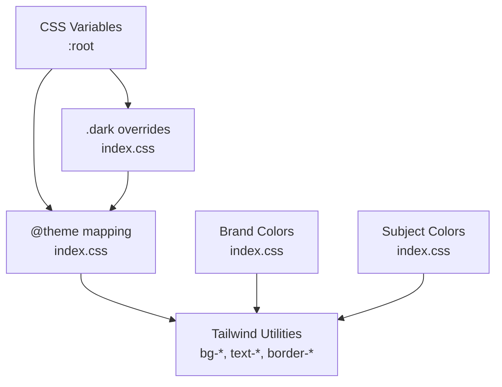
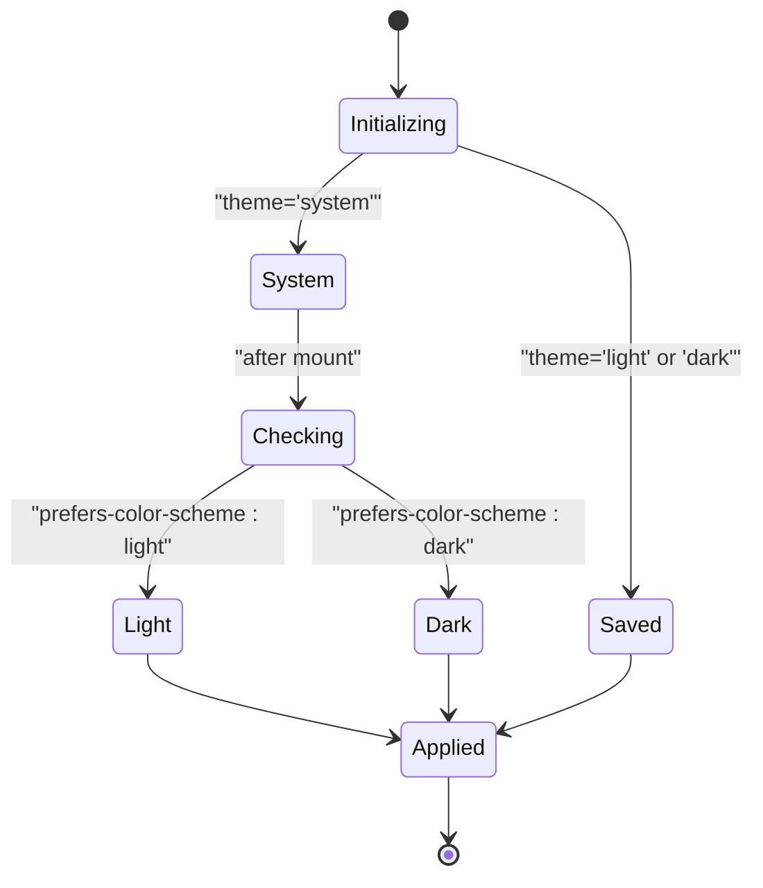
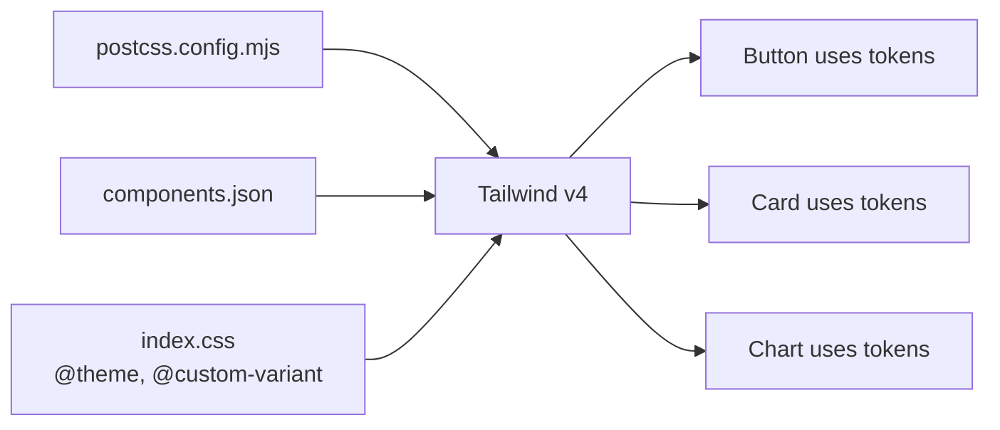
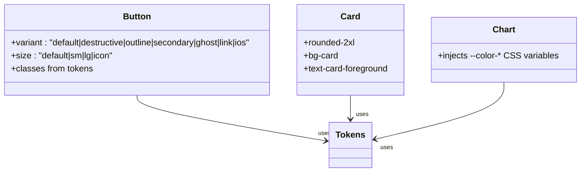
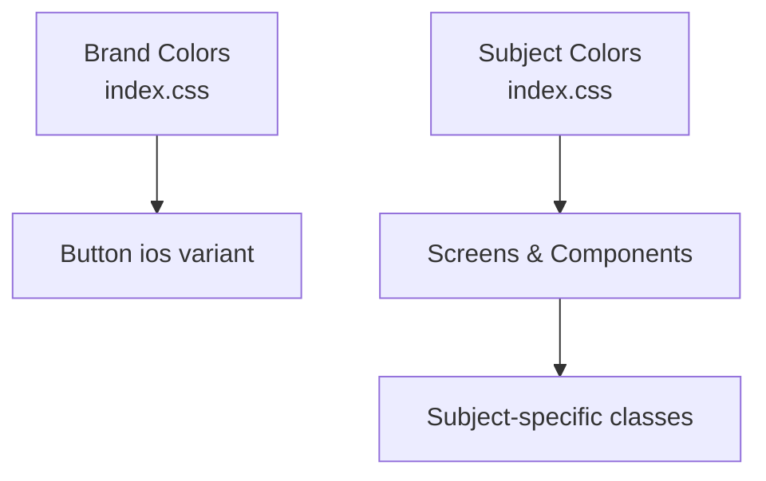
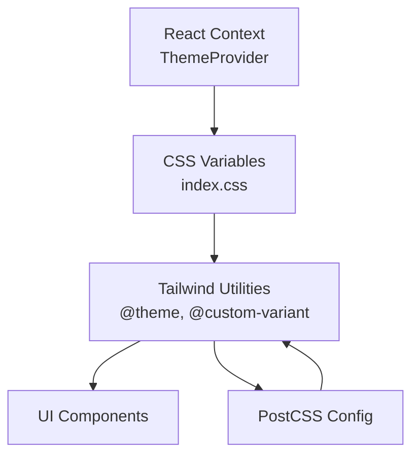

# Theming System

<cite>
**Referenced Files in This Document**
- [theme-provider.tsx](file://src/components/theme-provider.tsx)
- [use-theme.ts](file://src/hooks/use-theme.ts)
- [index.css](file://src/styles/index.css)
- [layout.tsx](file://src/app/layout.tsx)
- [button.tsx](file://src/components/ui/button.tsx)
- [card.tsx](file://src/components/ui/card.tsx)
- [chart.tsx](file://src/components/ui/chart.tsx)
- [components.json](file://components.json)
- [postcss.config.mjs](file://postcss.config.mjs)
- [package.json](file://package.json)
- [InteractiveQuiz.tsx](file://src/screens/InteractiveQuiz.tsx)
</cite>

## Table of Contents
1. [Introduction](#introduction)
2. [Project Structure](#project-structure)
3. [Core Components](#core-components)
4. [Architecture Overview](#architecture-overview)
5. [Detailed Component Analysis](#detailed-component-analysis)
6. [Dependency Analysis](#dependency-analysis)
7. [Performance Considerations](#performance-considerations)
8. [Troubleshooting Guide](#troubleshooting-guide)
9. [Conclusion](#conclusion)
10. [Appendices](#appendices)

## Introduction
This document describes MatricMaster AI's comprehensive theming system, covering the theme provider implementation, design tokens, dark/light mode behavior, Tailwind CSS integration, brand color usage, and guidelines for extending and maintaining the design system. The system centers around a React context provider that manages theme state, persists user preferences, and synchronizes the document class for Tailwind variants. Design tokens are defined via CSS custom properties and Tailwind's @theme, enabling consistent color, typography, spacing, and radius scales across components and educational subject branding.

## Project Structure
The theming system spans three primary areas:
- Provider and hook: Theme lifecycle and consumption
- Styles and tokens: CSS custom properties, Tailwind variants, and base styles
- UI components: Components that consume design tokens and variants

**Diagram sources**
- [theme-provider.tsx](file://src/components/theme-provider.tsx#L25-L75)
- [use-theme.ts](file://src/hooks/use-theme.ts#L1-L4)
- [index.css](file://src/styles/index.css#L1-L286)
- [components.json](file://components.json#L1-L24)
- [postcss.config.mjs](file://postcss.config.mjs#L1-L7)
- [button.tsx](file://src/components/ui/button.tsx#L1-L52)
- [card.tsx](file://src/components/ui/card.tsx#L1-L59)
- [chart.tsx](file://src/components/ui/chart.tsx#L76-L106)
- [layout.tsx](file://src/app/layout.tsx#L84-L107)

**Section sources**
- [theme-provider.tsx](file://src/components/theme-provider.tsx#L1-L84)
- [index.css](file://src/styles/index.css#L1-L286)
- [layout.tsx](file://src/app/layout.tsx#L1-L108)

## Core Components
- ThemeProvider: Manages theme state ('light', 'dark', 'system'), persists to localStorage, and updates the document class for Tailwind variants. It avoids hydration mismatches by initializing to 'system' and applying the actual theme after mount.
- useTheme hook: Thin wrapper around the ThemeProvider context for convenient consumption.
- Global CSS: Defines CSS variables for design tokens, dark mode overrides, Tailwind @theme mapping, and utility variants.
- UI components: Buttons, cards, and charts consume tokens via Tailwind classes and CSS variables.

Key behaviors:
- Automatic detection: Uses prefers-color-scheme media query when theme is 'system'.
- Manual switching: Persists user choice to localStorage and updates DOM class immediately.
- Hydration safety: Initializes provider state to prevent SSR vs CSR class mismatches.

**Section sources**
- [theme-provider.tsx](file://src/components/theme-provider.tsx#L25-L75)
- [use-theme.ts](file://src/hooks/use-theme.ts#L1-L4)
- [index.css](file://src/styles/index.css#L30-L165)
- [layout.tsx](file://src/app/layout.tsx#L84-L107)

## Architecture Overview
The theming architecture integrates React context, CSS custom properties, and Tailwind variants to deliver a cohesive design system.

**Diagram sources**
- [layout.tsx](file://src/app/layout.tsx#L84-L107)
- [theme-provider.tsx](file://src/components/theme-provider.tsx#L36-L58)

## Detailed Component Analysis

### ThemeProvider Implementation
- State management: Tracks current theme and exposes a setter that updates localStorage and state.
- Hydration safety: Initializes to 'system' and applies the real theme after mounting.
- System preference: Reads prefers-color-scheme to decide dark vs light when theme is 'system'.
- Class synchronization: Removes previous theme classes and adds the new one to the root element.

**Diagram sources**
- [theme-provider.tsx](file://src/components/theme-provider.tsx#L36-L58)

**Section sources**
- [theme-provider.tsx](file://src/components/theme-provider.tsx#L25-L75)

### Design Token System
Design tokens are defined as CSS custom properties and mapped into Tailwind via @theme. They include:
- Color palette: background, foreground, card, popover, primary, secondary, muted, accent, destructive, border, input, ring, sidebar, and chart colors.
- Brand colors: Blue, amber, purple, green, red, orange, gray.
- Subject colors: Math, physics, life sciences, accounting, English, geography, history.
- Typography: Inter, Lexend, and system font families.
- Spacing and radii: Base radius and derived sizes (sm, md, lg, xl, 2xl, 3xl, 4xl).

Token application:
- :root defines light-mode values.
- .dark overrides values for dark mode.
- @theme maps tokens to Tailwind utilities and component variants.

**Diagram sources**
- [index.css](file://src/styles/index.css#L30-L165)

**Section sources**
- [index.css](file://src/styles/index.css#L30-L165)

### Dark Mode Implementation
- Automatic detection: When theme is 'system', the provider checks prefers-color-scheme and applies 'dark' or 'light' accordingly.
- Manual switching: Users can choose 'light' or 'dark'; selection is persisted and applied immediately.
- System preference handling: On subsequent loads, the saved theme takes precedence; if absent, system preference is used.

**Diagram sources**
- [theme-provider.tsx](file://src/components/theme-provider.tsx#L50-L57)

**Section sources**
- [theme-provider.tsx](file://src/components/theme-provider.tsx#L36-L58)

### Tailwind CSS Integration and Variants
- Tailwind v4 is configured via PostCSS and components.json.
- CSS variables are enabled for Tailwind, allowing utilities to bind to design tokens.
- A custom dark variant targets elements under the .dark class.
- Utilities include iOS-style glass effects, active scaling, and math-serif typography.

**Diagram sources**
- [postcss.config.mjs](file://postcss.config.mjs#L1-L7)
- [components.json](file://components.json#L1-L24)
- [index.css](file://src/styles/index.css#L5-L28)

**Section sources**
- [postcss.config.mjs](file://postcss.config.mjs#L1-L7)
- [components.json](file://components.json#L1-L24)
- [index.css](file://src/styles/index.css#L5-L28)

### Component Variant Customization
- Button variants: default, destructive, outline, secondary, ghost, link, ios. Each variant binds to primary, destructive, secondary, and accent tokens for consistent behavior across modes.
- Card: Uses card and card-foreground tokens with rounded corners aligned to radius tokens.
- Charts: Dynamically inject chart-specific CSS variables per theme to align chart colors with the active theme.

**Diagram sources**
- [button.tsx](file://src/components/ui/button.tsx#L7-L33)
- [card.tsx](file://src/components/ui/card.tsx#L9-L12)
- [chart.tsx](file://src/components/ui/chart.tsx#L76-L106)

**Section sources**
- [button.tsx](file://src/components/ui/button.tsx#L1-L52)
- [card.tsx](file://src/components/ui/card.tsx#L1-L59)
- [chart.tsx](file://src/components/ui/chart.tsx#L76-L106)

### Brand Color Usage for Educational Themes
- Brand colors: Used for prominent actions and brand-aligned components (e.g., ios variant).
- Subject colors: Integrated into UI to reflect subject domains (e.g., math, physics, life sciences, accounting, English, geography, history).
- Example usage: Subject-specific styling in screen components leverages subject color tokens for backgrounds, borders, and gradients.

**Diagram sources**
- [index.css](file://src/styles/index.css#L70-L90)
- [button.tsx](file://src/components/ui/button.tsx#L19-L19)
- [InteractiveQuiz.tsx](file://src/screens/InteractiveQuiz.tsx#L23-L75)

**Section sources**
- [index.css](file://src/styles/index.css#L70-L90)
- [button.tsx](file://src/components/ui/button.tsx#L19-L19)
- [InteractiveQuiz.tsx](file://src/screens/InteractiveQuiz.tsx#L23-L75)

### Accessibility Considerations for Color Contrast
- The design system uses oklch color spaces for perceptually uniform lightness and chroma, aiding readability and contrast.
- Primary and foreground tokens invert between light and dark modes to maintain sufficient contrast.
- Components rely on semantic tokens (primary, secondary, destructive, muted) to preserve accessible contrast ratios across themes.

**Section sources**
- [index.css](file://src/styles/index.css#L98-L165)

### Responsive Design Tokens
- Typography scales and spacing units are defined via CSS variables and Tailwind utilities, ensuring consistent scaling across breakpoints.
- The base font stack and font feature settings improve legibility on various devices.
- Radius tokens adapt to different component sizes, maintaining visual rhythm across contexts.

**Section sources**
- [index.css](file://src/styles/index.css#L92-L195)

## Dependency Analysis
The theming system depends on:
- React context for state management
- Tailwind CSS for utility classes and variant resolution
- PostCSS for Tailwind compilation
- CSS custom properties for token-driven theming

**Diagram sources**
- [theme-provider.tsx](file://src/components/theme-provider.tsx#L25-L75)
- [index.css](file://src/styles/index.css#L30-L96)
- [postcss.config.mjs](file://postcss.config.mjs#L1-L7)

**Section sources**
- [package.json](file://package.json#L27-L82)
- [postcss.config.mjs](file://postcss.config.mjs#L1-L7)
- [components.json](file://components.json#L1-L24)

## Performance Considerations
- CSS variable-based theming minimizes runtime style recalculation and enables efficient dark/light toggling.
- Tailwind's @theme mapping reduces CSS bloat by generating utilities from tokens.
- Persisting theme choices prevents unnecessary re-evaluations on each load.
- Avoid excessive dynamic style injection; the chart theming approach already demonstrates targeted injection per chart ID.

## Troubleshooting Guide
Common issues and resolutions:
- Hydration mismatch: Ensure the root HTML element uses suppressHydrationWarning and ThemeProvider initializes to 'system' before applying the actual theme.
- Theme not persisting: Verify storageKey matches between provider props and localStorage key.
- Variants not applying: Confirm the .dark class is present on the root element and Tailwind is processing CSS variables.
- Subject colors not appearing: Check that subject tokens are defined and used consistently in components.

**Section sources**
- [layout.tsx](file://src/app/layout.tsx#L86-L90)
- [theme-provider.tsx](file://src/components/theme-provider.tsx#L36-L58)
- [index.css](file://src/styles/index.css#L5-L28)

## Conclusion
MatricMaster AI's theming system combines a robust provider pattern, CSS custom properties, and Tailwind v4 to deliver a flexible, accessible, and scalable design system. It supports automatic and manual theme selection, preserves brand identity through dedicated tokens, and ensures consistent component styling across light and dark modes. The architecture is straightforward to extend and maintain.

## Appendices

### Adding a New Theme
Steps:
- Extend CSS variables in :root and .dark blocks for the new theme.
- Optionally define a new @theme block if introducing new tokens.
- Update the provider to recognize the new theme option and persist it.
- Ensure Tailwind utilities map to the new tokens via @theme.

References:
- [index.css](file://src/styles/index.css#L98-L165)
- [theme-provider.tsx](file://src/components/theme-provider.tsx#L5-L11)

### Customizing Existing Themes
Guidelines:
- Modify :root values for light mode and .dark overrides for dark mode.
- Keep oklch values for perceptual consistency.
- Update brand or subject tokens as needed while preserving semantic names.

References:
- [index.css](file://src/styles/index.css#L70-L90)

### Maintaining Design System Consistency
- Centralize tokens in index.css and reference them via Tailwind utilities.
- Prefer semantic tokens (primary, secondary, destructive) over hardcoded colors.
- Use the @custom-variant dark to scope dark-specific overrides.
- Keep radius and typography tokens aligned across components.

References:
- [index.css](file://src/styles/index.css#L30-L96)
- [button.tsx](file://src/components/ui/button.tsx#L10-L32)
- [card.tsx](file://src/components/ui/card.tsx#L9-L12)