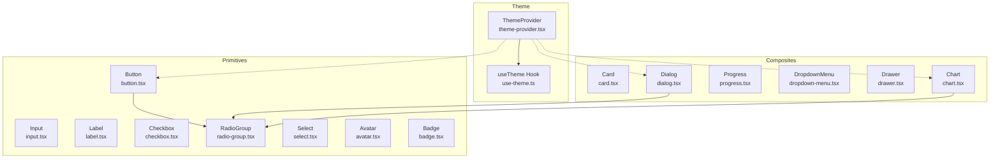
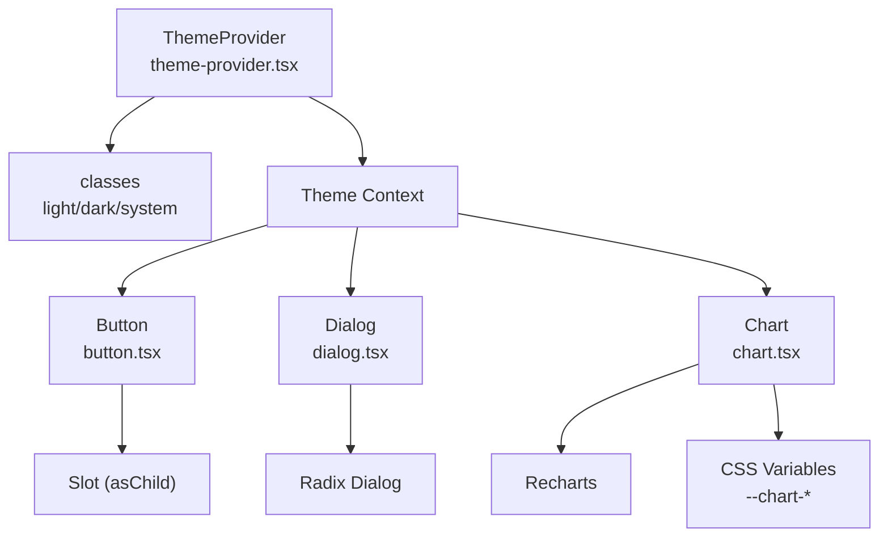
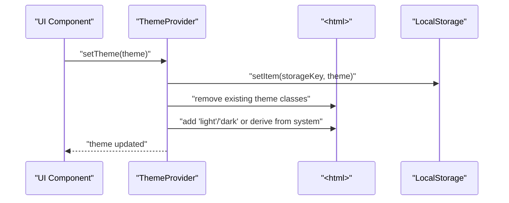
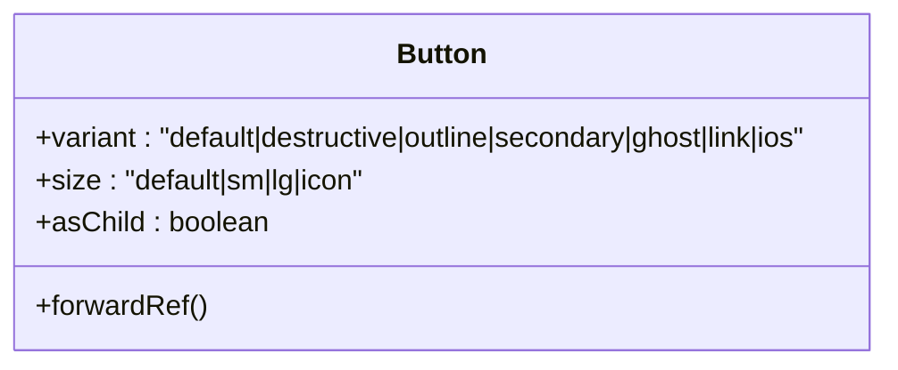
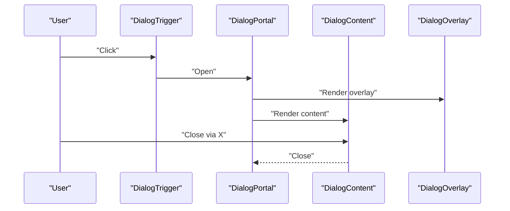
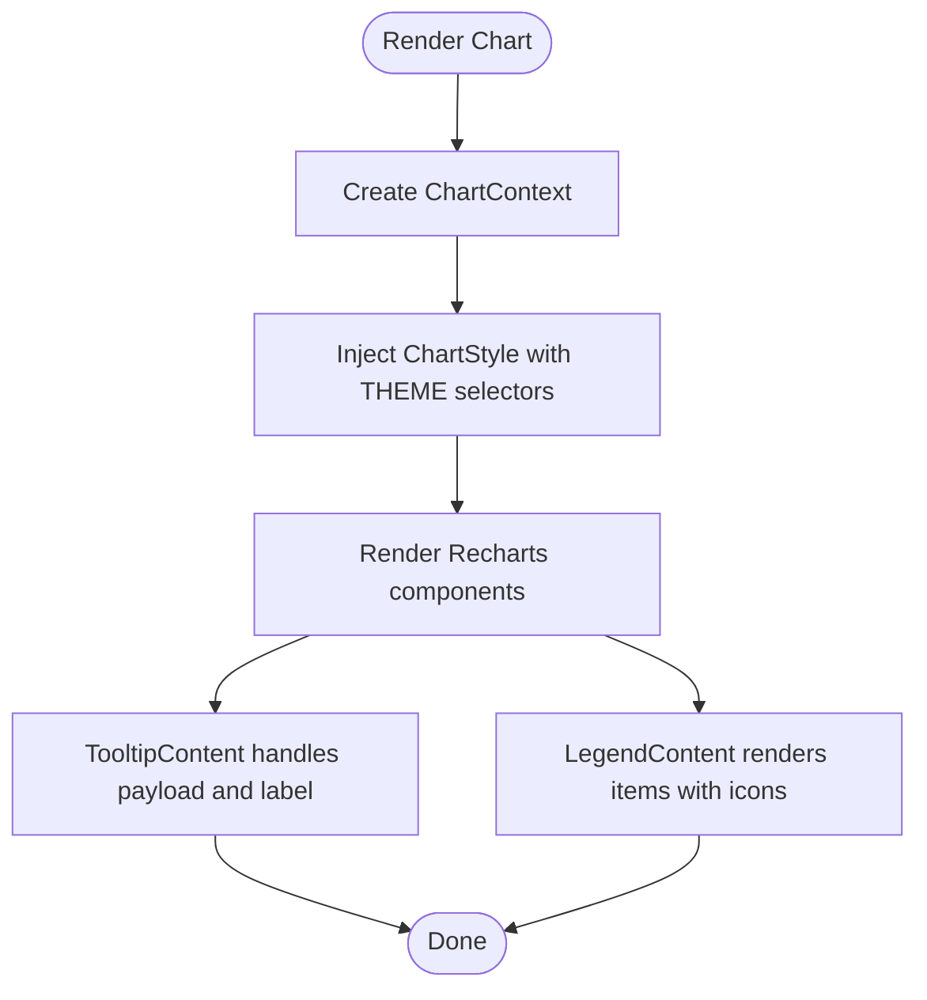
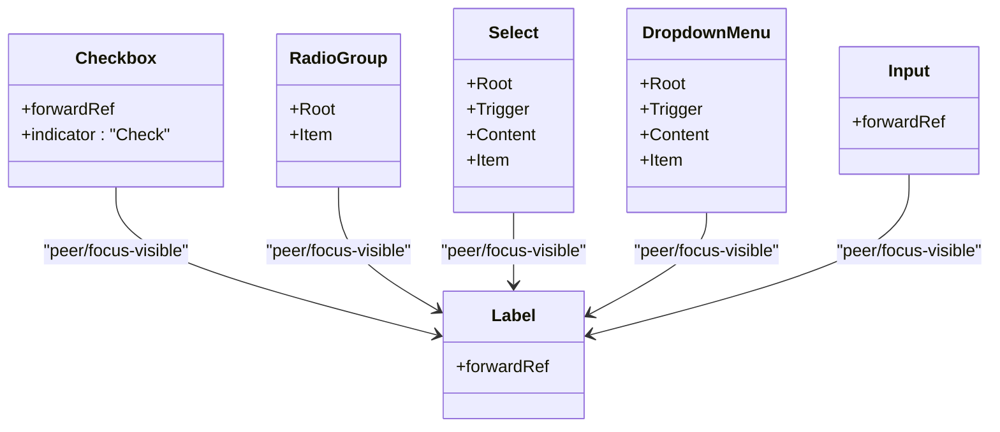
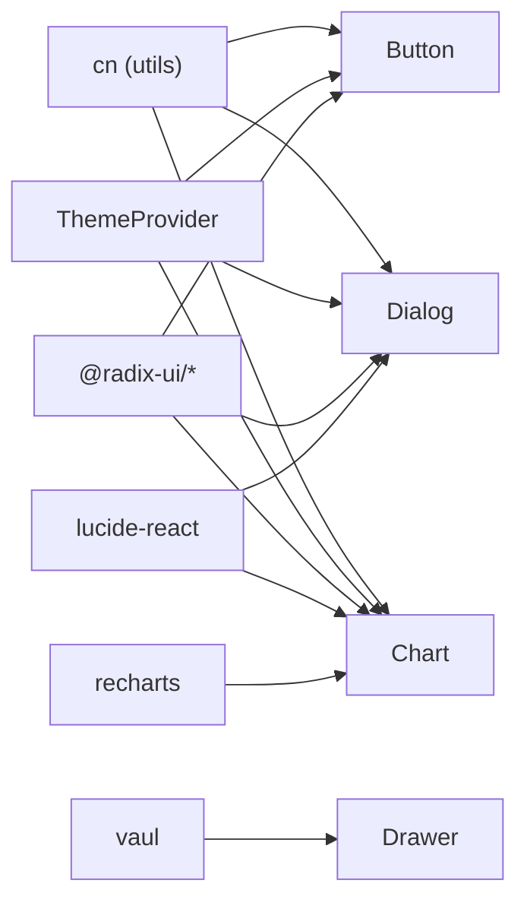

# UI Component System

<cite>
**Referenced Files in This Document**
- [button.tsx](file://src/components/ui/button.tsx)
- [card.tsx](file://src/components/ui/card.tsx)
- [dialog.tsx](file://src/components/ui/dialog.tsx)
- [input.tsx](file://src/components/ui/input.tsx)
- [chart.tsx](file://src/components/ui/chart.tsx)
- [theme-provider.tsx](file://src/components/theme-provider.tsx)
- [use-theme.ts](file://src/hooks/use-theme.ts)
- [progress.tsx](file://src/components/ui/progress.tsx)
- [avatar.tsx](file://src/components/ui/avatar.tsx)
- [badge.tsx](file://src/components/ui/badge.tsx)
- [checkbox.tsx](file://src/components/ui/checkbox.tsx)
- [drawer.tsx](file://src/components/ui/drawer.tsx)
- [dropdown-menu.tsx](file://src/components/ui/dropdown-menu.tsx)
- [label.tsx](file://src/components/ui/label.tsx)
- [radio-group.tsx](file://src/components/ui/radio-group.tsx)
- [select.tsx](file://src/components/ui/select.tsx)
</cite>

## Table of Contents
1. [Introduction](#introduction)
2. [Project Structure](#project-structure)
3. [Core Components](#core-components)
4. [Architecture Overview](#architecture-overview)
5. [Detailed Component Analysis](#detailed-component-analysis)
6. [Dependency Analysis](#dependency-analysis)
7. [Performance Considerations](#performance-considerations)
8. [Troubleshooting Guide](#troubleshooting-guide)
9. [Conclusion](#conclusion)
10. [Appendices](#appendices)

## Introduction
This document describes MatricMaster AI’s UI component system, built on Radix UI primitives with custom enhancements for an educational platform. It covers the theme system (including dark mode and system preference detection), responsive design patterns, and reusable components such as buttons, cards, dialogs, inputs, and specialized elements like charts and progress indicators. Guidance is included for composition patterns, accessibility, cross-browser compatibility, styling strategies using Tailwind CSS, state management, animations, and extending the component library while maintaining design consistency.

## Project Structure
The UI components live under src/components/ui and are organized by primitive or composite pattern. Theme management is centralized via a provider and hook. Charts integrate with Recharts and use CSS variables for theming. Responsive behavior leverages Tailwind utilities and Radix animations.

**Diagram sources**
- [theme-provider.tsx](file://src/components/theme-provider.tsx#L25-L75)
- [use-theme.ts](file://src/hooks/use-theme.ts#L1-L4)
- [button.tsx](file://src/components/ui/button.tsx#L35-L49)
- [input.tsx](file://src/components/ui/input.tsx#L5-L20)
- [label.tsx](file://src/components/ui/label.tsx#L11-L16)
- [checkbox.tsx](file://src/components/ui/checkbox.tsx#L9-L25)
- [radio-group.tsx](file://src/components/ui/radio-group.tsx#L7-L34)
- [select.tsx](file://src/components/ui/select.tsx#L7-L150)
- [avatar.tsx](file://src/components/ui/avatar.tsx#L6-L43)
- [badge.tsx](file://src/components/ui/badge.tsx#L25-L31)
- [card.tsx](file://src/components/ui/card.tsx#L5-L58)
- [dialog.tsx](file://src/components/ui/dialog.tsx#L9-L104)
- [progress.tsx](file://src/components/ui/progress.tsx#L8-L23)
- [dropdown-menu.tsx](file://src/components/ui/dropdown-menu.tsx#L7-L186)
- [drawer.tsx](file://src/components/ui/drawer.tsx#L6-L98)
- [chart.tsx](file://src/components/ui/chart.tsx#L35-L74)

**Section sources**
- [button.tsx](file://src/components/ui/button.tsx#L1-L52)
- [card.tsx](file://src/components/ui/card.tsx#L1-L59)
- [dialog.tsx](file://src/components/ui/dialog.tsx#L1-L105)
- [input.tsx](file://src/components/ui/input.tsx#L1-L23)
- [chart.tsx](file://src/components/ui/chart.tsx#L1-L354)
- [theme-provider.tsx](file://src/components/theme-provider.tsx#L1-L84)
- [use-theme.ts](file://src/hooks/use-theme.ts#L1-L4)
- [progress.tsx](file://src/components/ui/progress.tsx#L1-L26)
- [avatar.tsx](file://src/components/ui/avatar.tsx#L1-L46)
- [badge.tsx](file://src/components/ui/badge.tsx#L1-L34)
- [checkbox.tsx](file://src/components/ui/checkbox.tsx#L1-L29)
- [drawer.tsx](file://src/components/ui/drawer.tsx#L1-L99)
- [dropdown-menu.tsx](file://src/components/ui/dropdown-menu.tsx#L1-L187)
- [label.tsx](file://src/components/ui/label.tsx#L1-L20)
- [radio-group.tsx](file://src/components/ui/radio-group.tsx#L1-L37)
- [select.tsx](file://src/components/ui/select.tsx#L1-L151)

## Core Components
This section documents the primary reusable UI elements and their props, variants, and customization options.

- Button
  - Variants: default, destructive, outline, secondary, ghost, link, ios
  - Sizes: default, sm, lg, icon
  - Props: HTML button attributes, variant, size, asChild (Slot)
  - Accessibility: Inherits focus-visible ring and disabled states
  - Customization: Uses class variance authority and Tailwind utilities; supports nested SVG icons
  - Usage example path: [Button usage](file://src/components/ui/button.tsx#L41-L49)

- Card
  - Parts: Card, CardHeader, CardTitle, CardDescription, CardContent, CardFooter
  - Props: Standard HTML div attributes
  - Accessibility: No special ARIA roles; relies on semantic structure
  - Customization: Rounded corners, shadows, and spacing tailored for content grouping
  - Usage example path: [Card usage](file://src/components/ui/card.tsx#L5-L58)

- Dialog
  - Parts: Root, Portal, Overlay, Trigger, Close, Content, Header, Footer, Title, Description
  - Props: Radix Dialog primitives plus custom overlay/content classes
  - Animations: Fade and slide transitions; zoom on open/close
  - Accessibility: Focus trapping, portal rendering, close button with screen reader text
  - Usage example path: [Dialog usage](file://src/components/ui/dialog.tsx#L32-L54)

- Input
  - Props: Standard input attributes; type
  - Accessibility: Focus-visible ring, placeholder text color
  - Customization: Rounded borders, subtle shadows, responsive font sizes
  - Usage example path: [Input usage](file://src/components/ui/input.tsx#L5-L20)

- Progress
  - Props: Root accepts Radix Progress attributes; Indicator animates via transform
  - Accessibility: No explicit ARIA; suitable for learning milestones and timers
  - Usage example path: [Progress usage](file://src/components/ui/progress.tsx#L8-L23)

- Avatar
  - Parts: Root, Image, Fallback
  - Props: Radix Avatar attributes
  - Accessibility: Image alt text responsibility lies with parent; fallback visible when image fails
  - Usage example path: [Avatar usage](file://src/components/ui/avatar.tsx#L6-L43)

- Badge
  - Variants: default, secondary, destructive, outline
  - Props: HTML div attributes, variant
  - Accessibility: No special roles; text content is sufficient
  - Usage example path: [Badge usage](file://src/components/ui/badge.tsx#L25-L31)

- Checkbox
  - Props: Radix Checkbox attributes; renders check mark indicator
  - Accessibility: Focus-visible ring, disabled state, checked state styling
  - Usage example path: [Checkbox usage](file://src/components/ui/checkbox.tsx#L9-L25)

- Drawer
  - Parts: Root, Portal, Overlay, Trigger, Close, Content, Header, Footer, Title, Description
  - Props: Vaul Drawer root plus content and overlay classes
  - Accessibility: Portal rendering; handle bar for accessibility
  - Usage example path: [Drawer usage](file://src/components/ui/drawer.tsx#L6-L51)

- DropdownMenu
  - Parts: Root, Trigger, Portal, Content, Group, Sub, SubTrigger, SubContent, RadioGroup, Item, CheckboxItem, RadioItem, Label, Separator, Shortcut
  - Props: Radix primitives plus custom content and item classes
  - Animations: Fade and slide transitions
  - Accessibility: Keyboard navigation, focus management, proper labeling
  - Usage example path: [DropdownMenu usage](file://src/components/ui/dropdown-menu.tsx#L55-L72)

- Label
  - Props: Radix Label attributes; integrates with form controls
  - Accessibility: Peer-based disabled state handling
  - Usage example path: [Label usage](file://src/components/ui/label.tsx#L11-L16)

- RadioGroup
  - Parts: Root, Item
  - Props: Radix primitives plus indicator rendering
  - Accessibility: Focus-visible ring, disabled state
  - Usage example path: [RadioGroup usage](file://src/components/ui/radio-group.tsx#L7-L34)

- Select
  - Parts: Root, Group, Value, Trigger, Content, Viewport, ScrollUp/DownButtons, Label, Item, Separator
  - Props: Radix primitives plus custom trigger/content classes
  - Animations: Fade and slide transitions
  - Accessibility: Keyboard navigation, viewport sizing, scroll buttons
  - Usage example path: [Select usage](file://src/components/ui/select.tsx#L61-L91)

- Chart
  - Container: ChartContainer with dynamic CSS variables for theme-aware colors
  - Tooltip: ChartTooltipContent with configurable label/value formatting, indicator styles
  - Legend: ChartLegendContent with optional icons and alignment
  - Theming: Built-in light/dark theme scoping via CSS selectors
  - Accessibility: Recharts tooltips and legends; ensure external labeling for complex charts
  - Usage example path: [Chart usage](file://src/components/ui/chart.tsx#L35-L74)

**Section sources**
- [button.tsx](file://src/components/ui/button.tsx#L35-L51)
- [card.tsx](file://src/components/ui/card.tsx#L5-L58)
- [dialog.tsx](file://src/components/ui/dialog.tsx#L9-L104)
- [input.tsx](file://src/components/ui/input.tsx#L5-L20)
- [progress.tsx](file://src/components/ui/progress.tsx#L8-L23)
- [avatar.tsx](file://src/components/ui/avatar.tsx#L6-L43)
- [badge.tsx](file://src/components/ui/badge.tsx#L25-L31)
- [checkbox.tsx](file://src/components/ui/checkbox.tsx#L9-L25)
- [drawer.tsx](file://src/components/ui/drawer.tsx#L6-L51)
- [dropdown-menu.tsx](file://src/components/ui/dropdown-menu.tsx#L55-L72)
- [label.tsx](file://src/components/ui/label.tsx#L11-L16)
- [radio-group.tsx](file://src/components/ui/radio-group.tsx#L7-L34)
- [select.tsx](file://src/components/ui/select.tsx#L61-L91)
- [chart.tsx](file://src/components/ui/chart.tsx#L35-L74)

## Architecture Overview
MatricMaster AI’s UI architecture centers on:
- Radix UI primitives for accessibility and composability
- Tailwind CSS for styling and responsive behavior
- ThemeProvider managing theme state and DOM classes
- Recharts-based Chart components with theme-scoped CSS variables
- Composition patterns using Slot for flexible rendering

**Diagram sources**
- [theme-provider.tsx](file://src/components/theme-provider.tsx#L36-L58)
- [button.tsx](file://src/components/ui/button.tsx#L41-L49)
- [dialog.tsx](file://src/components/ui/dialog.tsx#L9-L104)
- [chart.tsx](file://src/components/ui/chart.tsx#L35-L74)

## Detailed Component Analysis

### Theme System and Dark Mode
- Provider behavior
  - Initializes to a neutral “system” to prevent hydration mismatches
  - After mount, reads storage key and applies “light” or “dark” to root
  - On “system”, queries prefers-color-scheme and sets appropriate class
  - Exposes setTheme to update storage and DOM classes
- Hook usage
  - useTheme returns current theme and setter for downstream components
- Cross-browser compatibility
  - prefers-color-scheme media query supported broadly
  - LocalStorage fallback ensures persistence across sessions

**Diagram sources**
- [theme-provider.tsx](file://src/components/theme-provider.tsx#L36-L58)
- [use-theme.ts](file://src/hooks/use-theme.ts#L1-L4)

**Section sources**
- [theme-provider.tsx](file://src/components/theme-provider.tsx#L25-L75)
- [use-theme.ts](file://src/hooks/use-theme.ts#L1-L4)

### Button Component
- Design
  - Rounded pill shapes, consistent padding, and transitions
  - Variants map to semantic roles; size variants scale padding and height
  - asChild enables composition with links or custom anchors
- Accessibility
  - Focus-visible ring and disabled pointer-events
- Animation
  - Hover and active transforms for tactile feedback

**Diagram sources**
- [button.tsx](file://src/components/ui/button.tsx#L35-L49)

**Section sources**
- [button.tsx](file://src/components/ui/button.tsx#L7-L33)

### Dialog Component
- Behavior
  - Overlay fades in/out; content slides and zooms
  - Portal renders outside normal DOM order for stacking
  - Close button with aria-label for assistive tech
- Accessibility
  - Focus trapping via Radix; Escape key support
- Composition
  - Header/Footer align differently on small vs. larger screens

**Diagram sources**
- [dialog.tsx](file://src/components/ui/dialog.tsx#L9-L54)

**Section sources**
- [dialog.tsx](file://src/components/ui/dialog.tsx#L17-L54)

### Chart Component
- Theming
  - CSS variables define per-series colors scoped by theme
  - ChartStyle injects theme-specific styles into the container
- Tooltip and Legend
  - Tooltip supports label/value formatting and custom indicators
  - Legend supports icons and vertical alignment
- Responsiveness
  - Wrapped in a responsive container

**Diagram sources**
- [chart.tsx](file://src/components/ui/chart.tsx#L35-L104)

**Section sources**
- [chart.tsx](file://src/components/ui/chart.tsx#L8-L104)

### Form Controls Composition Patterns
- Checkbox, RadioGroup, Select, DropdownMenu, Label, and Input compose around Radix primitives
- Consistent focus-visible rings and disabled states
- Icons integrated via Lucide React for visual cues

**Diagram sources**
- [checkbox.tsx](file://src/components/ui/checkbox.tsx#L9-L25)
- [radio-group.tsx](file://src/components/ui/radio-group.tsx#L7-L34)
- [select.tsx](file://src/components/ui/select.tsx#L61-L91)
- [dropdown-menu.tsx](file://src/components/ui/dropdown-menu.tsx#L55-L72)
- [label.tsx](file://src/components/ui/label.tsx#L11-L16)
- [input.tsx](file://src/components/ui/input.tsx#L5-L20)

**Section sources**
- [checkbox.tsx](file://src/components/ui/checkbox.tsx#L1-L29)
- [radio-group.tsx](file://src/components/ui/radio-group.tsx#L1-L37)
- [select.tsx](file://src/components/ui/select.tsx#L1-L151)
- [dropdown-menu.tsx](file://src/components/ui/dropdown-menu.tsx#L1-L187)
- [label.tsx](file://src/components/ui/label.tsx#L1-L20)
- [input.tsx](file://src/components/ui/input.tsx#L1-L23)

## Dependency Analysis
- Internal dependencies
  - Components import cn from shared utils for class merging
  - Chart depends on Recharts primitives and CSS variable theming
  - ThemeProvider supplies context consumed by components
- External dependencies
  - Radix UI for accessible primitives
  - Lucide React for icons
  - Vaul for Drawer behavior
  - Recharts for charting

**Diagram sources**
- [button.tsx](file://src/components/ui/button.tsx#L5-L6)
- [dialog.tsx](file://src/components/ui/dialog.tsx#L7-L8)
- [chart.tsx](file://src/components/ui/chart.tsx#L6-L7)
- [theme-provider.tsx](file://src/components/theme-provider.tsx#L3-L4)
- [drawer.tsx](file://src/components/ui/drawer.tsx#L4-L4)
- [chart.tsx](file://src/components/ui/chart.tsx#L4-L4)

**Section sources**
- [button.tsx](file://src/components/ui/button.tsx#L1-L6)
- [dialog.tsx](file://src/components/ui/dialog.tsx#L1-L8)
- [chart.tsx](file://src/components/ui/chart.tsx#L1-L7)
- [theme-provider.tsx](file://src/components/theme-provider.tsx#L1-L4)
- [drawer.tsx](file://src/components/ui/drawer.tsx#L1-L5)
- [chart.tsx](file://src/components/ui/chart.tsx#L1-L7)

## Performance Considerations
- Minimize re-renders by composing components with asChild and avoiding unnecessary wrappers
- Prefer CSS variables for theming to reduce style recalculations
- Use responsive utilities sparingly; leverage breakpoints thoughtfully
- Defer heavy chart rendering to client-only contexts
- Keep focus-visible rings and transitions subtle to avoid jank on low-end devices

## Troubleshooting Guide
- Hydration mismatch with theme
  - Ensure ThemeProvider initializes to “system” and updates after mount
  - Verify storage key consistency and that root classes are toggled correctly
- Dialog focus issues
  - Confirm Portal is wrapping Content and Overlay
  - Ensure Close button exists and is reachable via keyboard
- Chart colors not applying
  - Verify ChartContainer provides a config with color or theme entries
  - Confirm CSS variable injection occurs and theme selector matches
- Form control disabled states
  - Check peer/focus-visible classes and disabled attributes
  - Ensure labels are associated with inputs for accessibility

**Section sources**
- [theme-provider.tsx](file://src/components/theme-provider.tsx#L36-L58)
- [dialog.tsx](file://src/components/ui/dialog.tsx#L32-L54)
- [chart.tsx](file://src/components/ui/chart.tsx#L76-L104)
- [label.tsx](file://src/components/ui/label.tsx#L11-L16)

## Conclusion
MatricMaster AI’s UI system blends Radix UI primitives with thoughtful customizations, robust theming, and responsive Tailwind-driven styles. The component library emphasizes accessibility, composition, and maintainability, enabling consistent experiences across the educational platform. Extending the system follows established patterns: wrap Radix primitives, apply Tailwind classes, manage state via ThemeProvider, and keep animations and interactions predictable.

## Appendices

### Accessibility Checklist
- All interactive controls expose focus-visible rings and keyboard navigation
- Dialogs and drawers use portals and include close buttons with accessible labels
- Charts and complex widgets include external labeling and ARIA-friendly markup
- Form controls associate labels with inputs and reflect disabled states

### Cross-Browser Compatibility Notes
- prefers-color-scheme is broadly supported; ensure localStorage availability
- Radix primitives polyfill where necessary for older browsers
- Recharts requires modern browser APIs; test on target environments

### Styling Strategies with Tailwind CSS
- Use semantic color tokens (primary, secondary, destructive) consistently
- Apply rounded modifiers sparingly; favor component-level rounding for brand consistency
- Leverage responsive prefixes (sm:, md:, lg:) for adaptive layouts
- Combine class-variance-authority with Tailwind for variant-driven components

### Component State Management and Animation Patterns
- State updates via ThemeProvider/setTheme propagate to DOM classes
- Animations rely on Radix data attributes and CSS transitions
- Progress indicators animate via transform; ensure values clamp to expected ranges