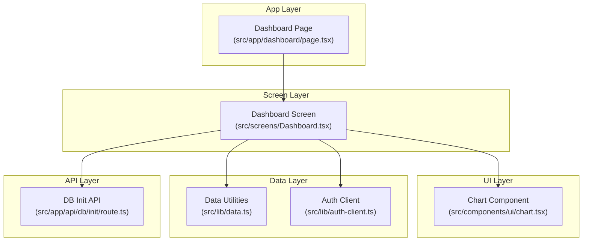
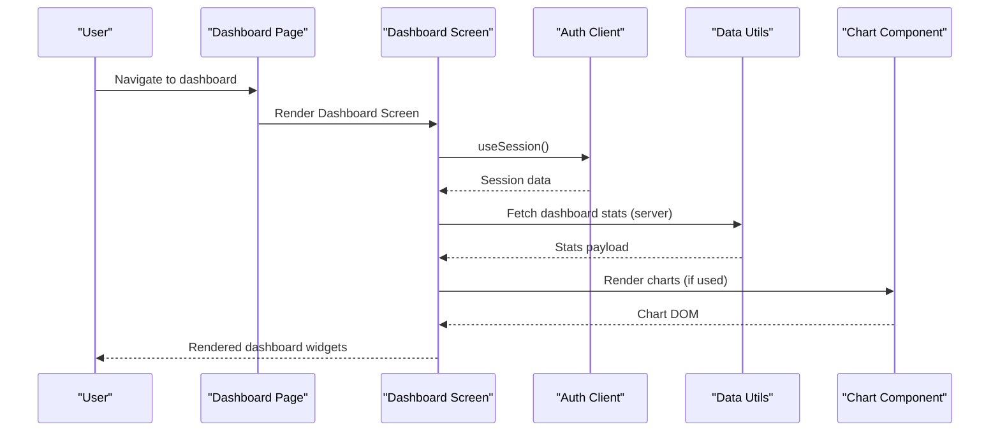
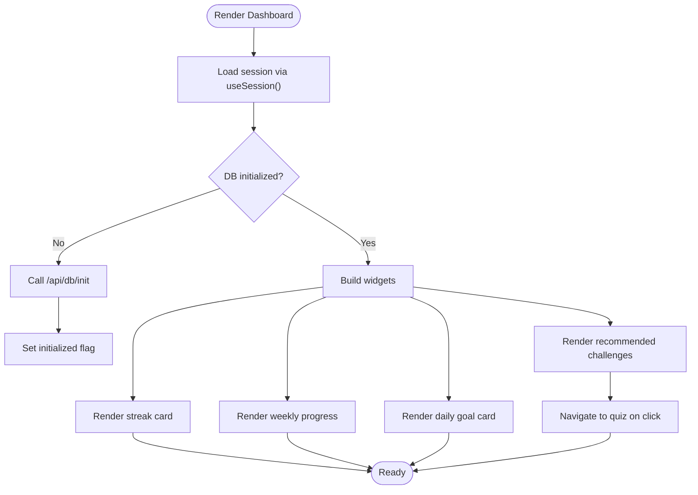
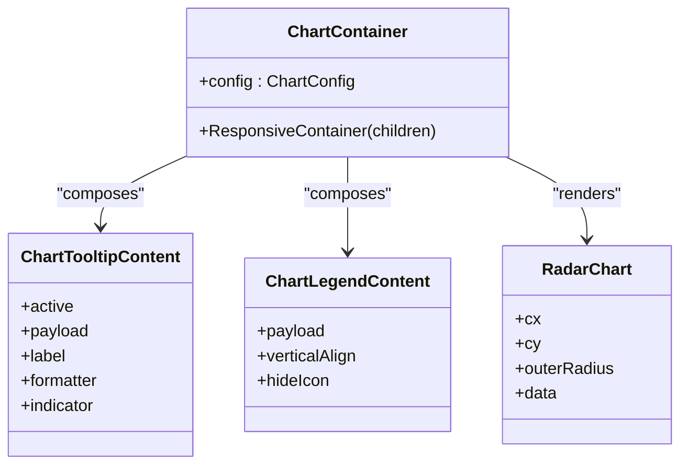
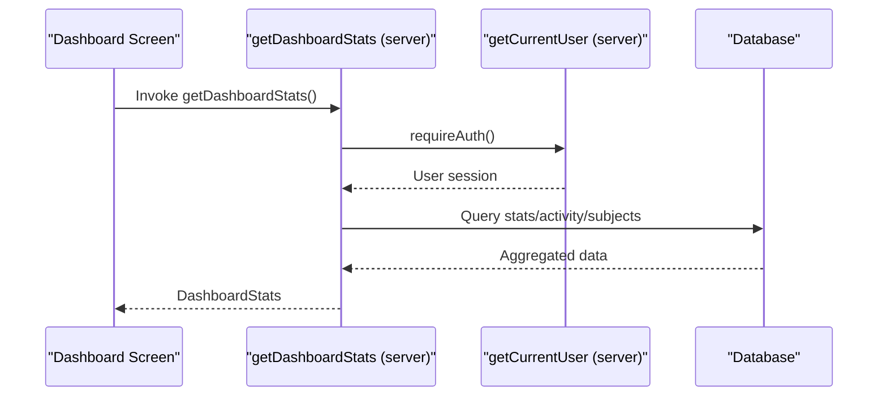
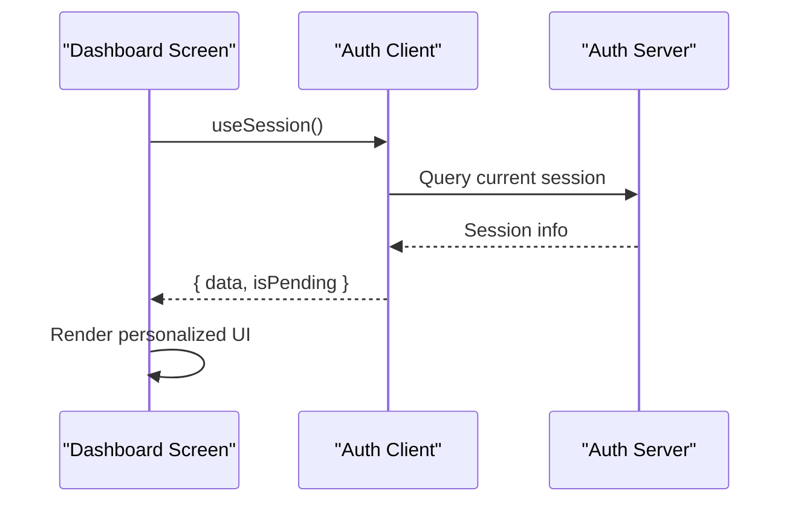
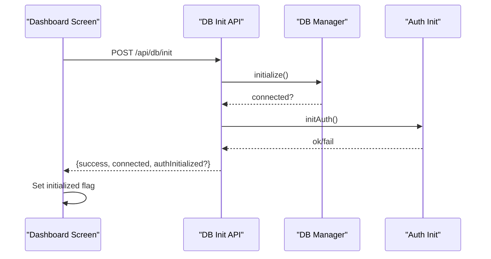
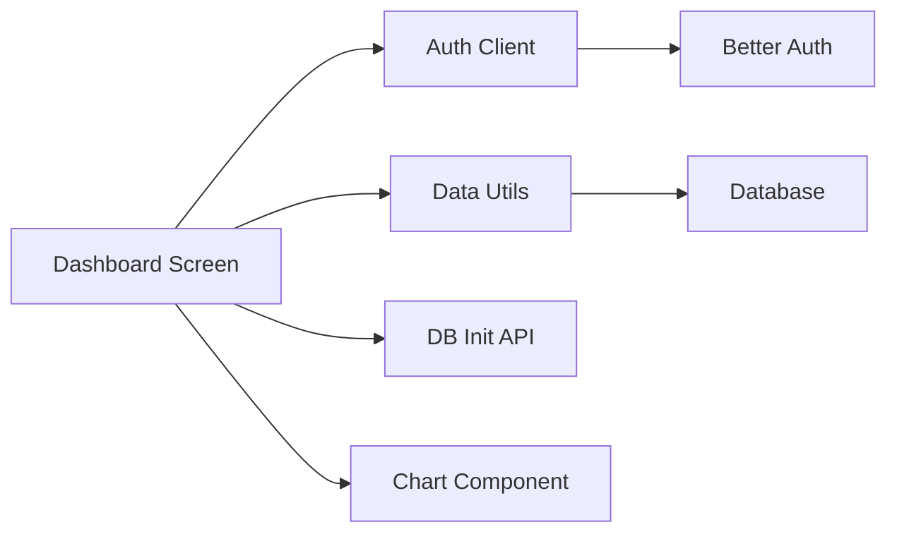

# Dashboard and Analytics

<cite>
**Referenced Files in This Document**
- [Dashboard.tsx](file://src/screens/Dashboard.tsx)
- [page.tsx](file://src/app/dashboard/page.tsx)
- [chart.tsx](file://src/components/ui/chart.tsx)
- [data.ts](file://src/lib/data.ts)
- [auth-client.ts](file://src/lib/auth-client.ts)
- [route.ts](file://src/app/api/db/init/route.ts)
- [Profile.tsx](file://src/screens/Profile.tsx)
- [index.ts](file://src/types/index.ts)
</cite>

## Table of Contents
1. [Introduction](#introduction)
2. [Project Structure](#project-structure)
3. [Core Components](#core-components)
4. [Architecture Overview](#architecture-overview)
5. [Detailed Component Analysis](#detailed-component-analysis)
6. [Dependency Analysis](#dependency-analysis)
7. [Performance Considerations](#performance-considerations)
8. [Troubleshooting Guide](#troubleshooting-guide)
9. [Conclusion](#conclusion)

## Introduction
This document describes the user dashboard and analytics system. It covers the dashboard layout with progress indicators, weekly activity, recommended challenges, and personalized content. It also documents analytics integration for academic performance trends, subject-wise progress, and comparative analysis via radar charts. The document explains data visualization components, dashboard widgets (averages, top subjects, milestones), and implementation details for data fetching, chart rendering, and real-time updates. Finally, it outlines integration with user authentication context, session management, and personalized content delivery.

## Project Structure
The dashboard is implemented as a Next.js app page backed by a screen component. Analytics visuals are built using a reusable chart component powered by Recharts. Data fetching utilities provide typed server functions for dashboard stats, user profile, subjects, and recommendations. Authentication is handled via a client wrapper around Better Auth.

**Diagram sources**
- [page.tsx](file://src/app/dashboard/page.tsx#L1-L12)
- [Dashboard.tsx](file://src/screens/Dashboard.tsx#L1-L340)
- [chart.tsx](file://src/components/ui/chart.tsx#L1-L354)
- [data.ts](file://src/lib/data.ts#L1-L504)
- [auth-client.ts](file://src/lib/auth-client.ts#L1-L10)
- [route.ts](file://src/app/api/db/init/route.ts#L1-L100)

**Section sources**
- [page.tsx](file://src/app/dashboard/page.tsx#L1-L12)
- [Dashboard.tsx](file://src/screens/Dashboard.tsx#L1-L340)
- [chart.tsx](file://src/components/ui/chart.tsx#L1-L354)
- [data.ts](file://src/lib/data.ts#L1-L504)
- [auth-client.ts](file://src/lib/auth-client.ts#L1-L10)
- [route.ts](file://src/app/api/db/init/route.ts#L1-L100)

## Core Components
- Dashboard Screen: Renders user greeting, streak flame card, weekly progress tracker, daily goal card, and recommended challenges. It initializes the database on first load and navigates to quizzes.
- Chart Component: Provides a reusable container and helpers for Recharts, including tooltips, legends, and theme-aware styling.
- Data Utilities: Expose typed server functions for dashboard stats, user profile, subjects, recent activity, and recommended content.
- Auth Client: Wraps Better Auth for client-side session management and exposes hooks for useSession.
- DB Init API: Initializes database connectivity and auth during development or controlled environments.

**Section sources**
- [Dashboard.tsx](file://src/screens/Dashboard.tsx#L61-L340)
- [chart.tsx](file://src/components/ui/chart.tsx#L1-L354)
- [data.ts](file://src/lib/data.ts#L66-L119)
- [auth-client.ts](file://src/lib/auth-client.ts#L1-L10)
- [route.ts](file://src/app/api/db/init/route.ts#L30-L92)

## Architecture Overview
The dashboard integrates client-side rendering with server-provided data. The screen component manages local state for progress and renders UI widgets. Data utilities encapsulate server actions and caching. Charts are rendered using a dedicated component that composes Recharts primitives. Authentication context is injected via a client wrapper.

**Diagram sources**
- [page.tsx](file://src/app/dashboard/page.tsx#L1-L12)
- [Dashboard.tsx](file://src/screens/Dashboard.tsx#L61-L120)
- [data.ts](file://src/lib/data.ts#L66-L79)
- [chart.tsx](file://src/components/ui/chart.tsx#L35-L73)

## Detailed Component Analysis

### Dashboard Screen
The dashboard screen orchestrates:
- User greeting and avatar with online indicator
- Streak display with dynamic message
- Weekly progress tracker with day statuses
- Daily goal card with progress bar and call-to-action
- Recommended challenges with difficulty and timing

It initializes the database via a controlled API endpoint and navigates to quizzes on user action. The screen consumes session data for personalization.

**Diagram sources**
- [Dashboard.tsx](file://src/screens/Dashboard.tsx#L61-L120)
- [route.ts](file://src/app/api/db/init/route.ts#L30-L92)

**Section sources**
- [Dashboard.tsx](file://src/screens/Dashboard.tsx#L61-L340)

### Analytics and Comparative Analysis
The analytics visualization leverages a chart component to render a radar chart for comparative performance. The chart supports:
- Theme-aware color configuration
- Tooltip and legend composition
- Gradient fills and glow effects
- Optional dashed overlay for average comparisons

**Diagram sources**
- [chart.tsx](file://src/components/ui/chart.tsx#L35-L106)
- [chart.tsx](file://src/components/ui/chart.tsx#L108-L259)
- [chart.tsx](file://src/components/ui/chart.tsx#L263-L316)

**Section sources**
- [chart.tsx](file://src/components/ui/chart.tsx#L1-L354)
- [Profile.tsx](file://src/screens/Profile.tsx#L128-L207)

### Data Fetching and Personalized Content
Server functions provide typed data for:
- Dashboard statistics (totals, accuracy, streak, recent activity, subjects)
- User profile (stats aggregation)
- Subjects and questions
- Recent activity and recommendations

These functions are cached and protected by authentication checks. Recommendations combine subjects and sampled questions.

**Diagram sources**
- [Dashboard.tsx](file://src/screens/Dashboard.tsx#L61-L120)
- [data.ts](file://src/lib/data.ts#L66-L79)
- [data.ts](file://src/lib/data.ts#L15-L35)

**Section sources**
- [data.ts](file://src/lib/data.ts#L66-L119)
- [data.ts](file://src/lib/data.ts#L130-L146)
- [data.ts](file://src/lib/data.ts#L487-L503)

### Authentication and Session Management
The auth client wraps Better Auth for client-side operations and exposes:
- signIn, signUp, signOut
- useSession hook for reactive session state

The dashboard screen uses useSession to personalize the greeting and avatar. The server utilities enforce authentication for protected data.

**Diagram sources**
- [Dashboard.tsx](file://src/screens/Dashboard.tsx#L61-L64)
- [auth-client.ts](file://src/lib/auth-client.ts#L1-L10)

**Section sources**
- [auth-client.ts](file://src/lib/auth-client.ts#L1-L10)
- [data.ts](file://src/lib/data.ts#L15-L35)

### Database Initialization
The dashboard triggers a controlled initialization of the database and auth stack via an internal API. Authorization checks allow localhost or a shared secret header. On success, the UI sets an internal flag to avoid repeated initialization.

**Diagram sources**
- [Dashboard.tsx](file://src/screens/Dashboard.tsx#L70-L89)
- [route.ts](file://src/app/api/db/init/route.ts#L30-L92)

**Section sources**
- [Dashboard.tsx](file://src/screens/Dashboard.tsx#L70-L89)
- [route.ts](file://src/app/api/db/init/route.ts#L30-L92)

## Dependency Analysis
The dashboard depends on:
- Auth client for session state
- Data utilities for server-provided stats and recommendations
- Chart component for analytics visualization
- DB init API for environment bootstrap

**Diagram sources**
- [Dashboard.tsx](file://src/screens/Dashboard.tsx#L21-L21)
- [data.ts](file://src/lib/data.ts#L1-L10)
- [auth-client.ts](file://src/lib/auth-client.ts#L1-L10)
- [route.ts](file://src/app/api/db/init/route.ts#L1-L4)

**Section sources**
- [Dashboard.tsx](file://src/screens/Dashboard.tsx#L1-L340)
- [data.ts](file://src/lib/data.ts#L1-L504)
- [auth-client.ts](file://src/lib/auth-client.ts#L1-L10)
- [route.ts](file://src/app/api/db/init/route.ts#L1-L100)

## Performance Considerations
- Use server caching for data utilities to reduce redundant queries and improve responsiveness.
- Defer heavy computations to server functions and keep client components lean.
- Lazy-load recommendation lists and charts to minimize initial bundle size.
- Use responsive chart containers to adapt to varying screen sizes without reflows.
- Avoid unnecessary re-renders by structuring state updates and memoization appropriately.

## Troubleshooting Guide
Common issues and resolutions:
- Unauthorized DB init: Ensure the request originates from localhost or includes the required internal API key header.
- Session not available: Verify Better Auth cookies/session and that server-side requireAuth redirects unauthenticated users to sign-in.
- Chart rendering anomalies: Confirm ChartContainer receives a valid config and that Recharts components are mounted within it.
- Missing data: Check server functions for proper error handling and default structures while implementing backend tables.

**Section sources**
- [route.ts](file://src/app/api/db/init/route.ts#L6-L28)
- [data.ts](file://src/lib/data.ts#L27-L35)
- [chart.tsx](file://src/components/ui/chart.tsx#L23-L33)

## Conclusion
The dashboard and analytics system combines a clean UI with robust data utilities and a flexible charting layer. It personalizes the experience through session-aware rendering, initializes the environment safely, and prepares the foundation for richer analytics and recommendations as backend tables are implemented.