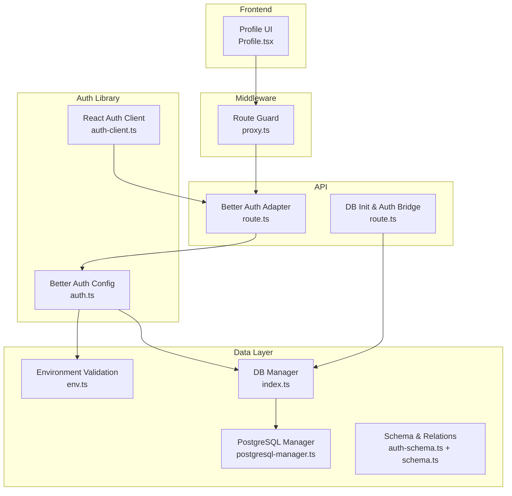
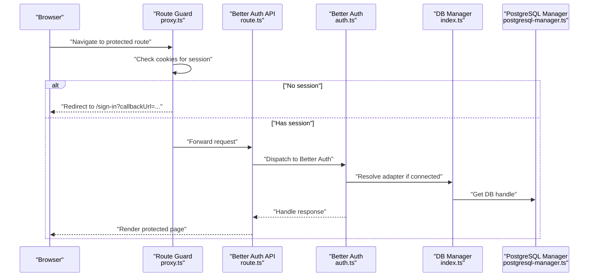
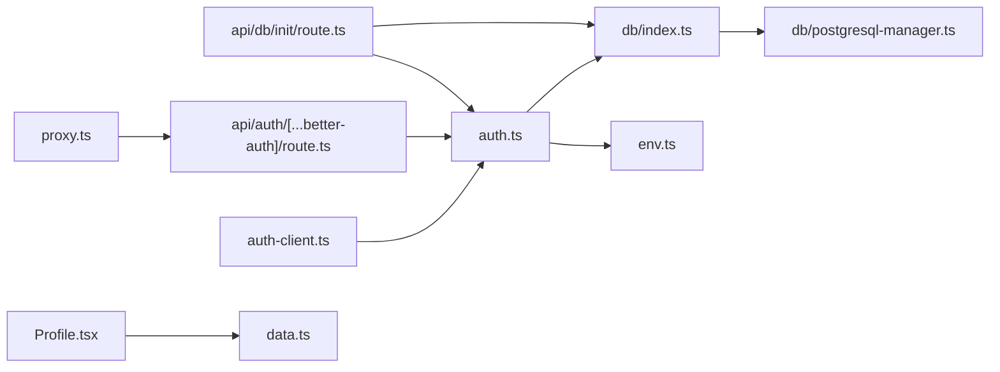

# Data Privacy and Security

<cite>
**Referenced Files in This Document**
- [auth.ts](file://src/lib/auth.ts)
- [auth-client.ts](file://src/lib/auth-client.ts)
- [auth-schema.ts](file://auth-schema.ts)
- [route.ts](file://src/app/api/auth/[...better-auth]/route.ts)
- [route.ts](file://src/app/api/db/init/route.ts)
- [index.ts](file://src/lib/db/index.ts)
- [postgresql-manager.ts](file://src/lib/db/postgresql-manager.ts)
- [env.ts](file://src/lib/env.ts)
- [proxy.ts](file://src/proxy.ts)
- [Profile.tsx](file://src/screens/Profile.tsx)
- [page.tsx](file://src/app/profile/page.tsx)
- [data.ts](file://src/lib/data.ts)
- [index.ts](file://src/lib/db/schema.ts)
- [package.json](file://package.json)
</cite>

## Table of Contents
1. [Introduction](#introduction)
2. [Project Structure](#project-structure)
3. [Core Components](#core-components)
4. [Architecture Overview](#architecture-overview)
5. [Detailed Component Analysis](#detailed-component-analysis)
6. [Dependency Analysis](#dependency-analysis)
7. [Performance Considerations](#performance-considerations)
8. [Troubleshooting Guide](#troubleshooting-guide)
9. [Conclusion](#conclusion)
10. [Appendices](#appendices)

## Introduction
This document explains the data privacy and security measures implemented for user management in the platform. It covers authentication and session handling, consent and privacy controls, data protection during transmission and storage, access control, audit-related fields, and user rights support surfaces. Where the codebase does not yet implement specific privacy features (such as explicit consent banners, data deletion workflows, or granular visibility settings), this document highlights those gaps and provides recommended approaches aligned with GDPR and similar frameworks.

## Project Structure
The privacy and security surface spans several layers:
- Authentication and session management via Better Auth
- Environment validation and secrets handling
- Database connectivity and schema for user/session/account data
- Request routing and middleware-like enforcement for protected routes
- UI surfaces for profile and stats display

**Diagram sources**
- [proxy.ts](file://src/proxy.ts#L1-L39)
- [route.ts](file://src/app/api/auth/[...better-auth]/route.ts#L1-L5)
- [route.ts](file://src/app/api/db/init/route.ts#L1-L100)
- [auth.ts](file://src/lib/auth.ts#L1-L103)
- [auth-client.ts](file://src/lib/auth-client.ts#L1-L10)
- [env.ts](file://src/lib/env.ts#L1-L62)
- [index.ts](file://src/lib/db/index.ts#L1-L102)
- [postgresql-manager.ts](file://src/lib/db/postgresql-manager.ts#L1-L162)
- [auth-schema.ts](file://auth-schema.ts#L1-L95)
- [index.ts](file://src/lib/db/schema.ts#L1-L50)
- [Profile.tsx](file://src/screens/Profile.tsx#L1-L284)

**Section sources**
- [auth.ts](file://src/lib/auth.ts#L1-L103)
- [auth-client.ts](file://src/lib/auth-client.ts#L1-L10)
- [auth-schema.ts](file://auth-schema.ts#L1-L95)
- [route.ts](file://src/app/api/auth/[...better-auth]/route.ts#L1-L5)
- [route.ts](file://src/app/api/db/init/route.ts#L1-L100)
- [index.ts](file://src/lib/db/index.ts#L1-L102)
- [postgresql-manager.ts](file://src/lib/db/postgresql-manager.ts#L1-L162)
- [env.ts](file://src/lib/env.ts#L1-L62)
- [proxy.ts](file://src/proxy.ts#L1-L39)
- [Profile.tsx](file://src/screens/Profile.tsx#L1-L284)
- [page.tsx](file://src/app/profile/page.tsx#L1-L12)
- [index.ts](file://src/lib/db/schema.ts#L1-L50)

## Core Components
- Authentication and session management: Better Auth configured with email/password and optional social providers, anonymous plugin, and session expiration policy.
- Database connectivity and schema: Drizzle ORM with PostgreSQL adapter; schema includes user, session, account, and verification tables.
- Environment validation: Zod-based validation for secrets and URLs; graceful defaults in development.
- Route protection: Middleware-like proxy checks cookies and redirects unauthenticated users to sign-in.
- Client-side auth client: React client for Better Auth with anonymous plugin.

Key privacy-relevant observations:
- Session persistence depends on database availability; absence of DB disables persistence.
- No explicit email verification requirement is enforced in configuration.
- Consent banner or opt-in UI for analytics/social features is not present in the codebase.
- Data deletion endpoints or user-controlled visibility toggles are not implemented yet.

**Section sources**
- [auth.ts](file://src/lib/auth.ts#L48-L69)
- [auth-schema.ts](file://auth-schema.ts#L4-L95)
- [index.ts](file://src/lib/db/index.ts#L24-L57)
- [env.ts](file://src/lib/env.ts#L3-L13)
- [proxy.ts](file://src/proxy.ts#L24-L39)
- [auth-client.ts](file://src/lib/auth-client.ts#L1-L10)

## Architecture Overview
The authentication flow integrates frontend and backend:

**Diagram sources**
- [proxy.ts](file://src/proxy.ts#L24-L39)
- [route.ts](file://src/app/api/auth/[...better-auth]/route.ts#L1-L5)
- [auth.ts](file://src/lib/auth.ts#L97-L103)
- [index.ts](file://src/lib/db/index.ts#L48-L57)
- [postgresql-manager.ts](file://src/lib/db/postgresql-manager.ts#L110-L122)

## Detailed Component Analysis

### Authentication and Session Management
- Configuration enables email/password sign-in and optional social providers (Google, Twitter). Sessions expire after seven days with daily updates.
- Anonymous plugin is enabled, allowing anonymous sessions.
- Trusted origins include the public app URL; base URL resolves from environment variables.
- Database adapter is conditionally attached when DB is available; otherwise, sessions are not persisted.

Privacy and security implications:
- Session lifetime and update age balance convenience and risk.
- Missing email verification setting means no mandatory verification step is enforced by default.
- No explicit consent banner for analytics or social features is present in the codebase.

Recommended enhancements aligned with GDPR:
- Add a consent banner for analytics and social features with granular opt-in/opt-out.
- Implement email verification requirement toggle and re-verification workflows.
- Provide a “delete my account” endpoint with data erasure and confirmation.

**Section sources**
- [auth.ts](file://src/lib/auth.ts#L48-L69)
- [auth.ts](file://src/lib/auth.ts#L9-L21)
- [auth.ts](file://src/lib/auth.ts#L40-L46)
- [auth-client.ts](file://src/lib/auth-client.ts#L1-L10)

### Database Connectivity and Schema
- PostgreSQL manager supports connection pooling, timeouts, and SSL detection for specific providers.
- Drizzle adapter is used when DB is connected; otherwise, Better Auth runs without persistent sessions.
- Schema defines user, session, account, and verification tables with timestamps and foreign keys.

Security and privacy notes:
- IP address and user agent are stored in the session table; consider whether this is necessary for your privacy model.
- Cascading deletes on user/session/account ensure referential integrity.

**Section sources**
- [postgresql-manager.ts](file://src/lib/db/postgresql-manager.ts#L52-L87)
- [postgresql-manager.ts](file://src/lib/db/postgresql-manager.ts#L110-L122)
- [index.ts](file://src/lib/db/index.ts#L24-L57)
- [auth-schema.ts](file://auth-schema.ts#L18-L35)
- [auth-schema.ts](file://auth-schema.ts#L37-L59)
- [auth-schema.ts](file://auth-schema.ts#L61-L75)
- [index.ts](file://src/lib/db/schema.ts#L25-L27)

### Environment Validation and Secrets
- Zod schema validates environment variables, including database URL, app URL, Better Auth secret, and provider credentials.
- In production, invalid env triggers failure; in development, defaults are applied with warnings.

Recommendations:
- Enforce minimum secret length for Better Auth secret.
- Add validation for allowed trusted origins and enforce HTTPS in production.

**Section sources**
- [env.ts](file://src/lib/env.ts#L3-L13)
- [env.ts](file://src/lib/env.ts#L19-L45)

### Route Protection and Access Control
- A proxy checks for Better Auth session cookies and redirects unauthenticated users to sign-in with a callback URL.
- Public routes include sign-in, sign-up, forgot-password, and auth endpoints.

Privacy note:
- The proxy does not enforce granular permissions beyond session presence; role-based access control would need additional implementation.

**Section sources**
- [proxy.ts](file://src/proxy.ts#L4-L22)
- [proxy.ts](file://src/proxy.ts#L24-L39)

### Secure Data Transmission and Encryption Practices
- SSL is automatically enabled for connections to specific providers detected via connection string.
- Environment variables are validated centrally; secrets are not logged.

Recommendations:
- Enforce HTTPS for all environments and redirect HTTP to HTTPS.
- Consider encrypting sensitive fields at rest if storing tokens or PII beyond session lifecycle.

**Section sources**
- [postgresql-manager.ts](file://src/lib/db/postgresql-manager.ts#L55-L65)

### Audit Trail and Retention
- Session and account tables include created/updated timestamps suitable for basic audit logging.
- No explicit retention policy is implemented in code; consider adding scheduled cleanup jobs.

Recommendations:
- Implement configurable retention windows for sessions, logs, and verification codes.
- Add audit events for sensitive actions (password change, account deletion).

**Section sources**
- [auth-schema.ts](file://auth-schema.ts#L10-L15)
- [auth-schema.ts](file://auth-schema.ts#L21-L35)
- [auth-schema.ts](file://auth-schema.ts#L37-L59)

### User Rights and Controls
- Profile UI displays user stats and achievements; no explicit privacy controls (e.g., visibility toggles) are implemented.
- Data fetching functions require authentication for protected views.

Recommendations:
- Add user preferences for profile visibility, activity visibility, and communication opt-outs.
- Implement data portability and erasure endpoints with confirmation flows.

**Section sources**
- [Profile.tsx](file://src/screens/Profile.tsx#L50-L284)
- [data.ts](file://src/lib/data.ts#L66-L79)

### Social Features and Achievement Sharing
- The profile screen showcases achievements visually; no explicit sharing controls are present.
- Consider adding opt-out for public leaderboards or achievement visibility.

**Section sources**
- [Profile.tsx](file://src/screens/Profile.tsx#L209-L240)

## Dependency Analysis

**Diagram sources**
- [auth.ts](file://src/lib/auth.ts#L1-L103)
- [index.ts](file://src/lib/db/index.ts#L1-L102)
- [env.ts](file://src/lib/env.ts#L1-L62)
- [auth-client.ts](file://src/lib/auth-client.ts#L1-L10)
- [route.ts](file://src/app/api/auth/[...better-auth]/route.ts#L1-L5)
- [route.ts](file://src/app/api/db/init/route.ts#L1-L100)
- [postgresql-manager.ts](file://src/lib/db/postgresql-manager.ts#L1-L162)
- [proxy.ts](file://src/proxy.ts#L1-L39)
- [Profile.tsx](file://src/screens/Profile.tsx#L1-L284)
- [data.ts](file://src/lib/data.ts#L1-L119)

**Section sources**
- [auth.ts](file://src/lib/auth.ts#L1-L103)
- [index.ts](file://src/lib/db/index.ts#L1-L102)
- [env.ts](file://src/lib/env.ts#L1-L62)
- [auth-client.ts](file://src/lib/auth-client.ts#L1-L10)
- [route.ts](file://src/app/api/auth/[...better-auth]/route.ts#L1-L5)
- [route.ts](file://src/app/api/db/init/route.ts#L1-L100)
- [postgresql-manager.ts](file://src/lib/db/postgresql-manager.ts#L1-L162)
- [proxy.ts](file://src/proxy.ts#L1-L39)
- [Profile.tsx](file://src/screens/Profile.tsx#L1-L284)
- [data.ts](file://src/lib/data.ts#L1-L119)

## Performance Considerations
- Session expiration and update intervals balance security and performance; adjust based on threat model.
- Database connection pooling and timeouts reduce latency and resource contention.
- Centralized environment validation prevents runtime failures and improves reliability.

[No sources needed since this section provides general guidance]

## Troubleshooting Guide
Common issues and resolutions:
- Database not connected: Initialization API returns success/failure; Better Auth falls back to non-persistent sessions.
- Invalid environment variables: Validation fails in production; development uses defaults with warnings.
- Missing session cookies: Proxy redirects to sign-in; ensure cookies are set and SameSite/Lax policies align with app deployment.

**Section sources**
- [route.ts](file://src/app/api/db/init/route.ts#L30-L91)
- [env.ts](file://src/lib/env.ts#L24-L45)
- [proxy.ts](file://src/proxy.ts#L32-L39)

## Conclusion
The platform implements a robust foundation for user authentication and session management with Better Auth, secure database connectivity, and environment validation. Privacy and security can be strengthened by adding consent management, data deletion workflows, granular visibility controls, and stricter retention policies. The current architecture supports incremental enhancements to meet GDPR and similar compliance needs.

[No sources needed since this section summarizes without analyzing specific files]

## Appendices

### Data Protection Compliance Checklist
- Consent management: Add consent banner and granular opt-in/opt-out for analytics/social features.
- Data minimization: Limit collection of IP address and user agent in sessions if not required.
- Right to erasure: Implement delete-account endpoint with confirmation and data removal.
- Data portability: Provide export of personal data upon request.
- Privacy by design: Enforce HTTPS, validate trusted origins, and encrypt sensitive fields at rest.

[No sources needed since this section provides general guidance]