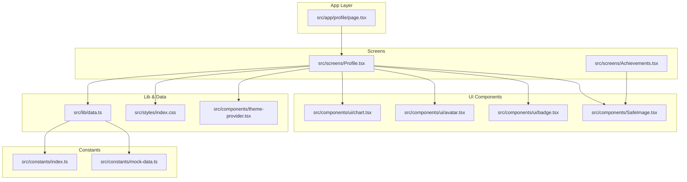
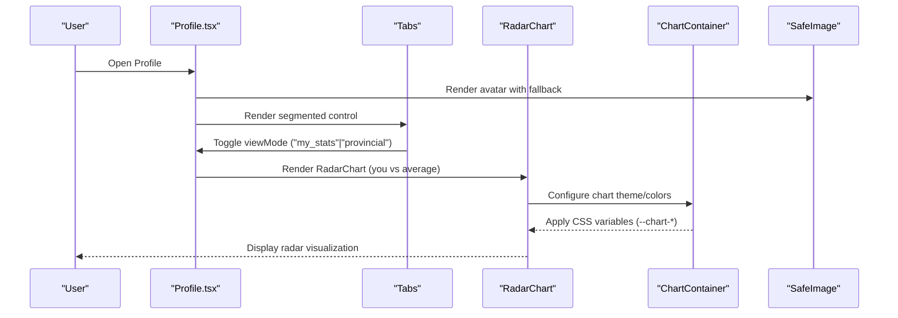
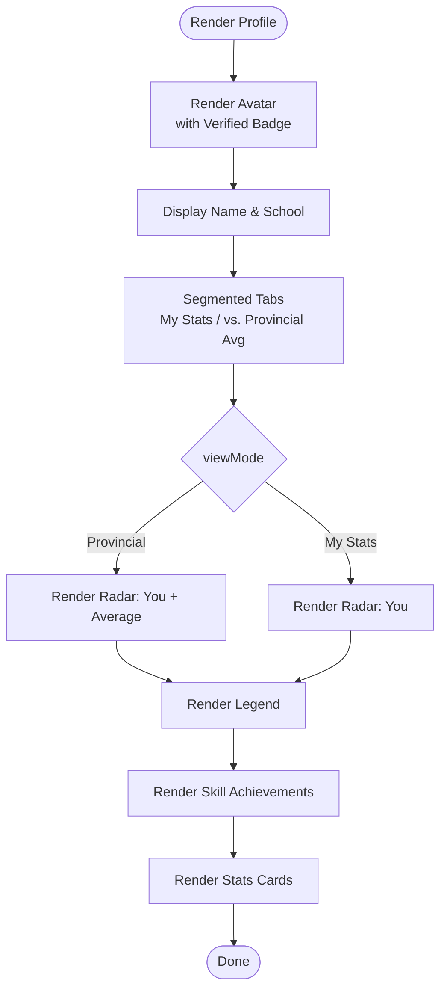
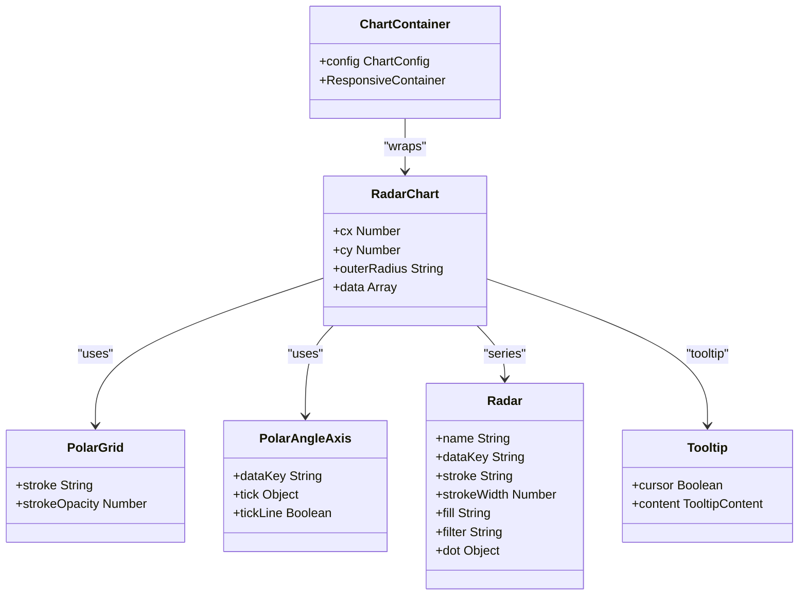
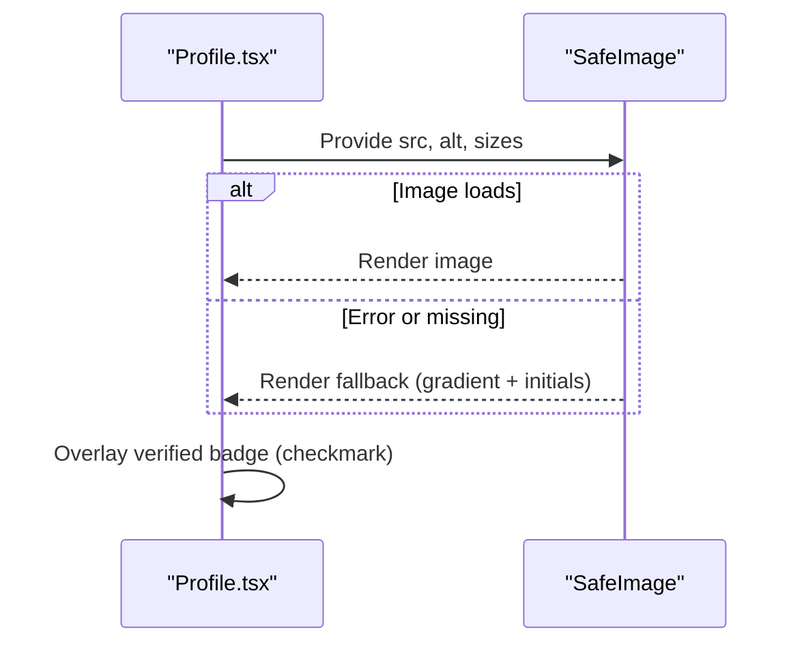
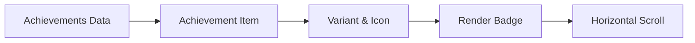
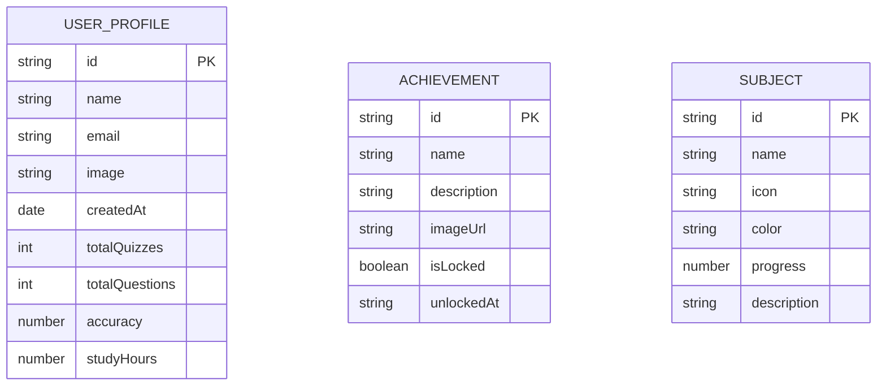
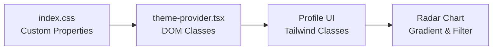
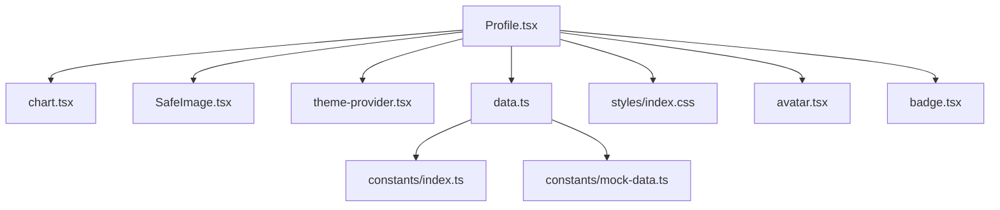

# Profile Management

<cite>
**Referenced Files in This Document**
- [Profile.tsx](file://src/screens/Profile.tsx)
- [page.tsx](file://src/app/profile/page.tsx)
- [chart.tsx](file://src/components/ui/chart.tsx)
- [SafeImage.tsx](file://src/components/SafeImage.tsx)
- [avatar.tsx](file://src/components/ui/avatar.tsx)
- [badge.tsx](file://src/components/ui/badge.tsx)
- [data.ts](file://src/lib/data.ts)
- [index.css](file://src/styles/index.css)
- [theme-provider.tsx](file://src/components/theme-provider.tsx)
- [layout.tsx](file://src/app/layout.tsx)
- [Achievements.tsx](file://src/screens/Achievements.tsx)
- [index.ts](file://src/constants/index.ts)
- [mock-data.ts](file://src/constants/mock-data.ts)
</cite>

## Table of Contents
1. [Introduction](#introduction)
2. [Project Structure](#project-structure)
3. [Core Components](#core-components)
4. [Architecture Overview](#architecture-overview)
5. [Detailed Component Analysis](#detailed-component-analysis)
6. [Dependency Analysis](#dependency-analysis)
7. [Performance Considerations](#performance-considerations)
8. [Troubleshooting Guide](#troubleshooting-guide)
9. [Conclusion](#conclusion)
10. [Appendices](#appendices)

## Introduction
This document describes the user profile management system, focusing on the profile page implementation, avatar display, user information presentation, verification badges, statistics visualization via radar charts, achievement system integration, tabbed interface for switching views, and supporting infrastructure for image handling, gradients, and responsive design. It also outlines data models for performance metrics and achievements, along with customization and validation patterns.

## Project Structure
The profile feature is composed of:
- A Next.js app route that renders the profile screen
- A client-side screen component implementing the UI and interactions
- Shared UI primitives for charts, avatars, and badges
- Utilities for safe image rendering and theme management
- Data utilities for user profile and achievements
- Constants and mock data for subjects and achievements

**Diagram sources**
- [page.tsx](file://src/app/profile/page.tsx#L1-L12)
- [Profile.tsx](file://src/screens/Profile.tsx#L1-L284)
- [chart.tsx](file://src/components/ui/chart.tsx#L1-L354)
- [SafeImage.tsx](file://src/components/SafeImage.tsx#L1-L91)
- [avatar.tsx](file://src/components/ui/avatar.tsx#L1-L46)
- [badge.tsx](file://src/components/ui/badge.tsx#L1-L34)
- [data.ts](file://src/lib/data.ts#L85-L119)
- [index.css](file://src/styles/index.css#L30-L165)
- [theme-provider.tsx](file://src/components/theme-provider.tsx#L1-L84)
- [Achievements.tsx](file://src/screens/Achievements.tsx#L1-L250)
- [index.ts](file://src/constants/index.ts#L38-L73)
- [mock-data.ts](file://src/constants/mock-data.ts#L1-L46)

**Section sources**
- [page.tsx](file://src/app/profile/page.tsx#L1-L12)
- [Profile.tsx](file://src/screens/Profile.tsx#L1-L284)

## Core Components
- Profile screen: Implements avatar display, user info, verification badge, tabbed interface, radar chart visualization, achievement badges, and summary cards.
- Chart utilities: Provides a configurable chart container, tooltip, and legend tailored for Recharts.
- Safe image: Robust image rendering with fallbacks and error handling.
- Theme provider: Manages theme persistence and DOM class updates.
- Data utilities: Define user profile and achievement data models and provide server-side helpers.

**Section sources**
- [Profile.tsx](file://src/screens/Profile.tsx#L50-L283)
- [chart.tsx](file://src/components/ui/chart.tsx#L35-L353)
- [SafeImage.tsx](file://src/components/SafeImage.tsx#L18-L90)
- [theme-provider.tsx](file://src/components/theme-provider.tsx#L25-L75)
- [data.ts](file://src/lib/data.ts#L85-L119)

## Architecture Overview
The profile page composes reusable UI components and chart primitives to present academic performance and achievements. It uses:
- Client-side state for view toggling
- Recharts for radar visualization
- SafeImage for resilient avatar rendering
- Theme provider for light/dark/system modes
- CSS custom properties for brand and subject colors

**Diagram sources**
- [Profile.tsx](file://src/screens/Profile.tsx#L50-L180)
- [chart.tsx](file://src/components/ui/chart.tsx#L35-L104)
- [SafeImage.tsx](file://src/components/SafeImage.tsx#L18-L90)

## Detailed Component Analysis

### Profile Screen
Responsibilities:
- Avatar display with verification badge overlay
- User information header
- Tabbed interface for “My Stats” and “vs. Provincial Avg”
- Radar chart for academic performance comparison
- Achievement badges display
- Summary statistics cards

Key implementation details:
- View mode state toggles between personal stats and comparative analysis.
- Radar chart uses a linear gradient fill and a glow filter for visual emphasis.
- Achievements are rendered as colored badges with icons and labels.
- Stats cards present overall average and top subject.

**Diagram sources**
- [Profile.tsx](file://src/screens/Profile.tsx#L50-L277)

**Section sources**
- [Profile.tsx](file://src/screens/Profile.tsx#L50-L283)

### Radar Chart Configuration
The chart displays subject-wise scores and optional provincial averages. It leverages:
- ChartContainer for theme-aware color variables
- PolarGrid, PolarAngleAxis, and Radar series
- Tooltip and legend integration
- Gradient fill and filter effects for visual polish

**Diagram sources**
- [chart.tsx](file://src/components/ui/chart.tsx#L35-L259)
- [Profile.tsx](file://src/screens/Profile.tsx#L129-L180)

**Section sources**
- [chart.tsx](file://src/components/ui/chart.tsx#L8-L353)
- [Profile.tsx](file://src/screens/Profile.tsx#L129-L180)

### Avatar and Verification Badge
- Avatar is displayed with a thick border and a verification badge positioned at the bottom-right.
- SafeImage ensures graceful fallbacks for missing or broken avatar URLs.
- The badge is a vector checkmark inside a colored circle.

**Diagram sources**
- [Profile.tsx](file://src/screens/Profile.tsx#L66-L93)
- [SafeImage.tsx](file://src/components/SafeImage.tsx#L18-L90)

**Section sources**
- [Profile.tsx](file://src/screens/Profile.tsx#L66-L93)
- [SafeImage.tsx](file://src/components/SafeImage.tsx#L18-L90)

### Achievement System Integration
- Skill achievements are presented as horizontal scrolling badges with icons and labels.
- Each achievement defines a variant (e.g., blue/purple) and an icon component.
- The achievements screen demonstrates mastery level, progress bar, and category filtering.

**Diagram sources**
- [Profile.tsx](file://src/screens/Profile.tsx#L37-L48)
- [Achievements.tsx](file://src/screens/Achievements.tsx#L96-L249)

**Section sources**
- [Profile.tsx](file://src/screens/Profile.tsx#L209-L240)
- [Achievements.tsx](file://src/screens/Achievements.tsx#L96-L249)

### Data Models and Mock Data
- User profile model includes identity, contact, avatar, join date, and stats.
- Achievement model includes identifiers, name, description, unlock status, and optional image.
- Mock data includes subjects with icons, colors, and paths.

**Diagram sources**
- [data.ts](file://src/lib/data.ts#L85-L119)
- [index.ts](file://src/constants/index.ts#L38-L73)
- [mock-data.ts](file://src/constants/mock-data.ts#L1-L46)

**Section sources**
- [data.ts](file://src/lib/data.ts#L85-L119)
- [index.ts](file://src/constants/index.ts#L38-L73)
- [mock-data.ts](file://src/constants/mock-data.ts#L1-L46)

### Responsive Design and Visual Effects
- The profile uses Tailwind utilities for responsive padding, aspect ratios, and spacing.
- CSS custom properties define brand and subject colors for consistent theming.
- Gradients and filters enhance the radar chart visuals.
- Theme provider applies light/dark/system classes to the document root.

**Diagram sources**
- [index.css](file://src/styles/index.css#L30-L165)
- [theme-provider.tsx](file://src/components/theme-provider.tsx#L36-L58)
- [Profile.tsx](file://src/screens/Profile.tsx#L129-L180)

**Section sources**
- [index.css](file://src/styles/index.css#L30-L165)
- [theme-provider.tsx](file://src/components/theme-provider.tsx#L36-L58)
- [Profile.tsx](file://src/screens/Profile.tsx#L129-L180)

## Dependency Analysis
- The profile page depends on:
  - Chart primitives for visualization
  - SafeImage for robust avatar rendering
  - Theme provider for consistent theming
  - Data utilities for user profile and achievements
  - Constants for subjects and achievement templates

**Diagram sources**
- [Profile.tsx](file://src/screens/Profile.tsx#L1-L15)
- [chart.tsx](file://src/components/ui/chart.tsx#L1-L7)
- [SafeImage.tsx](file://src/components/SafeImage.tsx#L1-L4)
- [theme-provider.tsx](file://src/components/theme-provider.tsx#L1-L3)
- [data.ts](file://src/lib/data.ts#L1-L10)
- [index.css](file://src/styles/index.css#L30-L96)
- [avatar.tsx](file://src/components/ui/avatar.tsx#L1-L4)
- [badge.tsx](file://src/components/ui/badge.tsx#L1-L4)
- [index.ts](file://src/constants/index.ts#L1-L2)
- [mock-data.ts](file://src/constants/mock-data.ts#L1-L10)

**Section sources**
- [Profile.tsx](file://src/screens/Profile.tsx#L1-L15)
- [data.ts](file://src/lib/data.ts#L1-L10)

## Performance Considerations
- Prefer client-side rendering for interactive UI elements (tabs, chart tooltips).
- Lazy-load external images using SafeImage to avoid layout shifts and improve reliability.
- Use CSS custom properties for theme-aware colors to minimize reflows.
- Keep chart datasets minimal and avoid unnecessary re-renders by memoizing data structures.
- Utilize responsive containers and aspect ratios to reduce layout thrashing on small screens.

## Troubleshooting Guide
Common issues and resolutions:
- Avatar not displaying:
  - Verify image URL validity and network accessibility.
  - SafeImage falls back to a gradient placeholder with initials; confirm alt text presence.
- Chart colors not applying:
  - Ensure ChartContainer receives a valid ChartConfig with color or theme entries.
  - Confirm CSS custom properties are defined in global styles.
- Theme not updating:
  - Check theme provider initialization and local storage persistence.
  - Ensure document root receives theme classes after mount.
- Tab view not switching:
  - Confirm state update logic and inline styles for active/inactive states.

**Section sources**
- [SafeImage.tsx](file://src/components/SafeImage.tsx#L18-L90)
- [chart.tsx](file://src/components/ui/chart.tsx#L35-L104)
- [theme-provider.tsx](file://src/components/theme-provider.tsx#L36-L58)
- [Profile.tsx](file://src/screens/Profile.tsx#L100-L126)

## Conclusion
The profile management system integrates avatar display, user information, verification badges, radar chart visualizations, and achievement badges into a cohesive, responsive UI. It leverages shared chart primitives, safe image handling, and theme-aware styling to deliver a polished experience. The modular design supports future enhancements such as real-time data binding, expanded achievement categories, and advanced analytics.

## Appendices

### Implementation Details Checklist
- Avatar display: Ensure SafeImage fallback and verification badge overlay.
- Tabs: Implement viewMode state and conditional rendering of average series.
- Chart: Configure ChartContainer, Radar series, tooltips, and legends.
- Achievements: Render badges with variant-specific colors and icons.
- Stats cards: Present aggregated metrics with appropriate icons.
- Theming: Apply theme provider and verify CSS custom properties.

### Examples and Patterns
- Profile customization:
  - Adjust avatar border thickness and badge size via inline styles.
  - Modify gradient stops and filter blur for chart visual effects.
- Data validation:
  - Validate chart data keys and ensure numeric values.
  - Guard against missing user profile fields before rendering.
- User preferences:
  - Persist theme selection using theme provider storage key.
  - Store preferred view mode in client-side state or cookies.