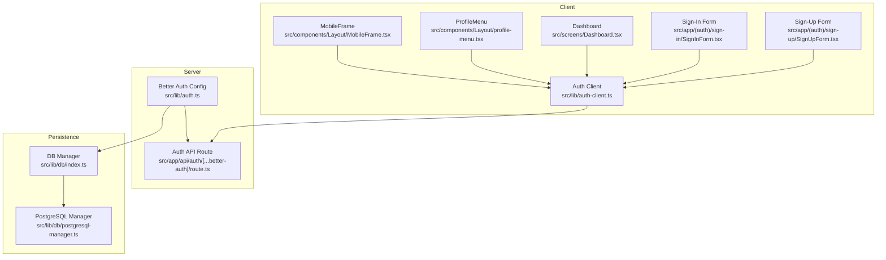
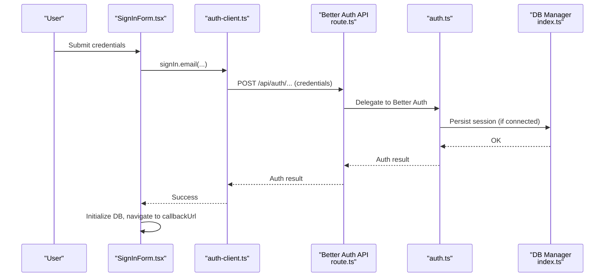
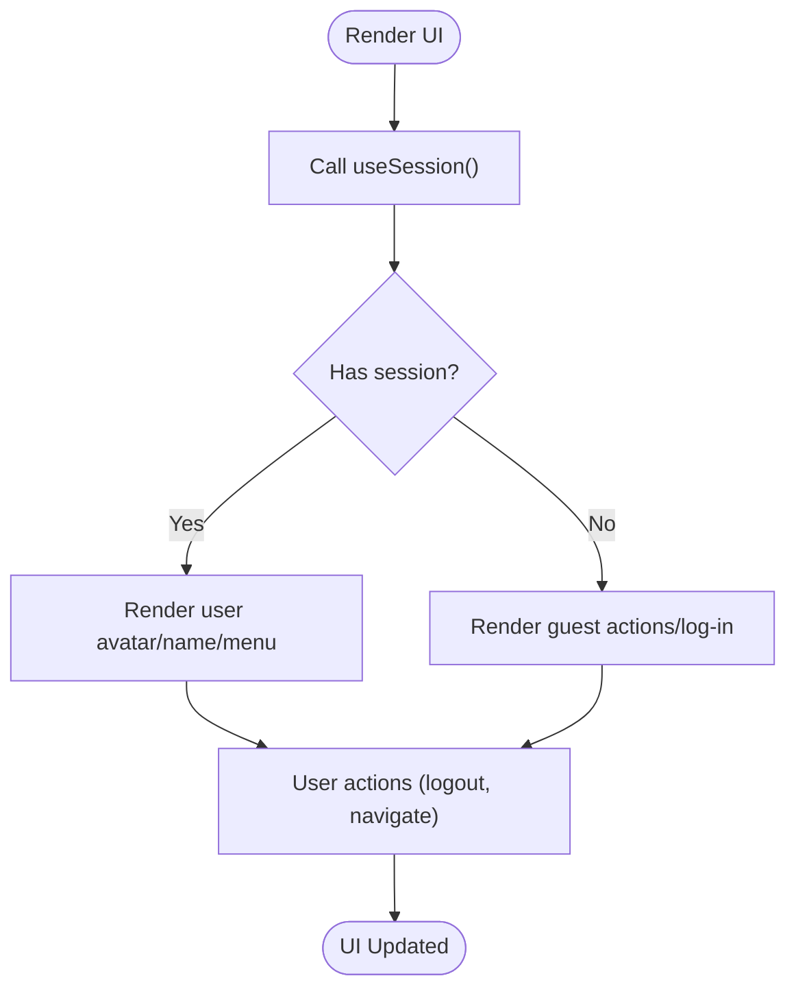
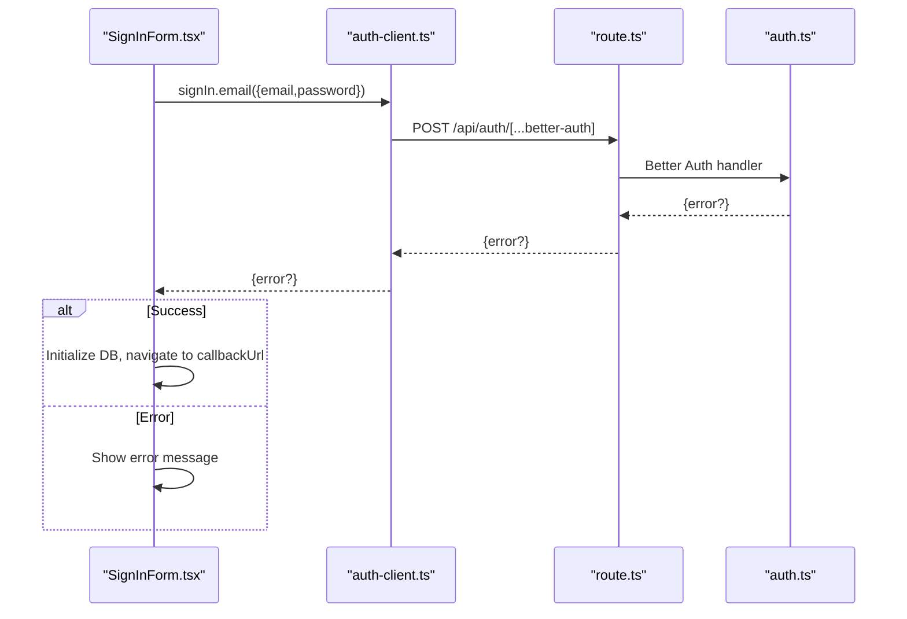
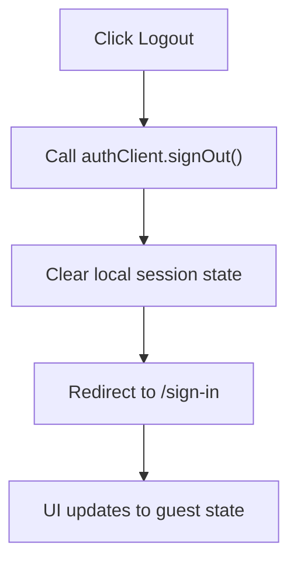
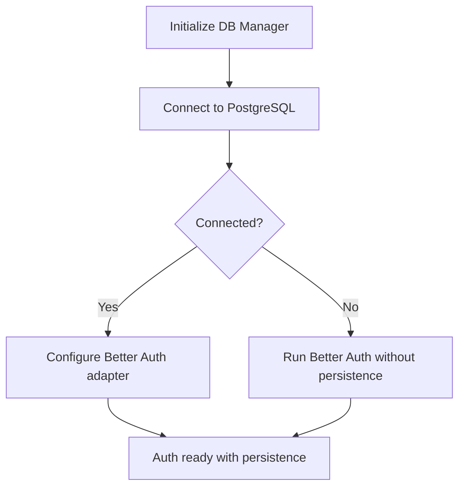
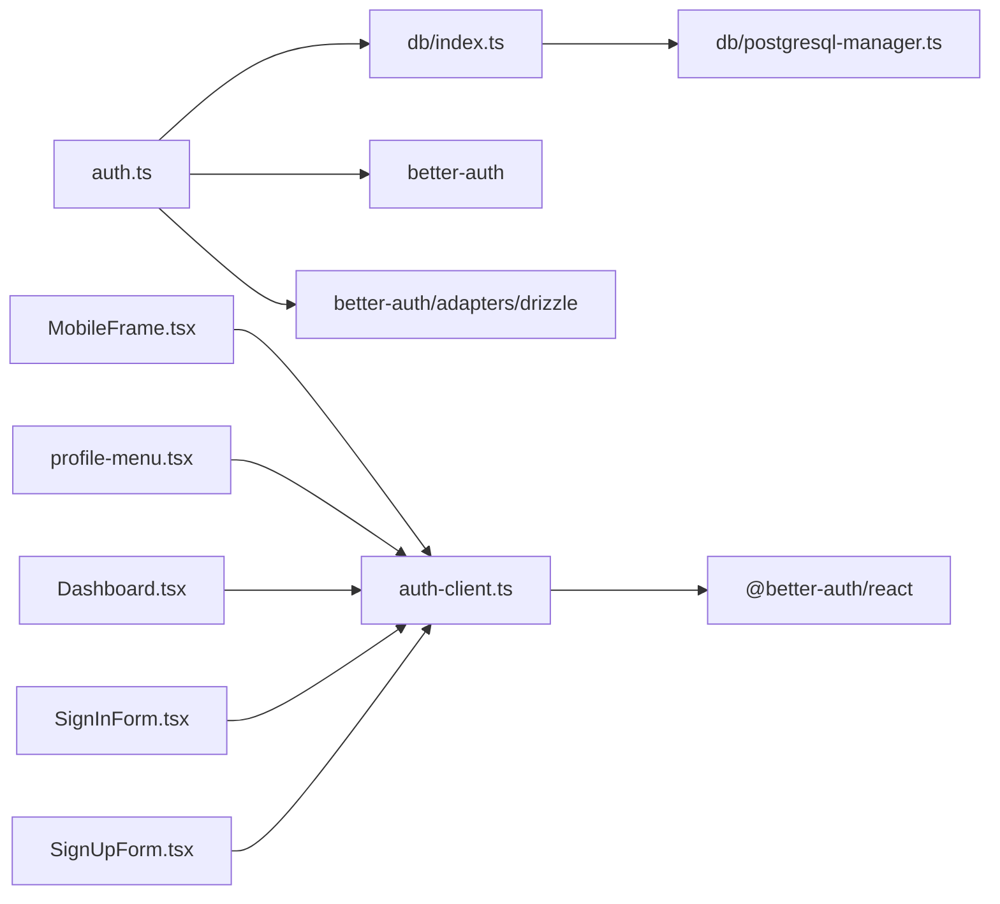

# User Context and Session Management

<cite>
**Referenced Files in This Document**
- [auth.ts](file://src/lib/auth.ts)
- [auth-client.ts](file://src/lib/auth-client.ts)
- [layout.tsx](file://src/app/layout.tsx)
- [MobileFrame.tsx](file://src/components/Layout/MobileFrame.tsx)
- [profile-menu.tsx](file://src/components/Layout/profile-menu.tsx)
- [Dashboard.tsx](file://src/screens/Dashboard.tsx)
- [SignInForm.tsx](file://src/app/(auth)/sign-in/SignInForm.tsx)
- [SignUpForm.tsx](file://src/app/(auth)/sign-up/SignUpForm.tsx)
- [index.ts](file://src/lib/db/index.ts)
- [postgresql-manager.ts](file://src/lib/db/postgresql-manager.ts)
- [route.ts](file://src/app/api/auth/[...better-auth]/route.ts)
- [package.json](file://package.json)
</cite>

## Table of Contents
1. [Introduction](#introduction)
2. [Project Structure](#project-structure)
3. [Core Components](#core-components)
4. [Architecture Overview](#architecture-overview)
5. [Detailed Component Analysis](#detailed-component-analysis)
6. [Dependency Analysis](#dependency-analysis)
7. [Performance Considerations](#performance-considerations)
8. [Troubleshooting Guide](#troubleshooting-guide)
9. [Conclusion](#conclusion)

## Introduction
This document explains how user context and session management are implemented across the application using Better Auth. It covers authentication integration, session establishment, token management, context propagation, user data context creation, session validation, automatic logout handling, protected routing behavior, and session persistence. It also details how user-aware components consume the session state, how to handle authentication failures, and how to synchronize user state across components.

## Project Structure
The authentication system spans several layers:
- Authentication server-side configuration and API endpoints
- Client-side authentication hooks and utilities
- UI components that render user context and trigger logout
- Database connectivity that enables Better Auth session persistence

**Diagram sources**
- [auth.ts](file://src/lib/auth.ts#L1-L103)
- [auth-client.ts](file://src/lib/auth-client.ts#L1-L10)
- [MobileFrame.tsx](file://src/components/Layout/MobileFrame.tsx#L1-L319)
- [profile-menu.tsx](file://src/components/Layout/profile-menu.tsx#L1-L80)
- [Dashboard.tsx](file://src/screens/Dashboard.tsx#L1-L340)
- [SignInForm.tsx](file://src/app/(auth)/sign-in/SignInForm.tsx#L1-L353)
- [SignUpForm.tsx](file://src/app/(auth)/sign-up/SignUpForm.tsx#L1-L249)
- [index.ts](file://src/lib/db/index.ts#L1-L102)
- [postgresql-manager.ts](file://src/lib/db/postgresql-manager.ts#L1-L162)
- [route.ts](file://src/app/api/auth/[...better-auth]/route.ts)

**Section sources**
- [auth.ts](file://src/lib/auth.ts#L1-L103)
- [auth-client.ts](file://src/lib/auth-client.ts#L1-L10)
- [MobileFrame.tsx](file://src/components/Layout/MobileFrame.tsx#L1-L319)
- [Dashboard.tsx](file://src/screens/Dashboard.tsx#L1-L340)
- [SignInForm.tsx](file://src/app/(auth)/sign-in/SignInForm.tsx#L1-L353)
- [SignUpForm.tsx](file://src/app/(auth)/sign-up/SignUpForm.tsx#L1-L249)
- [index.ts](file://src/lib/db/index.ts#L1-L102)
- [postgresql-manager.ts](file://src/lib/db/postgresql-manager.ts#L1-L162)

## Core Components
- Better Auth server configuration: Defines base URL, secret, database adapter, email/password, social providers, session expiration, trusted origins, and anonymous plugin.
- Better Auth client: Creates a client with baseURL and anonymous plugin, exposing sign-in, sign-up, sign-out, and session hook.
- UI integration: MobileFrame consumes session state to conditionally render navigation and profile actions; ProfileMenu displays user info and triggers logout; Dashboard reads session to personalize content; Sign-In/Sign-Up forms drive authentication flows and redirect on success.

Key behaviors:
- Session persistence: Enabled when database is available via Better Auth adapter.
- Social providers: Google configured; Twitter optional based on environment variables.
- Session lifecycle: Sessions expire after configured time and update age; anonymous plugin supports guest mode.

**Section sources**
- [auth.ts](file://src/lib/auth.ts#L48-L69)
- [auth-client.ts](file://src/lib/auth-client.ts#L4-L9)
- [MobileFrame.tsx](file://src/components/Layout/MobileFrame.tsx#L47-L48)
- [profile-menu.tsx](file://src/components/Layout/profile-menu.tsx#L19-L25)
- [Dashboard.tsx](file://src/screens/Dashboard.tsx#L63-L63)
- [SignInForm.tsx](file://src/app/(auth)/sign-in/SignInForm.tsx#L97-L117)
- [SignUpForm.tsx](file://src/app/(auth)/sign-up/SignUpForm.tsx#L55-L71)

## Architecture Overview
The system integrates client-side hooks with server-side Better Auth endpoints. The client authenticates against the API route, which delegates to Better Auth. When database connectivity is available, Better Auth persists sessions; otherwise, sessions are not persisted.

**Diagram sources**
- [SignInForm.tsx](file://src/app/(auth)/sign-in/SignInForm.tsx#L97-L117)
- [auth-client.ts](file://src/lib/auth-client.ts#L9-L9)
- [route.ts](file://src/app/api/auth/[...better-auth]/route.ts)
- [auth.ts](file://src/lib/auth.ts#L48-L69)
- [index.ts](file://src/lib/db/index.ts#L24-L39)

## Detailed Component Analysis

### Better Auth Server Configuration
Responsibilities:
- Configure baseURL, secret, database adapter (when connected), email/password, social providers, session settings, and trusted origins.
- Enable anonymous plugin for guest sessions.
- Provide lazy initialization with database readiness checks.

Implementation highlights:
- Database detection and adapter wiring occur only when the database is connected.
- Warning logs inform about missing database or Twitter credentials.
- Session expiration and update intervals are set for long-lived but refreshable sessions.

**Section sources**
- [auth.ts](file://src/lib/auth.ts#L9-L21)
- [auth.ts](file://src/lib/auth.ts#L23-L31)
- [auth.ts](file://src/lib/auth.ts#L48-L69)
- [auth.ts](file://src/lib/auth.ts#L72-L87)

### Better Auth Client
Responsibilities:
- Create a client with baseURL and anonymous plugin.
- Export convenience functions: signIn, signUp, useSession, signOut.

Usage patterns:
- Forms call sign-in/sign-up methods and handle errors.
- UI components use useSession to render user-specific content and actions.

**Section sources**
- [auth-client.ts](file://src/lib/auth-client.ts#L4-L9)

### Session Consumption in UI Components
- MobileFrame: Reads session to decide whether to show profile menu and bottom navigation; triggers logout via client.
- ProfileMenu: Receives user from session and renders profile details; triggers signOut.
- Dashboard: Uses session to display user avatar, name, and personalized content.

**Diagram sources**
- [MobileFrame.tsx](file://src/components/Layout/MobileFrame.tsx#L47-L48)
- [profile-menu.tsx](file://src/components/Layout/profile-menu.tsx#L19-L25)
- [Dashboard.tsx](file://src/screens/Dashboard.tsx#L63-L63)

**Section sources**
- [MobileFrame.tsx](file://src/components/Layout/MobileFrame.tsx#L47-L48)
- [profile-menu.tsx](file://src/components/Layout/profile-menu.tsx#L19-L25)
- [Dashboard.tsx](file://src/screens/Dashboard.tsx#L63-L63)

### Authentication Workflows
- Email/Password Sign-In:
  - Validates callbackUrl to prevent open redirects.
  - On success, initializes database and navigates to callbackUrl.
  - Displays user-facing errors on failure.
- Social Sign-In:
  - Supports Google and optionally Twitter when credentials are present.
  - Uses callbackURL for redirection.
- Anonymous Sign-In:
  - Allows guest access via anonymous plugin.
- Sign-Up:
  - Creates user via email/password and navigates to dashboard.

**Diagram sources**
- [SignInForm.tsx](file://src/app/(auth)/sign-in/SignInForm.tsx#L97-L117)
- [auth-client.ts](file://src/lib/auth-client.ts#L9-L9)
- [route.ts](file://src/app/api/auth/[...better-auth]/route.ts)
- [auth.ts](file://src/lib/auth.ts#L48-L69)

**Section sources**
- [SignInForm.tsx](file://src/app/(auth)/sign-in/SignInForm.tsx#L26-L48)
- [SignInForm.tsx](file://src/app/(auth)/sign-in/SignInForm.tsx#L97-L117)
- [SignInForm.tsx](file://src/app/(auth)/sign-in/SignInForm.tsx#L119-L124)
- [SignInForm.tsx](file://src/app/(auth)/sign-in/SignInForm.tsx#L126-L142)
- [SignUpForm.tsx](file://src/app/(auth)/sign-up/SignUpForm.tsx#L55-L71)

### Protected Routes and Automatic Logout
- Protected behavior: The application hides certain navigation elements when the user is not authenticated (e.g., top bar actions and bottom navigation).
- Automatic logout: Both MobileFrame and ProfileMenu expose logout actions that call the client’s signOut method, clearing local session state and redirecting to sign-in.

**Diagram sources**
- [MobileFrame.tsx](file://src/components/Layout/MobileFrame.tsx#L189-L196)
- [profile-menu.tsx](file://src/components/Layout/profile-menu.tsx#L69-L75)

**Section sources**
- [MobileFrame.tsx](file://src/components/Layout/MobileFrame.tsx#L52-L57)
- [MobileFrame.tsx](file://src/components/Layout/MobileFrame.tsx#L189-L196)
- [profile-menu.tsx](file://src/components/Layout/profile-menu.tsx#L69-L75)

### Session Persistence and Database Integration
- Database manager connects to PostgreSQL and exposes a singleton instance.
- Better Auth adapter is configured only when the database is connected.
- If database is unavailable, Better Auth runs without persistent sessions.

**Diagram sources**
- [index.ts](file://src/lib/db/index.ts#L24-L39)
- [postgresql-manager.ts](file://src/lib/db/postgresql-manager.ts#L42-L90)
- [auth.ts](file://src/lib/auth.ts#L13-L21)
- [auth.ts](file://src/lib/auth.ts#L52-L57)

**Section sources**
- [index.ts](file://src/lib/db/index.ts#L1-L102)
- [postgresql-manager.ts](file://src/lib/db/postgresql-manager.ts#L1-L162)
- [auth.ts](file://src/lib/auth.ts#L13-L21)
- [auth.ts](file://src/lib/auth.ts#L52-L57)

## Dependency Analysis
- Client depends on Better Auth client library and the application’s baseURL.
- Server depends on Better Auth core and Drizzle adapter when database is available.
- UI components depend on client hooks for session state and actions.
- Database connectivity is optional for session persistence.

**Diagram sources**
- [auth-client.ts](file://src/lib/auth-client.ts#L1-L10)
- [auth.ts](file://src/lib/auth.ts#L1-L7)
- [index.ts](file://src/lib/db/index.ts#L1-L102)
- [postgresql-manager.ts](file://src/lib/db/postgresql-manager.ts#L1-L162)
- [MobileFrame.tsx](file://src/components/Layout/MobileFrame.tsx#L1-L319)
- [profile-menu.tsx](file://src/components/Layout/profile-menu.tsx#L1-L80)
- [Dashboard.tsx](file://src/screens/Dashboard.tsx#L1-L340)
- [SignInForm.tsx](file://src/app/(auth)/sign-in/SignInForm.tsx#L1-L353)
- [SignUpForm.tsx](file://src/app/(auth)/sign-up/SignUpForm.tsx#L1-L249)

**Section sources**
- [package.json](file://package.json#L46-L64)
- [auth-client.ts](file://src/lib/auth-client.ts#L1-L10)
- [auth.ts](file://src/lib/auth.ts#L1-L7)
- [index.ts](file://src/lib/db/index.ts#L1-L102)

## Performance Considerations
- Session refresh: The configured update age balances freshness with server load.
- Database retries: The DB manager attempts connection with delays; Better Auth defers initialization until DB is ready.
- Client-side rendering: UI components use optimistic rendering while session resolves; consider skeleton states for better UX.

## Troubleshooting Guide
Common scenarios and resolutions:
- Authentication failures:
  - Email/password errors: Handled in sign-in form; displays user-friendly messages.
  - Social provider errors: Surface provider-specific errors; verify provider credentials.
- Database not connected:
  - Better Auth runs without persistence; sessions are not stored.
  - Check environment variables and connection string.
- Open redirect prevention:
  - The sign-in form validates callbackUrl to avoid unsafe redirects.

**Section sources**
- [SignInForm.tsx](file://src/app/(auth)/sign-in/SignInForm.tsx#L106-L116)
- [SignInForm.tsx](file://src/app/(auth)/sign-in/SignInForm.tsx#L28-L48)
- [auth.ts](file://src/lib/auth.ts#L13-L21)

## Conclusion
The application integrates Better Auth across client and server boundaries, enabling robust user context management and session handling. With optional database persistence, the system supports both persistent and ephemeral sessions. UI components consistently consume session state, provide logout capabilities, and adapt behavior for authenticated and guest users. The design ensures a smooth, secure, and responsive user experience across pages and features.