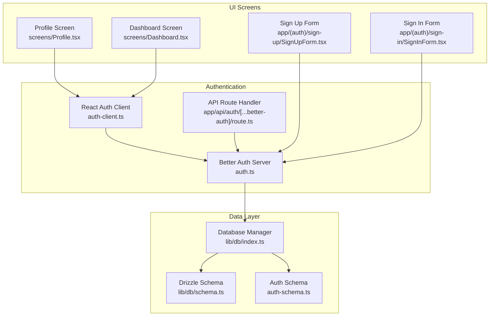
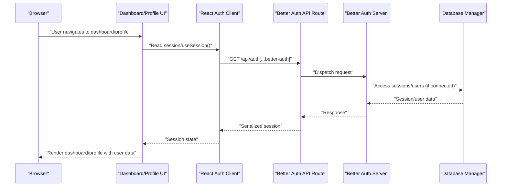
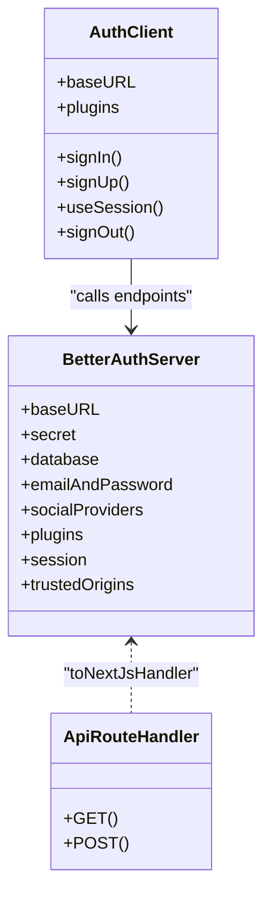
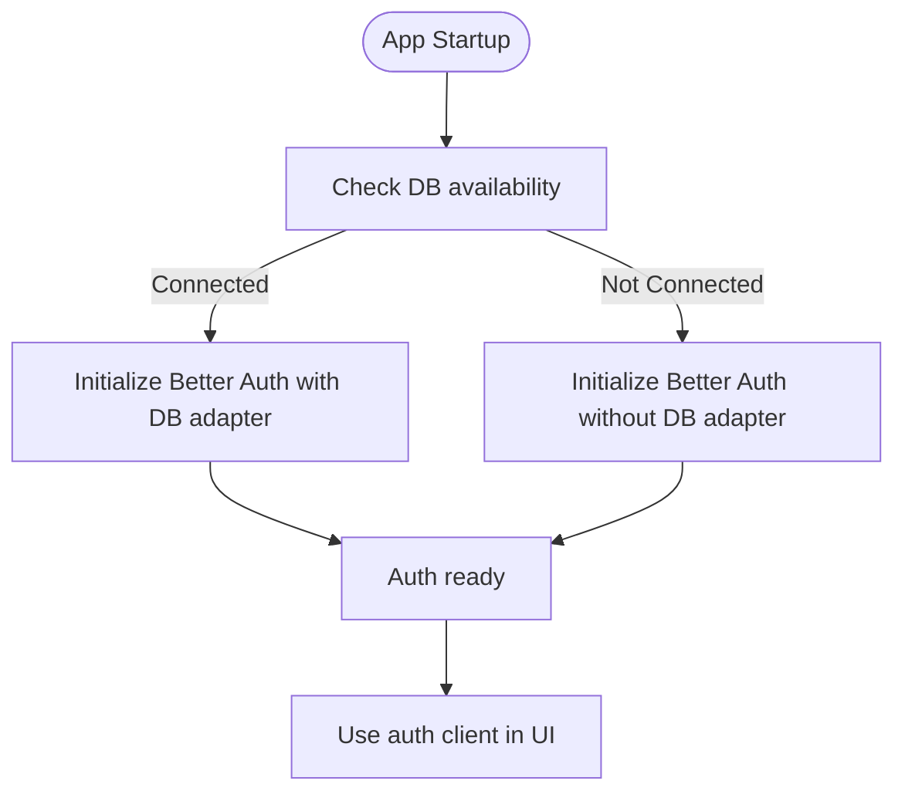
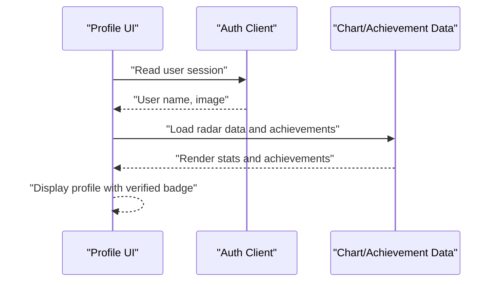
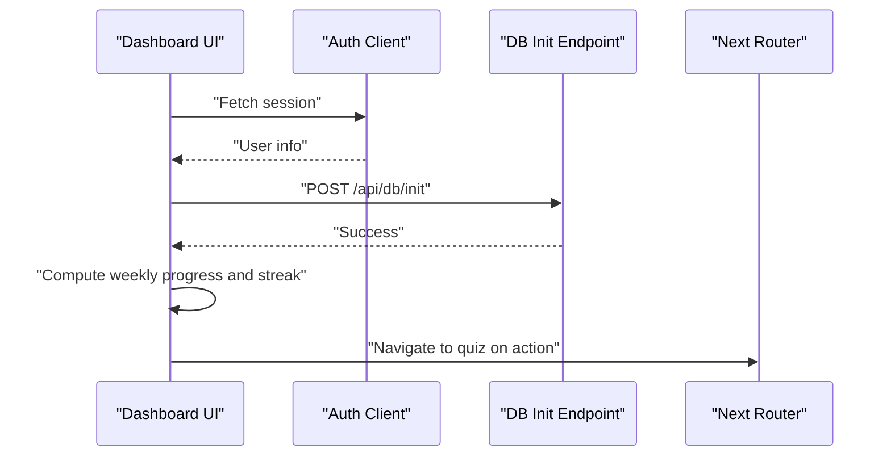
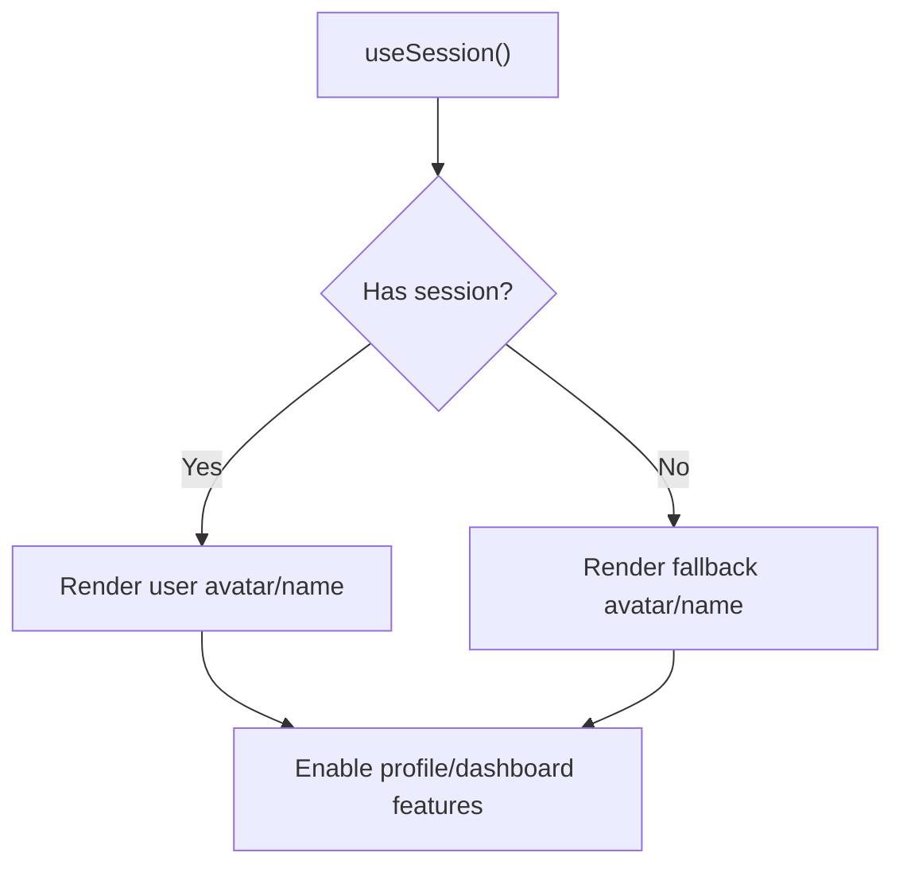
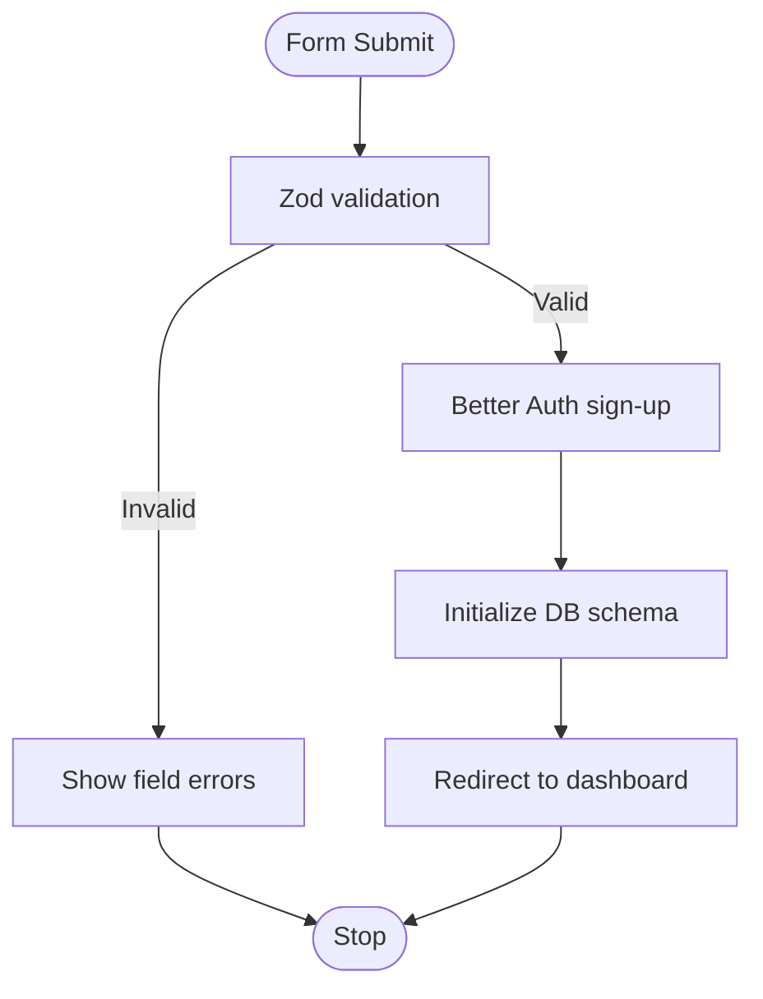
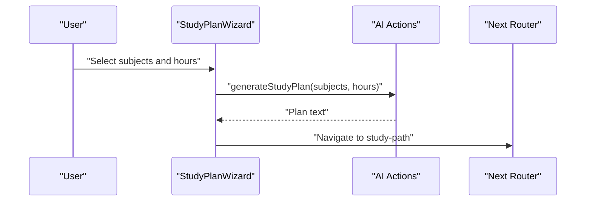
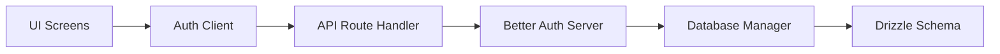

# User Management

<cite>
**Referenced Files in This Document**
- [auth.ts](file://src/lib/auth.ts)
- [auth-client.ts](file://src/lib/auth-client.ts)
- [route.ts](file://src/app/api/auth/[...better-auth]/route.ts)
- [db/index.ts](file://src/lib/db/index.ts)
- [schema.ts](file://src/lib/db/schema.ts)
- [auth-schema.ts](file://auth-schema.ts)
- [Profile.tsx](file://src/screens/Profile.tsx)
- [page.tsx](file://src/app/profile/page.tsx)
- [Dashboard.tsx](file://src/screens/Dashboard.tsx)
- [page.tsx](file://src/app/dashboard/page.tsx)
- [SignUpForm.tsx](file://src/app/(auth)/sign-up/SignUpForm.tsx)
- [SignInForm.tsx](file://src/app/(auth)/sign-in/SignInForm.tsx)
- [index.ts](file://src/types/index.ts)
- [mock-data.ts](file://src/constants/mock-data.ts)
- [StudyPlanWizard.tsx](file://src/screns/StudyPlanWizard.tsx)
- [page.tsx](file://src/app/study-plan/page.tsx)
- [aiActions.ts](file://src/services/aiActions.ts)
- [data.ts](file://src/lib/data.ts)
- [README.md](file://README.md)
</cite>

## Table of Contents
1. [Introduction](#introduction)
2. [Project Structure](#project-structure)
3. [Core Components](#core-components)
4. [Architecture Overview](#architecture-overview)
5. [Detailed Component Analysis](#detailed-component-analysis)
6. [Dependency Analysis](#dependency-analysis)
7. [Performance Considerations](#performance-considerations)
8. [Troubleshooting Guide](#troubleshooting-guide)
9. [Conclusion](#conclusion)
10. [Appendices](#appendices)

## Introduction
This document describes MatricMaster AI’s user management system with a focus on profile management, dashboard personalization, user context/session handling, and data privacy. It also covers integration points with progress tracking, achievements, and study planning, along with validation, persistence, and user analytics considerations.

## Project Structure
The user management system spans authentication, session handling, UI screens, and data access layers:
- Authentication and session management via Better Auth and a React client wrapper
- Database connectivity and schema definitions for user and related entities
- Profile and dashboard screens implementing user-centric UI and data visualization
- Onboarding forms with validation and database initialization triggers
- Study planning and AI-backed personalization integrations

**Diagram sources**
- [auth.ts](file://src/lib/auth.ts#L1-L103)
- [auth-client.ts](file://src/lib/auth-client.ts#L1-L10)
- [route.ts](file://src/app/api/auth/[...better-auth]/route.ts#L1-L5)
- [db/index.ts](file://src/lib/db/index.ts#L1-L102)
- [schema.ts](file://src/lib/db/schema.ts#L1-L160)
- [auth-schema.ts](file://auth-schema.ts#L1-L95)
- [Profile.tsx](file://src/screens/Profile.tsx#L1-L284)
- [Dashboard.tsx](file://src/screens/Dashboard.tsx#L1-L340)
- [SignUpForm.tsx](file://src/app/(auth)/sign-up/SignUpForm.tsx#L29-L168)
- [SignInForm.tsx](file://src/app/(auth)/sign-in/SignInForm.tsx#L153-L170)

**Section sources**
- [README.md](file://README.md#L1-L141)
- [auth.ts](file://src/lib/auth.ts#L1-L103)
- [auth-client.ts](file://src/lib/auth-client.ts#L1-L10)
- [route.ts](file://src/app/api/auth/[...better-auth]/route.ts#L1-L5)
- [db/index.ts](file://src/lib/db/index.ts#L1-L102)
- [schema.ts](file://src/lib/db/schema.ts#L1-L160)
- [auth-schema.ts](file://auth-schema.ts#L1-L95)
- [Profile.tsx](file://src/screens/Profile.tsx#L1-L284)
- [Dashboard.tsx](file://src/screens/Dashboard.tsx#L1-L340)
- [SignUpForm.tsx](file://src/app/(auth)/sign-up/SignUpForm.tsx#L29-L168)
- [SignInForm.tsx](file://src/app/(auth)/sign-in/SignInForm.tsx#L153-L170)

## Core Components
- Authentication and session management
  - Server-side Better Auth configuration with database adapter, email/password, trusted origins, and plugins
  - Client-side React auth client with anonymous plugin support
  - API route handler bridging Better Auth to Next.js
- Database connectivity and schema
  - Centralized database manager with connection lifecycle and fallback behavior
  - Drizzle schema for user, session, account, verification, and auxiliary tables
- UI screens
  - Profile screen with stats visualization and achievements display
  - Dashboard with progress, streaks, weekly view, daily goal, and recommended challenges
- Onboarding and validation
  - Sign-up form with Zod-based validation, submission flow, and database initialization trigger
  - Sign-in form supporting social providers and local credentials
- Integrations
  - Study planning wizard leveraging AI actions and Gemini service
  - Types and constants supporting subjects, goals, and recommendations

**Section sources**
- [auth.ts](file://src/lib/auth.ts#L48-L69)
- [auth-client.ts](file://src/lib/auth-client.ts#L1-L10)
- [route.ts](file://src/app/api/auth/[...better-auth]/route.ts#L1-L5)
- [db/index.ts](file://src/lib/db/index.ts#L24-L78)
- [schema.ts](file://src/lib/db/schema.ts#L1-L160)
- [auth-schema.ts](file://auth-schema.ts#L1-L95)
- [Profile.tsx](file://src/screens/Profile.tsx#L1-L284)
- [Dashboard.tsx](file://src/screens/Dashboard.tsx#L1-L340)
- [SignUpForm.tsx](file://src/app/(auth)/sign-up/SignUpForm.tsx#L29-L71)
- [StudyPlanWizard.tsx](file://src/screns/StudyPlanWizard.tsx#L1-L242)
- [aiActions.ts](file://src/services/aiActions.ts#L89-L125)
- [index.ts](file://src/types/index.ts#L1-L60)
- [mock-data.ts](file://src/constants/mock-data.ts#L1-L285)

## Architecture Overview
The user management architecture integrates authentication, session handling, and UI rendering with optional database persistence. The React client interacts with the Better Auth API, while the server initializes the auth engine and connects to the database when available.

**Diagram sources**
- [Dashboard.tsx](file://src/screens/Dashboard.tsx#L61-L120)
- [Profile.tsx](file://src/screens/Profile.tsx#L50-L98)
- [auth-client.ts](file://src/lib/auth-client.ts#L1-L10)
- [route.ts](file://src/app/api/auth/[...better-auth]/route.ts#L1-L5)
- [auth.ts](file://src/lib/auth.ts#L72-L86)
- [db/index.ts](file://src/lib/db/index.ts#L24-L78)

## Detailed Component Analysis

### Authentication and Session Management
- Server configuration
  - Initializes Better Auth with database adapter when connected, email/password enabled, social providers configured, and session expiration/update policies set
  - Provides a proxy to lazily access the auth instance
- Client configuration
  - Creates a React auth client with base URL and anonymous plugin
  - Exposes convenience hooks for sign-in, sign-up, session, and sign-out
- API route handler
  - Bridges Better Auth to Next.js handlers for GET/POST requests

**Diagram sources**
- [auth.ts](file://src/lib/auth.ts#L48-L69)
- [auth-client.ts](file://src/lib/auth-client.ts#L1-L10)
- [route.ts](file://src/app/api/auth/[...better-auth]/route.ts#L1-L5)

**Section sources**
- [auth.ts](file://src/lib/auth.ts#L1-L103)
- [auth-client.ts](file://src/lib/auth-client.ts#L1-L10)
- [route.ts](file://src/app/api/auth/[...better-auth]/route.ts#L1-L5)

### Database Connectivity and Schema
- Database manager
  - Manages connection lifecycle, availability checks, and graceful fallback when DB is unavailable
  - Exposes methods to get client, DB instance, and wait for connection
- Schema
  - Defines user, session, account, verification, and auxiliary tables
  - Includes relations and type exports for typed operations

**Diagram sources**
- [db/index.ts](file://src/lib/db/index.ts#L24-L78)
- [auth.ts](file://src/lib/auth.ts#L9-L21)
- [auth.ts](file://src/lib/auth.ts#L52-L57)

**Section sources**
- [db/index.ts](file://src/lib/db/index.ts#L1-L102)
- [schema.ts](file://src/lib/db/schema.ts#L1-L160)
- [auth-schema.ts](file://auth-schema.ts#L1-L95)

### Profile Management
- Profile screen
  - Displays avatar, verified badge, institution, and stats cards
  - Renders a radar chart comparing user performance against provincial averages
  - Lists skill achievements with icons and variants
- Data handling
  - Uses chart data and achievements arrays for visualization
  - Integrates with session data for user identity and image

**Diagram sources**
- [Profile.tsx](file://src/screens/Profile.tsx#L50-L284)
- [auth-client.ts](file://src/lib/auth-client.ts#L1-L10)

**Section sources**
- [Profile.tsx](file://src/screens/Profile.tsx#L1-L284)
- [page.tsx](file://src/app/profile/page.tsx#L1-L12)

### Dashboard Implementation
- Dashboard screen
  - Welcomes the user with avatar and online indicator
  - Shows streak, weekly progress with completion states, daily goal progress, and recommended challenges
  - Navigates to quizzes and handles loading states
- Data initialization
  - Calls database initialization endpoint on first render to ensure schema readiness

**Diagram sources**
- [Dashboard.tsx](file://src/screens/Dashboard.tsx#L61-L120)
- [Dashboard.tsx](file://src/screens/Dashboard.tsx#L114-L118)

**Section sources**
- [Dashboard.tsx](file://src/screens/Dashboard.tsx#L1-L340)
- [page.tsx](file://src/app/dashboard/page.tsx#L1-L12)

### User Context Management and Session Handling
- Context
  - Uses React auth client’s session hook to access user identity and image
  - Avatar fallback logic ensures robust rendering when user data is missing
- Session persistence
  - Better Auth session configuration defines expiry and update intervals
  - Database adapter enables persistent sessions when available

**Diagram sources**
- [Dashboard.tsx](file://src/screens/Dashboard.tsx#L61-L145)
- [auth.ts](file://src/lib/auth.ts#L64-L67)

**Section sources**
- [Dashboard.tsx](file://src/screens/Dashboard.tsx#L1-L340)
- [auth.ts](file://src/lib/auth.ts#L1-L103)

### Data Privacy Measures
- Configuration
  - Trusted origins restrict cross-origin requests to the app URL
  - Email/password enabled with optional verification flag
  - Social providers conditionally included based on environment variables
- Operational hygiene
  - Warns when DB is unavailable or OAuth credentials are missing
  - Uses environment variables for secrets and URLs

**Section sources**
- [auth.ts](file://src/lib/auth.ts#L48-L69)
- [auth.ts](file://src/lib/auth.ts#L23-L31)

### User Data Validation and Persistence
- Validation
  - Sign-up form uses Zod resolver for name, email, and password fields
  - AI actions validate inputs for study plan generation and sanitize queries
- Persistence
  - Database initialization triggered post-sign-up
  - Drizzle schema defines typed tables and relations for user and related entities

**Diagram sources**
- [SignUpForm.tsx](file://src/app/(auth)/sign-up/SignUpForm.tsx#L29-L71)
- [aiActions.ts](file://src/services/aiActions.ts#L89-L114)

**Section sources**
- [SignUpForm.tsx](file://src/app/(auth)/sign-up/SignUpForm.tsx#L29-L168)
- [aiActions.ts](file://src/services/aiActions.ts#L89-L125)
- [schema.ts](file://src/lib/db/schema.ts#L1-L160)
- [auth-schema.ts](file://auth-schema.ts#L1-L95)

### Integration with Progress Tracking, Achievements, and Study Planning
- Progress tracking
  - Dashboard displays streak, weekly progress, and daily goal completion
  - Mock data demonstrates weekly journey and recommended challenges
- Achievements
  - Profile showcases skill achievements with icons and variants
  - Constants define achievement entries for UI rendering
- Study planning
  - Study plan wizard collects subjects and weekly hours, generates a plan via AI, and navigates to the study path
  - AI actions validate and sanitize inputs before calling the Gemini model

**Diagram sources**
- [StudyPlanWizard.tsx](file://src/screns/StudyPlanWizard.tsx#L33-L60)
- [aiActions.ts](file://src/services/aiActions.ts#L89-L114)
- [page.tsx](file://src/app/study-plan/page.tsx#L1-L11)

**Section sources**
- [Dashboard.tsx](file://src/screens/Dashboard.tsx#L1-L340)
- [Profile.tsx](file://src/screens/Profile.tsx#L1-L284)
- [mock-data.ts](file://src/constants/mock-data.ts#L242-L285)
- [StudyPlanWizard.tsx](file://src/screns/StudyPlanWizard.tsx#L1-L242)
- [aiActions.ts](file://src/services/aiActions.ts#L89-L125)
- [data.ts](file://src/lib/data.ts#L272-L305)

### User Analytics Collection
- Current state
  - No explicit analytics collection code is present in the reviewed files
- Recommended approach
  - Integrate lightweight analytics at key user actions (e.g., sign-up, login, dashboard view, quiz start)
  - Respect privacy by avoiding personally identifiable information and enabling opt-out mechanisms

[No sources needed since this section provides general guidance]

### User Onboarding Flows
- Sign-up flow
  - Validates inputs, attempts Better Auth sign-up, initializes database, and redirects to dashboard
- Sign-in flow
  - Supports email/password and social providers with callback redirection

**Section sources**
- [SignUpForm.tsx](file://src/app/(auth)/sign-up/SignUpForm.tsx#L29-L71)
- [SignInForm.tsx](file://src/app/(auth)/sign-in/SignInForm.tsx#L153-L170)

### User Experience Optimization
- Personalization
  - Dashboard highlights daily goal and recommended challenges
  - Profile compares user performance to provincial averages
- Accessibility and responsiveness
  - UI components use scroll areas and responsive layouts
  - Loading states and transitions improve perceived performance

**Section sources**
- [Dashboard.tsx](file://src/screens/Dashboard.tsx#L1-L340)
- [Profile.tsx](file://src/screens/Profile.tsx#L1-L284)

## Dependency Analysis
The user management system exhibits clear separation of concerns:
- UI depends on the React auth client for session state
- Auth client communicates with Better Auth API route handler
- Server initializes Better Auth with optional database adapter
- Database manager centralizes connection logic and exposes DB to the auth adapter

**Diagram sources**
- [Dashboard.tsx](file://src/screens/Dashboard.tsx#L61-L120)
- [Profile.tsx](file://src/screens/Profile.tsx#L50-L98)
- [auth-client.ts](file://src/lib/auth-client.ts#L1-L10)
- [route.ts](file://src/app/api/auth/[...better-auth]/route.ts#L1-L5)
- [auth.ts](file://src/lib/auth.ts#L72-L86)
- [db/index.ts](file://src/lib/db/index.ts#L24-L78)
- [schema.ts](file://src/lib/db/schema.ts#L1-L160)

**Section sources**
- [auth.ts](file://src/lib/auth.ts#L1-L103)
- [auth-client.ts](file://src/lib/auth-client.ts#L1-L10)
- [route.ts](file://src/app/api/auth/[...better-auth]/route.ts#L1-L5)
- [db/index.ts](file://src/lib/db/index.ts#L1-L102)
- [schema.ts](file://src/lib/db/schema.ts#L1-L160)

## Performance Considerations
- Lazy initialization
  - Auth instance is created on first access if not yet initialized
- Database readiness
  - UI screens wait for DB initialization before rendering dependent features
- Session caching
  - Better Auth manages session lifecycles with configurable expiry and update intervals

**Section sources**
- [auth.ts](file://src/lib/auth.ts#L72-L86)
- [Dashboard.tsx](file://src/screens/Dashboard.tsx#L70-L89)
- [auth.ts](file://src/lib/auth.ts#L64-L67)

## Troubleshooting Guide
- Authentication issues
  - Verify environment variables for Better Auth secret and base URL
  - Check database connectivity warnings and ensure DB is reachable
- OAuth provider problems
  - Confirm provider credentials are set; missing credentials disable provider buttons
- Session not persisting
  - Ensure database is connected so Better Auth can use the database adapter
- UI rendering anomalies
  - Confirm avatar fallback logic and session loading states

**Section sources**
- [auth.ts](file://src/lib/auth.ts#L23-L31)
- [auth.ts](file://src/lib/auth.ts#L9-L21)
- [Dashboard.tsx](file://src/screens/Dashboard.tsx#L61-L120)

## Conclusion
MatricMaster AI’s user management system leverages Better Auth for secure, scalable authentication with optional database-backed sessions. The profile and dashboard screens deliver personalized experiences, while the study planning integration harnesses AI to tailor learning paths. Robust session handling, validation, and modular database connectivity enable extensibility and resilience.

## Appendices
- Data structures
  - User, session, account, verification entities defined in the schema
  - Achievement, ranking, content item, and subject types support UI and analytics
- Constants and mocks
  - Subjects, past papers, current goal, and weekly journey provide realistic demo data

**Section sources**
- [auth-schema.ts](file://auth-schema.ts#L1-L95)
- [schema.ts](file://src/lib/db/schema.ts#L1-L160)
- [index.ts](file://src/types/index.ts#L1-L60)
- [mock-data.ts](file://src/constants/mock-data.ts#L1-L285)