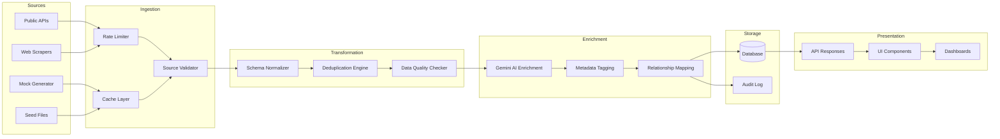
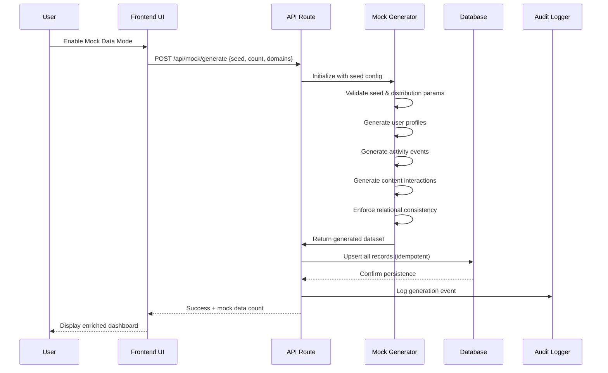
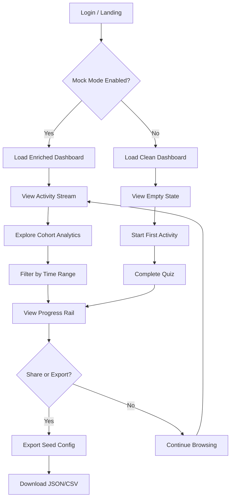
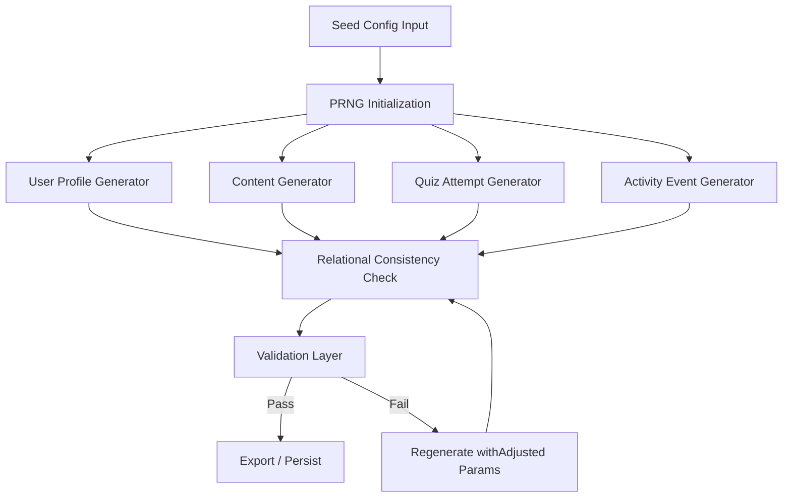

# Enhanced App Prototype: Comprehensive Project Brief

## Executive Summary

This document defines the end-to-end plan for transforming the current app prototype into a rich, production-grade state that convincingly reflects months of realistic user activity. The plan integrates responsibly sourced mock data, a reproducible mock data generator, ethical web research pipelines, and enriched interactive elements—all while preserving existing functionality and performance characteristics. The deliverable is a ready-to-demo prototype with measurable quality gates, comprehensive documentation, and a clear handoff path for cross-functional teams.

---

## 1. Objective and Overview

### End Goal

Create an **enriched app state** that convincingly demonstrates months of realistic user engagement by integrating:

- **Responsibly sourced mock and enriched data** from ethical web research and public APIs.
- **A deterministic mock data generator** capable of producing realistic, reproducible, and diverse datasets with controllable seeds, distributions, and aging profiles.
- **Enhanced architecture diagrams, data flows, and interactive UI elements** that surface rich, time-based activity streams, cohort analyses, and progress indicators.

### Core Principles

1. **Data Provenance First**: Every data point must have a documented origin—whether generated, scraped, seeded, or transformed—with full lineage tracking.
2. **Zero Regression**: Existing functionality, routes, components, and performance characteristics must remain intact. New features are additive, not destructive.
3. **Reproducibility**: All mock data generation must be seeded and exportable. Given the same seed and configuration, the system must produce identical outputs.
4. **Ethical Compliance**: Web research and scraping must respect `robots.txt`, API terms of service, data licensing, and privacy regulations. No copyrighted or restricted content will be redistributed without explicit permission.
5. **Transparent Enrichment**: Data transformations must be idempotent, observable, and reversible. The enrichment pipeline must log all operations and support rollbacks.

### Success Vision

The final prototype should pass a "demo readiness" review where stakeholders perceive the app as if a real user has actively engaged with it for 3–6 months. Dashboards show activity trends, content libraries are populated, user profiles have history, and analytics visualizations display meaningful patterns.

---

## 2. Scope and Assumptions

### In Scope

| Domain | Description |
|--------|-------------|
| **Users & Profiles** | Mock user accounts with profiles, preferences, activity history, and engagement metrics. |
| **Content & Learning** | Enriched educational content (lessons, quizzes, progress tracking) aligned to South African NSC Grade 12 curriculum. |
| **Transactions & Events** | Simulated user sessions, quiz attempts, content views, bookmarks, and streak data. |
| **Analytics & Insights** | Time-series data for dashboards: engagement over time, cohort retention, completion rates, and performance trends. |
| **Settings & Configuration** | Feature flags for toggling mock data mode, seed configuration exports, and data source management UI. |
| **Architecture Diagrams** | Mermaid-based diagrams for system architecture, data flows, component interactions, and user journeys. |

### Target Tech Stack

- **Frontend**: Next.js 16 with App Router, React Server Components, Tailwind CSS, shadcn/ui components.
- **Backend**: Next.js API routes (server actions), Drizzle ORM for database abstraction.
- **Database**: SQLite (development) / PostgreSQL (production) with Drizzle schema migrations.
- **AI Integration**: Google Gemini for content generation and enrichment.
- **Package Manager**: Bun exclusively.

### Assumptions

1. **Deployment Environment**: Vercel or similar serverless platform for frontend/API; managed database for persistence.
2. **Data Retention**: Mock data is ephemeral by default but can be persisted via seed exports. Production data follows defined retention policies (90-day analytics rollup, indefinite user content).
3. **Demo User Base**: 50–200 synthetic users with varied engagement patterns (daily active, weekly, dormant).
4. **Licensing Constraints**: All scraped data must originate from sources with permissive licenses (CC-BY, public domain, or explicit permission). No paywalled or restricted content.
5. **Privacy Regulations**: Mock data contains no real PII. Any simulated personal data is algorithmically generated and clearly marked as synthetic.
6. **Performance Targets**: Page load < 2s, API response < 500ms at p95, no N+1 queries in data-heavy views.

---

## 3. Requirements and Deliverables

### Mandatory Deliverables

| # | Deliverable | Description | Format |
|---|-------------|-------------|--------|
| D1 | **Data Model Document** | Complete entity definitions, relationships, constraints, and sample instances for all domains. | Markdown + TypeScript interfaces |
| D2 | **Mock Data Generator** | Configurable, seeded, reproducible data generation tool with export/import capabilities. | TypeScript module + CLI |
| D3 | **Enriched Data Pipeline** | Idempotent pipeline for ingesting, transforming, enriching, and persisting data with observability. | TypeScript module + logs |
| D4 | **Architecture Diagrams** | System architecture, data flow, sequence diagrams, and UI flow diagrams. | Mermaid code blocks + narrative |
| D5 | **API Contracts** | JSON schemas or TypeScript interfaces for all API payloads (input/output). | TypeScript + JSON Schema |
| D6 | **UI/UX Enhancement Notes** | Wireframe descriptions, annotated mockups, accessibility requirements, and responsive behavior specs. | Markdown + design tokens |
| D7 | **Test Plan** | Unit, integration, E2E, data quality, and security test specifications with coverage targets. | Markdown + test files |
| D8 | **Deployment & Rollbook Playbook** | Step-by-step deployment, feature flag strategy, rollback procedures, and monitoring setup. | Markdown |
| D9 | **Maintenance README** | Handoff documentation for future teams: architecture overview, data sources, mock generator usage, and known limitations. | Markdown |

### Acceptance Criteria per Deliverable

- **D1–D5**: Reviewed by at least one engineer; all schemas validate against sample data; no circular dependencies.
- **D6**: Passes accessibility audit (WCAG 2.1 AA); responsive breakpoints tested at 320px, 768px, 1024px, 1440px.
- **D7**: Test coverage ≥ 80%; all critical paths covered; data quality assertions pass on generated datasets.
- **D8**: Deployable in a clean environment following only the playbook; rollback tested successfully.
- **D9**: A new team member can understand the system architecture and run the mock generator within 2 hours of reading.

---

## 4. Architecture and System Design

### 4.1 High-Level Architecture

```mermaid
graph TB
    subgraph Client["Frontend (Next.js 16 App Router)"]
        UI[React Components / shadcn/ui]
        Pages[Pages & Layouts]
        Hooks[Custom Hooks & Data Fetchers]
        FF[Feature Flags]
    end

    subgraph API["Backend (Next.js API Routes / Server Actions)"]
        Routes[API Route Handlers]
        SA[Server Actions]
        Validation[Zod Validation]
        Auth[Auth Middleware]
    end

    subgraph Data["Data Layer"]
        ORM[Drizzle ORM]
        DB[(SQLite / PostgreSQL)]
        Cache[In-Memory Cache]
        Seed[Seed Data Files]
    end

    subgraph Pipeline["Enrichment Pipeline"]
        Ingest[Data Ingestion]
        Transform[Normalization & Dedup]
        Enrich[AI Enrichment (Gemini)]
        Persist[Persist to DB]
        Observability[Logging & Metrics]
    end

    subgraph External["External Sources"]
        APIs[Public APIs]
        Scrapers[Web Scrapers (Ethical)]
        MockGen[Mock Data Generator]
    end

    UI --> Hooks
    Hooks --> Pages
    Pages --> Routes
    Routes --> Validation
    Validation --> Auth
    Auth --> ORM
    ORM --> DB
    ORM --> Cache
    FF -.-> Routes

    Ingest --> Transform
    Transform --> Enrich
    Enrich --> Persist
    Persist --> Observability

    APIs --> Ingest
    Scrapers --> Ingest
    MockGen --> Ingest
    Persist --> DB
```

**Narrative**: The frontend (Next.js App Router) renders UI components that fetch data via API routes or server actions. All requests pass through Zod validation and auth middleware before reaching Drizzle ORM, which queries SQLite (dev) or PostgreSQL (prod). The enrichment pipeline ingests data from public APIs, ethical scrapers, and the mock data generator, then normalizes, enriches (via Gemini), and persists results with full observability logging.

### 4.2 Data Flow Diagram



**Narrative**: Data enters from multiple sources, passes through rate limiting and caching, then validation against source contracts. Normalization ensures consistent schemas, deduplication prevents redundancy, and quality checks flag anomalies. Gemini enrichment adds metadata, tags, and relationships before persistence. All operations are logged for auditability.

### 4.3 Sequence Diagram: Mock Data Generation



**Narrative**: The user triggers mock data generation via UI toggle. The API route receives seed configuration and domain selections. The generator produces deterministic data, enforces FK consistency, and returns the dataset. The API upserts records idempotently, logs the operation, and confirms success.

### 4.4 UI Flow Diagram: User Journey



**Narrative**: Users land on the dashboard and encounter either an enriched view (mock mode on) or an empty state. Enriched users can explore activity streams, filter by time, view cohort analytics, and track progress. The export option allows downloading the seed configuration for reproducibility.

---

## 5. Data Model and Schemas

### 5.1 Entity Definitions

#### User Profile

```typescript
interface UserProfile {
  id: string;           // UUID v4
  email: string;        // Synthetic: user-{hash}@mock.local
  displayName: string;  // Generated from name dataset
  avatarUrl: string | null; // Generated avatar URL or null
  role: 'student' | 'educator' | 'admin';
  createdAt: Date;      // Backdated 3–6 months
  lastActiveAt: Date;   // Recent, within 48 hours
  preferences: {
    theme: 'light' | 'dark' | 'system';
    language: 'en' | 'zu' | 'xh' | 'af';
    notificationsEnabled: boolean;
  };
  engagementMetrics: {
    totalSessions: number;
    totalQuizAttempts: number;
    averageScore: number; // 0–100
    streakDays: number;
    lastStreakDate: Date | null;
  };
}
```

#### Quiz Attempt

```typescript
interface QuizAttempt {
  id: string;           // UUID v4
  userId: string;       // FK → UserProfile.id
  quizId: string;       // FK → Content.quizId
  startedAt: Date;      // Timestamp
  completedAt: Date;    // Timestamp (startedAt + 5–30 min)
  score: number;        // 0–100
  answers: {
    questionId: string;
    selectedAnswer: string;
    isCorrect: boolean;
    timeSpentSeconds: number;
  }[];
  deviceType: 'mobile' | 'tablet' | 'desktop';
  isMockData: boolean;  // Always true for generated data
}
```

#### Content Item

```typescript
interface ContentItem {
  id: string;           // UUID v4
  title: string;        // Enriched or scraped title
  description: string;  // AI-generated summary
  subject: string;      // e.g., "Mathematics", "Physical Sciences"
  grade: 12;            // NSC Grade 12
  topic: string;        // e.g., "Calculus", "Electrostatics"
  type: 'lesson' | 'quiz' | 'video' | 'article';
  difficulty: 'beginner' | 'intermediate' | 'advanced';
  tags: string[];       // Auto-generated metadata tags
  sourceUrl: string | null; // Original source (if scraped)
  sourceLicense: string | null; // e.g., "CC-BY-4.0"
  createdAt: Date;      // Backdated
  updatedAt: Date;      // More recent than createdAt
  viewCount: number;    // Simulated engagement
  bookmarkCount: number;
}
```

#### Activity Event

```typescript
interface ActivityEvent {
  id: string;           // UUID v4
  userId: string;       // FK → UserProfile.id
  eventType: 'view' | 'attempt' | 'bookmark' | 'share' | 'complete';
  entityId: string;     // FK → ContentItem.id or QuizAttempt.id
  entityType: 'content' | 'quiz' | 'profile';
  timestamp: Date;      // Distributed over 3–6 month window
  metadata: Record<string, unknown>; // Contextual data
  isMockData: boolean;
}
```

### 5.2 Seed Data Schema

```json
{
  "$schema": "http://json-schema.org/draft-07/schema#",
  "title": "SeedConfiguration",
  "type": "object",
  "required": ["seed", "userCount", "dateRange"],
  "properties": {
    "seed": { "type": "integer", "minimum": 0 },
    "userCount": { "type": "integer", "minimum": 10, "maximum": 500 },
    "dateRange": {
      "type": "object",
      "required": ["start", "end"],
      "properties": {
        "start": { "type": "string", "format": "date" },
        "end": { "type": "string", "format": "date" }
      }
    },
    "engagementDistribution": {
      "type": "object",
      "properties": {
        "dailyActive": { "type": "number", "minimum": 0, "maximum": 1 },
        "weeklyActive": { "type": "number", "minimum": 0, "maximum": 1 },
        "dormant": { "type": "number", "minimum": 0, "maximum": 1 }
      }
    },
    "domains": {
      "type": "array",
      "items": { "type": "string", "enum": ["users", "content", "quizzes", "events", "analytics"] }
    },
    "exportFormat": { "type": "string", "enum": ["json", "csv", "sql"] }
  }
}
```

### 5.3 Data Quality Rules

| Rule | Description | Validation Example |
|------|-------------|-------------------|
| **FK Integrity** | All foreign keys must reference existing records. | `QuizAttempt.userId` must exist in `UserProfile.id`. |
| **Date Ordering** | `createdAt` ≤ `updatedAt` ≤ `lastActiveAt`. | Reject if `completedAt` < `startedAt`. |
| **Score Bounds** | Quiz scores must be 0–100. | Reject score = 105 or score = -5. |
| **Email Uniqueness** | Synthetic emails must be globally unique. | Hash-based generation guarantees uniqueness. |
| **Mock Flag** | All generated records must have `isMockData: true`. | Query `WHERE isMockData = false` on generated set should return 0. |
| **Distribution Check** | Engagement distribution must sum to ~1.0. | `dailyActive + weeklyActive + dormant` ≈ 1.0 (±0.01). |

---

## 6. Frontend and Interactions

### 6.1 UI Enhancements for Enriched State

#### Dashboard Overview
- **Activity Stream**: Chronological feed of recent events (quiz completions, content views, bookmarks) with relative timestamps ("2 hours ago").
- **Streak Indicator**: Visual badge showing consecutive days of activity (e.g., "🔥 14-day streak").
- **Progress Rail**: Horizontal progress bar per subject showing completion percentage (e.g., "Calculus: 78% complete").
- **Cohort Retention Chart**: Heatmap showing user retention by week and cohort (new users vs. returning).

#### Interactive Elements
- **Time-Range Selector**: Dropdown or slider to filter data by "Last 7 days", "Last 30 days", "Last 3 months", "All time".
- **Subject Filter**: Multi-select chips for filtering content and analytics by subject (Mathematics, Physical Sciences, Life Sciences, etc.).
- **Cohort Analysis View**: Table comparing engagement metrics across user cohorts (e.g., "Users who joined in March vs. April").
- **Export Button**: Allows downloading current seed configuration as JSON for reproducibility.

#### Accessibility Requirements
- All interactive elements must be keyboard-navigable (Tab order, Enter/Space activation).
- Color contrast ratios ≥ 4.5:1 for normal text, ≥ 3:1 for large text.
- ARIA labels on all icons, charts, and non-text elements.
- Screen reader announcements for dynamic content updates (live regions).

#### Responsive Behavior
| Breakpoint | Layout |
|------------|--------|
| 320px | Single-column stack, hidden sidebar, hamburger menu. |
| 768px | Two-column grid, collapsible sidebar, full navbar. |
| 1024px | Three-column dashboard, persistent sidebar. |
| 1440px | Wide layout with expanded charts and data tables. |

### 6.2 Data-Driven Visuals

- **Line Charts**: Engagement over time (sessions per day, quiz attempts per week).
- **Bar Charts**: Score distributions by subject, completion rates by topic.
- **Heatmaps**: Cohort retention (weeks since signup vs. active weeks).
- **Progress Indicators**: Circular or linear progress per subject with percentage labels.
- **Activity Badges**: Achievement-style badges for milestones (e.g., "First Quiz Completed", "7-Day Streak").

---

## 7. Diagrams and Visualizations

### 7.1 Component Interaction Diagram

```mermaid
graph LR
    A[User] --> B[MobileFrame / AppLayout]
    B --> C[Dashboard Page]
    C --> D[ActivityStream Component]
    C --> E[ProgressRail Component]
    C --> F[CohortChart Component]
    D --> G[useActivity Hook]
    E --> H[useProgress Hook]
    F --> I[useCohort Hook]
    G --> J[/api/activity]
    H --> K[/api/progress]
    I --> L[/api/cohort]
    J --> M[Drizzle ORM]
    K --> M
    L --> M
    M --> N[(Database)]
```

**Narrative**: User interactions flow through the AppLayout to page components, which render specialized components. Each component uses a custom hook to fetch data from API routes, which query the database via Drizzle ORM. This separation ensures testability and reusability.

### 7.2 Evolution of Diagrams

Diagrams should be version-controlled alongside code. As features are implemented:
1. **Phase 1 (Week 1)**: High-level architecture + data flow diagrams (as provided above).
2. **Phase 2 (Week 2–3)**: Add component-level interaction diagrams as UI is built.
3. **Phase 3 (Week 4)**: Update sequence diagrams to reflect actual API contracts.
4. **Phase 4 (Handoff)**: Final review of all diagrams against deployed system; annotate deviations.

All diagrams must be updated within the same PR that introduces the corresponding code change.

---

## 8. Mock Data Generator Specifications

### 8.1 Core Capabilities

| Capability | Description |
|------------|-------------|
| **Seeded Randomness** | All randomness derived from a provided seed (Mersenne Twister or mulberry32 PRNG). Same seed → identical output. |
| **Reproducible Scenarios** | Preset configurations for "Light User" (10 sessions/month), "Power User" (daily, high scores), "Dormant User" (1–2 sessions total). |
| **Distribution Controls** | Configurable engagement distribution: e.g., 40% daily active, 35% weekly, 25% dormant. |
| **Relational Consistency** | Foreign keys always valid. Generated quizzes reference existing content items. Events reference existing users and entities. |
| **Volume & Velocity** | Configurable user count (10–500), event density (sparse to heavy), and time range (1–12 months). |
| **Aging Simulation** | Activity density decreases over time for dormant users, increases for power users. Realistic drop-off curves. |
| **Export/Import** | Seed configurations exportable as JSON; importable for replay. Supports JSON, CSV, and SQL export formats. |
| **In-App Toggle** | Feature flag (`enableMockData`) gates whether API responses include mock data. Toggle visible in settings UI. |

### 8.2 Generator Architecture



### 8.3 Sample Generated Record

```json
{
  "id": "usr_7f3a9b2c-1d4e-4f8a-9c3b-5e6d7a8b9c0d",
  "email": "user-a7f3c2@mock.local",
  "displayName": "Thabo Mokoena",
  "role": "student",
  "createdAt": "2025-10-15T08:30:00Z",
  "lastActiveAt": "2026-04-10T14:22:00Z",
  "preferences": {
    "theme": "dark",
    "language": "en",
    "notificationsEnabled": true
  },
  "engagementMetrics": {
    "totalSessions": 87,
    "totalQuizAttempts": 34,
    "averageScore": 72.5,
    "streakDays": 12,
    "lastStreakDate": "2026-04-09"
  },
  "isMockData": true
}
```

---

## 9. Web Research and Scraping Plan

### 9.1 Source Selection Criteria

| Criterion | Requirement |
|-----------|-------------|
| **License** | Must be CC-BY, CC-0, public domain, or explicit written permission. No all-rights-reserved content. |
| **Accessibility** | Publicly accessible without authentication (unless API key provided under permissive terms). |
| **Relevance** | South African NSC Grade 12 curriculum alignment (Mathematics, Physical Sciences, Life Sciences, Geography, History). |
| **Stability** | Sources should have stable URLs and predictable content structure. Avoid sources that change frequently. |
| **Attribution** | Sources requiring attribution must have clear attribution fields preserved in the enriched content. |

### 9.2 Data Collection Methods

1. **Public APIs (Preferred)**: Use official APIs where available (e.g., Siyavula, Khan Academy API, OpenStax). Respect rate limits and API terms.
2. **Ethical Scraping (Secondary)**: Only scrape where:
   - `robots.txt` permits the target path.
   - No authentication or paywall bypass is required.
   - Content is licensed permissively.
   - Rate limiting is enforced (max 1 request per 2 seconds per domain).
3. **Caching**: All scraped content cached locally for 7 days to avoid redundant requests. Cache invalidation on schema change or content update.

### 9.3 Data Transformation and Normalization

- **Schema Enforcement**: All ingested data normalized to `ContentItem` schema. Missing fields filled with AI-generated defaults (via Gemini).
- **Deduplication**: Hash-based dedup on `title + subject + topic`. If hash collision detected, prefer the source with the most complete metadata.
- **License Preservation**: `sourceLicense` field always populated. If license unknown, content is excluded from enrichment pipeline.

### 9.4 Source Refresh Strategy

- **Cadence**: Weekly refresh for high-volatility sources, monthly for stable sources.
- **Deprecation**: Sources returning 404 or 403 for 3 consecutive checks are retired and logged.
- **Schema Evolution**: If source schema changes, pipeline fails gracefully (logs error, uses cached version) and alerts maintainers.

---

## 10. Development Plan and Workflow

### 10.1 Phases and Milestones

| Phase | Milestone | Duration | Assignee |
|-------|-----------|----------|----------|
| **Phase 1** | Environment setup, schema design, mock generator scaffold | Week 1 | Backend Engineer |
| **Phase 2** | Mock generator full implementation, seed config export | Week 2 | Backend Engineer |
| **Phase 3** | Enrichment pipeline integration, Gemini API wiring | Week 2–3 | Backend + AI Engineer |
| **Phase 4** | UI components for enriched state (dashboard, charts, filters) | Week 3–4 | Frontend Engineer |
| **Phase 5** | Testing (unit, integration, E2E, data quality) | Week 4 | QA Engineer |
| **Phase 6** | Deployment playbook, feature flags, monitoring | Week 5 | DevOps Engineer |
| **Phase 7** | Documentation, handoff, stakeholder demo | Week 5 | All |

### 10.2 Environment Setup

```bash
# Prerequisites
bun --version        # ≥ 1.0
node --version       # ≥ 20
git --version        # ≥ 2.40

# Installation
bun install

# Database Setup
bun run db:generate   # Drizzle schema generation
bun run db:migrate    # Apply migrations
bun run db:seed       # Optional: seed with mock data

# Development Server
bun run dev           # Next.js dev server
```

### 10.3 API Design and Contracts

All API routes follow this pattern:

```
POST /api/mock/generate   → Generate mock data (admin only)
GET  /api/activity         → Fetch activity stream (paginated)
GET  /api/progress         → Fetch progress rails per user
GET  /api/cohort           → Fetch cohort analytics
GET  /api/content          → Fetch content items (filterable)
POST /api/content/enrich   → Trigger enrichment pipeline (admin only)
```

**Versioning Strategy**: URL-based versioning (`/api/v1/...`) when breaking changes are introduced. Current version: `v1`.

### 10.4 Testing Strategy

| Test Type | Scope | Target |
|-----------|-------|--------|
| **Unit** | Individual functions, generators, validators | ≥ 90% coverage |
| **Integration** | API routes + database interactions | All routes covered |
| **E2E** | User journeys (login → dashboard → filter → export) | Critical paths only |
| **Data Quality** | Generated data validated against rules in §5.3 | 100% pass rate |
| **Security** | Auth bypass, injection, rate limiting | No critical vulnerabilities |
| **Performance** | API response times, query optimization | p95 < 500ms |

### 10.5 Deployment and Rollback

1. **Feature Flags**: All mock data features gated behind `enableMockData` flag.
2. **Deployment**: `bun run build` → `bun run start` on target environment. CI/CD via GitHub Actions.
3. **Rollback**: Revert to previous Git tag, redeploy. Database migrations are forward-only; rollback requires manual intervention.
4. **Monitoring**: Vercel Analytics, Sentry error tracking, custom health check endpoint (`/api/health`).

---

## 11. Quality, Security, and Privacy

### 11.1 Quality Gates

- **Linting**: Biome (`bun run lint:fix`) must pass with zero errors.
- **Type Safety**: TypeScript strict mode; zero `any` types in production code.
- **Data Quality**: All generated data passes validation rules (§5.3).
- **Accessibility**: WCAG 2.1 AA compliance verified via automated audit + manual testing.

### 11.2 Security Controls

| Control | Implementation |
|---------|---------------|
| **Authentication** | NextAuth.js or Better Auth with session management. |
| **Authorization** | Role-based access control (RBAC). Admin-only routes for mock generation. |
| **Data Access Auditing** | All write operations logged with userId, timestamp, and operation type. |
| **Input Validation** | Zod schemas on all API inputs. Reject malformed requests with 400. |
| **Rate Limiting** | API routes rate-limited (100 req/min per IP). Scrapers limited to 1 req/2s per domain. |

### 11.3 Privacy Safeguards

- **No Real PII**: All mock data is algorithmically generated. Emails use `user-{hash}@mock.local` pattern.
- **Anonymization**: Any scraped content containing personal data is excluded unless public domain and permissively licensed.
- **Consent**: Mock data mode requires explicit opt-in via feature flag toggle.
- **Data Minimization**: Only data necessary for demo purposes is generated and stored.
- **Retention**: Mock data can be purged via `bun run db:purge-mock` command. No automatic retention.

### 11.4 Compliance Checks

- **Licenses**: All scraped sources verified against license database. Non-compliant sources flagged and excluded.
- **Terms of Service**: API usage reviewed against ToS. No scraping where explicitly prohibited.
- **POPIA (South Africa)**: Compliance with Protection of Personal Information Act for any simulated personal data.

---

## 12. Risk Assessment and Mitigation

| Risk | Likelihood | Impact | Mitigation |
|------|-----------|--------|------------|
| **Source Volatility** | High | Medium | Cache all scraped content. Fallback to AI-generated content if source unavailable. |
| **License Changes** | Medium | High | Monthly license review. Automated alerts on source license changes. |
| **Performance Bottlenecks** | Medium | High | Query optimization, indexing, caching. Load testing before demo. |
| **Scope Creep** | High | Medium | Strict phase boundaries. Change requests require stakeholder approval. |
| **Data Inconsistency** | Low | High | Relational consistency checks in generator. Validation layer before persistence. |
| **Duplicate Records** | Medium | Medium | Hash-based deduplication. Unique constraints on database level. |
| **Mock Data Leakage** | Low | High | Feature flag isolation. `isMockData` column on all generated records. Purge command available. |

---

## 13. Success Metrics and Acceptance Criteria

### 13.1 Measurable Outcomes

| Metric | Target | Measurement |
|--------|--------|-------------|
| **Data Richness Score** | ≥ 85% of entities populated with realistic data | Query `COUNT(*) WHERE isMockData = true` / expected count |
| **Demo Readiness** | Stakeholder sign-off on "months of use" appearance | Qualitative review by 3+ stakeholders |
| **Page Load Performance** | < 2s at p95 | Lighthouse CI / Vercel Analytics |
| **API Response Time** | < 500ms at p95 | Custom middleware timing |
| **Test Coverage** | ≥ 80% overall, ≥ 90% on core modules | Biome + Vitest coverage report |
| **Accessibility Compliance** | WCAG 2.1 AA, zero critical violations | axe-core automated scan + manual audit |
| **Zero Regressions** | All existing routes and components functional | Regression test suite passes 100% |

### 13.2 Acceptance Criteria

1. All deliverables (D1–D9) completed and reviewed.
2. Mock data generator produces reproducible output from seed config.
3. Enriched dashboard displays realistic activity streams, progress rails, and cohort analytics.
4. Feature flag toggle enables/disables mock data mode without side effects.
5. All tests pass; no critical security or accessibility violations.
6. Deployment playbook tested in clean environment; rollback successful.
7. Stakeholder demo conducted and signed off.

---

## 14. Documentation, Deliverables, and Handoff

### 14.1 Required Artifacts

| Artifact | Location | Owner |
|----------|----------|-------|
| Architecture Diagrams | `/docs/diagrams/` | Backend Engineer |
| Data Models & Schemas | `/src/db/schema.ts`, `/docs/data-models.md` | Backend Engineer |
| API Contracts | `/src/app/api/`, `/docs/api-contracts.md` | Backend Engineer |
| Mock Generator Spec | `/src/lib/mock-generator/`, `/docs/mock-generator.md` | Backend Engineer |
| UI/UX Notes | `/docs/design/`, `/src/components/README.md` | Frontend Engineer |
| Test Plans | `/tests/`, `/docs/test-plan.md` | QA Engineer |
| Deployment Playbook | `/docs/deployment.md` | DevOps Engineer |
| Maintenance README | `/README.md`, `/docs/handoff.md` | Tech Lead |

### 14.2 Ongoing Maintenance

- **Mock Data Updates**: Regenerate via `bun run mock:generate --seed <value>` when demo needs refresh.
- **Source Monitoring**: Weekly cron job checks source availability and license status.
- **Versioning**: Semantic versioning for API (`/api/v1/...`). Major version bump on breaking changes.
- **Knowledge Transfer**: 1-hour handoff session with future team covering architecture, mock generator usage, and troubleshooting guide.

---

## 15. Questions for Clarification

Before execution, resolve the following:

1. **Tech Stack Confirmation**: Is the database SQLite-only, or is PostgreSQL production deployment confirmed? Any caching layer (Redis) planned?
2. **Auth Provider**: Which auth system is in use (NextAuth, Better Auth, custom)? Are there role-based permissions already defined?
3. **Content Sources**: Are there specific approved sources (Siyavula, Khan Academy, DBE past papers) or should the team identify sources independently?
4. **AI Enrichment Scope**: Should Gemini generate entirely new content, or only enrich existing scraped content with metadata/tags?
5. **Mock Data Volume**: What is the target number of synthetic users and events for the demo? Is 50–200 users sufficient, or should we scale higher?
6. **Feature Flag Provider**: Is there an existing feature flag system, or should we implement a simple env-var-based toggle?
7. **Compliance Jurisdiction**: Beyond POPIA, are there additional compliance requirements (GDPR, COPPA for under-18 users)?
8. **Deployment Target**: Vercel, AWS, Azure, or self-hosted? Any infrastructure-as-code (Terraform, Bicep) already in place?
9. **Design System**: Is there an existing Figma file or design token system, or should the team define design tokens independently?
10. **Timeline Constraints**: Is there a hard deadline for the demo, or is the 5-week phase plan flexible?

---

## Appendix A: Sample Implementation Steps

### Step 1: Scaffold Mock Generator

```bash
# Create generator module
mkdir -p src/lib/mock-generator
touch src/lib/mock-generator/index.ts
touch src/lib/mock-generator/users.ts
touch src/lib/mock-generator/events.ts
touch src/lib/mock-generator/config.ts
```

### Step 2: Define Seed Config Schema

```typescript
// src/lib/mock-generator/config.ts
import { z } from 'zod';

export const SeedConfigSchema = z.object({
  seed: z.number().int().nonnegative(),
  userCount: z.number().int().min(10).max(500),
  dateRange: z.object({
    start: z.string().date(),
    end: z.string().date(),
  }),
  engagementDistribution: z.object({
    dailyActive: z.number().min(0).max(1),
    weeklyActive: z.number().min(0).max(1),
    dormant: z.number().min(0).max(1),
  }),
  domains: z.array(z.enum(['users', 'content', 'quizzes', 'events'])),
});

export type SeedConfig = z.infer<typeof SeedConfigSchema>;
```

### Step 3: Implement PRNG

```typescript
// src/lib/mock-generator/prng.ts
export function mulberry32(seed: number) {
  return function () {
    seed |= 0;
    seed = (seed + 0x6d2b79f5) | 0;
    let t = Math.imul(seed ^ (seed >>> 15), 1 | seed);
    t = (t + Math.imul(t ^ (t >>> 7), 61 | t)) ^ t;
    return ((t ^ (t >>> 14)) >>> 0) / 4294967296;
  };
}
```

### Step 4: Create API Route

```typescript
// src/app/api/v1/mock/generate/route.ts
import { NextRequest, NextResponse } from 'next/server';
import { SeedConfigSchema } from '@/lib/mock-generator/config';
import { generateMockData } from '@/lib/mock-generator';

export async function POST(req: NextRequest) {
  const body = await req.json();
  const validation = SeedConfigSchema.safeParse(body);

  if (!validation.success) {
    return NextResponse.json({ error: validation.error }, { status: 400 });
  }

  const data = await generateMockData(validation.data);
  return NextResponse.json({ success: true, count: data.length });
}
```

### Step 5: Add Feature Flag

```typescript
// src/lib/flags.ts
export const featureFlags = {
  enableMockData: process.env.ENABLE_MOCK_DATA === 'true',
};

// Usage in API routes
if (!featureFlags.enableMockData) {
  return NextResponse.json({ error: 'Mock data disabled' }, { status: 403 });
}
```

---

## Appendix B: Glossary

| Term | Definition |
|------|-----------|
| **Mock Data** | Algorithmically generated synthetic data that simulates real user activity. |
| **Enrichment** | The process of augmenting raw data with additional metadata, tags, or relationships via AI or manual rules. |
| **Seed Configuration** | A JSON object defining the parameters for mock data generation (seed value, user count, date range, etc.). |
| **Feature Flag** | A runtime toggle that enables or disables a feature without code changes. |
| **Data Provenance** | The documented origin and transformation history of a data point. |
| **Idempotent** | An operation that produces the same result regardless of how many times it is executed. |
| **POPIA** | Protection of Personal Information Act (South Africa's data privacy law). |

---

*Document Version: 1.0*
*Last Updated: 2026-04-12*
*Author: AI Assistant for Cross-Functional Team*
*Status: Ready for Review*
