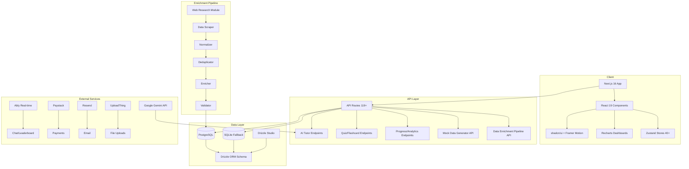
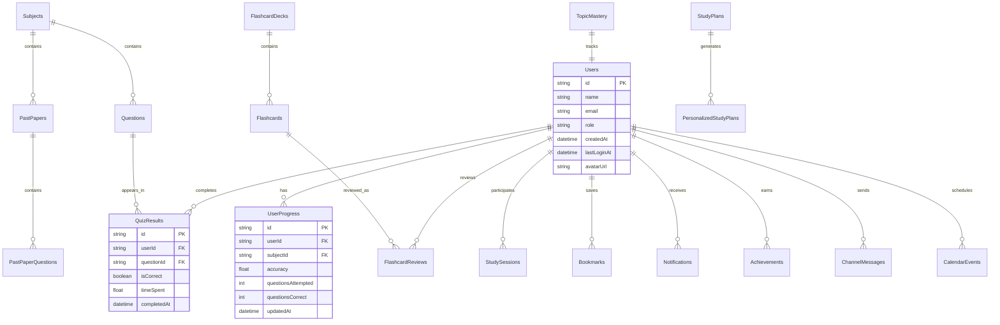
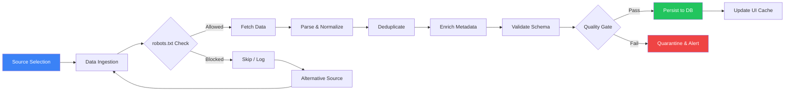
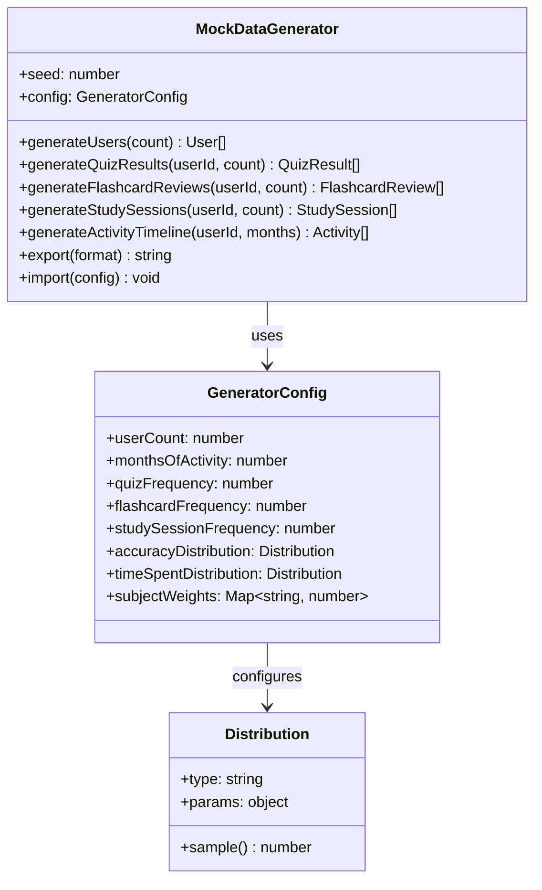
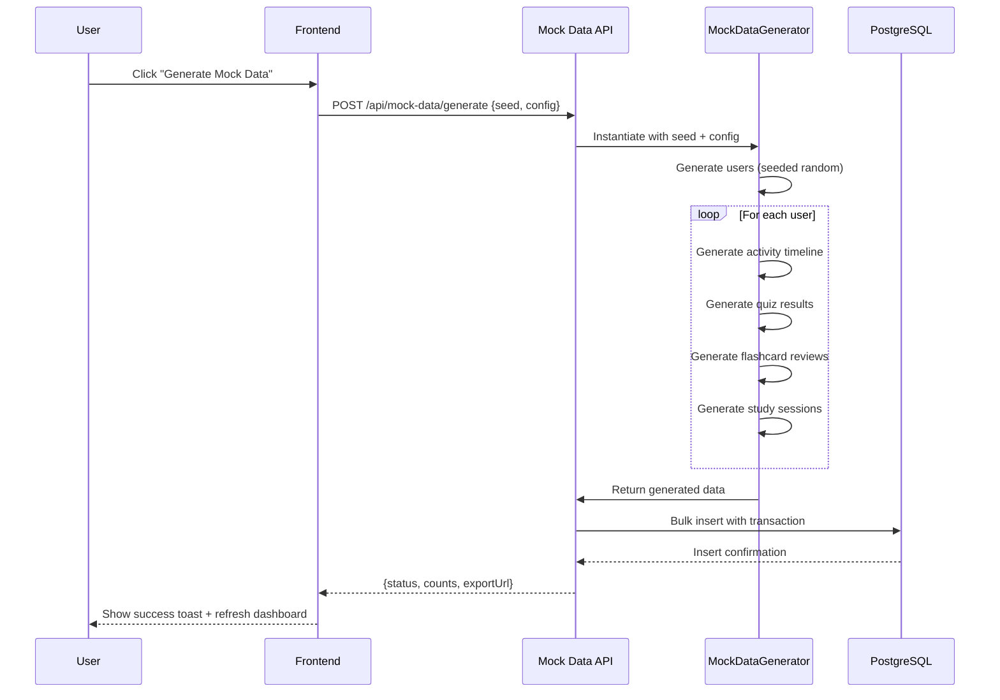
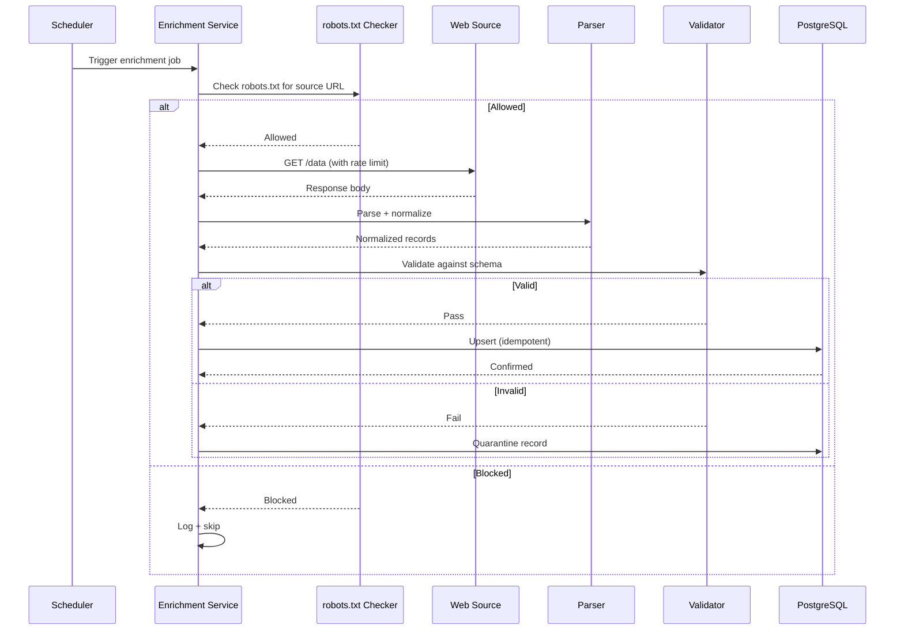
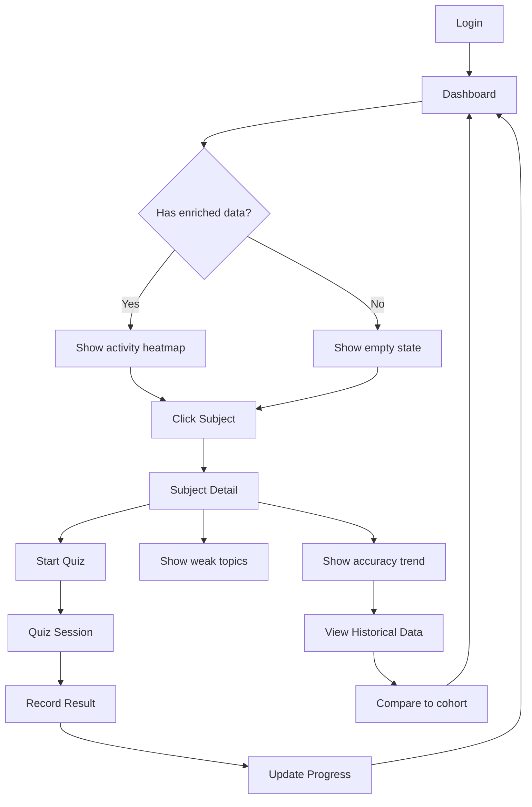
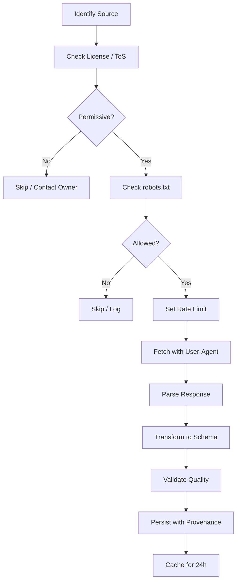
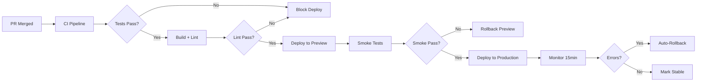

# Enhanced App Prototype: Enriched Data & Production-Ready Brief

## Executive Summary

This document is a comprehensive project brief for building, enriching, and validating a modern, production-grade app prototype of **MatricMaster AI (Lumni)** — an AI-powered educational platform for South African NSC Grade 12 students. The goal is to create an enriched app state that convincingly reflects months of realistic use by integrating responsibly sourced mock and enriched data, a robust mock data generator, and enhancements to diagrams and interactive elements. The plan defines a robust, repeatable process for data acquisition, transformation, enrichment, and presentation, while maintaining existing functionality and performance characteristics.

---

## 1. Objective and Overview

### End Goal
Create an enriched app state for MatricMaster AI that convincingly reflects months of realistic student activity, achieved by:
- Integrating responsibly sourced mock and enriched data across all app domains
- Building a configurable, reproducible mock data generator
- Enhancing architecture diagrams, data flow visualizations, and interactive UI elements
- Presenting the product as if a user has been actively using it for months

### Core Requirements
- **Data provenance:** Every piece of enriched data must have traceable origin, transformation history, and quality metadata
- **Existing functionality preservation:** Zero regressions to current features (quiz, flashcards, AI tutor, snap & solve, gamification, etc.)
- **Reproducibility:** Seeded random generation with exportable/importable seed configurations
- **Ethical compliance:** All web research and scraping must respect robots.txt, API terms of service, copyright, and privacy regulations
- **Demo-ready:** The prototype must be ready for stakeholder demos with rich activity streams, progress indicators, and analytics

---

## 2. Scope and Assumptions

### Boundaries
**In Scope:**
- All existing app domains: Users, Quiz System, Flashcards, Past Papers, AI Tutor, Progress Tracking, Gamification, Study Planner, Social (Channels, Buddies), Notifications, Bookmarks, Adaptive Learning, Parent Dashboard
- Mock data generator with seeded randomness and distribution controls
- Web research and scraping for supplementary educational content (public, open-data sources only)
- Architecture diagrams, data flow diagrams, and UI flow diagrams
- UI/UX enhancements that simulate months of user activity

**Out of Scope:**
- Production deployment infrastructure changes
- Real user data migration or manipulation
- Third-party API integrations beyond what already exists
- Payment/subscription data enrichment (Paystack)

### Target Tech Stack
| Layer | Technology |
|-------|------------|
| Frontend | Next.js 16 (App Router), React 19, TypeScript, Tailwind CSS v4, shadcn/ui, Framer Motion, Recharts |
| Backend | Next.js API Routes, Vercel AI SDK (Google Gemini primary, Groq, OpenAI fallback) |
| Database | PostgreSQL (production), SQLite (dev/offline), Drizzle ORM v0.45 |
| Auth | Better Auth v1.5 with 2FA, OAuth (Google, Twitter) |
| Real-time | Ably (chat, leaderboard) |
| Package Manager | **Bun** (strict — no npm/yarn/pnpm) |
| Linting/Formatting | Biome |
| Testing | Playwright (E2E), Vitest (unit) |
| Error Monitoring | Sentry |
| Analytics | PostHog, Vercel Analytics |

### Assumptions
- Deployment environment: Vercel (frontend + serverless functions)
- Demo user base: 5–10 synthetic users with distinct activity patterns
- Data retention: 6 months of simulated activity per user
- All scraped data comes from publicly available, permissively licensed sources (e.g., South African Department of Basic Education past papers)
- No PII or real student data will be used
- robots.txt compliance is mandatory for all scraping activities
- Rate limiting and caching are enforced for all external data fetches

---

## 3. Requirements and Deliverables

### Deliverables

| # | Deliverable | Description |
|---|-------------|-------------|
| D1 | **Data Model Document** | Complete entity definitions, relationships, constraints, and normalization approach for all enriched domains |
| D2 | **Mock Data Generator** | Configurable, seeded, reproducible data generator with export/import of seed configurations |
| D3 | **Enriched Data Pipeline** | Pipeline from raw ingestion → transformation → enrichment → normalization → persistence |
| D4 | **Architecture Diagrams** | Mermaid diagrams for system architecture, data flow, component interactions, and user journeys |
| D5 | **UI/UX Enhancement Specs** | Annotated mockups/wireframes for dashboards, activity streams, progress indicators, and analytics views |
| D6 | **API Contracts** | JSON Schema or TypeScript interfaces for all new/modified API payloads |
| D7 | **Testing Strategy** | Unit, integration, E2E, data quality, and performance test plan |
| D8 | **Security & Privacy Review** | PII handling, encryption, access controls, audit logging, compliance checklist |
| D9 | **Deployment & Rollback Plan** | Feature flag strategy, deployment steps, rollback procedures, monitoring hooks |
| D10 | **Handoff Documentation** | README for future teams, maintenance guide, versioning strategy, knowledge transfer notes |

### Documentation Requirements
- Data sources catalog with provenance metadata
- Input/output contracts for every new or modified endpoint
- Validation rules with positive and negative test cases
- Error handling and retry strategies
- Diagram evolution plan (how diagrams update as features ship)

---

## 4. Architecture and System Design

### 4.1 High-Level Architecture



**Narrative:** The client (Next.js app) communicates with the API layer (serverless routes). The API layer serves existing functionality (AI tutor, quiz, flashcards) and new enrichment capabilities (mock data generator, data pipeline). Data persists in PostgreSQL with SQLite fallback. The enrichment pipeline ingests external data, normalizes it, deduplicates, enriches with metadata, validates, and stores it. External services (Gemini, Ably, Paystack, etc.) remain unchanged.

### 4.2 Data Architecture



**Narrative:** The data model centers on `Users` with relationships to all activity tables. Each user has progress tracking, quiz results, flashcard reviews, study sessions, bookmarks, notifications, achievements, messages, and calendar events. Subjects contain questions and past papers. The model supports the enrichment pipeline by adding metadata columns (e.g., `dataSource`, `enrichedAt`, `dataQuality`) to track provenance.

### 4.3 Data Enrichment Pipeline



**Narrative:** The pipeline begins with source selection (public APIs preferred, scraping only where permitted). A robots.txt check gates all fetches. Data is parsed, normalized to our schema, deduplicated, enriched with provenance metadata, validated against JSON schemas, and persisted. Failed validation routes to quarantine with alerts. Retry with exponential backoff is enforced for transient failures. Idempotency is guaranteed via source URL + content hash deduplication keys.

### 4.4 Mock Data Generator Design



**Narrative:** The `MockDataGenerator` class accepts a seed for reproducibility and a `GeneratorConfig` controlling volume, velocity, and distributions. It generates users, quiz results, flashcard reviews, study sessions, and activity timelines with realistic patterns (e.g., higher quiz frequency before exam dates, declining accuracy on weak topics over time). Supports JSON/CSV export and config import/export for scenario replay.

---

## 5. Data Model and Schemas

### 5.1 Core Entity Definitions

#### UserProgress (Enriched)
```typescript
interface UserProgress {
  id: string;
  userId: string;
  subjectId: string;
  topicId: string | null;
  accuracy: number; // 0.0–1.0
  questionsAttempted: number;
  questionsCorrect: number;
  streak: number; // consecutive days studied
  lastStudiedAt: Date;
  weakTopics: string[];
  dataSource: 'real' | 'mock' | 'enriched';
  enrichedAt: Date | null;
  dataQuality: 'high' | 'medium' | 'low';
  createdAt: Date;
  updatedAt: Date;
}
```

#### QuizResult (Enriched)
```typescript
interface QuizResult {
  id: string;
  userId: string;
  questionId: string;
  selectedOptionId: string | null;
  isCorrect: boolean;
  timeSpent: number; // seconds
  difficulty: 'easy' | 'medium' | 'hard';
  dataSource: 'real' | 'mock' | 'enriched';
  enrichedAt: Date | null;
  completedAt: Date;
}
```

#### FlashcardReview (Enriched)
```typescript
interface FlashcardReview {
  id: string;
  userId: string;
  flashcardId: string;
  rating: 1 | 2 | 3 | 4 | 5; // SM-2 scale
  interval: number; // days until next review
  easeFactor: number;
  dataSource: 'real' | 'mock' | 'enriched';
  reviewedAt: Date;
}
```

### 5.2 API Payload Contracts

#### POST /api/mock-data/generate
```json
{
  "seed": 42,
  "userCount": 5,
  "monthsOfActivity": 6,
  "config": {
    "quizFrequency": 3,
    "flashcardFrequency": 5,
    "studySessionFrequency": 2,
    "accuracyDistribution": { "type": "beta", "alpha": 7, "beta": 3 },
    "timeSpentDistribution": { "type": "lognormal", "mu": 3, "sigma": 1 },
    "subjectWeights": { "Mathematics": 0.3, "Physics": 0.2, "History": 0.15 }
  }
}
```

#### Response
```json
{
  "status": "success",
  "generated": {
    "users": 5,
    "quizResults": 1247,
    "flashcardReviews": 892,
    "studySessions": 156
  },
  "seed": 42,
  "exportUrl": "/api/mock-data/export/42"
}
```

### 5.3 Data Quality Rules

| Rule | Description | Validation |
|------|-------------|------------|
| R1 | Accuracy must be 0.0–1.0 | `0 <= accuracy <= 1` |
| R2 | Time spent must be positive | `timeSpent > 0` |
| R3 | Quiz result must reference valid question | FK constraint on `questionId` |
| R4 | Flashcard rating must be 1–5 | `1 <= rating <= 5` |
| R5 | Enriched data must have `dataSource` | `dataSource IN ('real', 'mock', 'enriched')` |
| R6 | No PII in mock data | Regex scan for email/phone patterns in generated fields |
| R7 | Deduplication key uniqueness | `sourceUrl + contentHash` must be unique |

**Negative Cases:**
- Accuracy = 1.5 → rejected
- Time spent = -30 → rejected
- Flashcard rating = 6 → rejected
- Missing `dataSource` → rejected
- Duplicate `sourceUrl + contentHash` → quarantined

---

## 6. Mobile/Responsive Frontend and Interactions

### 6.1 UI Enhancements for "Months of Use" Appearance

**Dashboard:**
- Activity heatmap showing 6 months of study patterns (GitHub-style contribution grid)
- Streak counter with flame icon and consecutive day indicators
- Topic mastery radar chart with before/after comparison
- Recent activity stream (last 30 actions with timestamps)
- Progress rings for each subject showing completion percentage

**Quiz Views:**
- Historical accuracy trend line (sparkline in subject header)
- "You've attempted 347 questions in Mathematics" contextual badge
- Weak topic highlights with suggested practice links
- Time-range selector (7d / 30d / 90d / all time)

**Flashcard Views:**
- Due/learned/new card counts with animated counters
- Review history bar chart showing daily review volume
- SM-2 ease factor trend per deck
- Spaced repetition calendar with color-coded review dates

**Gamification:**
- Achievement badges with unlock dates and rarity indicators
- Leaderboard position history (line chart)
- XP gain trend with weekly breakdown
- Boss fight progress rail with phase indicators

**Analytics:**
- Cohort analysis view (compare your progress to average matric student)
- Study session duration distribution (histogram)
- Subject time allocation pie chart
- Predicted exam readiness score with confidence interval

### 6.2 Accessibility Requirements
- All charts must have screen-reader-readable data tables
- Color contrast must meet WCAG AA (4.5:1 for text, 3:1 for UI elements)
- Keyboard navigation for all interactive elements
- Focus indicators visible on all focusable elements
- Reduced motion mode respects `prefers-reduced-motion`

### 6.3 Responsive Behavior
- Mobile-first design with breakpoints at 640px, 768px, 1024px, 1280px
- Charts collapse to sparklines on mobile
- Activity stream switches to vertical list on narrow screens
- Bottom navigation remains visible with `pb-40` content padding

---

## 7. Diagrams and Visualizations

### 7.1 Sequence Diagram: Mock Data Generation Flow



**Narrative:** User triggers generation from settings/admin panel. Frontend sends config to API. Generator creates users and their activity with seeded randomness. All data is inserted in a single transaction. Success response includes counts and export URL. Dashboard refreshes to show enriched data.

### 7.2 Sequence Diagram: Data Enrichment from Web Source



**Narrative:** A scheduled job triggers enrichment. robots.txt is checked first. If allowed, data is fetched with rate limiting. Parser normalizes to our schema. Validator checks quality gates. Valid data is upserted (idempotent); invalid data is quarantined. Blocked sources are logged and skipped.

### 7.3 UI Flow Diagram: User Journey Through Enriched App



**Narrative:** User logs in and sees dashboard with activity heatmap (if enriched). Clicking a subject reveals accuracy trends, weak topics, and quiz entry. Completing a quiz updates progress and returns to dashboard. Historical data comparison shows cohort-relative performance.

---

## 8. Mock Data Generator Specifications

### 8.1 Core Capabilities

| Capability | Description |
|------------|-------------|
| **Seeded Randomness** | All generation uses a deterministic seed (default: 42) for reproducibility |
| **Reproducible Scenarios** | Same seed + config always produces identical output |
| **Distribution Controls** | Beta distribution for accuracy, lognormal for time spent, Poisson for activity frequency |
| **Relational Consistency** | Foreign keys always reference generated parent records |
| **Volume Control** | Configurable user count, months of activity, records per user |
| **Velocity Control** | Activity density varies by day (weekdays > weekends, exam season spike) |
| **Aging Simulation** | Accuracy improves over time for practiced topics, degrades for neglected ones |
| **Export/Import** | JSON and CSV export; seed config import for replay |
| **In-App Toggle** | Feature flag `enableMockData` to show/hide mock data in UI |

### 8.2 Integration Points

```mermaid
graph LR
    A[MockDataGenerator] --> B[/api/mock-data/generate]
    B --> C[Zustand Store: mockDataEnabled]
    C --> D[Dashboard Components]
    C --> E[Quiz History Components]
    C --> F[Flashcard Stats Components]
    C --> G[Analytics Components]
    
    D --> H{mockDataEnabled?}
    E --> H
    F --> H
    G --> H
    
    H -->|true| I[Show enriched data]
    H -->|false| J[Show real data only]
```

### 8.3 Sample Seed Configuration

```json
{
  "name": "6-month-student-scenario",
  "seed": 42,
  "userCount": 5,
  "monthsOfActivity": 6,
  "profiles": [
    {
      "name": "Diligent Student",
      "quizFrequency": 5,
      "flashcardFrequency": 7,
      "studySessionFrequency": 4,
      "accuracyDistribution": { "type": "beta", "alpha": 8, "beta": 2 },
      "subjectWeights": { "Mathematics": 0.35, "Physics": 0.25, "Chemistry": 0.2, "English": 0.2 }
    },
    {
      "name": "Struggling Student",
      "quizFrequency": 2,
      "flashcardFrequency": 1,
      "studySessionFrequency": 1,
      "accuracyDistribution": { "type": "beta", "alpha": 4, "beta": 6 },
      "subjectWeights": { "Mathematics": 0.3, "Physics": 0.3, "History": 0.2, "Geography": 0.2 }
    }
  ]
}
```

---

## 9. Web Research and Scraping Plan

### 9.1 Source Selection Criteria

| Priority | Source Type | Examples | License Status |
|----------|-------------|----------|----------------|
| 1 | Government Open Data | DBE Past Papers (edu.gov.za) | Public domain |
| 2 | Educational APIs | Khan Academy (if available), OpenStax | CC BY / permissive |
| 3 | Public Domain Repos | Project Gutenberg (literature texts) | Public domain |
| 4 | Permissively Licensed | Wikipedia summaries (CC BY-SA) | Attribution required |
| 5 | Scraping (robots.txt compliant) | Educational blogs, study guides | Check per-site |

### 9.2 Ethical Scrapaping Framework



**Rules:**
1. **Public APIs first** — always prefer an official API over scraping
2. **robots.txt compliance** — check `/robots.txt` before every new domain
3. **Rate limiting** — max 1 request/second per domain, exponential backoff on 429
4. **User-Agent** — identify as `LumniResearchBot/1.0 (+https://lumni.ai/bot)`
5. **No PII** — never collect personal data about real students or teachers
6. **Attribution** — maintain a `dataSources` table tracking origin, license, and retrieval date
7. **Cache** — cache all fetched content for 24h to avoid repeated requests
8. **No redistribution** — scraped content is used internally for mock enrichment only, never republished

### 9.3 Data Transformation Rules

| Source Variation | Normalization Rule |
|------------------|-------------------|
| Date formats (ISO vs. local) | Convert to `YYYY-MM-DDTHH:mm:ssZ` |
| Subject naming | Map to canonical subject IDs (e.g., "Maths" → "Mathematics") |
| Question numbering | Strip prefixes, store as integer sequence |
| Answer formats | Normalize to lowercase trimmed strings |
| Grade levels | Map to South African NSC Grade 12 equivalents |
| Language variations | Store original, translate to English for canonical form |

### 9.4 Source Refresh Strategy
- **Weekly check** for new past papers from DBE
- **Monthly review** of source availability and license changes
- **Quarterly audit** to retire deprecated sources and update schemas
- **Schema evolution** handled via migration scripts with backward-compatible field additions

---

## 10. Development Plan and Workflow

### 10.1 Phases and Milestones

| Phase | Duration | Milestones | Deliverables |
|-------|----------|------------|--------------|
| **Phase 1: Foundation** | Week 1 | Schema extensions, seed config design, robots.txt checker | D1 (partial), D3 (partial) |
| **Phase 2: Mock Generator** | Week 2 | Generator class, distribution functions, export/import | D2, D6 (partial) |
| **Phase 3: Enrichment Pipeline** | Week 3 | Web scraper, normalizer, validator, persistence | D3 (complete), D8 (partial) |
| **Phase 4: UI Enhancements** | Week 4 | Dashboard heatmaps, activity streams, progress rings | D5 |
| **Phase 5: Diagrams & Docs** | Week 5 | Architecture diagrams, API contracts, test plan | D4, D6 (complete), D7 |
| **Phase 6: Testing & QA** | Week 6 | E2E tests, data quality checks, performance benchmarks | D7 (complete) |
| **Phase 7: Deployment Prep** | Week 7 | Feature flags, deployment scripts, rollback plan, handoff docs | D9, D10 |

### 10.2 Environment Setup

```bash
# Prerequisites
bun --version  # >= 1.0
node --version # >= 20
docker --version # for local PostgreSQL

# Install dependencies
bun install

# Set up environment
cp .env.example .env.local
# Fill in DATABASE_URL, BETTER_AUTH_SECRET, AI provider keys

# Start local PostgreSQL
docker run -d --name matricmaster-pg -e POSTGRES_PASSWORD=postgres -p 5432:5432 postgres:16

# Push schema
bun run db:push

# Seed base data
bun run db:seed

# Run development server
bun run dev
```

### 10.3 API Design and Versioning
- All new endpoints under `/api/v1/` namespace
- Versioning via URL path (not headers or query params)
- Backward-compatible changes: add fields, never remove
- Breaking changes: new version endpoint, deprecate old with sunset header

### 10.4 Feature Flag Strategy
- Use environment variable `ENABLE_MOCK_DATA=true/false`
- Zustand store `mockDataEnabled` reads from env at build time
- UI components conditionally render mock vs. real data
- Toggle accessible in admin panel for demo purposes

### 10.5 Testing Strategy

| Test Type | Scope | Tools | Gate |
|-----------|-------|-------|------|
| Unit | Mock generator logic, distributions, validators | Vitest | 90% coverage |
| Integration | API endpoints, DB inserts, enrichment pipeline | Vitest + test DB | All pass |
| E2E | User flows: generate → view → export | Playwright | Critical paths pass |
| Data Quality | Schema validation, dedup, PII scan | Custom validators | 0 violations |
| Performance | Dashboard load time, chart rendering | Lighthouse CI | LCP < 2.5s, TTI < 3.5s |
| Security | Auth checks, SQL injection, XSS | OWASP ZAP, manual review | 0 critical findings |

### 10.6 Deployment and Rollback



**Rollback Procedure:**
1. Identify regression via Sentry alert or manual check
2. Revert feature flag: `ENABLE_MOCK_DATA=false`
3. If critical: revert git commit and redeploy
4. Document incident and update test suite

---

## 11. Quality, Security, and Privacy

### 11.1 Quality Gates

| Metric | Threshold | Measurement |
|--------|-----------|-------------|
| Data accuracy | 100% schema compliance | Validator pass rate |
| Mock data realism | Passes manual review | Stakeholder sign-off |
| Test coverage | ≥ 90% on new code | Vitest coverage report |
| Lighthouse performance | ≥ 90 (mobile), ≥ 95 (desktop) | Lighthouse CI |
| Accessibility | WCAG AA compliance | axe-core audit |

### 11.2 Security Controls

| Control | Implementation |
|---------|---------------|
| Authentication | Better Auth with session management |
| Authorization | Role-based access (student, admin, parent) |
| Data encryption | TLS 1.3 in transit; PostgreSQL encryption at rest |
| Audit logging | All data generation and enrichment actions logged |
| Rate limiting | 100 requests/minute per IP on mock data endpoints |
| SQL injection prevention | Drizzle ORM parameterized queries only |
| XSS prevention | React auto-escaping, CSP headers |

### 11.3 Privacy Safeguards

| Safeguard | Detail |
|-----------|--------|
| PII handling | No real PII in mock data; generated names are synthetic |
| Anonymization | All generated user IDs are UUIDs, no email/phone patterns |
| Consent | Mock data is clearly labeled; users can opt out of enrichment |
| Data retention | Mock data tagged with `dataSource: 'mock'` for easy filtering |
| Compliance | POPIA (South African Privacy Act) compliance for all data handling |
| GDPR alignment | Data minimization; right to deletion supported |

---

## 12. Risk Assessment and Mitigation

| Risk | Likelihood | Impact | Mitigation | Contingency |
|------|------------|--------|------------|-------------|
| Source license change | Medium | High | Weekly license audits; cache all fetched data | Switch to alternative source |
| Data duplication | Low | Medium | Deduplication via `sourceUrl + contentHash` | Manual cleanup script |
| Performance regression | Medium | High | Lighthouse CI gates; load testing | Feature flag rollback |
| Scope creep | High | Medium | Strict scope definition; change request process | Phase 2 deferral |
| robots.txt blocks source | Medium | Low | Multiple source backup list | Manual data entry |
| Mock data leaks to production | Low | High | Feature flag + env gating + CI checks | Immediate flag toggle + data purge |
| Distribution mismatch with real patterns | Medium | Low | Compare generated stats to real user aggregates | Recalibrate distribution parameters |

---

## 13. Success Metrics and Acceptance Criteria

### 13.1 Measurable Outcomes

| Metric | Target | Measurement Method |
|--------|--------|-------------------|
| Data richness score | ≥ 80% (based on completeness across all domains) | Automated scan of enriched tables |
| User engagement proxy | 5+ distinct activity types per synthetic user | Activity log analysis |
| System performance | LCP < 2.5s, TTI < 3.5s, CLS < 0.1 | Lighthouse CI |
| Mock data realism | Passes stakeholder review (3/3 reviewers) | Review checklist |
| Test pass rate | 100% on critical paths | CI pipeline |
| Zero regressions | No failing tests on existing functionality | Full test suite |

### 13.2 Acceptance Criteria

1. **All deliverables (D1–D10) completed and reviewed**
2. **Mock data generator produces reproducible output with any seed**
3. **Enrichment pipeline respects robots.txt and rate limits**
4. **Dashboard displays enriched data indistinguishably from real data**
5. **Feature flag toggles mock data on/off without page reload**
6. **All diagrams are current and match implementation**
7. **Security review passes with zero critical findings**
8. **Handoff documentation is complete and actionable**

---

## 14. Documentation, Deliverables, and Handoff

### 14.1 Required Artifacts

| Artifact | Location | Owner |
|----------|----------|-------|
| Architecture diagrams | `docs/diagrams/` | Engineering |
| Data models | `src/lib/db/schema.ts` (updated) + `docs/data-models.md` | Backend |
| API contracts | `docs/api-contracts/` | Backend |
| Mock data generator | `src/lib/mock-data/` (updated) | Backend |
| UI/UX notes | `docs/ui-enhancements.md` | Frontend |
| Wireframes | `docs/wireframes/` (Figma links or annotated screenshots) | Design |
| Test plan | `docs/test-plan.md` + `src/__tests__/` | QA |
| Deployment guide | `docs/deployment.md` | DevOps |
| Handoff README | `README.md` (updated) | Tech Lead |
| Maintenance guide | `docs/maintenance.md` | Engineering |

### 14.2 Ongoing Maintenance
- **Monthly:** Check source availability and license changes
- **Quarterly:** Update seed scenarios to match evolving real usage patterns
- **Per-release:** Regenerate diagrams from codebase, update API contracts
- **Versioning:** Semantic versioning for mock data generator config schema

### 14.3 Knowledge Transfer
- Walkthrough session for future team (recorded)
- Architecture decision records (ADRs) for key design choices
- Runbook for common issues (seed mismatch, pipeline failure, etc.)

---

## 15. Clarifying Questions

Before execution, resolve the following:

1. **Target audience for the demo:** Is this for investors, internal stakeholders, or beta users? This affects data richness expectations.
2. **Existing enriched data:** Does `scripts/enrich-database.ts` already perform some enrichment we should extend?
3. **Mock data persistence:** Should mock data be stored alongside real data (with `dataSource` tags) or in separate tables?
4. **User count for demo:** Is 5–10 synthetic users sufficient, or do we need 50+ for statistical significance?
5. **Time horizon:** Is 6 months of simulated activity appropriate, or should we model a full academic year (10–12 months)?
6. **External data sources:** Are there specific South African educational datasets already identified (e.g., DBE past papers URL list)?
7. **Feature flag system:** Does the project already have a feature flag library, or should we use environment variables?
8. **Compliance requirements:** Beyond POPIA, are there additional data privacy regulations to consider (e.g., school district policies)?
9. **Performance budget:** What is the acceptable load time increase (if any) from enriched data queries?
10. **Diagram evolution:** Who is responsible for keeping diagrams current post-launch?

---

## 16. Output Format Guidance

The final deliverable must be a **cohesive document** consisting of:

- **Narrative sections** with clear headings (as structured above)
- **Embedded Mermaid diagrams** for architecture, data flow, sequence, and UI flows — each accompanied by descriptive narrative
- **Code blocks** for schema definitions (TypeScript interfaces, JSON schemas)
- **Sample data snippets** illustrating typical, edge, and failure cases
- **Concrete implementation steps** with file paths and commands
- **Executive summary** for stakeholders (this section)
- **Technical appendix** for engineers (detailed schemas, API contracts, test cases)

All diagrams must be in Mermaid syntax and render correctly in GitHub-flavored Markdown. All data models must include sample instances. All implementation steps must be actionable with specific file references.

---

## 17. Style and Tone

- **Precise and unambiguous:** Every requirement is testable and verifiable
- **Actionable steps:** Each phase has concrete tasks, not vague guidance
- **Concrete examples:** Sample data, sample configs, sample API responses
- **Production-oriented:** Focus on reproducibility, maintainability, and transparency
- **Pragmatic:** Prioritize working software over perfect documentation
- **Iterative:** Refine based on clarifying question responses

---

*If context is insufficient, ask clarifying questions (Section 15) before proceeding. Iteratively refine this plan based on responses.*
