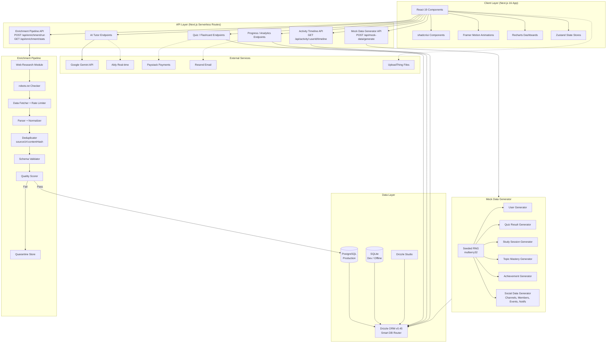
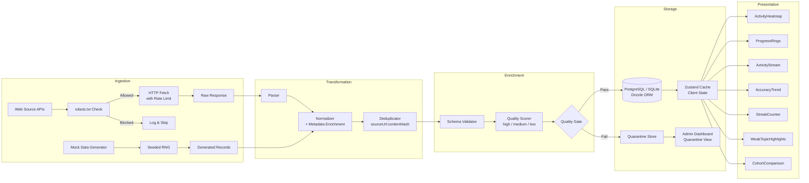
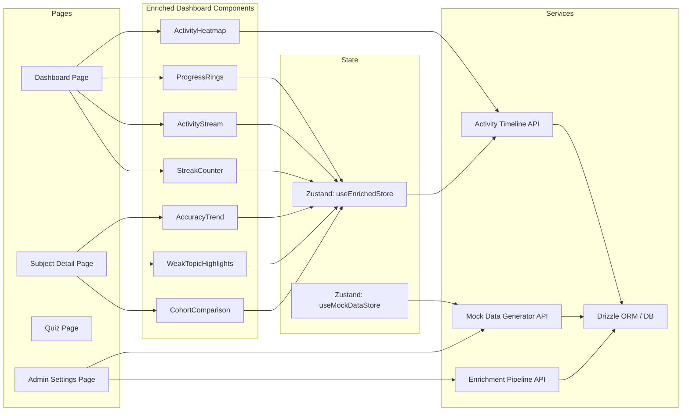

# Architecture Diagrams

System architecture, data flow, and component interaction diagrams for the MatricMaster AI enriched app prototype.

---

## 1. System Architecture

**Narrative:** The client layer consists of React 19 components powered by shadcn/ui, Framer Motion, Recharts, and Zustand stores. These communicate with the API layer of Next.js serverless routes. The API layer serves three categories: existing app features (AI tutor, quiz, flashcards, progress), mock data generation, and data enrichment. The data layer uses Drizzle ORM with a smart router that targets PostgreSQL in production and SQLite in development. External services (Gemini, Ably, Paystack, Resend, UploadThing) remain unchanged. The enrichment pipeline independently fetches, normalizes, deduplicates, validates, and persists external data. The mock data generator uses a seeded RNG to produce reproducible synthetic user data.

---

## 2. Data Flow Diagram

**Narrative:** Data enters the system through two paths: (1) web sources fetched via the enrichment pipeline, and (2) synthetic data from the mock generator. Both paths converge at the normalizer, which adds provenance metadata (`dataSource`, `enrichedAt`, `dataQuality`). Records are deduplicated using a composite key of `sourceUrl` + `contentHash` (SHA-256). The validator checks schema compliance, and the quality scorer assigns a tier based on field completeness. Passing records persist to the database; failing records go to quarantine. The client reads from the cached Zustand store, which reflects the latest persisted state.

---

## 3. Component Interaction Diagram

**Narrative:** The Dashboard page composes ActivityHeatmap, ProgressRings, ActivityStream, and StreakCounter. The Subject Detail page uses AccuracyTrend, WeakTopicHighlights, and CohortComparison. Admin Settings provides controls to trigger mock data generation and run the enrichment pipeline. All enriched components read from the `useEnrichedStore` Zustand store, which fetches from the Activity Timeline API. The mock data and enrichment APIs write directly to the database. Feature flags (`mockDataEnabled`) control whether enriched or real data is displayed.
