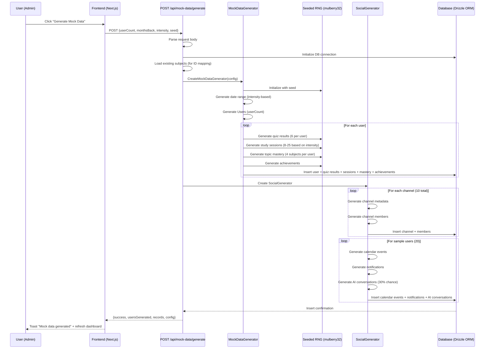
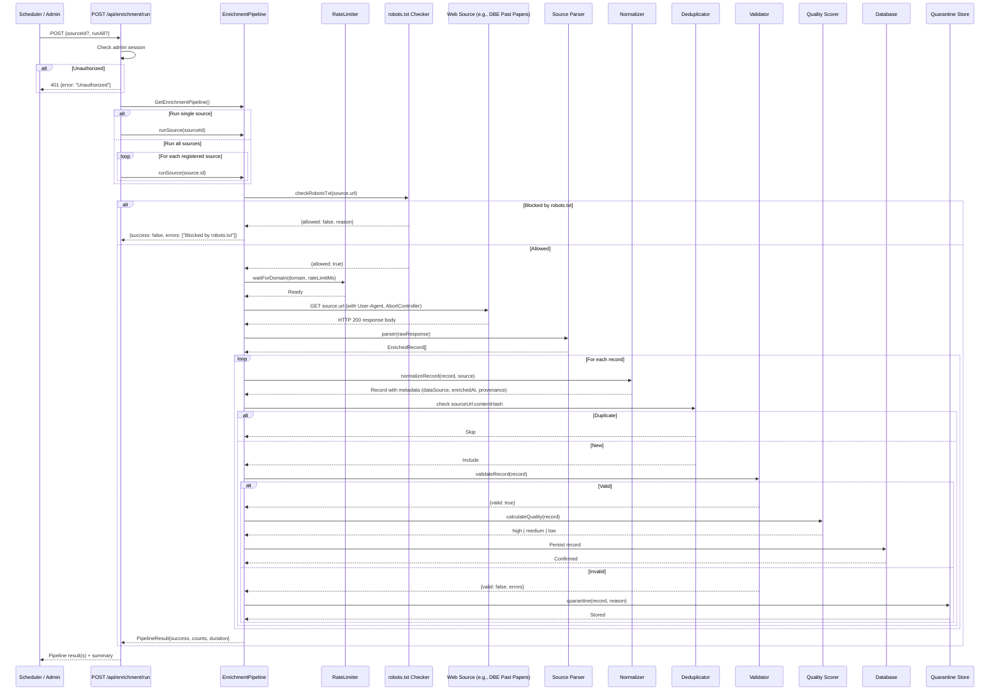

# Flow Diagrams

Sequence and lifecycle diagrams for the MatricMaster AI enriched app prototype.

---

## 1. Sequence Diagram: Mock Data Generation



**Narrative:** An admin triggers mock data generation from the admin panel. The API initializes the database, loads existing subjects for ID mapping, and creates a `MockDataGenerator` with the provided seed. For each user, it generates quiz results, study sessions, topic mastery, and achievements -- inserting them in per-user transactions. Then a `SocialGenerator` creates channels with members, followed by calendar events, notifications, and AI conversations for a sample of users. The final response includes record counts and the seed used. The frontend shows a success toast and refreshes the dashboard.

---

## 2. Sequence Diagram: Data Enrichment from Web Source



**Narrative:** An admin or scheduler triggers the enrichment pipeline. The API verifies admin access first. For each source, the pipeline checks robots.txt, then rate-limits the request. Data is fetched with a 30-second timeout and retries with exponential backoff (1s, 2s, 4s). The source-specific parser converts raw data to `EnrichedRecord` objects. Each record is normalized with provenance metadata, deduplicated via SHA-256 content hash, validated against schema rules, quality-scored, and persisted. Invalid records are quarantined with reason codes. The response includes per-source and aggregate statistics.

---

## 3. UI Flow Diagram: User Journey Through Enriched App

```mermaid
flowchart TD
    Start([User Opens App]) --> Login{Authenticated?}

    Login -->|No| AuthFlow[Login / Register Page]
    AuthFlow --> Login

    Login -->|Yes| Dashboard[Dashboard Page]

    Dashboard --> HasData{Has enriched data?}
    HasData -->|Yes| ShowHeatmap[Show ActivityHeatmap<br/>6-month contribution grid]
    HasData -->|No| EmptyState[Show empty state<br/>"Start your journey"]

    ShowHeatmap --> Streak[Show StreakCounter<br/>flame icon + streak count]
    Streak --> Rings[Show ProgressRings<br/>per-subject circular progress]
    Rings --> Stream[Show ActivityStream<br/>grouped by date]

    EmptyState --> Streak

    Dashboard --> ClickSubject[User clicks subject card]
    ClickSubject --> SubjectDetail[Subject Detail Page]

    SubjectDetail --> Accuracy[Show AccuracyTrend<br/>sparkline + area chart]
    Accuracy --> WeakTopics[Show WeakTopicHighlights<br/>top 5 weak topics with practice CTAs]
    WeakTopics --> Cohort[Show CohortComparison<br/>user vs cohort bar chart]

    SubjectDetail --> StartQuiz[Click "Start Quiz"]
    StartQuiz --> QuizSession[Quiz Session]
    QuizSession --> RecordResult[Record quiz result]
    RecordResult --> UpdateProgress[Update user progress in DB]
    UpdateProgress --> Dashboard

    SubjectDetail --> PracticeWeak[Click "Practice Now" on weak topic]
    PracticeWeak --> QuizSession

    Dashboard --> ViewAnalytics[Click "Analytics"]
    ViewAnalytics --> AnalyticsPage[Analytics Dashboard]
    AnalyticsPage --> ViewCohort[View cohort comparison]
    ViewCohort --> Dashboard

    Dashboard --> ViewGamification[Click "Achievements"]
    ViewGamification --> AchievementsPage[Achievement badges<br/>with unlock dates and rarity]
    AchievementsPage --> Dashboard

    style Start fill:#3B82F6,color:#fff
    style Dashboard fill:#22C55E,color:#fff
    style ShowHeatmap fill:#8B5CF6,color:#fff
    style Accuracy fill:#8B5CF6,color:#fff
    style WeakTopics fill:#8B5CF6,color:#fff
    style Cohort fill:#8B5CF6,color:#fff
```

**Narrative:** The user authenticates and lands on the Dashboard. If enriched data exists, they see the activity heatmap, streak counter, progress rings, and activity stream. Clicking a subject reveals accuracy trends, weak topic highlights, and cohort comparison. From any subject view, the user can start a quiz or practice weak topics. Quiz results update progress and return to the dashboard. The analytics and achievements pages provide deeper insights into historical performance.

---

## 4. Data Lifecycle Diagram

```mermaid
flowchart LR
    subgraph Create["Creation"]
        A1[Mock Data Generator<br/>seeded RNG] --> A2[Synthetic Users + Activity]
        A3[Web Scrapers / APIs<br/>robots.txt compliant] --> A4[Raw External Data]
    end

    subgraph Process["Processing"]
        A2 --> B1[Normalize to Schema<br/>+ provenance metadata]
        A4 --> B1
        B1 --> B2[Deduplicate<br/>sourceUrl:contentHash SHA-256]
        B2 --> B3[Validate<br/>schema compliance]
        B3 --> B4[Quality Score<br/>high / medium / low]
    end

    subgraph Store["Persistence"]
        B4 -->|Pass| C1[(PostgreSQL / SQLite<br/>Drizzle ORM)]
        B4 -->|Fail| C2[Quarantine Store<br/>with reason codes]
        C1 --> C3[Tag: dataSource =<br/>mock | enriched | real]
    end

    subgraph Serve["Presentation"]
        C1 --> D1[Activity Timeline API<br/>GET /api/activity/:userId/timeline]
        D1 --> D2[Zustand Store<br/>useEnrichedStore]
        D2 --> D3[React Components<br/>Heatmap, Rings, Stream, etc.]
        C2 --> D4[Admin Quarantine View<br/>GET /api/enrichment/stats]
    end

    subgraph Evolve["Evolution"]
        D3 --> E1[New user activity<br/>quiz, study, flashcard]
        E1 --> C1
        C1 -.->|weekly/monthly| A3
        C2 -.->|retry with<br/>alternative parser| B1
    end
```

**Narrative:** Data is created through two channels: the mock data generator produces synthetic users with seeded randomness, and web sources provide external educational content. Both converge at the normalization step where provenance metadata is attached. Deduplication prevents duplicate records via SHA-256 content hashing. Validation and quality scoring gate data before persistence. All records are tagged with their `dataSource` (`mock`, `enriched`, or `real`). The presentation layer serves data through the Activity Timeline API to React components via Zustand. The lifecycle is cyclical: new user activity feeds back into the database, enrichment sources are refreshed on schedule, and quarantined records can be retried with alternative parsers.
