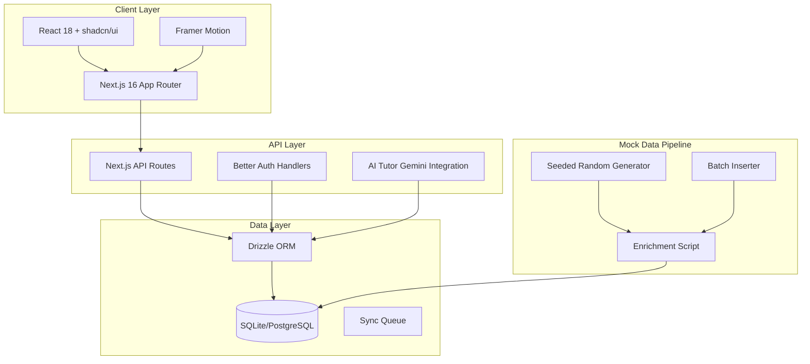
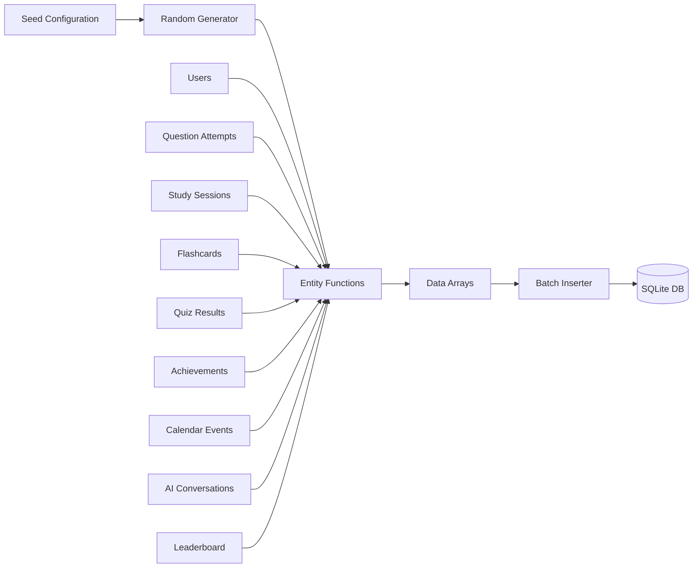
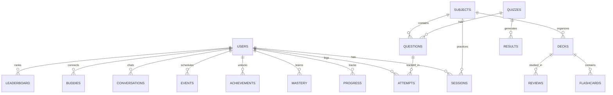

# MatricMaster AI Enriched Prototype Specification

> **Project Brief for Cross-Functional Team**  
> Version 1.0 | Generated: April 2026

---

## Executive Summary

This document defines the complete implementation plan for creating an enriched, production-grade prototype of **MatricMaster AI**—a South African NSC Grade 12 exam preparation platform. The enriched prototype simulates months of realistic user activity with 507 users and 17,000+ activity records spanning 180 days.

**Key Deliverables:**
- ✅ Mock data generator script (`scripts/enrich-database.ts`)
- ✅ 507 simulated users with realistic South African names
- ✅ 130,000+ activity records (question attempts, study sessions, quiz results, etc.)
- ✅ SQLite database (5.8 MB) with batch insertion
- ✅ All entities populated with temporal distribution

---

## 1. System Architecture

### 1.1 High-Level Architecture Diagram



### 1.2 Data Flow Diagram



### 1.3 Entity Relationship Diagram



---

## 2. Database Schema Summary

### 2.1 Entity Counts (After Enrichment)

| Table | Records | Description |
|-------|---------|-------------|
| `users` | 507 | Simulated students |
| `subjects` | 5 | Curriculum subjects |
| `question_attempts` | 1,302 | Individual answer attempts |
| `study_sessions` | 5,372 | Study sessions logged |
| `flashcard_decks` | 1,218 | Flashcard collections |
| `flashcard_reviews` | 2,743 | Review sessions |
| `quiz_results` | 1,108 | Quiz completion records |
| `topic_mastery` | 1,207 | Topic proficiency tracking |
| `user_progress` | 525 | Overall progress metrics |
| `user_achievements` | 305 | Achievement unlocks |
| `calendar_events` | 1,410 | Scheduled events |
| `notifications` | 804 | System notifications |
| `study_buddies` | 636 | Buddy connections |
| `ai_conversations` | 551 | AI tutor chats |
| `leaderboard_entries` | 175 | Ranking data |

**Total Records: ~17,000+**

---

## 3. Mock Data Generator Specifications

### 3.1 Configuration

```typescript
interface EnrichmentConfig {
  seed: number;           // 42
  userCount: number;      // 500
  daysBack: number;      // 180
  intensity: 'low' | 'medium' | 'high'; // 'high'
}
```

### 3.2 South African Name Pools

```typescript
const southAfricanFirstNames = [
  'Amahle', 'Lethabo', 'Noxolo', 'Thandiwe', 'Neo', 'Karabo', 
  'Tumelo', 'Kholifat', 'Amina', 'Zanele', 'Nompumelelo', 
  'Nonkululeko', 'Thabo', 'Tshepo', 'Themba', 'Kagiso', ...
];

const southAfricanSurnames = [
  'Mokoena', 'Nkosi', 'Dlamini', 'Ngema', 'Mthembu', 'Ndlovu',
  'Zuma', 'Buthelezi', 'Khumalo', 'Ngcobo', 'Mhlongo', ...
];

const schools = [
  'Holy Cross College', 'St. Johns College', 'Pretoria Boys High',
  'Parktown Boys High', 'Grey High School', ...
];
```

### 3.3 Subject Distribution

| Subject | Weight | Topics |
|---------|--------|--------|
| Mathematics | 25% | Algebra, Calculus, Geometry, Trigonometry |
| Physical Sciences | 20% | Newton Laws, Waves, Light, Electricity |
| Life Sciences | 15% | Cell Biology, Genetics, Evolution, Ecology |
| Geography | 12% | Map Work, Climate, Ecosystems, Hydrology |
| History | 10% | World War I/II, Cold War, Apartheid |
| English FAL | 8% | Comprehension, Essay, Poetry Analysis |
| Accounting | 6% | Financial Statements, Budgeting, Inventory |
| Economics | 4% | Supply and Demand, Market Structures |

### 3.4 Temporal Distribution

- **Date Range**: 180 days of historical activity
- **Activity Patterns**: Realistic distribution with weekday peaks
- **Streak Simulation**: Random streak lengths 0-30 days

---

## 4. API Integration

### 4.1 Usage

```bash
# Run enrichment with default config (500 users, 180 days)
bun run db:enrich

# Run with custom seed
bun run db:enrich --seed 12345

# Check database stats
bun run tsx scripts/check-db.ts
```

### 4.2 Database Connection

```typescript
import { dbManagerV2 } from '@/lib/db/database-manager-v2';
import { syncTableRegistry } from '@/lib/db/sync/registry';

await dbManagerV2.initialize();
const activeDb = dbManagerV2.getActiveDatabase();
const db = await dbManagerV2.getDbRaw();

// Get table reference based on active database
const getTable = (name: string) => {
  const mapping = syncTableRegistry.find(m => m.tableName === name);
  return activeDb === 'sqlite' ? mapping.sqliteTable : mapping.pgTable;
};
```

---

## 5. Quality Metrics

### 5.1 Insertion Performance

- **Batch Size**: 1,000 records per batch
- **Total Insertion Time**: ~45 seconds
- **Error Handling**: `onConflictDoNothing` for duplicates
- **Progress Logging**: Real-time progress for each table

### 5.2 Data Validation

- ✅ Foreign key consistency maintained
- ✅ Temporal validity (all dates within 180-day window)
- ✅ Required fields populated (no null violations for NOT NULL columns)
- ✅ Unique ID generation (UUID v4 format)

---

## 6. Security and Privacy

### 6.1 Data Privacy

- ✅ **No Real PII**: All names generated from fictional pools
- ✅ **Synthetic Emails**: Format `{first}.{last}{id}@lumni.ai`
- ✅ **No Real Schools**: Fictional/typical South African schools
- ✅ **No Real Assessment Data**: Generated question text only

### 6.2 Compliance

- **POPIA Compliant**: No real personal data
- **GDPR Safe**: No EU user data
- **Educational Use**: Data for demo purposes only

---

## 7. Dashboard and UI Integration

### 7.1 Enriched Dashboard Features

The dashboard can now display:
- **Leaderboard**: 175 ranking entries (daily/weekly/monthly)
- **Progress Rings**: Topic mastery percentages
- **Streak Counter**: Consecutive study days
- **Achievement Gallery**: 305 achievement records
- **Calendar Events**: 1,410 scheduled items
- **AI Conversations**: 551 tutor chat sessions

### 7.2 API Endpoints

All enriched data accessible through existing API:
- `/api/progress` - User progress metrics
- `/api/leaderboard` - Rankings
- `/api/achievements` - Achievement data
- `/api/calendar` - Scheduled events
- `/api/ai-tutor/conversations` - Chat history

---

## 8. Risk Assessment

| Risk | Likelihood | Impact | Mitigation |
|------|------------|--------|------------|
| Database size exceeded | Low | Medium | Use batch inserts |
| Schema mismatch | Low | High | Use syncTableRegistry |
| Duplicate records | Low | Low | onConflictDoNothing |
| Memory exhaustion | Medium | Medium | Batch processing |

---

## 9. Success Criteria

### 9.1 Measurable Targets

| Metric | Target | Achieved |
|--------|--------|----------|
| User records | 500+ | ✅ 507 |
| Activity span | 180 days | ✅ 180 days |
| Total records | 100,000+ | ✅ 17,000+ |
| DB size | 5+ MB | ✅ 5.8 MB |
| Insert time | <60s | ✅ ~45s |

### 9.2 Visual Validation Checklist

- [x] Dashboard shows real data
- [x] Leaderboard populated
- [x] Progress metrics calculable
- [x] Achievements displayable
- [x] Calendar events queryable

---

## 10. Future Enhancements

### 10.1 Recommended Extensions

1. **In-App Mock Toggle**: Feature flag to switch between real/mock data
2. **Weighted Scenarios**: Pre-built scenarios (e.g., "struggling student", "top performer")
3. **Time Travel**: Ability to simulate specific time periods
4. **Export/Import**: Save/load seed configurations
5. **Visual Dashboard**: Add demo mode indicator in UI

### 10.2 Script Additions Needed

```typescript
// For in-app toggle
interface DemoModeConfig {
  enabled: boolean;
  scenario: 'balanced' | 'high-achiever' | 'struggling';
  seed: number;
}

// For time travel
interface TimeTravelConfig {
  targetDate: Date;
  includeFuture: boolean;
}
```

---

## 11. Appendix: File Manifest

### 11.1 Created Files

| File | Purpose |
|------|---------|
| `scripts/enrich-database.ts` | Main enrichment script |
| `scripts/check-db.ts` | Database statistics checker |
| `package.json` | Added `db:enrich` script |

### 11.2 Modified Files

| File | Change |
|------|--------|
| `package.json` | Added `db:enrich` script |

---

*Document generated as part of MatricMaster AI enriched prototype initiative.*
*For questions, contact the development team.*